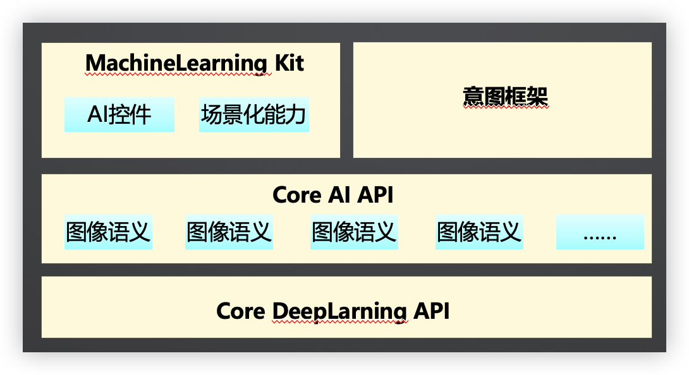

[TOC]

# HarmonyOS 介绍

## 应用开发的机遇，挑战与趋势

当前移动应用开发中遇到的**主要挑战**

1. 针对不同设备上的不同操作系统，重复开发，维护多套版本

2. 多种语言栈，对人员技能要求高

3. 多种开发框架，不同的编程范式

4. 命令式编程，需关注细节，变更频繁，维护成本

**为了更好的抓住机遇，应对万物互联所带来的一系列挑战，新的应用生态应该具备如下特征：**

- 单一设备延伸到多设备
- 厚重应用模式到轻量化服务模式
- 集中化分发到AI加持下的智慧分发
- 纯软件到软硬芯协同的AI能力

**HarmonyOS是新一代的智能终端操作系统，为不同设备的智能化、互联与协同提供了统一的语言，为用户带来简捷，流畅，连续，安全可靠的全场景交互体验。**

## Harmony OS核心技术理念

### 三大技术理念

### 可分可合

- **元服务是鸿蒙系统提供的一种全新的应用形态**，具有独立入口，无需显式安装，由程序框架后台静默安装后即可使用，可为用户提供便捷服务的新程序实体

- 传统移动生态下，开发者通常需要开发一个原生应用版本，如果提供小程序给用户，往往需要开发若干个独立的小程序

- 鸿蒙生态下，鸿蒙原生支持元服务开发，开发者无需维护多套版本，通过业务解耦将应用分解为若干元服务独立开发，按需根据场景组合成复杂应用

### 自由流转

- 传统应用只能在单个设备内运行，当用户有多个设备，且要完成多个任务时，则需要在多个设备间来回切换。因此应用能够在设备之间流转，不间断给用户提供服务的能力就变得非常重要

- 鸿蒙提供了自由流转的能力，使开发者可以方便地开发出跨越多个设备的应用，用户也能够方便地使用

- 自由流转可分为跨端迁移和多端协同两种情况。他们分别是时间上的串行交互和时间上的并行交互

- 自由流转不仅带给用户全新的交互体验，也为开发者搭建了一座从单设备时代通往多设备时代的桥梁

### 原生智能

**HarmonyOS内置强大的Al 能力，通过不同层次的 Al 能力开放，满足开发者的不同开发场景下的诉求，降低应用的开发门槛，帮助开发者快速实现应用智能化**

## 高效开发与调试

ArkTS、 ArkUI框架、开发/测试工具

## 上架与分发

**HUAWEI AppGallery Connect**

