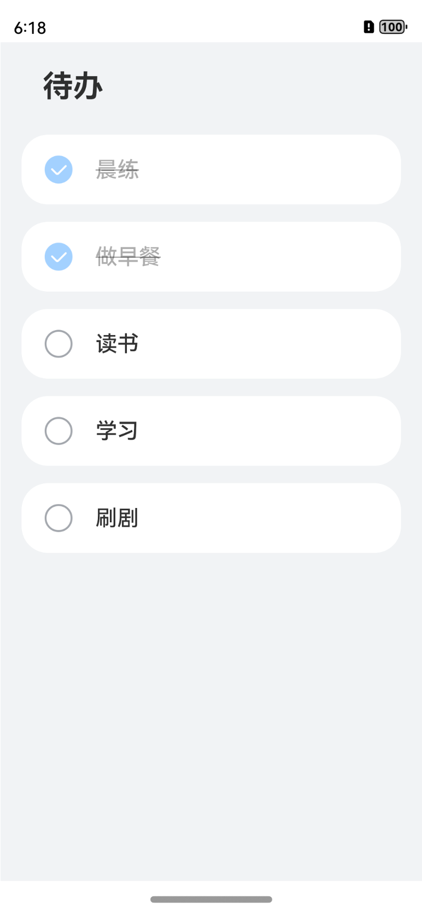
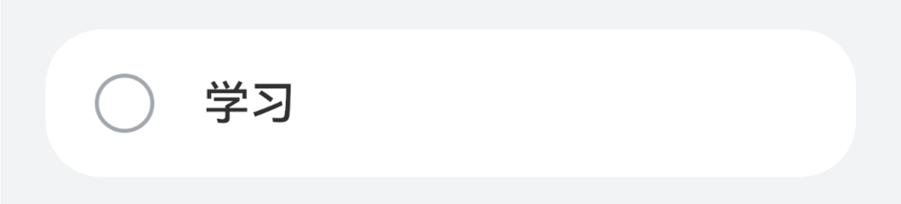
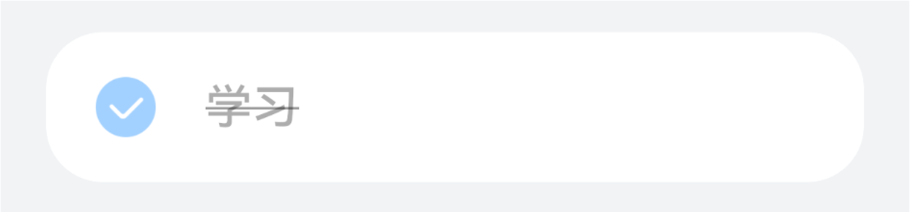
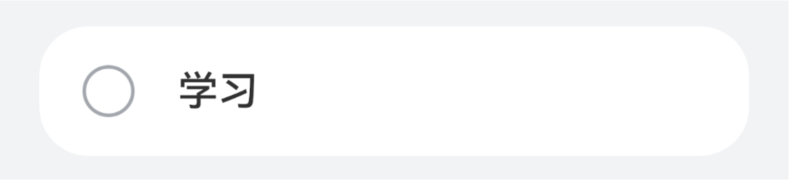
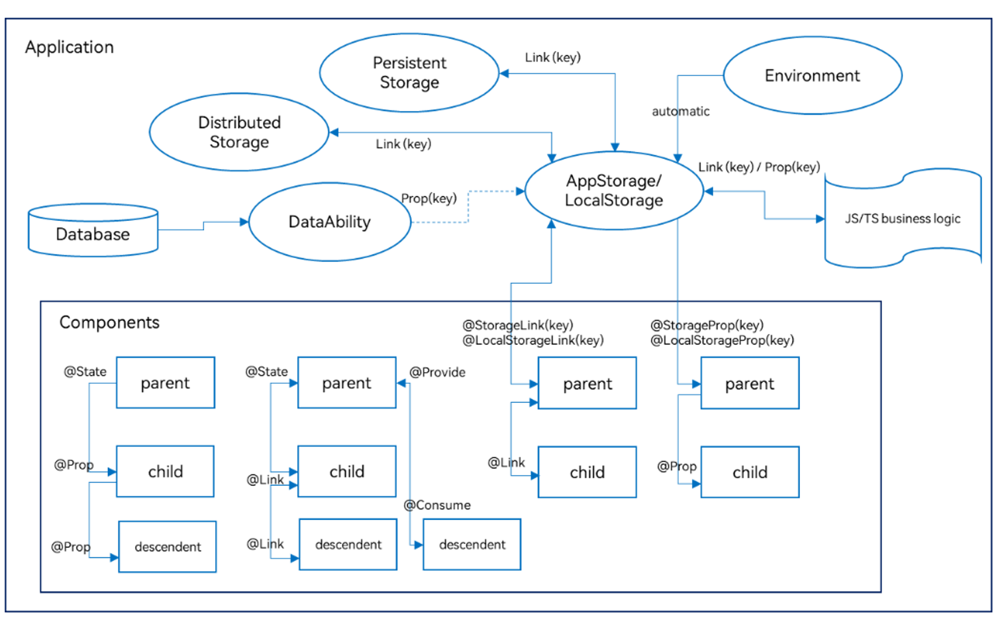
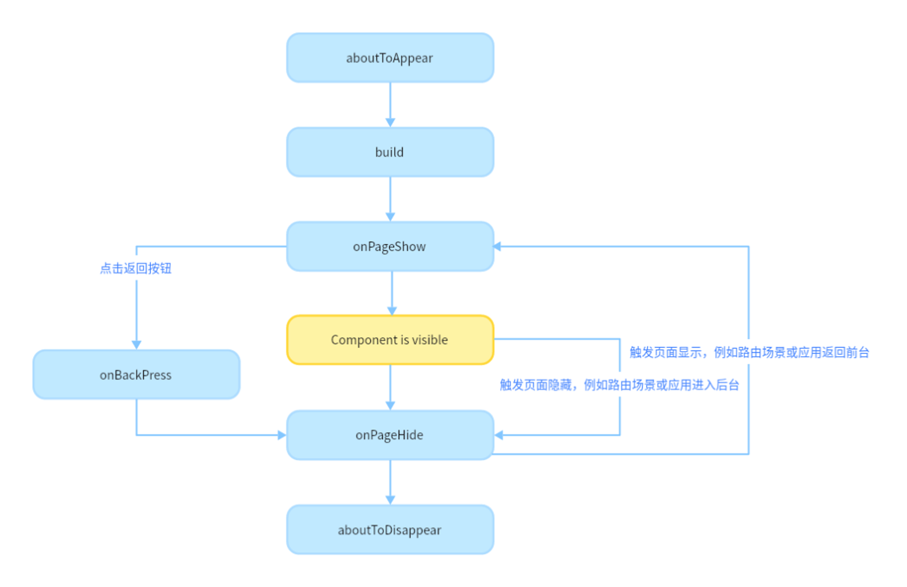

[TOC]

# 什么是声明式UI

- 声明式布局描述
- 状态驱动视图更新





# 声明式描述

- 布局描述：一个横向布局，里面依次排列了一张图片和一个文本

  ```
  Row(){
  	Image($r('app.media.ic_default'))
  	Text('学习')
  }
  ```

  

- 属性设置：使用点语法设置组建属性

  ```
  Text('待办')
  .fontSize(28)//设置字体大小
  .fontWeight(FontWeight.Bold)//设置字体粗细
  ```

- 渲染控制

  - 支持if、else条件渲染

    ```
    Column(){
    	Text(`count=${this.count}`)
    	
    	if(this.count > 0){
    		Text(`count is positive`)
    			.fontColor(Color.Green)
    	}
    }
    ```

  - 支持ForEach循环

    ```
    Column(){
    	ForEach(this.simpleList, (item: string) => {
    		Text(item)
    	}, (item: string) => item)
    }
    ```

  - 支持LazyForEach循环

    ```
    private data: MyDataSource = new MyDataSource()
    
    List({space: 3}){
    	LazyForEach(this.data, (item: string) => {
    		ListItem(){
    			Row(){
    				Text(item)
    					.fontSize(50)
    			}
    		}
    	}, (item: string) => item)
    }.cachedCount(5)
    
    
    class BasicDataSource implements IDataSource {
    	public getData(index: number): string { 
    		return this.originDataArray[index];
      }
      
      // 该方法为框架侧调用，为LazyForEach组件向其数据源处添加listener监听
      registerDataChangeListener(listener: DataChangeListener): void {
      	if (this.listeners.indexOf(listener) < 0) {
     				console.info('add listener');
      			this.listeners.push(listener);
      	}
      }
      
      // 该方法为框架侧调用，为对应的LazyForEach组件在数据源处去除listener监听
      unregisterDataChangeListener(listener: DataChangeListener): void {
      	const pos = this.listeners.indexOf(listener);
      	if (pos >= 0) {
      		console.info('remove listener');
      		this.listeners.splice(pos, 1);
      	}
    	}
    	
    	// 通知LazyForEach组件需要重载所有子组件
      notifyDataReload(): void {
      	this.listeners.forEach(listener => {
      		listener.onDataReloaded();
      	})
      }
      
      // 通知LazyForEach组件需要在index对应索引处添加子组件
      notifyDataAdd(index: number): void {
      	this.listeners.forEach(listener => {
      		listener.onDataAdd(index);
      	})
      }
      
      // 通知LazyForEach组件在index对应索引处数据有变化，需要重建该子组件
      notifyDataChange(index: number): void {
      	this.listeners.forEach(listener => {
      		listener.onDataChange(index);
      	})
      }
      
      // 通知LazyForEach组件需要在index对应索引处删除该子组件
      notifyDataDelete(index: number): void {
      	this.listeners.forEach(listener => {
      		listener.onDataDelete(index);
      	})
      }
      
      // 通知LazyForEach组件将from索引和to索引处的子组件进行交换
      notifyDataMove(from: number, to: number): void {
      	this.listeners.forEach(listener => {
      		listener.onDataMove(from, to);
      	})
      }
    }
    ```


# 状态驱动UI更新

```
@State isComplete: boolean = false
…
Row() {
	if (this.isComplete) {
  	Image($r('app.media.ic_ok'))
  } else {
  	Image($r('app.media.ic_default'))
  }
  …
  Text ("学习")
    .opacity(this.isComplete ? 0.4 : 1)
    .decoration({
    	type: this.isComplete ? TextDecorationType.LineThrough : TextDecorationType.None
    })
  …
}
.onClick(() => {
	this.isComplete = !this.isComplete
})

```






- @State：@State装饰的变量拥有其所属组件的状态，可以作为其子组件单向和双向同步的数据源。当其数值改变时，会引起相关组件的渲染刷新。

- @Prop：@Prop装饰的变量可以和父组件建立单向同步关系，@Prop装饰的变量是可变的，但修改不会同步回父组件。

- @Link：@Link装饰的变量和父组件构建双向同步关系的状态变量，父组件会接受来自@Link装饰的变量的修改的同步，父组件的更新也会同步给@Link装饰的变量。

- @Provide/@Consume：@Provide/@Consume装饰的变量用于跨组件层级（多层组件）同步状态变量，可以不需要通过参数命名机制传递，通过alias（别名）或者属性名绑定。

- @Observed：@Observed装饰class，需要观察多层嵌套场景的class需要被@Observed装饰。单独使用@Observed没有任何作用，需要和@ObjectLink、@Prop连用。

- @ObjectLink：@ObjectLink装饰的变量接收@Observed装饰的class的实例，应用于观察多层嵌套场景，和父组件的数据源构建双向同步。




# 自定义组件

具有相同结构的界面模块可以封装成一个独立组件。


Item组件封装

```
@Component
export default struct ToDoItem{
	private content?: string
	
	build(){
		Row(){
			Image($r('app.media.ic_default'))
			Text(this.content)
		}
	}
}
```


整体界面封装

```
@Entry
@Component
struct ToDoListPage{
	build(){
		Column({space: 16}){
			Text('待办')
		
			ForEach(..., {
				 ToDoItem({ content: '学习' })
			}, ...)
		}
	}
}
```


# 组件的生命周期


自定义组件和页面的关系：

- 自定义组件：`@Component`装饰的UI单元，可以组合多个系统组件实现UI的复用，可以调用组件的生命周期。

- 页面：即应用的UI页面。可以由一个或者多个自定义组件组成，`@Entry`装饰的自定义组件为页面的入口组件，即页面的根节点，**一个页面有且仅能有一个@Entry。只有被@Entry装饰的组件才可以调用页面的生命周期。**


页面生命周期，即被@Entry装饰的组件生命周期，提供以下生命周期接口：

- **onPageShow**：页面每次显示时触发一次，包括路由过程、应用进入前台等场景。

- **onPageHide**：页面每次隐藏时触发一次，包括路由过程、应用进入后台等场景。

- **onBackPress**：当用户点击返回按钮时触发。


组件生命周期，即一般用@Component装饰的自定义组件的生命周期，提供以下生命周期接口：

- **aboutToAppear**：组件即将出现时回调该接口，具体时机为在创建自定义组件的新实例后，在执行其build()函数之前执行。

- **aboutToDisappear**：aboutToDisappear函数在自定义组件析构销毁之前执行。不允许在aboutToDisappear函数中改变状态变量，特别是@Link变量的修改可能会导致应用程序行为不稳定。


生命周期流程如下图所示，下图展示的是被**@Entry**装饰的组件（页面）生命周期。



#  @Builder装饰器：自定义构建函数


Item的icon样式

```
@Builder
labelIcon(icon: Resource){
	Image(icon)
		.objectFit(ImageFit.Contain)
		.width(28)
		.height(28)
		.margin(20)
}
```


Item样式

```
@Component
export default struct ToDoItem{
	private content?: string
	
	@Builder
	labelIcon(icon: Resource){
		Image(icon)
			.objectFit(ImageFit.Contain)
			.width(28)
			.height(28)
			.margin(20)
	}
	
	build(){
		Row(){
			this.labelIcon($r('app.media.ic_default'))
			Text()
		}
	}
}
```


# 渲染列表数据


```
@Entry
@Component
struct ToDoListPage{
	private totalTasks: Array<string> = [
    '晨练',
    '做早餐',
    '读书',
    '学习',
    '刷题'
	]
	
	build(){
		Column({space: 16}){
			Text("待办")
			...
			ForEach(this.totalTasks, (item: string) => {
				ToDoItem({content: item})
			}, ...)
		}
	}
}
```

