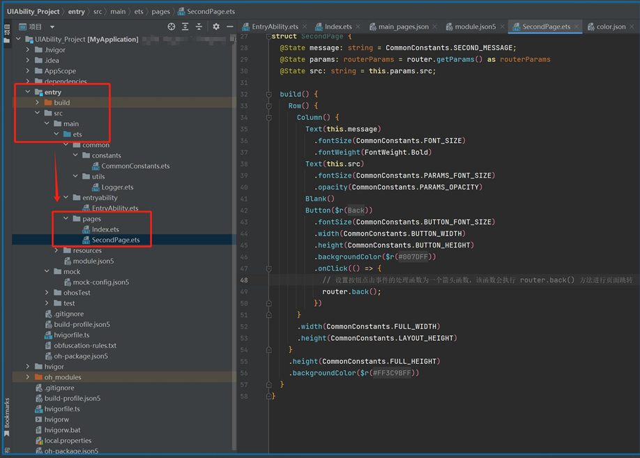
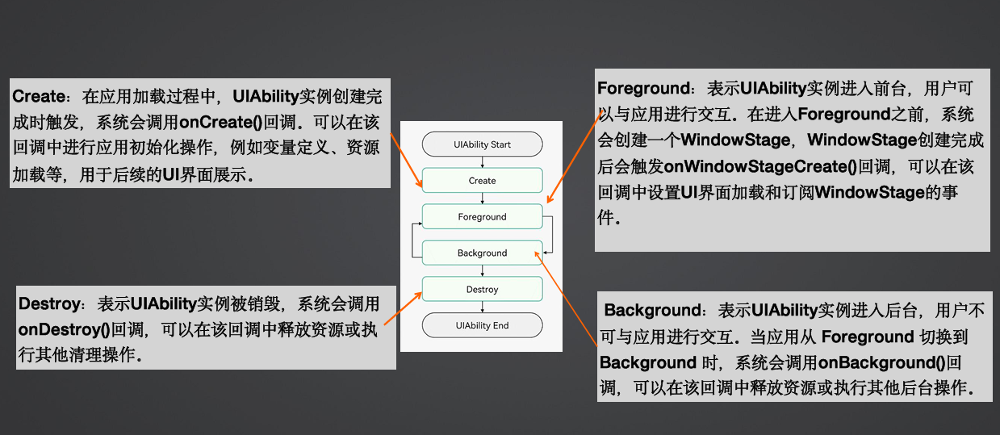
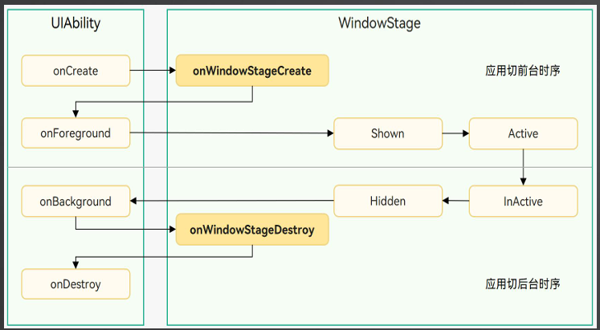

[TOC]

# UIAbility是什么

- `UIAbility` 是HarmonyOS 中一种包含UI界面的应用组件，主要用于与用户进行交互。它也是系统调度的基本单元，为应用提供绘制界面的窗口。

- 一个 UIAbility 组件中可以通过多个页面来实现一个功能模块。

- 每一个 UIAbility 组件实例，都对应一个最近任务列表中的任务。因此，对于开发者而言，可以根据具体的场景选择 **单个** 或者 **多个** UIAbility。


# UIAbility内页面的创建

1. 在 DevEco Studio中创建的UIAbility中，该Ability实例默认会加载Index页面，你可以根据需要将Index页面路径替换为需要的页面路径。
2. 所有创建的页面都需要在`main_pages.json`配置，通过DevEco Studio创建的页面会自动配置。
3. 手动创建的`page`文件到 `entry -> src -> main -> ets -> pages` 目录



# 页面间的跳转和数据传递

- 在HarmonyOs中，页面路由可以在应用程序中实现不同页面之前的跳转和数据传递。
- HarmonyOS提供了`Router`模块，通过不同的url地址，可以方便的进行页面路由，轻松的访问不同的页面。
- Router模块提供了两种跳转模式：
  1. router.pushUrl()：目标页不会替换当前页，而是压入页面栈。这样可以保留当前页的状态，并且可以通过返回键或者调用`router.back()`方法返回到当前页。
  2. router.replaceUrl()：目标页会替换当前页，并销毁当前页。这样可以释放当前页的资源，并且无法返回到当前页。
- 页面栈的**最大容量为32个页面**。如果超过这个限制，可以调用router.clear()方法清空历史页面栈，释放内存空间。

```
//跳转
router.pushUrl({
	//跳转到的url
	url: CommonConstants.HOME_URL,
	//传递的对象：创建一个新的 routerParams 对象，并设置其中的 src 属性为 CommonConstants.HOME_SRC_MSG
	params: new routerParams(CommonConstants.HOME_SRC_MSG)
}).catch((error: Error) => {
	//如果页面跳转失败，使用Logger.info 方法打印错误信息到控制台
	Logger.info("123===", `IndexPage push error ${JSON.stringify(error)}`)
})
```


Router模块提供了两种实例模式，分别是Standard和Single。这两种模式决定了目标url是否会对应多个实例。

- Standard：标准实例模式，也是默认情况下的实例模式。每次调用该方法都会新建一个目标页，并压入栈顶。
- Single：单实例模式。即如果目标页的url在页面栈中已经存在同url页面，则离栈顶最近的同url页面会被移动到栈顶，并重新加载；如果目标页的url在页面栈中不存在同url页面，则按照标准模式跳转。


# UIAbility的生命周期


1. UIAbility的生命周期主要包括四个状态
2. 在不同状态之间转换时，系统会调用相应的生命周期回调函数
3. 合理管理UIAbility的生命周期可以提高应用的性能和用户体验


## 四个状态



1. Create：在应用加载过程中，UIAbility 实例创建完成时触发，系统会调用`onCreate()`回调。可以在回调中进行应用初始化操作，例如：变量定义、资源加载等，用于后续的UI界面展示。
2. Foreground：表示 UIAbility 实例进入前台，用户可以与应用进行交互。在进入 Foreground 之前，系统会创建一个`WindowStage`，WindowStage 创建完成后会触发 `onWindowStageCreate()` 回调，可以在该回调中设置 UI 界面加载和订阅 WindowStage 的事件。
3. Background：表示 UIAbility 实例进入后台，用户不可与应用进行交互。当应用从 Foreground 切换到 Background 时，系统会调用 `onBackground()` 回调，可以在该回调中释放资源或者执行其他后台操作。
4. Destroy：表示 UIAbility 实例被销毁，系统会调用 `onDestroy()` 回调，可以在该回调中释放资源或执行其他清理操作。


### Create状态

在应用加载过程中，UIAbility 实例创建完成时触发，系统会调用`onCreate()`回调。可以在回调中进行应用初始化操作，例如：变量定义、资源加载等，用于后续的UI界面展示。

```
export default class EntryAbility extends UIAbility {
	onCreate(want: Want, launchParam: AbilityConstant.LaunchParam): void {
 		// ⻚⾯初始化
  	}
}
```

`Want`是对象间信息传递的载体，可以用于应用组件间的信息传递。`want`的详细介绍请参见信息传递载体`Want`。


### WindowStageCreate 和 WindowStageDestroy 状态

UIAbility 实例创建完成之后，在进入 Foreground 之前，系统会创建一个 WindowStage。WindowStage 创建完成后会进入 onWindowStageCreate() 回调，可以在该回调中设置UI加载、设置WindowStage的事件订阅。




在`onWindowStageCreate()`回调中通过`loadContent()`方法设置应用要加载的页面，并根据需要调用`on('windowStageEvent')`方法订阅`WindowStage`的事件（获焦/失焦、可见/不可见）。

```
 export default class EntryAbility extends UIAbility {
 	//...
 	onWindowStageCreate(windowStage: window.WindowStage): void {
 		// 设置 WindowStage 的事件订阅（获焦/失焦、可⻅/不可⻅）
		try {
 			windowStage.on('windowStageEvent', (data) => {
 				let stageEventType: window.WindowStageEventType = data;
                switch (stageEventType) {
                    case window.WindowStageEventType.SHOWN: // 切到前台
                        Logger.info('windowStage foreground.');
                        break;
                    case window.WindowStageEventType.ACTIVE: // 获焦状态
                        Logger.info('windowStage active.');
                        break;
                    case window.WindowStageEventType.INACTIVE: // 失焦状态
                        Logger.info('windowStage inactive.');
                        break;
                    case window.WindowStageEventType.HIDDEN: // 切到后台
                        Logger.info('windowStage background.');
                        break;
                    default:
                        break;
                }
     		 });
    	} catch (exception) {
     		 Logger.error('Failed to enable the listener for window stage event changes. Cause:' + JSON.stringify(exception));
   		}
   		
    	// 设置 UI 加载
    	windowStage.loadContent('pages/Index', (err, data) => {
      		//...
    	});
  	}
 }
```

`WindowStage`的相关使用参见窗口开发指导。

对应于`onWindowStageCreate()`回调。在 UIAbility 实例销毁之前，则会先进入 `onWindowStageDestroy()`回调，可以在该回调中释放UI资源。

```
export default class EntryAbility extends UIAbility {
	windowStage: window.WindowStage | undefined = undefined
	
	onWindowStageCreate(windowStage: window.WindowStage): void {
		this.windowStage = windowStage;
	}
	
	onWindowStageDestroy() {
		//释放UI资源
	}
}
```


### Foreground 和 Background 状态

`Foreground`和`Background`状态分别在 UIAbility 实例 切换前台 和 切换后台时触发，对应于`onForeground()`回调和`onBackground()`回调。

`onForeground()`回调，在UIAbility的UI可见之前，如UIAbility切换至前台时触发。可以在onForeground()中申请系统需要的资源，或重新申请在`onBackground()`中释放的资源。

`onBackground()`回调，在UIAbility的UI完全不可见之后，如UIAbility切换至后台时触发。可以在onBackground()回调中释放UI不可见时无用的资源，或者在回调中执行较为耗时的操作，例如状态保存等。

例如：

- 应用在使用过程中需要使用用户定位时，并已经获取用户定位权限授权。在UI显示之前，可以在onForeground()回调中开启定位功能，从而获取到当前位置信息。

- 当用户切换到后台状态，可以在onBackground()回调中停止定位功能，以节省系统的资源小号。

```
export default class EntryAbility extends UIAbility {
	onForeground(): void {
		//申请系统需要的资源，或 重新申请在onBackground()中释放的资源
	}
	
	onBackground(): void {
		//释放 UI 不可见时无用的资源，或 在此回调中执行较为耗时的操作
		//例如状态保存等
	}
}
```


### Destroy 状态

Destroy状态在UIAbility实例销毁时触发。可以在`onDestroy()`回调中进行系统资源的释放、数据的保存等操作。

例如：调用`terminateSelf()`方法停止当前`UIAbility`实例，从而完成UIAbility实例的销毁；或 用户使用最近任务列表关闭该`UIAbility`实例，完成UIAbility的销毁。

```
export default class EntryAbility extends UIAbility {
	onDestroy() {
		//系统资源的释放、数据的保存等
	}
}
```


# UIAbility 基本用法

- 指定UIAbility的启动页面
- 获取UIAbility的上下文UIAbilityContext


### 指定启动页面

应用中的UiAbility在启动过程中，需要指定启动页面，否则应用启动后会因为没有默认加载页面而导致白屏。

可以在UIAbility的onWindowStageCreate()回调中，通过WindowStage对象的`loadContent()`方法设置启动页面.

```
export default class EntryAbility extends UIAbility {
 	//...
 	onWindowStageCreate(windowStage: window.WindowStage): void {
 		
    	// 设置 UI 加载
    	windowStage.loadContent('pages/Index', (err, data) => {
      		if(err.code) {
      			//加载失败
      			return;
      		}
      		//加载成功
    	});
  	}
 }
```


### 获取上下文UIAbilityContext

UIAbility类拥有自身的上下文信息，该信息为UIAbilityContext类的实例，UIAbilityContext类拥有abilityInfo、currentHapModuleInfo等属性。

通过UIAbilityContext可以获取UIAbility的相关配置信息，如包代码路径、Bundle名称Ability名称和应用程序需要的环境状态等属性信息，以及可以获取操作UIAbility实例的方法（startAbility()、connectServiceExtensionAbility()、terminateSelf()等）。

如需要在页面中获取当前Ability的Context，可以调用getContext接口获取当前页面关联的UIAbilityContext或ExtensionContext。


在UIAbility红获取上下文信息

```
export default class EntryAbility extends UIAbility {
		onCreate(want: Want, launchParam: AbilityConstant.LaunchParam): void {
			let context = this.context;//在UIAbility中获取上下文信息
		}
}
```


在页面中获取上下文信息

```
@Entry
@Component
struct Index {
	@State message: string = CommonConstants.INDEX_MESSAGE;
	private context = getContext(this) as common.UIAbilityContext
	
	startAbilityTest() {
		let want: Want = {}
		
		this.context.startAbility(want)
	}
}
```


# UIAbility组件与UI的数据同步


## 实现方式

1. 使用EventHub进行数据通信：在基类Context中提供了EventHub对象，可以通过发布订阅方式来实现事件的传递。

   在事件传递前，订阅者需要先进行订阅，当发布者发布事件时，订阅者将接收到事件并进行相应处理。

2. 使用AppStorage/LocalStorage进行数据同步

   ArkUI提供了AppStorage和LocalStorage两种应用级别的状态管理方案，可用于实现应用级别和UIAbility级别的的数据同步。


## EventHub

EventHub为UIAbility组件提供了事件机制，使它们能够进行订阅、取消订阅和触发事件等数据通信能力。

基类Context提供了EventHub对象，可用于在UIAbility组件实例内通信。

1. 在UIAbility中调用eventHub.on()方法注册一个自定义事件'event1'，eventHub.on()有下面两种调用方式。

   ```
   export default class EntryAbility extends UIAbility {
   
   	onCreta(want: Want, launchParam: AbilityConstants.LaunchParam): void {
   		//页面初始化
   	
           //获取UIAbility实例的上下文
           let context = this.context
           //获取eventHub
           let eh = context.eventHub
           //方式1.注册一个事件'event1'，绑定一个监听函数，处理逻辑
           eh.on('event1', this.eventFunc)
           //方式2.直接使用箭头函数处理
           eh.on('event1', (data: string) => {
               //处理逻辑
           })
   	}
   	
   	//event1对应的监听函数
   	eventFunc(arg1: Context, arg2: Context) {
   		//监听到事件参数
   	}
   }
   ```

2. 在页面中通过eventHub.emit()方法触发该事件，在触发事件的同时，根据需要传入参数信息。

   ```
   private context = getContext(this) as common.UIAbilityContext
   
   emitEvent1() {
   	this.context.eventHub.emit('event1')//不带参数
   	this.context.eventHub.emit('event1', 2002)//带参数一个
   	this.context.eventHub.emit('event1', 2002, '这是一个eventHub emit发送的参数')//带2个参数
   }
   ```

3. 在自定义事件'event1'使用完成后，可以根据需要调用eventHub.off()方法取消该事件的订阅

   `this.context.eventHub.off(event1)`


# UIAbility组件间交互

在设备内的功能模块跳转时，会涉及启动特定的UIAbility，可以是应用内的其他Ability，或者其他

应用的（如启动第三方支付UIAbility）


## 启动应用内的UIAbility

当一个应用内包含多个UIAbility时，存在应用内启动UIAbility的场景。


- 假设应用中有两个UIAbility：EntryAbility和FuncAbility（可以在同一个Module中，也可以在不同的Module中），需要从EntryAbility的页面启动FuncAbility。

  在EntryAbility中，通过调用startAbility()方法启动其他UIAbility

  want为UIAbility实例启动的入口参数：

  - bundleName：待启动应用的Bundle名
  - abilityName：待启动的Ability名
  - moduleName：待启动的UIAbility属于不同的Module时添加
  - parameters：自定义信息参数

  ```
  startAbilityTest(){
  	let want: Want = {
  		deviceId: '',//空代表本设备
  		bundleName: 'com.xxx.uiabilitytest'
  		//moduleName: 'entry',//非必填
  		abilityName: 'funcAbility',
  		parameters: {//自定义参数
  			info: '来自EntryAbility的信息'
  		}
  	}
  	
  	this.context.startAbility(want)
  }
  ```

- 在FuncAbility的onCreate()或者onNewWant()生命周期回调中接受EntryAbility传递过来参数。

  ```
  let info = want.paramters?.info
  ```

- 在被拉起的FuncAbility中，可以通过获取传递过来的want参数的parameters来获取拉起方UIAbility的PID、Bundle Name等信息

- 在FuncAbility业务完成之后，如果要停止当前UIAbility实例，在FuncAbility中拖过调用terminateSelf()方法实现。

  调用terminateSelf()方法停用当前UIAbility实例时默认会保留该实例的快照(Snapshot)，即在最近任务列表中仍然能查看到该实例对应的任务。如果不需要保留该实例的快照。可以在其对应的UIAbility的module.json5配置文件中，将abilities标签的removeMissionAfterTerminate字段配置为true。

- 关闭应用所有的UIAbility实例，可以调用ApplicationContext的killAllProcesses()方法实现关闭应用所有的进程。


## 启动应用内的UIAbility并获取返回结果

在一个EntryAbility启动另外一个FuncAbility时，希望在被启动的FuncAbility完成相关业务后，能将结果返回给调用方。


- 在EntryAbility中，调用startAbilityForResult()接口启动FuncAbility，异步回调中的data用于接收FuncAbility停止自身后返回给EntryAbility的信息。

  ```
  this.context.startAbilityForResult(want).then((result) => {
  	if(result.resultCode = 1111) {
  		//如果与自定义返回值相同
  		let info = result.want?.paramters?.info ?? '信息为空'
  	}
  })
  ```

- 在FuncAbility停止自身时，需要调用terminateSelfWithResult()方法，入参abilityResult为返回给EntryAbility的信息。

  ```
  let result: common.AbilityResult = {
  	resultCode = 1111,//自定义返回值
  	want: {
  		deviceId: '',//空代表本设备
  		bundleName: 'com.xxx.uiabilitytest',
  		//module: 'entry', //非必填
  		abilityName: 'funcAbility',
  		parameters: {
  			info: '来自FuncAbility结果返回的信息'
  		}
  	}
  }
  //终止并返回结果
  this.context.terminateSelfWithResult(result, (err) => {
  	if(err.code) {
  		//返回结果出错
  		return
  	}
  })
  ```

  


