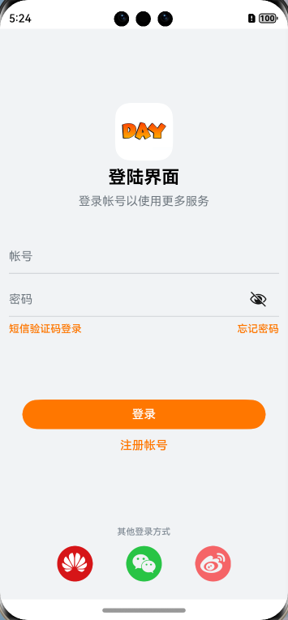
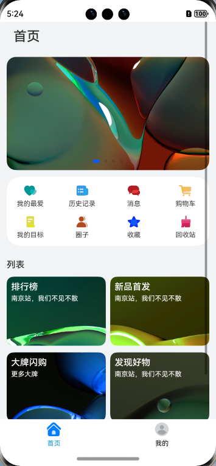
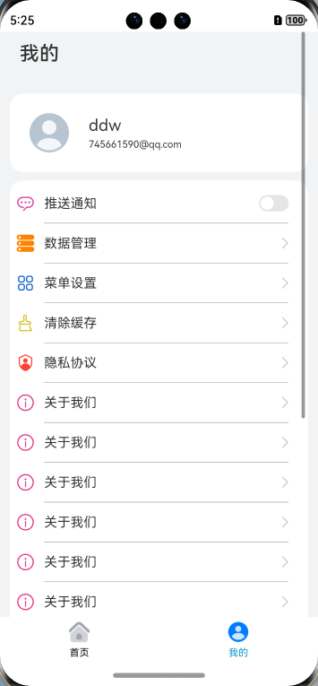

[TOC]

# 基础组件

**组件介绍**

组件（Component）是界面搭建与显示的最小单位，HarmonyOS ArkUI声明式开发范式为开发者提供了丰富多样的UI组件，我们可以使用这些组件轻松的编写出更加丰富、漂亮的界面。

组件根据功能可以分为以下五大类：

- 基础组件
- 容器组件
- 媒体组件
- 绘制组件
- 画布组件

其中**基础组件是视图层的基本组成单元**，包括Text、Image、TextInput、Button、LoadingProgress等，例如下面这个常用的登录界面就是由这些基础组件组合而成。

## Text

> 例子：看TextPage.ets

Text组件用于在界面上展示一段文本信息，可以包含`Span`和`ImageSpan`子组件

### 文本样式

针对包含文本元素的组件，例如`Text`、`Span`、`Button`、`TextInput`等，可使用`fontColor`、`fontSize`、`fontStyle`、 `fontWeight`、`fontFamily`这些文本样式，分别设置文本的颜色、大小、样式、粗细以及字体，文本样式的属性如下表：

| 名称       | 参数类型                                                     | 描述                                                         |
| ---------- | ------------------------------------------------------------ | ------------------------------------------------------------ |
| fontColor  | [ResourceColor](https://developer.huawei.com/consumer/cn/doc/harmonyos-references/ts-types-0000001862687741#ZH-CN_TOPIC_0000001862687741__resourcecolor) | 设置字体颜色。                                               |
| fontSize   | Length \| [Resource](https://developer.huawei.com/consumer/cn/doc/harmonyos-references/ts-types-0000001862687741#ZH-CN_TOPIC_0000001862687741__resource) | 设置字体大小，Length为number类型时，使用fp单位。             |
| fontStyle  | [FontStyle](https://developer.huawei.com/consumer/cn/doc/harmonyos-references/ts-appendix-enums-0000001815927712#ZH-CN_TOPIC_0000001815927712__fontstyle) | 设置字体样式。默认值：FontStyle.Normal。                     |
| fontWeight | number \| [FontWeight](https://developer.huawei.com/consumer/cn/doc/harmonyos-references/ts-appendix-enums-0000001815927712#ZH-CN_TOPIC_0000001815927712__fontweight) \| string | 设置文本的字体粗细，number类型取值[100, 900]，取值间隔为100，默认为400，取值越大，字体越粗。string类型仅支持number类型取值的字符串形式，例如“400”，以及“bold”、“bolder”、“lighter”、“regular”、“medium”，分别对应FontWeight中相应的枚举值。默认值：FontWeight.Normal。 |
| fontFamily | string \| [Resource](https://developer.huawei.com/consumer/cn/doc/harmonyos-references/ts-types-0000001862687741#ZH-CN_TOPIC_0000001862687741__resource) | 设置字体列表。默认字体'HarmonyOS Sans'，当前支持'HarmonyOS Sans'字体和[注册自定义字体](https://developer.huawei.com/consumer/cn/doc/harmonyos-references/js-apis-font-0000001821000745)。 |
| lineHeight | string \| number \| [Resource](https://developer.huawei.com/consumer/cn/doc/harmonyos-references/ts-types-0000001862687741#ZH-CN_TOPIC_0000001862687741__resource) | 设置文本的文本行高，设置值不大于0时，不限制文本行高，自适应字体大小，Length为number类型时单位为fp。 |
| decoration | {type: [TextDecorationType](https://developer.huawei.com/consumer/cn/doc/harmonyos-references/ts-appendix-enums-0000001815927712#ZH-CN_TOPIC_0000001815927712__textdecorationtype),color?: [ResourceColor](https://developer.huawei.com/consumer/cn/doc/harmonyos-references/ts-types-0000001862687741#ZH-CN_TOPIC_0000001862687741__resourcecolor)} | 设置文本装饰线样式及其颜色。默认值：{type: TextDecorationType.None,color：Color.Black} |

### 设置文本对齐方式

使用textAlign属性可以设置文本的对齐方式，示例代码如下：

```typescript
Text('Hello ArkTs')
    .width(200)
    .textAlign(TextAlign.Start)
    .backgroundColor(0xE6F2FD)
```

textAlign参数类型为TextAlign，定义了以下几种类型：

- Start（默认值）：水平对齐首部。

- Center：水平居中对齐。

- End：水平对齐尾部。

- JUSTIFY：双端对齐。


## Image

> 例子：看ImagePage.ets

Image组件用来渲染展示图片，它可以让界面变得更加丰富多彩。给Image组件设置图片地址、宽和高，图片就能加载出来，示例如下：

```typescript
Image($r("app.media.icon"))
    .width(100)
    .height(100)
```


### 设置缩放类型

为了使图片在页面中有更好的显示效果，有时候需要对图片进行缩放处理。您可以使用objectFit属性设置图片的缩放类型，**objectFit**的参数类型为ImageFit。

ImageFit包含以下几种类型：

- Contain：保持宽高比进行缩小或者放大，使得图片完全显示在显示边界内。

- Cover（默认值）：保持宽高比进行缩小或者放大，使得图片两边都大于或等于显示边界。

- Auto：自适应显示。

- Fill：不保持宽高比进行放大缩小，使得图片充满显示边界。

- ScaleDown：保持宽高比显示，图片缩小或者保持不变。

- None：保持原有尺寸显示。

  

### 加载网络图片

比如浏览新闻的时候，图片一般从网络加载而来，Image组件支持加载网络图片，将图片地址换成网络图片地址进行加载。

```typescript
Image('https://www.example.com/xxx.png')
```

为了成功加载网络图片，您需要在module.json5文件中申明网络访问权限。

```xml
{     
	"module" : {         
		"requestPermissions":[            
			{              
				"name": "ohos.permission.INTERNET"            
			}         
		]     
	} 
}
```


## TextInput

TextInput组件用于输入单行文本，响应输入事件。TextInput的使用也非常广泛，例如应用登录账号密码、发送消息等。和Text组件一样，TextInput组件也支持文本样式设置，下面的示例代码实现了一个简单的输入框：

```typescript
TextInput()
    .fontColor(Color.Blue)  
    .fontSize(20)  
    .fontStyle(FontStyle.Italic)  
    .fontWeight(FontWeight.Bold)  
    .fontFamily('Arial')
```


### 设置输入提示文本

当我们平时使用输入框的时候，往往会有一些提示文字。例如登录账号的时候会有“请输入账号”这样的文本提示，当用户输入内容之后，提示文本就会消失，这种提示功能使用placeholder属性就可以轻松的实现。您还可以使用placeholderColor和placeholderFont分别设置提示文本的颜色和样式，示例代码如下：

```typescript
TextInput({ placeholder: '请输入帐号' })  
    .placeholderColor(0x999999)  
    .placeholderFont({ size: 20, weight: FontWeight.Medium, family: 'cursive', style: FontStyle.Italic })
```


### 设置输入类型

可以使用type属性来设置输入框类型。例如密码输入框，一般输入密码的时候，为了用户密码安全，内容会显示为“......”，针对这种场景，将type属性设置为InputType.Password就可以实现。示例代码如下：

```typescript
TextInput({ placeholder: '请输入密码' })  
    .type(InputType.Password)
```

type的参数类型为InputType，包含以下几种输入类型：

- Normal：基本输入模式。支持输入数字、字母、下划线、空格、特殊字符。

- Password：密码输入模式。

- Email：e-mail地址输入模式。

- Number：纯数字输入模式。

- PhoneNumber：电话号码输入模式。支持输入数字、+ 、-、*、#，长度不限。

  

### 设置光标位置

可以使用TextInputController动态设置光标位置，下面的示例代码使用TextInputController的caretPosition方法，将光标移动到了第二个字符后。

```typescript
@Entry
@Component
struct TextInputDemo {  
    controller: TextInputController = new TextInputController();  
    build() {    
        Column() {      
            TextInput({ controller: this.controller })      
            Button('设置光标位置')        
                .onClick(() => {          
                	this.controller.caretPosition(2)        
            	})    
        }    
        .height('100%')    
        .backgroundColor(0xE6F2FD)  
    }
}
```


### 获取输入文本

我们可以给TextInput设置onChange事件，输入文本发生变化时触发回调，下面示例代码中的value为实时获取用户输入的文本信息。

```typescript
@Entry
@Component 
struct TextInputDemo {  
    @State text: string = '';  
    build() {    
        Column() {      
            TextInput({ placeholder: '请输入账号' })        
                .caretColor(Color.Blue)        
                .onChange((value: string) => {          
                	this.text = value;         
            	})      
            Text(this.text)    
        }    
        .alignItems(HorizontalAlign.Center)    
        .padding(12)    
        .backgroundColor(0xE6F2FD)  
    }
}
```


## Button

Button组件主要用来响应点击操作，可以包含子组件。下面的示例代码实现了一个“登录按钮”：

```typescript
Button('登录', { type: ButtonType.Capsule, stateEffect: true })  
    .width('90%')  
    .height(40)  
    .fontSize(16)  
    .fontWeight(FontWeight.Medium)  
    .backgroundColor('#007DFF')
```


### 设置按钮样式

type用于定义按钮样式，示例代码中ButtonType.Capsule表示胶囊形按钮；stateEffect用于设置按钮按下时是否开启切换效果，当状态置为false时，点击效果关闭，默认值为true。

我们可以设置多种样式的Button，除了Capsule可以以设置Normal和Circle：

- Capsule：胶囊型按钮（圆角默认为高度的一半）。

- Circle：圆形按钮。

- Normal：普通按钮（默认不带圆角）。

  

### 设置按钮点击事件

可以给Button绑定onClick事件，每当用户点击Button的时候，就会回调执行onClick方法，调用里面的逻辑代码。

```typescript
Button('登录', { type: ButtonType.Capsule, stateEffect: true })  
	//...  
    .onClick(() => {    
    	// 处理点击事件逻辑  
	}
)
```


### 包含子组件

Button组件可以包含子组件，让您可以开发出更丰富多样的Button，下面的示例代码中Button组件包含了一个Image组件：

```typescript
Button({ type: ButtonType.Circle, stateEffect: true }){
    Image($r('app.media.icon_delete'))
        .width(30)
        .height(30)
}.width(55).height(55).backgroundColor(0x317aff)
```


## LoadingProgress

LoadingProgress组件用于显示加载进展，比如应用的登录界面，当我们点击登录的时候，显示的“正在登录”的进度条状态。LoadingProgress的使用非常简单，只需要设置颜色和宽高就可以了。

```typescript
LoadingProgress()  
    .color(Color.Blue)  
    .height(60)  
    .width(60)
```


## 用资源引用类型

Resource是资源引用类型，用于设置组件属性的值。推荐大家优先使用Resource类型，将资源文件（字符串、图片、音频等）统一存放于resources目录下，便于开发者统一维护。同时系统可以根据当前配置加载合适的资源，例如，开发者可以根据屏幕尺寸呈现不同的布局效果，或根据语言设置提供不同的字符串。

例如下面的这段代码，直接在代码中写入了字符串和数字这样的硬编码。

```typescript
Button('登录', { type: ButtonType.Capsule, stateEffect: true })  
    .width(300)  
    .height(40)  
    .fontSize(16)  
    .fontWeight(FontWeight.Medium)  
    .backgroundColor('#007DFF')
```

我们可以将这些硬编码写到entry/src/main/resources下的资源文件中。

在string.json中定义Button显示的文本。

```xml
{   
	"string": [     
		{       
			"name": "login_text",       
			"value": "登录"     
		}   
	] 
} 
```

在float.json中定义Button的宽高和字体大小。

```xml
{   
	"float": [     
		{       
			"name": "button_width",       
			"value": "300vp"     
		},     
		{       
			"name": "button_height",       
			"value": "40vp"     
		},     
		{       
			"name": "login_fontSize",       
			"value": "18fp"     
		}   
	]
}
```

在color.json中定义Button的背景颜色。

```xml
{   
	"color": [     
		{       
			"name": "button_color",       
			"value": "#1890ff"     
		}   
	] 
}
```

然后在Button组件通过“$r('app.type.name')”的形式引用应用资源。app代表应用内resources目录中定义的资源；type代表资源类型（或资源的存放位置），可以取“color”、“float”、“string”、“plural”、“media”；name代表资源命名，由开发者定义资源时确定。

```typescript
Button($r('app.string.login_text'), { type: ButtonType.Capsule })
	.width($r('app.float.button_width'))  
	.height($r('app.float.button_height'))  
	.fontSize($r('app.float.login_fontSize'))  
	.backgroundColor($r('app.color.button_color'))
```


# 容器组件

## 概述

一个丰富的页面需要很多组件组成，那么，我们如何才能让这些组件有条不紊地在页面上布局呢？这就需要借助容器组件来实现。

容器组件是一种比较特殊的组件，它可以包含其他的组件，而且按照一定的规律布局，帮助开发者生成精美的页面。容器组件除了放置基础组件外，也可以放置容器组件，通过多层布局的嵌套，可以布局出更丰富的页面。


## 组件介绍

### 布局容器概念

线性布局容器表示按照垂直方向或者水平方向排列子组件的容器，ArkTS提供了Column和Row容器来实现线性布局。

- Column表示沿垂直方向布局的容器。
- Row表示沿水平方向布局的容器。


### 主轴和交叉轴概念

在布局容器中，默认存在两根轴，分别是主轴和交叉轴，这两个轴始终是相互垂直的。不同的容器中主轴的方向不一样的。

- **主轴**：在Column容器中的子组件是按照从上到下的垂直方向布局的，其主轴的方向是垂直方向；在Row容器中的组件是按照从左到右的水平方向布局的，其主轴的方向是水平方向。
- **交叉轴**：与主轴垂直相交的轴线，如果主轴是垂直方向，则交叉轴就是水平方向；如果主轴是水平方向，则交叉轴是垂直方向。


### 属性介绍

了解布局容器的主轴和交叉轴，主要是为了让大家更好地理解子组件在主轴和交叉轴的排列方式。

接下来，我们将详细讲解Column和Row容器的两个属性justifyContent和alignItems。

| 属性名称       | 描述                                 |
| -------------- | ------------------------------------ |
| justifyContent | 设置子组件在主轴方向上的对齐格式。   |
| alignItems     | 设置子组件在交叉轴方向上的对齐格式。 |


1. 主轴方向的对齐（justifyContent）

子组件在主轴方向上的对齐使用justifyContent属性来设置，其参数类型是[FlexAlign](https://developer.huawei.com/consumer/cn/doc/harmonyos-references/ts-appendix-enums-0000001815927712#ZH-CN_TOPIC_0000001815927712__flexalign)。FlexAlign定义了以下几种类型：

- Start：元素在主轴方向首端对齐，第一个元素与行首对齐，同时后续的元素与前一个对齐。

- Center：元素在主轴方向中心对齐，第一个元素与行首的距离以及最后一个元素与行尾距离相同。

- End：元素在主轴方向尾部对齐，最后一个元素与行尾对齐，其他元素与后一个对齐。

- SpaceBetween：元素在主轴方向均匀分配弹性元素，相邻元素之间距离相同。 第一个元素与行首对齐，最后一个元素与行尾对齐。

- SpaceAround：元素在主轴方向均匀分配弹性元素，相邻元素之间距离相同。 第一个元素到行首的距离和最后一个元素到行尾的距离是相邻元素之间距离的一半。

- SpaceEvenly：元素在主轴方向等间距布局，无论是相邻元素还是边界元素到容器的间距都一样

  

2.交叉轴方向的对齐（alignItems）

子组件在交叉轴方向上的对齐方式使用alignItems属性来设置。

Column容器的主轴是垂直方向，交叉轴是水平方向，其参数类型为[HorizontalAlign](https://developer.huawei.com/consumer/cn/doc/harmonyos-references/ts-appendix-enums-0000001815927712#ZH-CN_TOPIC_0000001815927712__horizontalalign)（水平对齐），HorizontalAlign定义了以下几种类型：

- Start：设置子组件在水平方向上按照按照语言方向起始端对齐。
- Center（默认值）：设置子组件在水平方向上居中对齐。
- End：设置子组件在水平方向上按照语言方向末端对齐。

Row容器的主轴是水平方向，交叉轴是垂直方向，其参数类型为[VerticalAlign](https://developer.huawei.com/consumer/cn/doc/harmonyos-references/ts-appendix-enums-0000001815927712#ZH-CN_TOPIC_0000001815927712__verticalalign)（垂直对齐），VerticalAlign定义了以下几种类型：

- Top：设置子组件在垂直方向上居顶部对齐。
- Center（默认值）：设置子组件在竖直方向上居中对齐。
- Bottom：设置子组件在竖直方向上居底部对齐。


### 接口介绍

接下来，我们介绍Column和Row容器的接口。

| 容器组件 | 接口                                      |
| -------- | ----------------------------------------- |
| Column   | Column(value?:{space?: string \| number}) |
| Row      | Row(value?:{space?: string \| number})    |

Column和Row容器的接口都有一个可选参数space，表示子组件在主轴方向上的间距。


## 组件使用

讲解如何高效的使用Column和Row容器组件来构建这个登录页面。

登录页面。在静态布局中，组件整体是从上到下布局的，因此构建该页面可以使用Column来构建。在此基础上，我们可以看到有部分内容在水平方向上由几个基础组件构成，例如页面中间的短信验证码登录与忘记密码以及页面最下方的其他方式登录，那么构建这些内容的时候，可以在Column组件中嵌套Row组件，继而在Row组件中实现水平方向的布局。

在Column容器里，依次是Image、Text、TextInput、Button等基础组件，还有两组组件是使用Row容器组件来实现的，主要代码如下：

```typescript
@Entry 
@Component 
export struct LoginPage {  
    build() {    
        Column() {      
            Image($r('app.media.logo'))      
            //...      
            Text($r('app.string.login_page'))      
            //...      
            Text($r('app.string.login_more'))      
            //...      
            TextInput({ placeholder: $r('app.string.account') })      
            //...      
            TextInput({ placeholder: $r('app.string.password') })      
            //...      
            Row() {         
                Text($r(…))         
                Text($r(…))        
            }      
            Button($r('app.string.login'), { type: ButtonType.Capsule, stateEffect: true })      			//...      
            Row() {         
                this.imageButton($r(…))         
                this.imageButton($r(…))         
                this.imageButton($r(…))       
            }      
            //...    
        }    
        //...  
    }
}
```

我们详细看一下使用Row容器的两组组件。

两个文本组件展示的内容是按水平方向布局的，使用两端对齐的方式。这里我们使用Row容器组件，并且需要配置主轴上（水平方向）的对齐格式justifyContent为FlexAlign.SpaceBetween（两端对齐）。

```typescript
Row() {  
    Text(...)   
    Text(...)
}
.justifyContent(FlexAlign.SpaceBetween)
.width('100%')
```

其他登录方式的三个按钮也是按水平方向布局的，同样使用Row容器组件。这里按钮的间距是一致的，我们可以通过配置可选参数space来设置按钮间距，使子组件间距一致。

```typescript
Row({ space: CommonConstants.LOGIN_METHODS_SPACE }) {
    this.imageButton($r('app.media.login_method1'))
    this.imageButton($r('app.media.login_method2'))
    this.imageButton($r('app.media.login_method3'))
}
```


# 构建列表页面

## List组件的使用

### List组件简介

List是很常用的滚动类容器组件，一般和子组件ListItem一起使用，List列表中的每一个列表项对应一个ListItem组件。


### 使用ForEach渲染列表

列表往往由多个列表项组成，所以我们需要在List组件中使用多个ListItem组件来构建列表，这就会导致代码的冗余。使用循环渲染（ForEach）遍历数组的方式构建列表，可以减少重复代码，示例代码如下：

```typescript
@Entry
@Component 
struct ListDemo {  
    private arr: number[] = [0, 1, 2, 3, 4, 5, 6, 7, 8, 9];  
    build() {    
        Column() {      
            List({ space: 10 }) {        
                ForEach(this.arr, (item: number) => {          
                    ListItem() {            
                        Text(`${item}`)              
                            .width('100%')              
                            .height(100)              
                            .fontSize(20)              
                            .fontColor(Color.White)              
                            .textAlign(TextAlign.Center)              
                            .borderRadius(10)              
                            .backgroundColor(0x007DFF)          
                    }        
                }, (item: number) => JSON.stringify(item))      
            }    
        }    
        .padding(12)    
        .height('100%')    
        .backgroundColor(0xF1F3F5)  
    }
}
```


### 设置列表项分割线

List组件子组件ListItem之间默认是没有分割线的，部分场景子组件ListItem间需要设置分割线，这时候您可以使用List组件的divider属性。divider属性包含四个参数：

- strokeWidth: 分割线的线宽。

- color: 分割线的颜色。

- startMargin：分割线距离列表侧边起始端的距离。

- endMargin: 分割线距离列表侧边结束端的距离。

  

### List列表滚动事件监听

List组件提供了一系列事件方法用来监听列表的滚动，您可以根据需要，监听这些事件来做一些操作：

- onScroll：列表滑动时触发，返回值scrollOffset为滑动偏移量，scrollState为当前滑动状态。
- onScrollIndex：有子组件划入或划出List显示区域时触发。从API version 10开始，List显示区域中间位置子组件变化时也会触发。
- onReachStart：列表到达起始位置时触发。
- onReachEnd：列表到达末尾位置时触发。
- onScrollStop：列表滑动停止时触发。


### 设置List排列方向

List组件里面的列表项默认是按垂直方向排列的，如果您想让列表沿水平方向排列，您可以将List组件的listDirection属性设置为Axis.Horizontal。

**listDirection**参数类型是[Axis](https://developer.huawei.com/consumer/cn/doc/harmonyos-references/ts-appendix-enums-0000001815927712#ZH-CN_TOPIC_0000001815927712__axis)，定义了以下两种类型：

- Vertical（默认值）：子组件ListItem在List容器组件中呈纵向排列。
- Horizontal：子组件ListItem在List容器组件中呈横向排列。


## Grid组件的使用

### Grid组件简介

Grid组件为网格容器，是一种网格布局，由“行”和“列”分割的单元格所组成，通过指定“项目”所在的单元格做出各种各样的布局。Grid组件一般和子组件GridItem一起使用，Grid网格中的每一个条目对应一个GridItem组件。


### 使用ForEach渲染网格布局

和List组件一样，Grid组件也可以使用ForEach来渲染多个GridItem项，我们通过下面的这段示例代码来介绍Grid组件的使用。

```typescript
@Entry
@Component 
struct GridExample {  
    private arr: String[] = ['0', '1', '2', '3'];  
    build() {    
        Column() {      
            Grid() {        
                ForEach(this.arr, (day: string) => {          
                    ForEach(this.arr, (day: string) => {            
                        GridItem() {              
                            Text(day)                
                                .fontSize(16)                
                                .fontColor(Color.White)                
                                .backgroundColor(0x007DFF)                
                                .width('100%')                
                                .height('100%')                
                                .textAlign(TextAlign.Center)            
                        }          
                    }, (day: string) => JSON.stringify(day))        
                }, (day: string) => JSON.stringify(day))      
            }      
            .columnsTemplate('1fr 1fr 1fr 1fr')      
            .rowsTemplate('1fr 1fr 1fr 1fr')      
            .columnsGap(10)      
            .rowsGap(10)      
            .height(300)    
        }    
        .width('100%')    
        .padding(12)    
        .backgroundColor(0xF1F3F5)  
    }
}
```

示例代码中使用了两层ForEach遍历长度为4的数组arr，创建了16个GridItem项。同时设置columnsTemplate的值为'1fr 1fr 1fr 1fr'，表示这个网格为4列，将Grid允许的宽分为4等分，每列占1份；rowsTemplate的值为'1fr 1fr 1fr 1fr'，表示这个网格为4行，将Grid允许的高分为4等分，每行占1份。这样就构成了一个4行4列的网格布局，然后使用columnsGap设置列间距为10vp，使用rowsTemplate设置行间距也为10vp。

上面构建的网格布局使用了固定的行数和列数，所以构建出的网格是不可滚动的。然而有时候因为内容较多，我们通过滚动的方式来显示更多的内容，就需要一个可以滚动的网格布局。我们只需要设置rowsTemplate和columnsTemplate中的一个即可。如果设置的是columnsTemplate，Grid的滚动方向为垂直方向；如果设置的是rowsTemplate，Grid的滚动方向为水平方向。

将示例代码中GridItem的高度设置为固定值，例如100；仅设置columnsTemplate属性，不设置rowsTemplate属性，就可以实现Grid列表的滚动：

```typescript
Grid() {  
    ForEach(this.arr, (day: string) => {    
        ForEach(this.arr, (day: string) => {      
            GridItem() {        
                Text(day)          
                    .fontSize(16)          
                    .fontColor(Color.White)          
                    .backgroundColor(0x007DFF)          
                    .width('100%')          
                    .height('100%')          
                    .textAlign(TextAlign.Center)      
            }    
        }, (day: string) => JSON.stringify(day))  
    }, (day: string) => JSON.stringify(day))
}
.columnsTemplate('1fr 1fr 1fr 1fr')
.columnsGap(10)
.rowsGap(10)
.height(300)
```

此外，Grid像List一样也可以使用onScrollIndex来监听列表的滚动。

## 长列表性能优化

开发者在使用长列表时，如果直接采用循环渲染方式，会一次性加载所有的列表元素，从而导致页面启动时间过长，影响用户体验，推荐通过以下方式来进行长列表性能优化：

[懒加载](https://developer.huawei.com/consumer/cn/doc/harmonyos-guides/best-practices-long-list-0000001728333749#section182645364229)

[缓存列表项](https://developer.huawei.com/consumer/cn/doc/harmonyos-guides/best-practices-long-list-0000001728333749#section11667144010222)

[组件复用](https://developer.huawei.com/consumer/cn/doc/harmonyos-guides/best-practices-long-list-0000001728333749#section36781044162218)

[布局优化](https://developer.huawei.com/consumer/cn/doc/harmonyos-guides/best-practices-long-list-0000001728333749#section155051250172217)


# 页签切换

## Tabs组件的简单使用

Tabs组件仅可包含子组件TabContent，每一个页签对应一个内容视图即TabContet组件。下面的示例代码构建了一个简单的页签页面：

```typescript
@Entry
@Component
struct TabsExample {
  private controller: TabsController = new TabsController();

  build() {
    Column() {
      Tabs({ barPosition: BarPosition.Start, controller: this.controller }) {
        TabContent() {
          Column().width('100%').height('100%').backgroundColor(Color.Green)
        }
        .tabBar('green')

        TabContent() {
          Column().width('100%').height('100%').backgroundColor(Color.Blue)
        }
        .tabBar('blue')

        TabContent() {
          Column().width('100%').height('100%').backgroundColor(Color.Yellow)
        }
        .tabBar('yellow')

        TabContent() {
          Column().width('100%').height('100%').backgroundColor(Color.Pink)
        }
        .tabBar('pink')
      }
      .barWidth('100%') // 设置TabBar宽度
      .barHeight(60) // 设置TabBar高度
      .width('100%') // 设置Tabs组件宽度
      .height('100%') // 设置Tabs组件高度
      .backgroundColor(0xF5F5F5) // 设置Tabs组件背景颜色
    }
    .width('100%')
    .height('100%')
  }
}
```


## 设置TabBar布局模式

因为Tabs的布局模式默认是Fixed的，所以Tabs的页签是不可滑动的。当页签比较多的时候，可能会导致页签显示不全，将布局模式设置为Scrollable的话，可以实现页签的滚动

Tabs的布局模式有Fixed（默认）和Scrollable两种：

- BarMode.Fixed：所有TabBar平均分配barWidth宽度（纵向时平均分配barHeight高度），页签不可滚动。

- BarMode.Scrollable：每一个TabBar均使用实际布局宽度，超过总长度（横向Tabs的barWidth，纵向Tabs的barHeight）后可滑动。

- 当页签比较多的时候，可以滑动页签，下面的示例代码将barMode设置为BarMode.Scrollable，实现了可滚动的页签:

  ```typescript
  @Entry
  @Component
  struct TabsExample {
    private controller: TabsController = new TabsController();
  
    build() {
      Column() {
        Tabs({ barPosition: BarPosition.Start, controller: this.controller }) {
          TabContent() {
            Column()
              .width('100%')
              .height('100%')
              .backgroundColor(Color.Green)
          }
          .tabBar('green')
  
          TabContent() {
            Column()
              .width('100%')
              .height('100%')
              .backgroundColor(Color.Blue)
          }
          .tabBar('blue')
  
          // ...
  
        }
        .barMode(BarMode.Scrollable)
        .barWidth('100%')
        .barHeight(60)
        .width('100%')
        .height('100%')
        .backgroundColor(0xF5F5F5)
      }
    }
  }
  ```

  

## 设置TabBar位置和排除方向

Tabs组件页签默认显示在顶部，某些场景下您可能希望Tabs页签出现在底部或者侧边，您可以使用Tabs组件接口中的参数barPosition设置页签位置。此外页签显示位置还与vertical属性相关联，vertical属性用于设置页签的排列方向，当vertical的属性值为false（默认值）时页签横向排列，为true时页签纵向排列。

barPosition的值可以设置为BarPosition.Start（默认值）和BarPosition.End：

- BarPosition.Start

  vertical属性方法设置为false（默认值）时，页签位于容器顶部。

  vertical属性方法设置为true时，页签位于容器左侧。

- BarPosition.End

  vertical属性方法设置为false时，页签位于容器底部。

  vertical属性方法设置为true时，页签位于容器右侧。


## 自定义TabBar样式

TabContent的tabBar属性除了支持string类型，还支持使用@Builder装饰器修饰的函数。您可以使用@Builder装饰器，构造一个生成自定义TabBar样式的函数，实现上面的底部页签效果，示例代码如下：

```typescript
@Entry
@Component
struct TabsExample {
  @State currentIndex: number = 0;
  private tabsController: TabsController = new TabsController();

  @Builder TabBuilder(title: string, targetIndex: number, selectedImg: Resource, normalImg: Resource) {
    Column() {
      Image(this.currentIndex === targetIndex ? selectedImg : normalImg)
        .size({ width: 25, height: 25 })
      Text(title)
        .fontColor(this.currentIndex === targetIndex ? '#1698CE' : '#6B6B6B')
    }
    .width('100%')
    .height(50)
    .justifyContent(FlexAlign.Center)
    .onClick(() => {
      this.currentIndex = targetIndex;
      this.tabsController.changeIndex(this.currentIndex);
    })
  }

  build() {
    Tabs({ barPosition: BarPosition.End, controller: this.tabsController }) {
      TabContent() {
        Column().width('100%').height('100%').backgroundColor('#00CB87')
      }
      .tabBar(this.TabBuilder('首页', 0, $r('app.media.home_selected'), $r('app.media.home_normal')))

      TabContent() {
        Column().width('100%').height('100%').backgroundColor('#007DFF')
      }
      .tabBar(this.TabBuilder('我的', 1, $r('app.media.mine_selected'), $r('app.media.mine_normal')))
    }
    .barWidth('100%')
    .barHeight(50)
    .backgroundColor('#f2f3f5')
    .onChange((index: number) => {
      this.currentIndex = index;
    })
  }
}
```

示例代码中将barPosition的值设置为BarPosition.End，使页签显示在底部。使用@Builder修饰TabBuilder函数，生成由Image和Text组成的页签。同时也给Tabs组件设置了TabsController控制器，当点击某个页签时，调用changeIndex方法进行页签内容切换。

最后还需要给Tabs添加onChange事件，Tab页签切换后触发该事件，这样当我们左右滑动内容视图的时候，页签样式也会跟着改变。


# 案例

HarmonyOS ArkUI提供了丰富多样的UI组件，您可以使用这些组件轻松地编写出更加丰富、漂亮的界面。在本篇Codelab中，您将通过一个简单的购物社交应用示例，学习如何使用常用的基础组件和容器组件。本示例主要包含：“登录”、“首页”、“我的”三个页面。

- [Image](https://developer.huawei.com/consumer/cn/doc/harmonyos-references/ts-basic-components-image-0000001815927572)：Image为图片组件，常用于在应用中显示图片。Image支持加载PixelMap、ResourceStr和DrawableDescriptor类型的数据源，支持png、jpg、bmp、svg和gif类型的图片格式。

- [TextInput](https://developer.huawei.com/consumer/cn/doc/harmonyos-references/ts-basic-components-textinput-0000001862607429)：单行文本输入框组件。

- [LoadingProgress](https://developer.huawei.com/consumer/cn/doc/harmonyos-references/ts-basic-components-loadingprogress-0000001862607401)：用于显示加载动效的组件。

- [Flex](https://developer.huawei.com/consumer/cn/doc/harmonyos-references/ts-container-flex-0000001815767820)：以弹性方式布局子组件的容器组件。

- [List](https://developer.huawei.com/consumer/cn/doc/harmonyos-references/ts-container-list-0000001862607449)：列表包含一系列相同宽度的列表项。适合连续、多行呈现同类数据，例如图片和文本。

- [Swiper](https://developer.huawei.com/consumer/cn/doc/harmonyos-references/ts-container-swiper-0000001862607461)：滑块视图容器，提供子组件滑动轮播显示的能力。

- [Grid](https://developer.huawei.com/consumer/cn/doc/harmonyos-references/ts-container-grid-0000001815927620)：网格容器，由“行”和“列”分割的单元格所组成，通过指定“项目”所在的单元格做出各种各样的布局。


| 登录                                                     | 首页                                                    | 我的                                                    |
| -------------------------------------------------------- | ------------------------------------------------------- | ------------------------------------------------------- |
|  |  |  |

