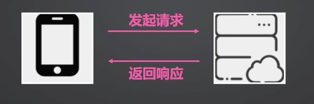

[TOC]

# HTTP概述

HTTP，全称`Hyper Text Transfer Protocol` 超文本传输协议。

HTTP请求为短连接。客户端发起请求，服务器返回响应。本次连接即结束。




# 添加网络权限

在访问网络之前，需要在module.json5中给APP添加网络权限

```json
"module": {
	"requestPermissions": [
        {
        	"name": "ohos.permission.INTERNET"
        }
    ]
}
```


# HTTP请求开发步骤

## 导入http模块

```typescript
import { http } from '@kit.NetworkKit'
```


## 创建http请求

```typescript
let httpRequest = http.createHttp()
```


## 订阅响应事件

```typescript
httpRequest.on('headersReceive', (header) => {
	// 返回请求头
});
```


## 发起请求

```typescript
let promise = httpRequest.request(
  url,
  {
    method: http.RequestMethod.POST,
    extraData: {
      "param1": "value1",
      "param2": "value2"
    },
    connectTimeout: 60000,
    readTimeout: 60000,
    expectDataType: http.HttpDataType.STRING,
    usingCache: true,
    priority: 1,
    usingProtocol: http.HttpProtocol.HTTP1_1,
    usingProxy: false,
    header: {
      'Content-Type': 'application/json'
    }
  })
```

请求参数解读如下表

| **字段**       | **类型**               |
| -------------- | ---------------------- |
| method         | 请求方式               |
| extraData      | 请求的额外数据         |
| connectTimeout | 连接超时时间           |
| readTimeout    | 读取超时时间           |
| expectDataType | 指定返回数据的类型     |
| usingCache     | 是否使用缓存，默认true |
| priority       | 优先级，1~1000，默认1  |
| usingProtocol  | 是否使用协议           |
| usingProxy     | 是否使用http代理       |
| header         | http请求头             |

请求方式支持列表

| **字段** | **类型**                                             |
| -------- | ---------------------------------------------------- |
| GET      | 请求指定的页面信息，并返回响应主体                   |
| POST     | 请求会向指定资源提交数据，请求服务器进行处理         |
| PUT      | 请求会向指定资源位置上传其最新内容                   |
| CONNECT  | HTTP/1.1协议预留，能够将连接改为管道方式的代理服务器 |
| HEAD     | 类似GET请求，返回响应头信息，但不会返回响应主体      |
| DELETE   | 请求服务器删除所请求URI                              |
| TRACE    | 请求服务器回显其收到的请求信息                       |
| OPTIONS  | 请求用于客户端查看服务器的性能                       |


## 处理响应

```typescript
let promise = httpRequest.request(…)

promise.then((data) => {
	if (data.responseCode === http.ResponseCode.OK) {
		…
  	}
})
```

data中包含以下字段

| data包含的字段 | 类型                |
| -------------- | ------------------- |
| responseCode   | 响应结果状态码      |
| result         | 响应数据            |
| resultType     | 返回值类型          |
| header         | 响应头              |
| cookies        | 服务器返回的cookies |

常见responseCode状态码

| **名称**  | **值** | **说明**                 |
| --------- | ------ | ------------------------ |
| OK        | 200    | 请求成功                 |
| CREATED   | 201    | 已创建新的资源           |
| NOT_FOUND | 404    | 找不到资源               |
| VERSION   | 505    | 服务器请求的HTTP协议版本 |


## 取消订阅

```typescript
httpRequest.off("headersReceive")
```


## 销毁http对象（可选）

```typescript
httpRequest.destroy()
```


# HTTP流式请求开发步骤

HTTP流式请求通常用于下载文件

前几步与前文HTTP请求相同

```typescript
// 导入https模块
import { http } from '@kit.NetworkKit’;
// 创建请求
let httpRequest = http.createHttp()
// 订阅响应事件
httpRequest.on('headersReceive', (header) => {
// 返回请求头
});
```


## 订阅更多响应事件

```typescript
let res = ""
httpRequest.on("dataReceive", (data: ArrayBuffer) => {
  // 累加数据
  res += data
})
httpRequest.on("dataEnd", () => {
  // 接收完毕
})
```


## 使用requestInStream发起请求

与前文不同的是，这里使用requestInStream发起请求

```typescript
let promise = httpRequest.requestInStream(
 url,
   {
  method: http.RequestMethod.POST,
     extraData: {
       "param1": "value1",
       "param2": "value2"
     },
     connectTimeout: 60000,
     readTimeout: 60000,
  expectDataType: http.HttpDataType.STRING,
     usingCache: true,
     priority: 1,
  usingProtocol: http.HttpProtocol.HTTP1_1,
     usingProxy: false,
  header: {
       'Content-Type': 'application/json'
     }
 });
```

请求字段如下

| **字段**       | **类型**               |
| -------------- | ---------------------- |
| method         | 请求方式               |
| extraData      | 请求的额外数据         |
| connectTimeout | 连接超时时间           |
| readTimeout    | 读取超时时间           |
| expectDataType | 指定返回数据的类型     |
| usingCache     | 是否使用缓存，默认true |
| priority       | 优先级，1~1000，默认1  |
| usingProtocol  | 是否使用协议           |
| usingProxy     | 是否使用http代理       |
| header         | http请求头             |


## 处理相应

```typescript
let promise = httpRequest.requestInStream(
	…
)

promise.then((responseCode) => {
  if (responseCode === http.ResponseCode.OK) {
    …
  }
})
```


## 取消订阅

```typescript
httpRequest.off("headersReceive")
httpRequest.off("dataReceive")
httpRequest.off("dataReceiveProgress")
httpRequest.off("dataEnd")
```


## 销毁http对象（可选）

```typescript
httpRequest.destroy()
```


# 案例：新闻加载

从网络api获取一个新闻列表，收到的数据为json格式，并将其显示到一个列表界面上面

我们将分这几个步骤来实现这个Demo

1. 行布局
2. ForEach实现列表
3. 配置Http请求
4. 发起请求处理响应
5. 界面触发更新


## 行布局

我们简单做个行布局，横向排列一个文本和图片。

```typescript
ListItem() {
  Row() {
    Text(item.title)
    Image(item.imgsrc)
  }
}
```


## ForEach实现列表

我们声明一个自定义类Item用于表达每行数据，包含title和imgsrc属性。声明一个@State属性newsList，类型为Item数组。在ForEach渲染的时候把newsList传入，每次循环的时候取得item实例，把其中的属性赋值给UI组件。

```typescript
class Item {
  title?: string
  imgsrc?: string
}
…
@State newsList: Item[] = new Array(10)
…
ForEach(this.newsList, (item: Item) => {
  ListItem() {
	…
  }
}, (item: Item) => item.title)
```


## 配置Http请求

参考上文，配置Http请求。请求的url可以使用https://v2.alapi.cn/api/new/toutiao?token=qlVquQZPYSeaCi6u。

```typescript
let httpRequest = http.createHttp()
httpRequest.on('headersReceive', (header) => {
  console.info('header: ' + JSON.stringify(header))
})
let url = "https://v2.alapi.cn/api/new/toutiao?token=qlVquQZPYSeaCi6u"
let promise = httpRequest.request(
  url, // 请求url地址
  {
   	// 请求方式
   	method: http.RequestMethod.GET,
   	// 开发者根据自身业务需要添加header字段
   	header: {
             'Content-Type': 'application/json'
   	}
  }
)
```


## 发起请求处理响应

用上文创建的promise任务发送请求，promise.then。在then回调里面拿到返回数据之后，赋值给newsList属性。


```typescript
@State newsList: Item[] = new Array(10)
…
promise.then((data) => {
  if (data.responseCode === http.ResponseCode.OK) {
    console.info('Result:' + data.result)
    console.info('code:' + data.responseCode)

    this.newsList = JSON.parse(data.result as string)["data"]
  }
}).catch((err: BusinessError) => {
  console.info('error:' + JSON.stringify(err))
})
```


## 界面触发更新

newsList更新之后，由于被@State，会自定触发UI更新。在之前定义的ForEach循环中，再次使用newsList渲染，界面将显示相应信息。

```typescript
@State newsList: Item[] = new Array(10)
…
this.newsList = JSON.parse(data.result as string)["data"]
…
List() {
  ForEach(this.newsList, (item: Item) => {
    ListItem() {
      Row() {
        Text(item.title)
        Image(item.imgsrc)
      }
    }
  }, (item: Item) => item.title)
}
```


# 案例：文件下载

本例将通过一个文件下载的Demo来学习Http流式请求。文件我们选择了一个常用磁盘工具DiskGenius，从其官网获得的下载链接，一共30m左右，大小和网络条件都比较合适。

分为以下步骤

1. 简单界面布局
2. 点击下载按钮设置保存文件
3. 配置Http请求
4. 开始下载
5. 下载完成


## 简单界面布局

界面上我们需要这几个元素：下载链接输入框，进度条，下载按钮，下载完成的文字提示。同时，有几个@State修饰的属性。

`@State progress`用于更新Progress组件的进度显示。

`@State downloadUrl`用于设置下载链接。代码中可以填写好链接，通常不需要在界面上手动修改。

`@State downloadFinished`用于表示下载是否完成的状态。可以用于“下载完成”的文字显示与否。

```typescript
@State progress: number = 0
@State downloadUrl: string = “…”
@State downloadFinished: boolean = false
…
Column() {
  TextInput({ text: this.downloadUrl })
  Progress({ value: this.progress })
  Button("下载")
    .onClick(() => {
  …
    })
  Text("下载完成")
    .visibility(this.downloadFinished ? Visibility.Visible : Visibility.Hidden)
}
```


## 点击下载按钮，设置保存文件

接下来，我们要配置点击按钮的动作。

**当我们点击下载按钮的时候，会调起系统的文件管理器界面，我们会在界面上声明创建的文件名以及选择它所在的目录。**

这里需要使用系统自带的`DocumentViewPicker`，调用实例的save方法，在异步回调then里面会获取到新文件的完整路径（包含文件名）。

在回调里面我们用获取到的文件路径来创建一个文件实例，保存在变量file里。

使用fs.openSync方法，打开文件，设定读写模式，并获取file实例。获取到file实例之后我们把它传到我们自己封装的download方法里。

```typescript
Button("下载")
  .onClick(() => {
   const documentViewPicker = new picker.DocumentViewPicker(); // 创建文件选择器实例
   documentViewPicker.save().then((documentSaveResult: Array<string>) => {
           let file = fs.openSync(documentSaveResult[0], fs.OpenMode.READ_WRITE);
           this.download(file)
    })
  })
```


## 配置Http请求

在download方法中，我们拿到了file实例，接下来我们看看怎么实现这个方法。

根据上文，我们同样先创建一个HttpRequest实例，然后注册几个事件监听：dataReceive，dataReceiveProgress和dataEnd。

在dataReceive中，我们会不停获取到文件的部分数据，每次获得数据的时候就用file实例写入磁盘。

在dataReceiveProgress中，我们会获取到文件下载进度。有两个数据，一个是已下载的大小，一个是总大小。我们可以利用这个数据，更新界面上进度条的显示。

在dataEnd中，我们可以关闭文件操作，并把@State修饰的progress属性置为0，让界面上的进度条回到初始显示状态。

```typescript
download(file: fs.File): void {
  let httpRequest = http.createHttp()
  httpRequest.on('dataReceive', (data: ArrayBuffer) => {
    fs.writeSync(file.fd, data)
  })
  httpRequest.on('dataReceiveProgress', (info: http.DataReceiveProgressInfo) => {
    this.progress = info.receiveSize / info.totalSize * 100
  })
  httpRequest.on('dataEnd', () => {
    fs.closeSync(file)
    this.progress = 0
  })
  …
}
```


## 开始下载

创建完请求，注册完监听之后，我们就要触发请求了。不同于上文，我们这里使用httpRequest.requestInStream()方法来配置请求地址。获取到异步任务之后，调用promise.then()发起请求。在文件接收完之后，会触发此处的then回调。

```typescript
download(file: fs.File): void {
  let httpRequest = http.createHttp()
  …
  let promise = httpRequest.requestInStream(
      	// 请求url地址
   		this.downloadUrl,
      	{
           	// 请求方式
     		method: http.RequestMethod.GET,
     		header: {
              'Content-Type': 'application/json'
           	}
       	}
  )
  promise.then((data) => {
    console.info('Result:' + data)
  })
}
```


## 下载完成

当下载完成时，会显示完成的提示。


# 案例：图片下载

本例将通过一个图片下载的Demo来学习Http流式请求。我们选择了百度首页的百度logo图片地址。

分为以下步骤

1. 简单界面布局
2. 点击下载按钮调用下载方法
3. 配置Http请求
4. 开始下载
5. 下载完成


## 简单界面布局

界面上我们需要这几个元素：下载链接输入框，进度条，下载按钮，下载完成的文字提示。同时，有几个@State修饰的属性。

@State progress用于更新Progress组件的进度显示。

@State downloadUrl用于设置下载链接。代码中可以填写好链接，通常不需要在界面上手动修改。

@State downloadFinished用于表示下载是否完成的状态。可以用于“下载完成”的文字显示与否。

@State pixelMap用于设置图片组件的数据源。

```typescript
@State progress: number = 0
@State downloadUrl: string = “…”
@State downloadFinished: boolean = false
@State pixelMap?: PixelMap = undefined
imageBuffer: ArrayBuffer = new ArrayBuffer(0)
…
Column() {
  TextInput({ text: this.downloadUrl })
  Progress({ value: this.progress })
  Image(this.pixelMap)
  Button("下载")
    .onClick(() => {
  …
    })
  Text("下载完成")
    .visibility(this.downloadFinished ? Visibility.Visible : Visibility.Hidden)
}
```


## 点击下载按钮，调用下载方法

```typescript
Button("下载")
  .onClick(() => {
       this.download()
  })
```


## 配置Http请求

在download方法中，我们拿到了file实例，接下来我们看看怎么实现这个方法。

根据上文，我们同样先创建一个HttpRequest实例，然后注册几个事件监听：dataReceive，dataReceiveProgress和dataEnd。

在dataReceive中，我们会不停获取到文件的部分数据，每次获得数据的时候就拼接到imageBuffer尾部。

在dataReceiveProgress中，我们会获取到文件下载进度。有两个数据，一个是已下载的大小，一个是总大小。我们可以利用这个数据，更新界面上进度条的显示。

在dataEnd中，我们可以调用createImageSource，createPixelMap方法，把收到的二进制数据转换为pixel map。

并把@State修饰的progress属性置为0，让界面上的进度条回到初始显示状态。

```typescript
download(file: fs.File): void {
  let httpRequest = http.createHttp()
  httpRequest.on('dataReceive', (data: ArrayBuffer) => {
    this.imageBuffer = concatenateArrayBuffers(this.imageBuffer, data)
  })
  httpRequest.on('dataReceiveProgress', (info: http.DataReceiveProgressInfo) => {
    this.progress = info.receiveSize / info.totalSize * 100
  })
  httpRequest.on('dataEnd', () => {
    let imageSource: image.ImageSource = image.createImageSource(this.imageBuffer);
    imageSource.createPixelMap().then((pixelMap: PixelMap) => {
        this.pixelMap = pixelMap
    })
    this.progress = 0
  })
  …
}
```


## 开始下载

创建完请求，注册完监听之后，我们就要触发请求了。不同于上文，我们这里使用httpRequest.requestInStream()方法来配置请求地址。获取到异步任务之后，调用promise.then()发起请求。在文件接收完之后，会触发此处的then回调。

```typescript
download(file: fs.File): void {
  let httpRequest = http.createHttp()
  …
  let promise = httpRequest.requestInStream(
      	// 请求url地址
   		this.downloadUrl,
      	{
           	// 请求方式
     		method: http.RequestMethod.GET,
     		header: {
              'Content-Type': 'application/json'
           	}
       	}
  )
  promise.then((data) => {
    console.info('Result:' + data)
  })
}
```


## 下载完成

当下载完成时，会显示完成的提示。
