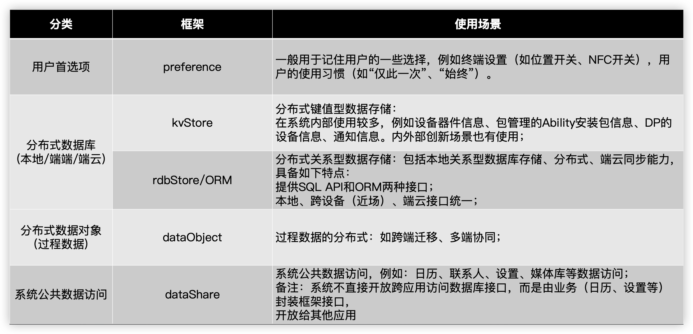

[TOC]

# 数据管理




# Preference 用户首选项


## 什么是用户首选项

用户首选项为应用提供Key-Value键值型的数据存储能力，支持应用持久化轻量级数据，并对其进行增删除改查等。该存储对象中的数据会被缓存在内存中，因此它可以获得更快的存取速度。


## 用户首选项运作机制

用户首选项的特点是：

1、以Key-Value形式存储数据

​		Key是不重复的关键字，Value是数据值。

2、非关系型数据库

​		区别于关系型数据库，它不保证遵循ACID（Atomicity, Consistency, Isolation and Durability）特性，数据之间无关系。


进程中每个文件对应一个Preferences实例，应用获取到实例后，可以从中读取数据，或者将数据存入实例中。通过调用flush方法可以将实例中的数据回写到文件里。

与关系数据库的区别

| 分类       | 关系型数据库                               | 用户首选项                                |
| ---------- | ------------------------------------------ | ----------------------------------------- |
| 数据库类型 | 关系型                                     | 非关系型                                  |
| 使用场景   | 提供复杂场景下的本地数据库管理机制         | 对Key-Value结构的数据进行存取和持久化操作 |
| 存储方式   | SQLite数据库                               | 文件                                      |
| 约束与限制 | 1.连接池最大4个 2.同一时间只支持一个写操作 | 1.建议数据不超一万条 2.Key为string型      |


## 接口介绍

常用接口有：保存数据（put）、获取数据（get）、是否包含指定的key（has）、数据持久化（flush）、删除数据（delete）等。


### 创建

```typescript
preference = preferences.getPreferences(this.context, 'PreferencesDemo')
```


### 保存数据（put）

通过flush方法把数据保存到文件

```typescript
this.preference.then(async (p) => {
  await p.put('key', 'value')
  await p.flush()
  console.info("preference put成功")
}).catch((err) => {

})
```


### 获取数据（get）

```typescript
let p = await this.preference
let str = await p.get('key', 'defValue')
console.info(`preference get到数据${str}`)
```


### 是否包含指定的key（has）


### 数据持久化（flush）

通过flush方法把应用数据保存到文件中，使得应用数据保存期限变长。


### 删除数据（delete）

```typescript
let p = await this.preference
await p.delete('key')
await p.flush()//此处一定要flush，要不然不能永久序列化到本地
console.info('preference del数据成功')
```


### 清空数据（clear）

```typescript
let p = await this.preference
await p.clear()
await p.flush()//此处一定要flush，要不然不能永久序列化到本地
console.info('preference clear数据成功')
```


# 数据库

关系型数据库**基于SQLite组件**，用于系统中结构化数据的存储和同步。例如:日历、联系人、备忘录、记账本等。

关系型数据库对应用提供通用的操作接口，底层使用SQLite作为持久化存储引擎，支持SQLite具有的数据库特性，包括但不限于事务、 索引、视图、触发器、外键、参数化查询和预编译SQL语句。


## **约束**

- 系统默认日志方式是WAL(Write Ahead Log)模式，**系统默认落盘方式是FULL模式**。

- 数据库中连接池的**最大数量是4个**，用以管理用户的读操作。
- 为保证数据的准确性，数据库**同一时间只能支持一个写操作**。
- 当应用被卸载完成后，设备上的相关数据库文件及临时文件会被自动清除。


## 基础类型

**NULL**：值是一个 NULL 值。

**INTEGER**：值是一个有符号的整数，根据值的大小存储在1、2、3、4、6或8个字节中。

**REAL**：值是一个浮点值，存储为8字节的IEEE浮点数。

**TEXT**：值是一个文本字符串，使用数据库编码（UTF-8、UTF-16BE或UTF-16LE）存储。

**BLOB**：值是一个二进制大对象，完全根据它的输入存储。


## 创建数据库

1. 配置数据库相关信息，包括数据库的名称、存储模式、是否为只读模式等; 

2. 初始化数据库表结构和相关数据;
3. 创建数据库。

```typescript
private rdbStore: relationalStore.RdbStore | undefined


const CREATE_TABLE_TEST = 'CREATE TABLE IF NOT EXISTS test (' +
    '_id INTEGER PRIMARY KEY,' +
    'name TEXT NOT NULL,' +
    'age INTEGER,' +
    'salary REAL,' +
    'date TEXT)';

    const STORE_CONFIG: relationalStore.StoreConfig = {
      name: 'RdbTest.db',
      securityLevel: relationalStore.SecurityLevel.S1
    }
    relationalStore.getRdbStore(this.context, STORE_CONFIG, (error, rdbStore) => {
      if (error) {
        console.error(`数据库获取错误：${error.message}`)
        return
      }
      this.rdbStore = rdbStore
      this.rdbStore.executeSql(CREATE_TABLE_TEST)
      console.log('创建数据库成功')
    })
```


## 插入数据

1. 构造要插入的数据，以ValuesBucket形式存储。
2. 调用关系型数据库提供的插入接口。

```typescript
let m: relationalStore.ValuesBucket = {
  'name': `wdd${this.count}}`,
  'age': this.count,
  'salary': this.count * 100.01,
  'date': `2024/06/13 88:0${this.count}`
}
this.rdbStore.insert('test', m, (error, rawId) => {
  if (error) {
    console.error(`数据库插入失败：${error.message}`)
    return
  }
  console.log(`创建数据库插入成功${rawId}`)
})
```


## 查询数据

1. 构造用于查询的谓词对象，设置查询条件。
2. 调用查询接口查询数据。
3. 调用结果集接口，返回查询结果。

```typescript
let predicates = new relationalStore.RdbPredicates("test")
predicates.isNotNull('name')
this.rdbStore.query(predicates, ["_id", "name", "age", "salary", "date"], (error, resultSet) => {
  if (error) {
    console.error(`数据库查询失败：${error.message}`)
    return
  }
  while (resultSet.goToNextRow()) {
    let _id = resultSet.getLong(resultSet.getColumnIndex("_id"))
    let name = resultSet.getString(resultSet.getColumnIndex("name"))
    let age = resultSet.getLong(resultSet.getColumnIndex("age"))
    let salary = resultSet.getDouble(resultSet.getColumnIndex("salary"))
    let date = resultSet.getString(resultSet.getColumnIndex("date"))
    console.info(`数据库查询结果：${_id},${name},${age},${salary},${date}`)
  }
})
```


# 案例

如何使用基础组件[Slider](https://developer.huawei.com/consumer/cn/doc/harmonyos-references/ts-basic-components-slider-0000001815767800)，通过拖动滑块调节应用内字体大小。要求完成以下功能：

1. 实现两个页面的UX：主页面和字体大小调节页面。
2. 拖动滑块改变字体大小系数，列表页和调节页面字体大小同步变化。往右拖动滑块字体变大，反之变小。
3. 字体大小支持持久化存储，再次启动时，应用内字体仍是调节后的字体大小。
