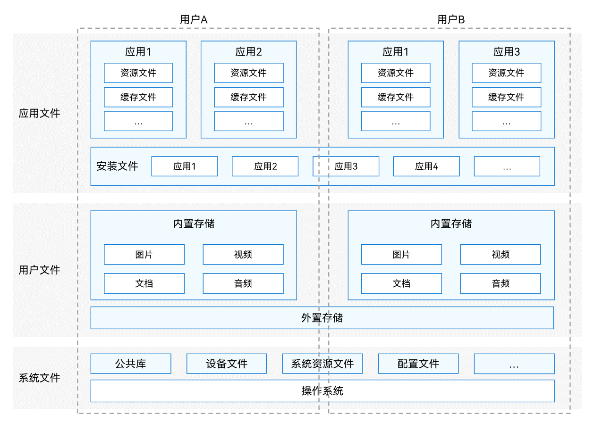
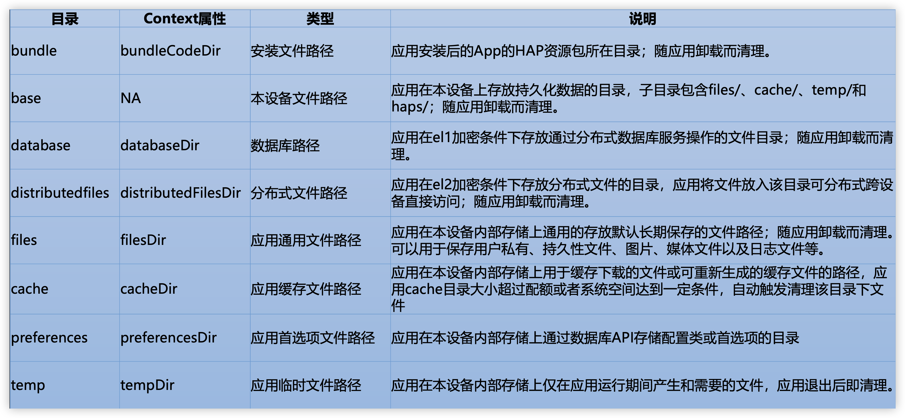
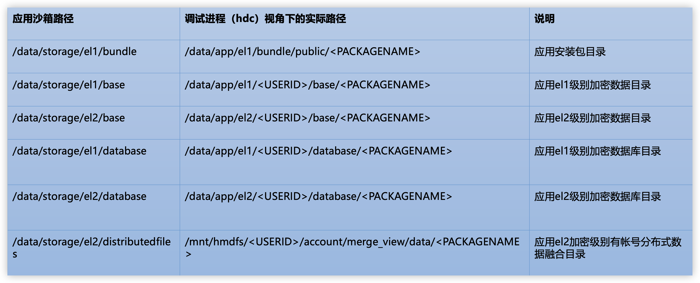

[TOC]

# 文件分类

按照文件所有者的不同可以把系统中的文件分为 **应用文件**、**用户文件**、**系统文件**。

- 应用文件 主要包括应用安装文件、资源文件以及缓存文件等。

- 用户文件 包括用户私有的图片、视频、音频、文档等

- 系统文件 包括公共库，设备文件、配置文件等。

# 应用沙箱（虚拟目录，仅应用自己可见）

应用沙箱是一种以安全防护为目的的隔离机制，避免数据受到恶意路径穿越访问。在这种沙箱的保护机制下，应用可见的目录范围即为“应用沙箱目录”。

在“应用沙箱目录”中，应用仅能看到自己的应用文件以及少量的系统文件（应用运行必需的少量系统文件）。因此，本应用的文件也不为其他应用可见，从而保护了应用文件的安全。

1. 一级目录data/：代表应用文件目录。

2. 二级目录storage/：代表本应用持久化文件目录。

3. 三级目录el1/、el2/：代表不同文件加密类型。

​	3.1 el1，设备级加密区：设备开机后即可访问的数据区。

​	3.2 el2，用户级加密区：设备开机后，需要至少一次解锁对应用户的锁屏界面（密码、指纹、人脸等方式或无密码状态）后，才能够访问的加密数据区。

​	3.3 应用如无特殊需要，应将数据存放在el2加密目录下，以尽可能保证数据安全。但是对于某些场景，一些应用文件需要在用户解锁前就可被访问，例如时钟、闹铃、壁纸等，此时应用需要将这些文件存放到设备级加密区（el1）。

4. 四级、五级目录：通过ApplicationContext可以获取distributedfiles目录或base下的files、cache、preferences、temp等目录的应用文件路径，应用全局信息可以存放在这些目录下。

# 应用文件路径详细

像首选项文件保存在preference下，键值型数据库保存在database 文件下，他们都是随着应用卸载而被清理，

还有缓存目录cache，存储大小达到一定条件后会清理该目录下的文件，

temp存放临时文件，应用推出后就清理，

分布式文件保存在distributedfiles目录下，随着应用卸载而清理

# 沙箱路径 VS 物理路径

应用沙箱目录是经过系统隔离机制后 只有应用自己才能访问的目录，

在实际开发过程中，我们可能需要通过命令行窗口来像应用目录下传送文件或者读取文件，

这里列出了应用沙箱目录与hdc命令调式进程下对应的实际路径

