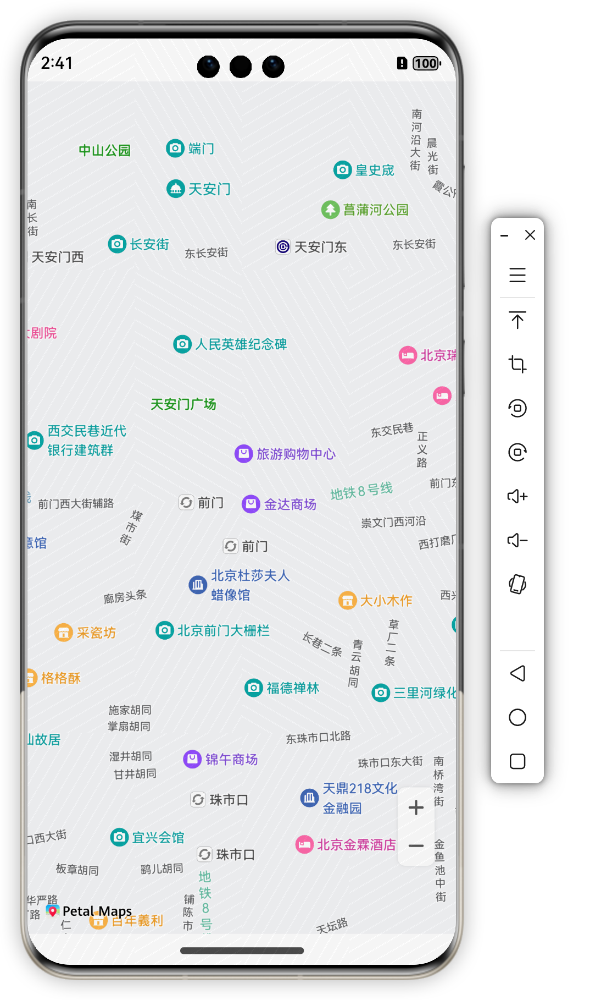
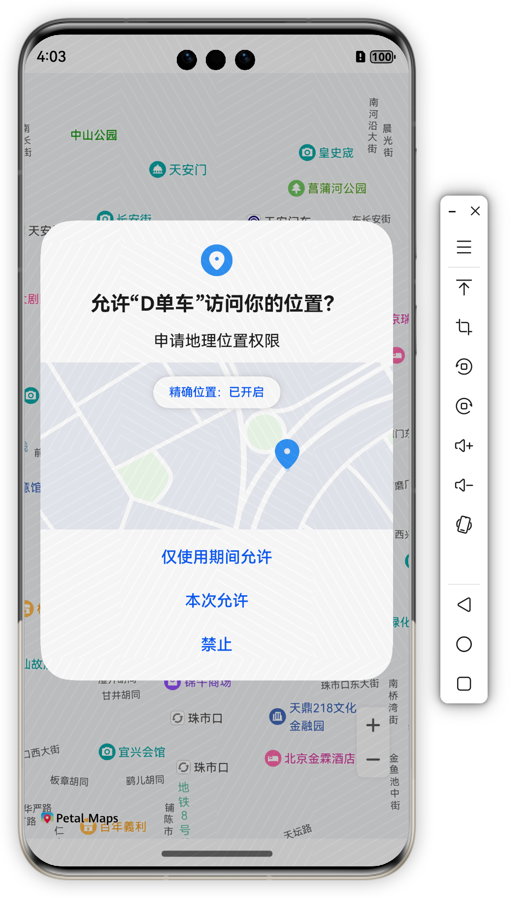
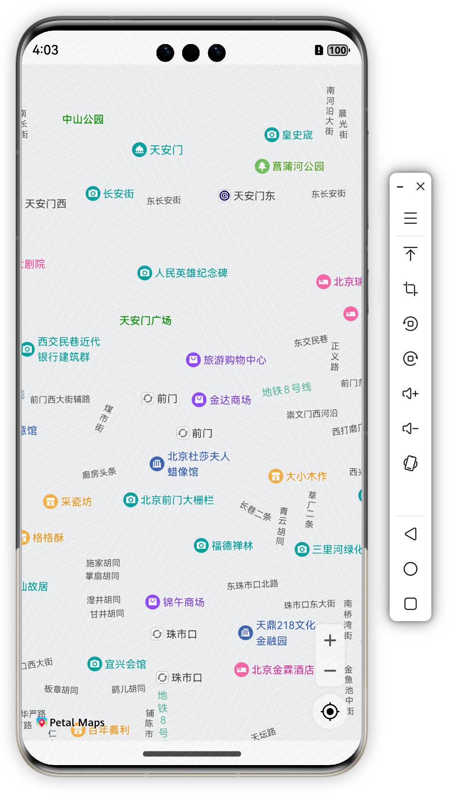
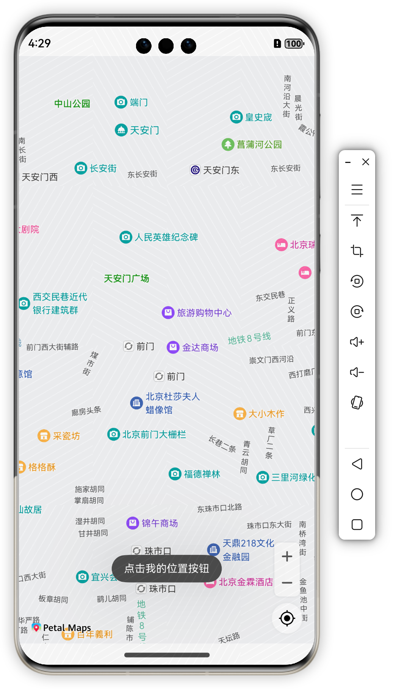
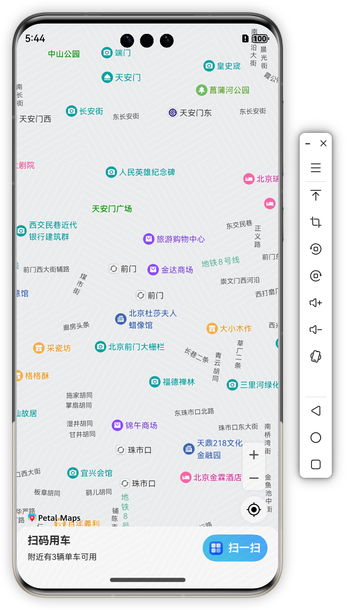
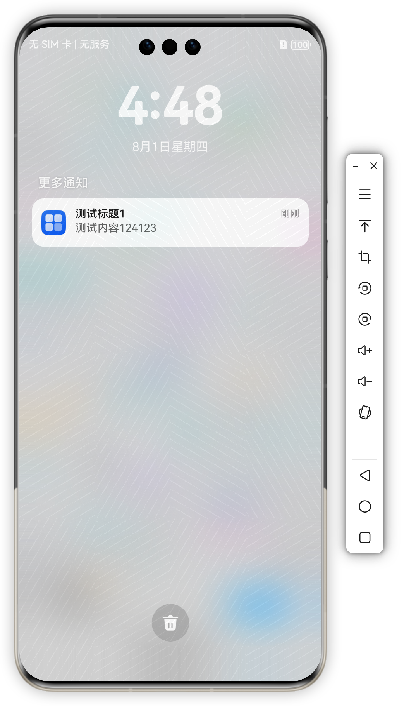

[TOC]

> 熟悉HarmonyOS 开放能力

- ~~华为帐号服务（Account Kit）~~
- 位置服务（Location Kit）
- 地图服务（Map Kit）
- 统一扫码服务（Scan Kit）
- 推送服务（Push Kit）


# 配置

## client配置：entry->module.json5

```typescript
"metadata": [
  {"name": "client_id", "value": "111635561"}
]
```


## 申请静态权限

```typescript
"requestPermissions": [
  {
    "name": "ohos.permission.INTERNET"
  },
  {
    "name": "ohos.permission.LOCATION",
    "reason": "$string:local_reason",
    "usedScene": {
      "when": "inuse"
    }
  },
  {
    "name": "ohos.permission.APPROXIMATELY_LOCATION",
    "reason": "$string:local_reason",
    "usedScene": {
      "when": "inuse"
    }
  }
]
```


## 动态权限申请

```typescript
import { abilityAccessCtrl, bundleManager, common, PermissionRequestResult, Permissions } from '@kit.AbilityKit'

const context = getContext(this) as common.UIAbilityContext

export class PermissionsUtils {
  /**
   * 检查是否授权
   */
  static checkAccessToken(permission: Permissions): abilityAccessCtrl.GrantStatus {
    const atManager = abilityAccessCtrl.createAtManager()
    let grantStatus = abilityAccessCtrl.GrantStatus.PERMISSION_DENIED
    let tokenId = 0
    try {
      //获取app包相关信息
      const bundleInfo =
        bundleManager.getBundleInfoForSelfSync(bundleManager.BundleFlag.GET_BUNDLE_INFO_WITH_APPLICATION)
      const appInfo = bundleInfo.appInfo
      tokenId = appInfo.accessTokenId
      grantStatus = atManager.checkAccessTokenSync(tokenId, permission)
    } catch (e) {
      console.error(`PermissionsUtils checkAccessToken 失败。原因：${JSON.stringify(e)}`)
    }
    return grantStatus
  }

  /**
   * 动态申请权限
   */
  static async reqPermissionsFromUser(permissions: Permissions[]): Promise<number[]> {
    const atManager = abilityAccessCtrl.createAtManager()
    let result: PermissionRequestResult = { permissions: [], authResults: [] }
    try {
      result = await atManager.requestPermissionsFromUser(context, permissions)
    } catch (e) {
      console.error(`PermissionsUtils reqPermissionsFromUser 失败。原因：${JSON.stringify(e)}`)
    }

    return result.authResults
  }
}
```

> API9及之后的版本，需要申请ohos.permission.APPROXIMATELY_LOCATION或者同时申请ohos.permission.APPROXIMATELY_LOCATION和ohos.permission.LOCATION；无法单独申请ohos.permission.LOCATION。


# 地图

使用地图组件`MapComponent`和地图组件功能入口类`MapComponentController`呈现地图。

- `MapComponent`地图组件，用于开发者的页面中放置地图
- `MapComponentController`是地图组件的主要功能入口类，用来操作地图，与地图相关的所有方法从此处接入。它所承载的工作包括：地图类型切换（如编著地图、空地图）、改变地图状态（中心点坐标和缩放级别）、添加标记（Marker）、绘制几何图形（MapPolyline、MapCircle）、各类时间监听等。


## 创建地图

新建地图初始化参数mapOption，设置地图中心点坐标及层级，通过callback回调的方式获取`MapComponentController`对象，用来操作地图。调用`MapComponent`组件，传入mapOption和mapCallback参数，初始化地图。


```typescript
import { map, mapCommon, MapComponent } from '@kit.MapKit'
import { AsyncCallback } from '@kit.BasicServicesKit'
import { promptAction } from '@kit.ArkUI'

@Entry
@Component
struct Index {
  mapController?: map.MapComponentController = undefined
  private mapOption?: mapCommon.MapOptions
  private mapCallback?: AsyncCallback<map.MapComponentController>

  build() {
    Stack({ alignContent: Alignment.Top }) {
      //调用MapComponent组件初始化地图
      MapComponent({
        mapOptions: this.mapOption,
        mapCallback: this.mapCallback
      }).width('100%').height('100%')
    }.width('100%')
    .height('100%')
  }

  aboutToAppear(): void {
    //地图初始化参数，设置地图中心点坐标及层级
    this.mapOption = {
      position: {
        target: {
          latitude: 39.9,
          longitude: 116.4
        },
        zoom: 15
      }
    }

    //初始化地图回调
    this.mapCallback = async (err, mapController) => {
      console.log("mapCallback error", err)
      if (!err) {
        //获取地图控制器类，用来操作地图
        this.mapController = mapController
        this.mapController?.on('mapLoad', async () => {
          promptAction.showToast({ message: '地图加载完成' })
        })
      }
    }
  }
}
```





## 开启我的位置按钮

确保可以获取用户定位权限，即`ohos.permission.APPROXIMATELY_LOCATION`和`ohos.permission.LOCATION`

```typescript
private locationPermissions:Array<Permissions> = ['ohos.permission.APPROXIMATELY_LOCATION', 'ohos.permission.LOCATION']

//初始化地图回调
this.mapCallback = async (err, mapController) => {
  if (!err) {
    //获取地图控制器类，用来操作地图
    this.mapController = mapController
    this.mapController?.on('mapLoad', async () => {
      promptAction.showToast({ message: '地图加载完成' })
      //获取是否有定位权限
      const grantStatus = await this.checkPermissions()
      if (!grantStatus) {
        //请求权限
        await PermissionsUtils.reqPermissionsFromUser(this.locationPermissions)
      }
      this.mapController?.setMyLocationEnabled(true)
      this.mapController?.setMyLocationControlsEnabled(true)
    })
  }
}

/**
 * 检验应用是否被授权定位权限
 */
async checkPermissions(): Promise<boolean> {
  for (let permission of this.locationPermissions) {
    const grantStatus = PermissionsUtils.checkAccessToken(permission)
    if (grantStatus == abilityAccessCtrl.GrantStatus.PERMISSION_GRANTED) {
      return true
    }
  }
  return false
}
```

|  |  |
| ------------------------------------------------------------ | ------------------------------------------------------------ |


## 我的位置

> Map Kit默认使用系统的连续定位能力，如果希望定制显示频率或者精准度，可以调用`geoLocationManager`相关接口获取用户位置坐标（WGS84坐标系）
>
> 注意访问设备的位置信息，必须申请`ohos.permission.APPROXIMATELY_LOCATION`和`ohos.permission.LOCATION`权限。在获取到用户坐标后，调用mapController对象的`setMyLocation`设置用户的位置


```typescript
import { geoLocationManager } from '@kit.LocationKit';

export class LocationUtils {
  /**
   * 获取当前位置
   */
  static async currentLocation(): Promise<geoLocationManager.Location | undefined> {
    const request: geoLocationManager.SingleLocationRequest = {
      'locatingPriority': geoLocationManager.LocatingPriority.PRIORITY_LOCATING_SPEED,
      'locatingTimeoutMs': 10000
    }
    let location: geoLocationManager.Location | undefined = undefined
    try {
      location = await geoLocationManager.getCurrentLocation(request)
      console.error(`LocationUtils currentLocation 成功。获取到数据：${JSON.stringify(location)}`)
    } catch (e) {
      console.error(`LocationUtils currentLocation 失败。原因：${JSON.stringify(e)}`)
    }
    return location
  }
}
```

Index.ets

```typescript
async getMyLocation() {
  const location: geoLocationManager.Location | undefined = await LocationUtils.currentLocation()
  if (location === undefined) {
    return
  }
  this.mapController?.setMyLocation(location)
  this.mapController?.animateCamera(map.newLatLng({
    latitude: location.latitude,
    longitude: location.longitude
  }, 15), 200)
}
```

Index.ets->aboutToAppear

```typescript
//监听点击我的位置
this.mapController?.on('myLocationButtonClick', async () => {
  promptAction.showToast({ message: '点击我的位置按钮' })
  this.getMyLocation()
})
```




# 华为帐号头像获取

```typescript
// 获取用户头像
async getAvatarAndNickName(): Promise<void> {
  // 创建授权请求，并设置参数
  let authRequest = new authentication.HuaweiIDProvider().createAuthorizationWithHuaweiIDRequest();
  // 获取头像昵称需要的参数
  authRequest.scopes = ['profile'];
  // 用户是否需要登录授权，该值为true且用户未登录或未授权时，会拉起用户登录或授权页面
  authRequest.forceAuthorization = true;
  authRequest.state = util.generateRandomUUID();
  try {
    let controller = new authentication.AuthenticationController(getContext(this));
    let response: authentication.AuthorizationWithHuaweiIDResponse = await controller.executeRequest(authRequest);
    if (response) {
      this.avatarUri = response.data?.avatarUri as string;
    }
  } catch (error) {
    console.error('getAvatarAndNickName 失败. 原因: ' + JSON.stringify(error));
  }
}
```


# 扫一扫

## 布局

```typescript
build() {
    Stack({ alignContent: Alignment.Bottom }) {
      //调用MapComponent组件初始化地图
      MapComponent({
        mapOptions: this.mapOption,
        mapCallback: this.mapCallback
      }).width('100%').height('100%').offset({ y: -56 })

      //底部扫一扫布局
      Row() {
        //左侧信息布局
        Column({ space: 8 }) {
          Text('扫码用车')
            .fontSize(16)
            .fontWeight(FontWeight.Bold)
          Text('附近有3辆单车可用')
            .fontSize(12)
            .fontWeight(FontWeight.Normal)
        }
        .height('100%')
        .justifyContent(FlexAlign.Center)
        .alignItems(HorizontalAlign.Start)

        //右侧扫一扫按钮布局
        Button() {
          Row({ space: 8 }) {
            Image($r('app.media.app_icon'))
              .width(20)
              .height(20)
              .fillColor(Color.White)
            Text('扫一扫')
              .fontSize(16)
              .fontWeight(FontWeight.Bold)
              .fontColor(Color.White)
          }
        }
        .height(40)
        .type(ButtonType.Capsule)
        .padding({ left: 10, right: 10 })
        .linearGradient({
          angle: 45,
          colors: [[0x49c5ef, 0.3], [0x4caefe, 0.8]]
        })
      }
      .width('100%')
      .height(64)
      .justifyContent(FlexAlign.SpaceBetween)
      .borderRadius({ topLeft: 16, topRight: 16 })
      .backgroundColor(Color.White)
      .padding({ left: 16, right: 16 })
    }.width('100%')
    .height('100%')
  }
```




## 调用统一扫码服务（Scan Kit）进行扫码解锁

```typescript
  /**
   * 启用默认扫码界面
   */
  async startScan() {
    console.log('默认扫码界面开始')
    //定义扫码参数options
    const options: scanBarcode.ScanOptions = {
      scanTypes: [scanCore.ScanType.ALL],
      enableMultiMode: true,
      enableAlbum: true
    }

    try {
      const result = await scanBarcode.startScanForResult(getContext(this), options)
      console.log('扫码成功：', JSON.stringify(result))
      promptAction.showToast({ message: '扫码成功' })
    } catch (e) {
      console.log('扫码失败：', e.message)
    }
  }
```


# 推送

## 获取push token

在应用UIAbility（例如EntryAbility）的onCreate方法中调用getToken()获取Push Token并上报到开发者的服务端，方便服务端向终端推送消息。

EntryAbility.ets

```typescript
 async onCreate(want: Want, launchParam: AbilityConstant.LaunchParam): Promise<void> {
    hilog.info(0x0000, 'testTag', '%{public}s', 'Ability onCreate');

    try {
      const pushToken = await pushService.getToken()
      //上报Push Token
      console.log('上报Push Token：', pushToken)
    } catch (error) {
      const e: BusinessError = error as BusinessError;
      console.error("获取Push Token 失败：", JSON.stringify(e));
    }
  }
```


## 请求通知授权

```typescript
//获取到push token后调用
this.requestNotification()

/**
 * 请求通知授权
 */
private async requestNotification() {
  console.log('请求通知授权 requestNotification')
  try {
    const notificationEnabled = await notificationManager.isNotificationEnabled()
    console.log('请求通知授权是否授权：', notificationEnabled)
    if (!notificationEnabled) {
      //未授权，请求通知授权
      await notificationManager.requestEnableNotification()
    }
  } catch (error) {
    const e: BusinessError = error as BusinessError
    console.error("requestNotification 失败：", JSON.stringify(e));
  }
}
```


## 测试通知

agc界面->我的项目->增长->推送服务->添加推送通知

填写完需要发送的消息可以看到app收到推送消息


