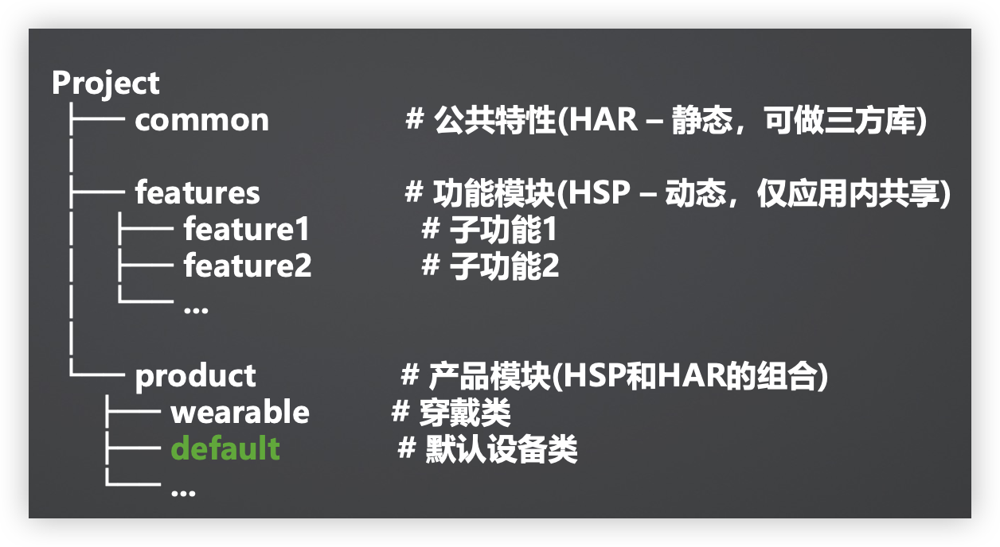

# 主要功能

- 手机、折叠屏、平板适配，通过响应式和自适应布局呈现不同效果
- 播放/暂停、上一首、下一首图标控制音乐播放功能
- 点击播放控制区空白处、列表歌曲跳转到播放页面
- 点击评论按钮、跳转到对应的评论页面
- 其他按钮无功能

# 一次开发，多端部署（工程级）

一套代码工程，一次开发上架，多端按需部署。支撑快速高效开发多终端设备应用。

**最佳工程结构实践（三层结构）**

- commom：**公共特性**。常量、算法、网络请求重构等
- featurees：**功能特性**。登录模块、订单模块、支付模块等
- Product：**产品特性**。手机渠道、平板渠道、电视渠道等

## hap、har区别

1. 带ability的hap：整合功能的各产品模块
2. 无ability的hsp：业务子功能，供各产品模块动态引用
3. 无ability的har：通用程度高，适合做三方库

## 如何创建

1. 先在project最顶层目录下，创建3个对应子目录
2. 在对应子目录下，创建所需要的模块

# ohpm模块依赖

# 一次开发，多端部署（界面级-自适应布局）

# 一次开发，多端部署（界面级-相应布局）

