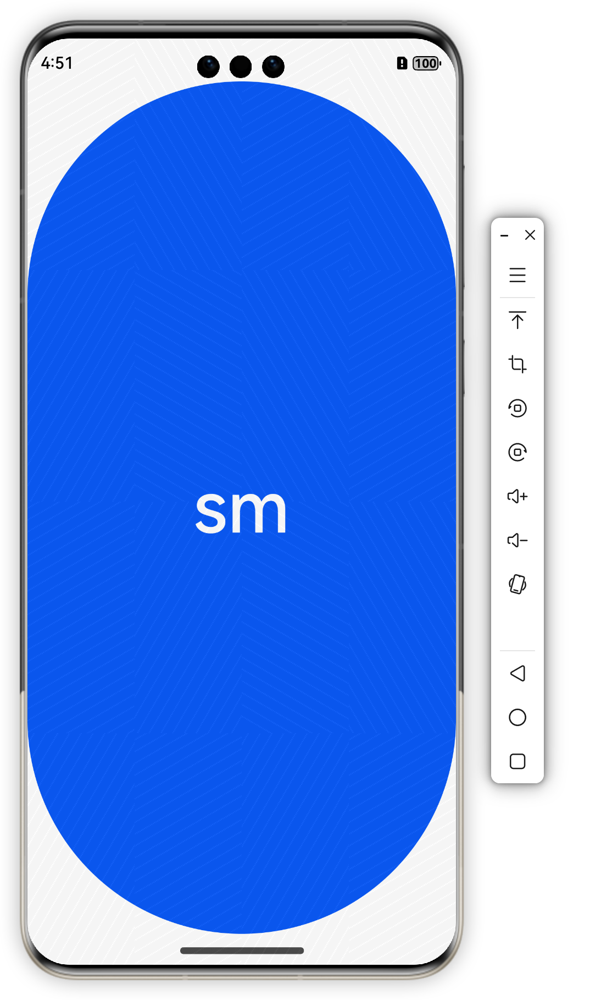
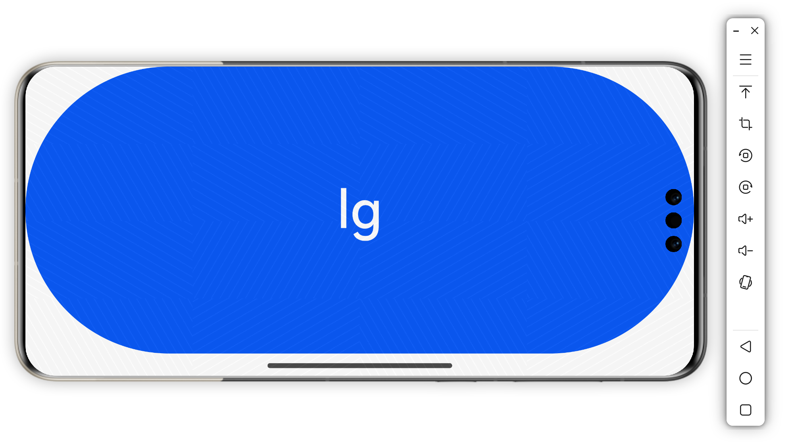
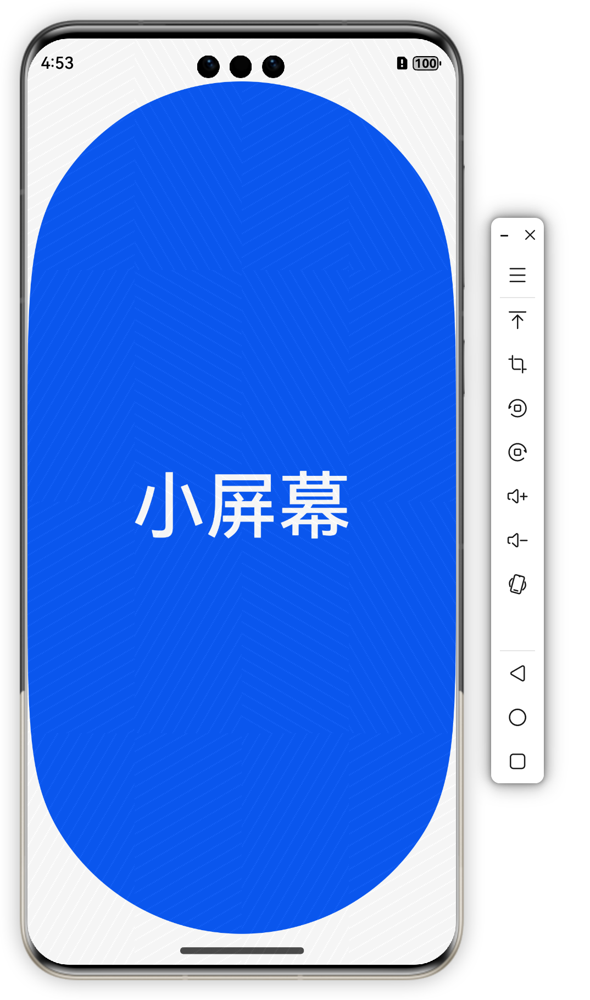

# 获取当前window

```typescript
async onWindowStageCreate(windowStage: window.WindowStage) {
    //当窗口刚开始启动的时候，设置当前窗口的bp
    let window = await windowStage.getMainWindow()
    this.updateBp(window.getWindowProperties().windowRect.width)
    //当屏幕尺寸发生变化
    window.on('windowSizeChange', (size) => {
      this.updateBp(size.width)
    })
}
```


# 设置对应的断点数据

```typescript
private updateBp(pxWidth: number) {
  let bp = '' //当前应用的断点
  let widthVp = pxWidth / display.getDefaultDisplaySync().densityPixels
  if (widthVp < 320) {
    bp = 'xs'
  } else if (widthVp < 600) {
    bp = 'sm'
  } else if (widthVp < 840) {
    bp = 'md'
  } else {
    bp = 'lg'
  }

  //全局存储
  AppStorage.setOrCreate("bp", bp)
}
```


# 调试屏幕宽度变化，配置模块的`module.json5`接受自动旋转

```typescript
"abilities": [
	{
		 "orientation": "auto_rotation",
	 }
]
```


# 在页面中获取设置的bp内容

```typescript
@Entry
@Component
struct Index {
  @StorageProp('bp') bp: string = ''

  build() {
    Column() {
      Text(this.bp)
        .fontSize(66)
        .width('100%')
        .height('100%')
    }
  }
}
```


# 封装

创建一个`BreakpointSystem.ets`，实现断点类型匹配

```typescript
declare interface BreakpointTypeOption<T> {
  //xs?: T,
  sm?: T,
  md?: T,
  lg?: T
}

export class BreakpointType<T> {
  option: BreakpointTypeOption<T>

  constructor(option: BreakpointTypeOption<T>) {
    this.option = option
  }

  getValue(currentBp: string): T {
    switch (currentBp) {
      case 'sm':
        return this.option.sm as T
      case 'md':
        return this.option.md as T
      default:
        return this.option.lg as T
    }
  }
}
```


```typescript
@Entry
@Component
struct Index {
  @StorageProp('bp') bp: string = ''

  build() {
    Column() {
      Button(new BreakpointType({
        sm: '小屏幕',
        md: '中屏幕',
        lg: '大屏幕'
      }).getValue(this.bp))
        .fontSize(66)
        .width('100%')
        .height('100%')
        .align(Alignment.Center)
    }
  }
}
```


|  |  |
| -------------------------------------------------------- | -------------------------------------------------------- |
|  |  |

