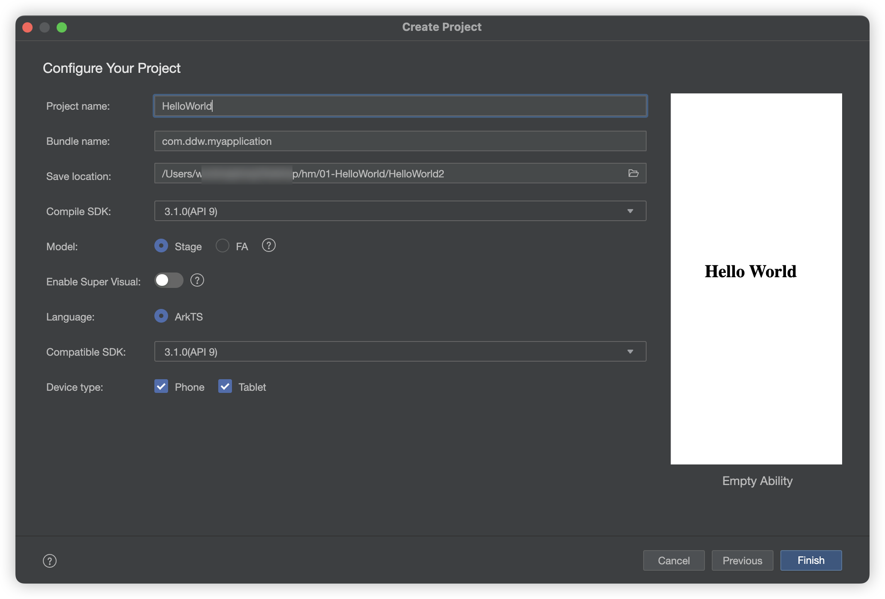

[TOC]

# 鸿蒙应用开发初体验 HelloWorld

##  **[下载与安装 DevEco Studio](https://developer.harmonyos.com/cn/develop/deveco-studio#download)**

## 配置环境

进入DevEco Studio配置页面，首先需要进行基础配置，包括Node.js与Ohpm的安装路径设置，选择从华为镜像下载至合适的路径。

单击'Next'进入SDK配置，设置为合适的路径，

点击'Next'后会显示'SDK License Agreement'，阅读相关协议后，勾选'Accept'。

单击‘Next’进入配置预览页，在这里进行配置项的确认。

确认完成后，单击'Next'，进入下一步。

等待配置自动下载完成，完成后，单击'Finish'，IDE会进入欢迎页，我们也就成功配置好了开发环境。

准备工作完成后，接下来将进入DevEco Studio进行工程创建和运行。

## 创建项目

在欢迎页中单击 Create Project，进入项目创建页面。

选择‘Application’，然后选择‘Empty Ability’，单击‘Next’进入工程配置页。

配置页中，详细信息如下：

- Project name 是开发者可以自行设置的项目名称，这里根据自己选择修改为自己项目名称。
- Bundle name 是包名称，默认情况下应用 ID 也会使用该名称，应用发布时对应的 ID 需要保持一致。
- Save location 为工程保存路径，建议用户自行设置相应位置。
- Compile SDK 是编译的 API 版本，这里默认选择 API9。
- Model 选择 Stage 模型，其他保持默认即可。

然后单击“Finish”完成工程创建，等待工程同步完成。

## 认识DevEco Studio界面

## 运行Hello World

1.单击顶部工具栏Tools>Device Manager。

2.选择Local Emulator，设置合适的Local Emulator Location存储地址，然后单击’+New Emulator’。

选择Huawei_Phone手机模拟器，单击'Next'，进入模拟器系统下载页。

选择下载api9的系统镜像，然后单击'Next’，等待下载完成。

下载完成后，进行创建相应的手机模拟器，单击Finish完成创建。

下载完成后，在Local Emulator页面中会出现创建的手机模拟器，点击Actions按钮，就能够启动模拟器。

模拟器启动后，点击上方启动按钮，将Hello World工程运行到模拟器上。

IDE构建完成后，即可在模拟器上看到运行效果，我们也就完成了Hello World工程在模拟器上的运行。

## 了解基本工程目录

### 工程级目录

工程的目录结构如下

其中详细如下：

- AppScope中存放应用全局所需要的资源文件。
- entry是应用的主模块，存放HarmonyOS应用的代码、资源等。
- oh_modules是工程的依赖包，存放工程依赖的源文件。
- build-profile.json5是工程级配置信息，包括签名、产品配置等。
- hvigorfile.ts是工程级编译构建任务脚本，hvigor是基于任务管理机制实现的一款全新的自动化构建工具，主要提供任务注册编排，工程模型管理、配置管理等核心能力。
- oh-package.json5是工程级依赖配置文件，用于记录引入包的配置信息。

在AppScope，其中有resources文件夹和配置文件app.json5。AppScope>resources>base中包含element和media两个文件夹，

- 其中element文件夹主要存放公共的字符串、布局文件等资源。

- media存放全局公共的多媒体资源文件。

### 模块级目录

entry>src目录中主要包含总的main文件夹，单元测试目录ohosTest，以及模块级的配置文件。

- main文件夹中，ets文件夹用于存放ets代码，resources文件存放模块内的多媒体及布局文件等，module.json5文件为模块的配置文件。
- ohosTest是单元测试目录。
- build-profile.json5是模块级配置信息，包括编译构建配置项。
- hvigorfile.ts文件是模块级构建脚本。
- oh-package.json5是模块级依赖配置信息文件。

进入src>main>ets目录中，其分为entryability、pages两个文件夹。

- entryability存放ability文件，用于当前ability应用逻辑和生命周期管理。

- pages存放UI界面相关代码文件，初始会生成一个Index页面。

resources目录下存放模块公共的多媒体、字符串及布局文件等资源，分别存放在element、media文件夹中。

### app.json5

AppScope>app.json5是应用的全局的配置文件，用于存放应用公共的配置信息。

其中配置信息如下：

- bundleName是包名。
- vendor是应用程序供应商。
- versionCode是用于区分应用版本。
- versionName是版本号。
- icon对应于应用的显示图标。
- label是应用名。

### module.json5

entry>src>main>module.json5是模块的配置文件，包含当前模块的配置信息。

其中module对应的是模块的配置信息，一个模块对应一个打包后的hap包，hap包全称是HarmonyOS Ability Package，其中包含了ability、第三方库、资源和配置文件。其具体属性及其描述可以参照下表1。

> 表1 module.json5默认配置属性及描述

| 属性                | 描述                                                         |
| ------------------- | ------------------------------------------------------------ |
| name                | 该标签标识当前module的名字，module打包成hap后，表示hap的名称，标签值采用字符串表示（最大长度31个字节），该名称在整个应用要唯一。 |
| type                | 表示模块的类型，类型有三种，分别是entry、feature和har。      |
| srcEntry            | 当前模块的入口文件路径。                                     |
| description         | 当前模块的描述信息。                                         |
| mainElement         | 该标签标识hap的入口ability名称或者extension名称。只有配置为mainElement的ability或者extension才允许在服务中心露出。 |
| deviceTypes         | 该标签标识hap可以运行在哪类设备上，标签值采用字符串数组的表示。 |
| deliveryWithInstall | 标识当前Module是否在用户主动安装的时候安装，表示该Module对应的HAP是否跟随应用一起安装。- true：主动安装时安装。- false：主动安装时不安装。 |
| installationFree    | 标识当前Module是否支持免安装特性。- true：表示支持免安装特性，且符合免安装约束。- false：表示不支持免安装特性。 |
| pages               | 对应的是main_pages.json文件，用于配置ability中用到的page信息。 |
| abilities           | 是一个数组，存放当前模块中所有的ability元能力的配置信息，其中可以有多个ability。 |

对于abilities中每一个ability的属性项，其描述信息如下表2。

> 表2 abilities中对象的默认配置属性及描述

| 属性                  | 描述                                                         |
| --------------------- | ------------------------------------------------------------ |
| name                  | 该标签标识当前ability的逻辑名，该名称在整个应用要唯一，标签值采用字符串表示（最大长度127个字节）。 |
| srcEntry              | ability的入口代码路径。                                      |
| description           | ability的描述信息。                                          |
| icon                  | ability的图标。该标签标识ability图标，标签值为资源文件的索引。该标签可缺省，缺省值为空。如果ability被配置为MainElement，该标签必须配置。 |
| label                 | ability的标签名。                                            |
| startWindowIcon       | 启动页面的图标。                                             |
| startWindowBackground | 启动页面的背景色。                                           |
| visible               | ability是否可以被其他应用程序调用，true表示可以被其它应用调用， false表示不可以被其它应用调用。 |
| skills                | 标识能够接收的意图的action值的集合，取值通常为系统预定义的action值，也允许自定义。 |
| entities              | 标识能够接收Want的Entity值的集合。                           |
| actions               | 标识能够接收的Want的Action值的集合，取值通常为系统预定义的action值，也允许自定义。 |

### main_pages.json

src/main/resources/base/profile/main_pages.json文件保存的是页面page的路径配置信息，所有需要进行路由跳转的page页面都要在这里进行配置。

## 遇到的问题

### DevEco Studio Preview失败

安装DevEco Studio新建第一个项目后，点击Previewer预览失败，Preview failed
Unable to start the previewer. Open PreviewerLog to check for details。

修复方案：点击File->Settings->Build, Execution, Deployment->Build Tools->Hvigor，取消勾选最后一项

