[TOC]

# ArkTS基础知识

> 用到的代码在ArkTsBase项目中

## ArkTS简介

ArkTs是HarmonyOS的一种应用开发语言。它在TypeScript语言的基础上，拓展了声明式UI、状态管理、并发任务等能力。让开发者以更简洁自然的方式开发高性能应用。

ArkTS在TS的基础上主要扩展了如下能力：

- [基本语法](https://developer.huawei.com/consumer/cn/doc/harmonyos-guides-V2/arkts-basic-syntax-overview-0000001531611153-V2)：ArkTS定义了声明式UI描述、自定义组件和动态扩展UI元素的能力，再配合ArkUI开发框架中的系统组件及其相关的事件方法、属性方法等共同构成了UI开发的主体。
- [状态管理](https://developer.huawei.com/consumer/cn/doc/harmonyos-guides-V2/arkts-state-management-overview-0000001524537145-V2)：ArkTS提供了多维度的状态管理机制。在UI开发框架中，与UI相关联的数据可以在组件内使用，也可以在不同组件层级间传递，比如父子组件之间、爷孙组件之间，还可以在应用全局范围内传递或跨设备传递。另外，从数据的传递形式来看，可分为只读的单向传递和可变更的双向传递。开发者可以灵活地利用这些能力来实现数据和UI的联动。
- [渲染控制](https://developer.huawei.com/consumer/cn/doc/harmonyos-guides-V2/arkts-rendering-control-overview-0000001543911149-V2)：ArkTS提供了渲染控制的能力。条件渲染可根据应用的不同状态，渲染对应状态下的UI内容。循环渲染可从数据源中迭代获取数据，并在每次迭代过程中创建相应的组件。数据懒加载从数据源中按需迭代数据，并在每次迭代过程中创建相应的组件。

## 基本语法

### 基本语法概述

点击按钮时，文本内容从`Hello World`变为`Hello ArkUI`

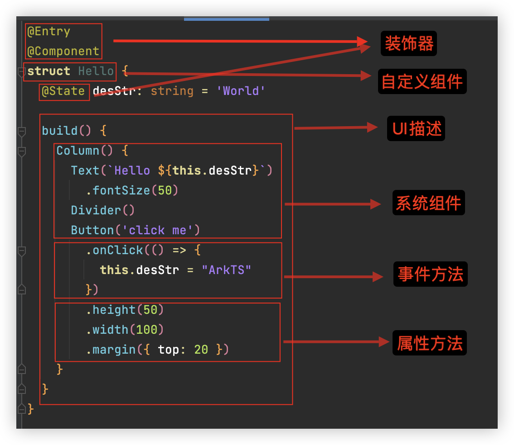

- 装饰器： 用于装饰类、结构、方法以及变量，并赋予其特殊的含义。如上述示例中`@Entry、@Component和@State`都是装饰器，[@Component](https://developer.huawei.com/consumer/cn/doc/harmonyos-guides-V2/arkts-create-custom-components-0000001473537046-V2#section1430055924816)表示自定义组件，[@Entry](https://developer.huawei.com/consumer/cn/doc/harmonyos-guides-V2/arkts-create-custom-components-0000001473537046-V2#section1430055924816)表示该自定义组件为入口组件，[@State](https://developer.huawei.com/consumer/cn/doc/harmonyos-guides-V2/arkts-state-0000001474017162-V2)表示组件中的状态变量，状态变量变化会触发UI刷新。
- [UI描述](https://developer.huawei.com/consumer/cn/doc/harmonyos-guides-V2/arkts-declarative-ui-description-0000001524416537-V2)：以声明式的方式来描述UI的结构，例如build()方法中的代码块。
- [自定义组件](https://developer.huawei.com/consumer/cn/doc/harmonyos-guides-V2/arkts-create-custom-components-0000001473537046-V2)：可复用的UI单元，可组合其他组件，如上述被`@Component`装饰的`struct Hello`。
- 系统组件：ArkUI框架中默认内置的基础和容器组件，可直接被开发者调用，比如示例中的`Column、Text、Divider、Button`。
- 属性方法：组件可以通过链式调用配置多项属性，如`fontSize()、width()、height()、backgroundColor()`等。
- 事件方法：组件可以通过链式调用设置多个事件的响应逻辑，如跟随在`Button`后面的`onClick()`。
- 系统组件、属性方法、事件方法具体使用可参考[基于ArkTS的声明式开发范式](https://developer.huawei.com/consumer/cn/doc/harmonyos-references-V2/ts-components-summary-0000001478181369-V2)。

除此之外，ArkTS扩展了多种语法范式来使开发更加便捷：

- [@Builder](https://developer.huawei.com/consumer/cn/doc/harmonyos-guides-V2/arkts-builder-0000001524176981-V2)/[@BuilderParam](https://developer.huawei.com/consumer/cn/doc/harmonyos-guides-V2/arkts-builderparam-0000001524416541-V2)：特殊的封装UI描述的方法，细粒度的封装和复用UI描述。
- [@Extend](https://developer.huawei.com/consumer/cn/doc/harmonyos-guides-V2/arkts-extend-0000001473696678-V2)/[@Styles](https://developer.huawei.com/consumer/cn/doc/harmonyos-guides-V2/arkts-style-0000001473856690-V2)：扩展内置组件和封装属性样式，更灵活地组合内置组件。
- [stateStyles](https://developer.huawei.com/consumer/cn/doc/harmonyos-guides-V2/arkts-statestyles-0000001482592098-V2)：多态样式，可以依据组件的内部状态的不同，设置不同样式。

### 声明式UI描述

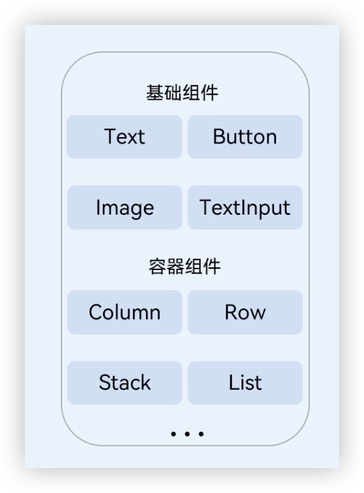

#### 创建组件

根据组件构造方法的不同，创建组件包含有参数和无参数两种方式。

> 创建组件时不需要new运算符。

##### 无参数

如果组件的接口定义没有包含必选构造参数，则组件后面的“()”不需要配置任何内容。例如，Divider组件不包含构造参数：

```typescript
Column() {
  Text('item 1')
  Divider()
  Text('item 2')
}
```

##### 有参数

如果组件的接口定义包含构造参数，则在组件后面的“()”配置相应参数。

- Image组件的必选参数src。

  ```typescript
  Image('https://xyz/test.jpg')
  ```

- Text组件的非必选参数content。

  ```typescript
  // string类型的参数
  Text('test')
  // $r形式引入应用资源，可应用于多语言场景
  Text($r('app.string.title_value'))
  // 无参数形式
  Text()
  ```

- 变量或表达式也可以用于参数赋值，其中表达式返回的结果类型必须满足参数类型要求。

  例如，设置变量或表达式来构造Image和Text组件的参数。

  ```typescript
  Image(this.imagePath)
  Image('https://' + this.imageUrl)
  Text(`count: ${this.count}`)
  ```

#### 配置属性

属性方法以“.”链式调用的方式配置系统组件的样式和其他属性，建议每个属性方法单独写一行。

- 配置Text组件的字体大小。

  ```typescript
  Text('test')
    .fontSize(12)
  ```

- 配置组件的多个属性。

  ```typescript
  Image('test.jpg')
    .alt('error.jpg')
    .width(100)
    .height(100)
  ```

- 除了直接传递常量参数外，还可以传递变量或表达式。

  ```typescript
  Text('hello')
    .fontSize(this.size)
  Image('test.jpg')
    .width(this.count % 2 === 0 ? 100 : 200)
    .height(this.offset + 100)
  ```

- 对于系统组件，ArkUI还为其属性预定义了一些枚举类型供开发者调用，枚举类型可以作为参数传递，但必须满足参数类型要求。

  例如，可以按以下方式配置Text组件的颜色和字体样式。

  ```typescript
  Text('hello')
    .fontSize(20)
    .fontColor(Color.Red)
    .fontWeight(FontWeight.Bold)
  ```

#### 配置事件

事件方法以“.”链式调用的方式配置系统组件支持的事件，建议每个事件方法单独写一行。

- 使用箭头函数配置组件的事件方法。

  ```typescript
  Button('Click me')
    .onClick(() => {
    	this.myText = 'ArkUI';
  	})
  ```

- 使用匿名函数表达式配置组件的事件方法，要求使用bind，以确保函数体中的this指向当前组件。

  ```typescript
  Button('add counter')
    .onClick(function(){
   		 this.counter += 2;
  	}.bind(this))
  ```

- 使用组件的成员函数配置组件的事件方法。

  ```typescript
  myClickHandler(): void {
    this.counter += 2;
  }
  ...
  Button('add counter')
    .onClick(this.myClickHandler.bind(this))
  ```

- 使用声明的箭头函数，可以直接调用，不需要bind this。

  ```typescript
  fn = () => {
    console.info(`counter: ${this.counter}`)
    this.counter++
  }
  ...
  Button('add counter')
    .onClick(this.fn)
  ```

#### 配置子组件

如果组件支持子组件配置，则需在尾随闭包"{...}"中为组件添加子组件的UI描述。Column、Row、Stack、Grid、List等组件都是容器组件。

- 以下是简单的Column组件配置子组件的示例。

  ```typescript
  Column() {
    Text('Hello')
      .fontSize(100)
    Divider()
    Text(this.myText)
      .fontSize(100)
      .fontColor(Color.Red)
  }
  ```

- 容器组件均支持子组件配置，可以实现相对复杂的多级嵌套。

  ```typescript
  Column() {
    Row() {
      Image('test1.jpg')
        .width(100)
        .height(100)
      Button('click +1')
        .onClick(() => {
        	console.info('+1 clicked!');
      	})
    }
  }
  ```

### 自定义组件

#### 创建自定义组件

在ArkUI中，UI显示的内容均为组件，由框架直接提供的称为系统组件，由开发者定义的称为自定义组件。在进行 UI 界面开发时，通常不是简单的将系统组件进行组合使用，而是需要考虑代码可复用性、业务逻辑与UI分离，后续版本演进等因素。因此，将UI和部分业务逻辑封装成自定义组件是不可或缺的能力。

自定义组件具有以下特点：

- 可组合：允许开发者组合使用系统组件、及其属性和方法。
- 可重用：自定义组件可以被其他组件重用，并作为不同的实例在不同的父组件或容器中使用。
- 数据驱动UI更新：通过状态变量的改变，来驱动UI的刷新。

##### 自定义组件的基本用法

以下示例展示了自定义组件的基本用法。

```typescript
@Component
export struct HelloComponent {
  @State message: string = 'Hello, World!';
  
  build() {
    // HelloComponent自定义组件组合系统组件Row和Text
    Row() {
      Text(this.message)
        .onClick(() => {
        		// 状态变量message的改变驱动UI刷新，UI从'Hello, World!'刷新为'Hello, ArkUI!'    
        		this.message = 'Hello, ArkUI!';
      	})
    }
  }
}
```

> 如果在另外的文件中引用该自定义组件，需要使用export关键字导出，并在使用的页面import该自定义组件。

HelloComponent可以在其他自定义组件中的build()函数中多次创建，实现自定义组件的重用。

```typescript
@Entry
@Component
struct ParentHelloComponent {
  build() {
    Column() {
      Text('ArkUI message')
      Divider()
      HelloComponent({ message: 'Hello, World!' });
      Divider()
      HelloComponent({ message: '你好!' });
    }
  }
}
```

要完全理解上面的示例，需要了解自定义组件的以下概念定义：

- [自定义组件的基本结构](https://developer.huawei.com/consumer/cn/doc/harmonyos-guides-V2/arkts-create-custom-components-0000001473537046-V2#section1430055924816)
- [成员函数/变量](https://developer.huawei.com/consumer/cn/doc/harmonyos-guides-V2/arkts-create-custom-components-0000001473537046-V2#section371262217494)
- [自定义组件的参数规定](https://developer.huawei.com/consumer/cn/doc/harmonyos-guides-V2/arkts-create-custom-components-0000001473537046-V2#section4421142421915)
- [build()函数](https://developer.huawei.com/consumer/cn/doc/harmonyos-guides-V2/arkts-create-custom-components-0000001473537046-V2#section1150911733811)
- [自定义组件通用样式](https://developer.huawei.com/consumer/cn/doc/harmonyos-guides-V2/arkts-create-custom-components-0000001473537046-V2#section1051122203016)

##### 自定义组件的基础结构

- struct：自定义组件基于struct实现，`struct + 自定义组件名 + {...}`的组合构成自定义组件，不能有继承关系。对于struct的实例化，可以省略new。

  > 自定义组件名、类名、函数名不能和系统组件名相同。

- `@Component`：`@Component`装饰器仅能装饰`struct`关键字声明的数据结构。`struct`被@Component装饰后具备组件化的能力，需要实现`build`方法描述UI，一个`struct`只能被一个`@Component`装饰。

  > 从API version 9开始，该装饰器支持在ArkTS卡片中使用。

  ```typescript
  @Component
  struct MyComponent {}
  ```
  
- `build()`函数：`build()`函数用于定义自定义组件的声明式UI描述，自定义组件必须定义`build()`函数。

  ```typescript
  @Component
  struct MyComponent {
  	build() {
    }
  }
  ```

- `@Entry`：`@Entry`装饰的自定义组件将作为UI页面的入口。在单个UI页面中，最多可以使用`@Entry`装饰一个自定义组件。`@Entry`可以接受一个可选的[LocalStorage](https://developer.huawei.com/consumer/cn/doc/harmonyos-guides-V2/arkts-localstorage-0000001524537149-V2)的参数。

  > 从API version 9开始，该装饰器支持在ArkTS卡片中使用。

  ```typescript
  @Entry
  @Component
  struct MyComponent {
  }
	```

##### 成员函数/变量

自定义组件除了必须要实现`build()`函数外，还可以实现其他成员函数，成员函数具有以下约束：

- 不支持静态函数。
- 成员函数的访问是私有的。

自定义组件可以包含成员变量，成员变量具有以下约束：

- 不支持静态成员变量。
- 所有成员变量都是私有的，变量的访问规则与成员函数的访问规则相同。
- 自定义组件的成员变量本地初始化有些是可选的，有些是必选的。具体是否需要本地初始化，是否需要从父组件通过参数传递初始化子组件的成员变量，请参考[状态管理](https://developer.huawei.com/consumer/cn/doc/harmonyos-guides-V2/arkts-state-management-overview-0000001524537145-V2)。

##### 自定义组件的参数规定

从上文的示例中，我们已经了解到，可以在`build`方法或者[@Builder](https://developer.huawei.com/consumer/cn/doc/harmonyos-guides-V2/arkts-builder-0000001524176981-V2)装饰的函数里创建自定义组件，在创建自定义组件的过程中，根据装饰器的规则来初始化自定义组件的参数。

```typescript
@Component
struct MyComponent {
  private countDownFrom: number = 0;
  private color: Color = Color.Blue;
  build() {
  }
}

@Entry
@Component
struct ParentComponent {
  private someColor: Color = Color.Pink;
  
  build() {
    Column() {
      // 创建MyComponent实例，并将创建MyComponent成员变量countDownFrom初始化为10，将成员变量color初始化为this.someColor
      MyComponent({ countDownFrom: 10, color: this.someColor })
    }
  }
}
```

##### build()函数

所有声明在`build()`函数的语言，我们统称为UI描述，UI描述需要遵循以下规则：

- `@Entry`装饰的自定义组件，其`build()`函数下的根节点唯一且必要，且必须为容器组件，其中`ForEach`禁止作为根节点。

  `@Component`装饰的自定义组件，其`build()`函数下的根节点唯一且必要，可以为非容器组件，其中`ForEach`禁止作为根节点。

  ```typescript
  @Entry
  @Component
  struct MyComponent {
    build() { 
      // 根节点唯一且必要，必须为容器组件
      Row() {
        ChildComponent()
      }
    }
  }
  
  @Component
  struct ChildComponent {
    build() {
      // 根节点唯一且必要，可为非容器组件
      Image('test.jpg')
    }
  }
  ```

- 不允许声明本地变量，反例如下。

  ```typescript
  build() {  
    // 反例：不允许声明本地变量
    let a: number = 1;
  }
  ```

- 不允许在UI描述里直接使用console.info，但允许在方法或者函数里使用，反例如下。

  ```typescript
  build() {
    // 反例：不允许console.info
    console.info('print debug log');
  }
  ```

- 不允许创建本地的作用域，反例如下。

  ```typescript
  build() {
    // 反例：不允许本地作用域
    {
      ...
    }
  }
  ```

- 不允许调用没有用@Builder装饰的方法，允许系统组件的参数是TS方法的返回值。

  ```typescript
  @Component
  struct ParentComponent {
    doSomeCalculations() {
    }
    
    calcTextValue(): string {
      return 'Hello World';
    }
    
    @Builder doSomeRender() { 
      Text(`Hello World`)
    }
    
    build() {
      Column() { 
        // 反例：不能调用没有用@Builder装饰的方法  
        this.doSomeCalculations();
        // 正例：可以调用
        this.doSomeRender();
        // 正例：参数可以为调用TS方法的返回值 
        Text(this.calcTextValue())
      }
    }
  }
  ```

- 不允许switch语法，如果需要使用条件判断，请使用if。反例如下。

  ```typescript
  build() {
    Column() { 
      // 反例：不允许使用switch语法
      switch (expression) {
        case 1:
          Text('...')
          break;
        case 2:
          Image('...')
          break;
        default:
          Text('...')
          break;
      }
    }
  }
  ```

- 不允许使用表达式，反例如下。

  ```typescript
  build() {
    Column() {
      // 反例：不允许使用表达式
      (this.aVar > 10) ? Text('...') : Image('...') 
    }
  }
  ```

##### 自定义组件通用样式

自定义组件通过“.”链式调用的形式设置通用样式。

```typescript
@Component
struct MyComponent2 {
  build() {
    Button(`Hello World`)
  }
}

@Entry
@Component
struct MyComponent {
  build() {
    Row() {
      MyComponent2()
        .width(200)
        .height(300)
        .backgroundColor(Color.Red)
    }
  }
}
```

> ArkUI给自定义组件设置样式时，相当于给MyComponent2套了一个不可见的容器组件，而这些样式是设置在容器组件上的，而非直接设置给MyComponent2的Button组件。通过渲染结果我们可以很清楚的看到，背景颜色红色并没有直接生效在Button上，而是生效在Button所处的开发者不可见的容器组件上。

### 页面和自定义组件生命周期

我们先明确自定义组件和页面的关系：

- 自定义组件：`@Component`装饰的UI单元，可以组合多个系统组件实现UI的复用，可以调用组件的生命周期。
- 页面：即应用的UI页面。可以由一个或者多个自定义组件组成，[@Entry](https://developer.huawei.com/consumer/cn/doc/harmonyos-guides-V2/arkts-create-custom-components-0000001473537046-V2#section1430055924816)装饰的自定义组件为页面的入口组件，即页面的根节点，**一个页面有且仅能有一个@Entry**。只有被`@Entry`装饰的组件才可以调用页面的生命周期。

页面生命周期，即被@Entry装饰的组件生命周期，提供以下生命周期接口：

- [onPageShow](https://developer.huawei.com/consumer/cn/doc/harmonyos-references-V2/arkts-custom-component-lifecycle-0000001482395076-V2#ZH-CN_TOPIC_0000001523488850__onpageshow)：页面每次显示时触发一次，包括路由过程、应用进入前台等场景。
- [onPageHide](https://developer.huawei.com/consumer/cn/doc/harmonyos-references-V2/arkts-custom-component-lifecycle-0000001482395076-V2#ZH-CN_TOPIC_0000001523488850__onpagehide)：页面每次隐藏时触发一次，包括路由过程、应用进入后台等场景。
- [onBackPress](https://developer.huawei.com/consumer/cn/doc/harmonyos-references-V2/arkts-custom-component-lifecycle-0000001482395076-V2#ZH-CN_TOPIC_0000001523488850__onbackpress)：当用户点击返回按钮时触发。

组件生命周期，即一般用`@Component`装饰的自定义组件的生命周期，提供以下生命周期接口：

- [aboutToAppear](https://developer.huawei.com/consumer/cn/doc/harmonyos-references-V2/arkts-custom-component-lifecycle-0000001482395076-V2#ZH-CN_TOPIC_0000001523488850__abouttoappear)：组件即将出现时回调该接口，具体时机为在创建自定义组件的新实例后，在**执行其build()函数之前执行**。
- [aboutToDisappear](https://developer.huawei.com/consumer/cn/doc/harmonyos-references-V2/arkts-custom-component-lifecycle-0000001482395076-V2#ZH-CN_TOPIC_0000001523488850__abouttodisappear)：在自定义组件析构销毁之前执行。**不允许在aboutToDisappear函数中改变状态变量，特别是@Link变量的修改可能会导致应用程序行为不稳定**。

生命周期流程如下图所示，下图展示的是被`@Entry`装饰的组件（页面）生命周期。


根据上面的流程图，我们从自定义组件的初始创建、重新渲染和删除来详细解释。

#### 自定义组件的创建和渲染流程

1. 自定义组件的创建：自定义组件的实例由ArkUI框架创建。

2. 初始化自定义组件的成员变量：通过本地默认值或者构造方法传递参数来初始化自定义组件的成员变量，初始化顺序为成员变量的定义顺序。

3. 如果开发者定义了`aboutToAppear`，则执行`aboutToAppear`方法。

4. 在首次渲染的时候，执行`build`方法渲染系统组件，如果子组件为自定义组件，则创建自定义组件的实例。在执行`build()`函数的过程中，框架会观察每个状态变量的读取状态，将保存两个`map`：

   1. 状态变量 -> UI组件（包括`ForEach`和`if`）。
   2. UI组件 -> 此组件的更新函数，即一个`lambda`方法，作为`build()`函数的子集，创建对应的UI组件并执行其属性方法，示例如下。

   ```typescript
   build() {
     ...
     this.observeComponentCreation(() => {
       Button.create();
     })
     
     this.observeComponentCreation(() => {
       Text.create();
     })
     ...
   }
   ```

当应用在后台启动时，此时应用进程并没有销毁，所以仅需要执行`onPageShow`。

#### 自定义组件重新渲染

当事件句柄被触发（比如设置了点击事件，即触发点击事件）改变了状态变量时，或者`LocalStorage / AppStorage`中的属性更改，并导致绑定的状态变量更改其值时：

1. 框架观察到了变化，将启动重新渲染。
2. 根据框架持有的两个map（自定义组件的创建和渲染流程中第4步），框架可以知道该状态变量管理了哪些UI组件，以及这些UI组件对应的更新函数。执行这些UI组件的更新函数，实现最小化更新。

#### 自定义组件的删除

如果`if`组件的分支改变，或者`ForEach`循环渲染中数组的个数改变，组件将被删除：

1. 在删除组件之前，将调用其aboutToDisappear生命周期函数，标记着该节点将要被销毁。ArkUI的节点删除机制是：后端节点直接从组件树上摘下，后端节点被销毁，对前端节点解引用，前端节点已经没有引用时，将被JS虚拟机垃圾回收。
2. 自定义组件和它的变量将被删除，如果其有同步的变量，比如[@Link](https://developer.huawei.com/consumer/cn/doc/harmonyos-guides-V2/arkts-link-0000001524297305-V2)、[@Prop](https://developer.huawei.com/consumer/cn/doc/harmonyos-guides-V2/arkts-page-custom-components-lifecycle-0000001524296665-V2)、[@StorageLink](https://developer.huawei.com/consumer/cn/doc/harmonyos-guides-V2/arkts-appstorage-0000001524417209-V2#section84115526424)，将从[同步源](https://developer.huawei.com/consumer/cn/doc/harmonyos-guides-V2/arkts-state-management-overview-0000001524537145-V2#section127619262713)上取消注册。

**不建议在生命周期aboutToDisappear内使用async await**，如果在生命周期的aboutToDisappear使用异步操作（Promise或者回调方法），自定义组件将被保留在Promise的闭包中，直到回调方法被执行完，这个行为阻止了自定义组件的垃圾回收。

以下示例展示了生命周期的调用时机：

```typescript
// Index.ets
import router from '@ohos.router';

@Entry
@Component
struct MyComponent {
  @State showChild: boolean = true;
  
  // 只有被@Entry装饰的组件才可以调用页面的生命周期
  onPageShow() {
    console.info('Index onPageShow');
  }
  // 只有被@Entry装饰的组件才可以调用页面的生命周期
  onPageHide() {
    console.info('Index onPageHide');
  }
  // 只有被@Entry装饰的组件才可以调用页面的生命周期
  onBackPress() {
    console.info('Index onBackPress');
  }
  
  // 组件生命周期
  aboutToAppear() {
    console.info('MyComponent aboutToAppear');
  }
  // 组件生命周期
  aboutToDisappear() {
    console.info('MyComponent aboutToDisappear');
  }
  
  build() {
    Column() {
      // this.showChild为true，创建Child子组件，执行Child aboutToAppear
      if (this.showChild) {
        Child()
      } 
      // this.showChild为false，删除Child子组件，执行Child aboutToDisappear
      Button('delete Child').onClick(() => {
        this.showChild = false;
      })
      // push到Page2页面，执行onPageHide
      Button('push to next page')
        .onClick(() => {
       		 router.pushUrl({ url: 'pages/Page2' });
      	})
    }
  }
}

@Component
struct Child {
  @State title: string = 'Hello World';
  
  // 组件生命周期
  aboutToDisappear() {
    console.info('[lifeCycle] Child aboutToDisappear')
  }
  // 组件生命周期
  aboutToAppear() {
    console.info('[lifeCycle] Child aboutToAppear')
  }
  
  build() {
    Text(this.title).fontSize(50).onClick(() => {
      this.title = 'Hello ArkUI';
    })
  }
}
```

以上示例中，`Index`页面包含两个自定义组件，一个是被`@Entry`装饰的`MyComponent`，也是页面的入口组件，即页面的根节点；一个是`Child`，是`MyComponent`的子组件。只有`@Entry`装饰的节点才可以使页面级别的生命周期方法生效，所以`MyComponent`中声明了当前`Index`页面的页面生命周期函数。`MyComponent`和其子组件`Child`也同时也声明了组件的生命周期函数。

- 应用冷启动的初始化流程为：MyComponent aboutToAppear --> MyComponent build --> Child aboutToAppear --> Child build --> Child build执行完毕 --> MyComponent build执行完毕 --> Index onPageShow。
- 点击“delete Child”，if绑定的this.showChild变成false，删除Child组件，会执行Child aboutToDisappear方法。

- 点击“push to next page”，调用router.pushUrl接口，跳转到另外一个页面，当前Index页面隐藏，执行页面生命周期Index onPageHide。此处调用的是router.pushUrl接口，Index页面被隐藏，并没有销毁，所以只调用onPageHide。跳转到新页面后，执行初始化新页面的生命周期的流程。
- 如果调用的是router.replaceUrl，则当前Index页面被销毁，执行的生命周期流程将变为：Index onPageHide --> MyComponent aboutToDisappear --> Child aboutToDisappear。上文已经提到，组件的销毁是从组件树上直接摘下子树，所以先调用父组件的aboutToDisappear，再调用子组件的aboutToDisappear，然后执行初始化新页面的生命周期流程。
- 点击返回按钮，触发页面生命周期Index onBackPress，且触发返回一个页面后会导致当前Index页面被销毁。
- 最小化应用或者应用进入后台，触发Index onPageHide。当前Index页面没有被销毁，所以并不会执行组件的aboutToDisappear。应用回到前台，执行Index onPageShow。

- 退出应用，执行Index onPageHide --> MyComponent aboutToDisappear --> Child aboutToDisappear。

### @Builder装饰器：自定义构建函数

ArkUI还提供了一种更轻量的UI元素复用机制@Builder，@Builder所装饰的函数遵循build()函数语法规则，开发者可以将重复使用的UI元素抽象成一个方法，在build方法里调用。

为了简化语言，我们将@Builder装饰的函数也称为“自定义构建函数”

> 从API version 9开始，该装饰器支持在ArkTS卡片中使用。

#### 装饰器使用说明

##### 自定义组件内自定义构建函数

定义的语法：

```typescript
@Builder MyBuilderFunction(){ ... }
```

使用方法：

```typescript
this.MyBuilderFunction()
```

- 允许在自定义组件内定义一个或多个@Builder方法，该方法被认为是该组件的私有、特殊类型的成员函数。
- 自定义构建函数可以在所属组件的build方法和其他自定义构建函数中调用，但不允许在组件外调用。
- 在自定义函数体中，`this`指代当前所属组件，组件的状态变量可以在自定义构建函数内访问。建议通过`this`访问自定义组件的状态变量而不是参数传递。

##### 全局自定义构建函数

定义的语法：

```typescript
@Builder function MyGlobalBuilderFunction(){ ... }
```

使用方法：

```typescript
MyGlobalBuilderFunction()
```

- 全局的自定义构建函数可以被整个应用获取，不允许使用`this`和`bind`方法。
- 如果不涉及组件状态变化，建议使用全局的自定义构建方法。

#### 参数传递规则

自定义构建函数的参数传递有[按值传递](https://developer.huawei.com/consumer/cn/doc/harmonyos-guides-V2/arkts-builder-0000001524176981-V2#section163841721135012)和[按引用传递](https://developer.huawei.com/consumer/cn/doc/harmonyos-guides-V2/arkts-builder-0000001524176981-V2#section1522464044212)两种，均需遵守以下规则：

- 参数的类型必须与参数声明的类型一致，不允许undefined、null和返回undefined、null的表达式。
- 在自定义构建函数内部，不允许改变参数值。如果需要改变参数值，且同步回调用点，建议使用[@Link](https://developer.huawei.com/consumer/cn/doc/harmonyos-guides-V2/arkts-link-0000001524297305-V2)。
- @Builder内UI语法遵循[UI语法规则](https://developer.huawei.com/consumer/cn/doc/harmonyos-guides-V2/arkts-create-custom-components-0000001473537046-V2#section1150911733811)。
- 只有传入一个参数，且参数需要直接传入对象字面量才会按引用传递该参数，其余传递方式均为按值传递。

##### 按引用传递参数

按引用传递参数时，传递的参数可为状态变量，且状态变量的改变会引起`@Builder`方法内的UI刷新。ArkUI提供`$$`作为按引用传递参数的范式。

```typescript
ABuilder( $$ : { paramA1: string, paramB1 : string } );
```

```typescript
@Builder function ABuilder($$: { paramA1: string }) {
  Row() {
    Text(`UseStateVarByReference: ${$$.paramA1} `)
  }
}

@Entry
@Component
struct Parent {
  @State label: string = 'Hello';
  build() {
    Column() {
      // 在Parent组件中调用ABuilder的时候，将this.label引用传递给ABuilder
      ABuilder({ paramA1: this.label })
      Button('Click me').onClick(() => {
        // 点击“Click me”后，UI从“Hello”刷新为“ArkUI”
        this.label = 'ArkUI';
      })
    }
  }
}
```

##### 按值传递参数

调用@Builder装饰的函数默认按值传递。当传递的参数为状态变量时，状态变量的改变不会引起@Builder方法内的UI刷新。所以当使用状态变量的时候，推荐使用[按引用传递](https://developer.huawei.com/consumer/cn/doc/harmonyos-guides-V2/arkts-builder-0000001524176981-V2#section1522464044212)。

```typescript
@Builder function ABuilder(paramA1: string) {
  Row() {
    Text(`UseStateVarByValue: ${paramA1} `)
  }
}
@Entry
@Component
struct Parent {
  @State label: string = 'Hello';
  build() {
    Column() {
      ABuilder(this.label)
    }
  }
}
```

### @BuilderParam装饰器：引用@Builder函数

当开发者创建了自定义组件，并想对该组件添加特定功能时，例如在自定义组件中添加一个点击跳转操作。若直接在组件内嵌入事件方法，将会导致所有引入该自定义组件的地方均增加了该功能。为解决此问题，ArkUI引入了`@BuilderParam`装饰器，`@BuilderParam`用来装饰指向`@Builder`方法的变量，开发者可在初始化自定义组件时对此属性进行赋值，为自定义组件增加特定的功能。该装饰器用于声明任意UI描述的一个元素，类似`slot`占位符。

#### 装饰器使用说明

##### 初始化@BuilderParam装饰的方法

`@BuilderParam`装饰的方法只能被自定义构建函数（`@Builder`装饰的方法）初始化。

- 使用所属自定义组件的自定义构建函数或者全局的自定义构建函数，在本地初始化`@BuilderParam`。

  ```typescript
  @Builder function GlobalBuilder0() {}
  
  @Component
  struct Child {
    @Builder doNothingBuilder() {};
    // 使用自定义组件的自定义构建函数初始化@BuilderParam
    @BuilderParam aBuilder0: () => void = this.doNothingBuilder;
    // 使用全局自定义构建函数初始化@BuilderParam
    @BuilderParam aBuilder1: () => void = GlobalBuilder0;
    build(){}
  }
  ```

- 用父组件自定义构建函数初始化子组件`@BuilderParam`装饰的方法。

  ```typescript
  @Component
  struct Child {
    // 使用父组件@Builder装饰的方法初始化子组件@BuilderParam
    @BuilderParam aBuilder0: () => void;
  
    build() {
      Column() {
        this.aBuilder0()
      }
    }
  }
  
  @Entry
  @Component
  struct Parent {
    @Builder componentBuilder() {
      Text(`Parent builder `)
    }
  
    build() {
      Column() {
        Child({ aBuilder0: this.componentBuilder })
      }
    }
  }
  ```

  

- 需注意this指向正确。

	 以下示例中，`Parent`组件在调用`this.componentBuilder()`时，`this`指向其所属组件，即`“Parent”`。`@Builder componentBuilder()`传给子组件`@BuilderParam aBuilder0`，在`Child`组件中调用`this.aBuilder0()`时，`this`指向在`Child`的`label`，即`“Child”`。

	> 开发者谨慎使用bind改变函数调用的上下文，可能会使this指向混乱。
	
	```typescript
	@Component
	struct Child {
	  label: string = `Child`
	  @BuilderParam aBuilder0: () => void;
	
	  build() {
	    Column() {
	      this.aBuilder0()
	    }
	  }
	}
	
	@Entry
	@Component
	struct Parent {
	  label: string = `Parent`
	
	  @Builder componentBuilder() {
	    Text(`${this.label}`)
	  }
	
	  build() {
	    Column() {
	      this.componentBuilder()
	      Child({ aBuilder0: this.componentBuilder })
	    }
	  }
	}
	```
	
	
	
#### 使用场景

##### 参数初始化组件

`@BuilderParam`装饰的方法可以是有参数和无参数的两种形式，需与指向的`@Builder`方法类型匹配。`@BuilderParam`装饰的方法类型需要和`@Builder`方法类型一致。

```typescript
@Builder function GlobalBuilder1($$ : {label: string }) {
  Text($$.label)
    .width(400)
    .height(50)
    .backgroundColor(Color.Green)
}

@Component
struct Child {
  label: string = 'Child'
  // 无参数类型，指向的componentBuilder也是无参数类型
  @BuilderParam aBuilder0: () => void;
  // 有参数类型，指向的GlobalBuilder1也是有参数类型的方法
  @BuilderParam aBuilder1: ($$ : { label : string}) => void;

  build() {
    Column() {
      this.aBuilder0()
      this.aBuilder1({label: 'global Builder label' } )
    }
  }
}

@Entry
@Component
struct Parent {
  label: string = 'Parent'

  @Builder componentBuilder() {
    Text(`${this.label}`)
  }

  build() {
    Column() {
      this.componentBuilder()
      Child({ aBuilder0: this.componentBuilder, aBuilder1: GlobalBuilder1 })
    }
  }
}
```


##### 尾随闭包初始化组件

在自定义组件中使用`@BuilderParam`装饰的属性时也可通过尾随闭包进行初始化。在初始化自定义组件时，组件后紧跟一个大括号“{}”形成尾随闭包场景。

> 此场景下自定义组件内有且仅有一个使用@BuilderParam装饰的属性。

开发者可以将尾随闭包内的内容看做`@Builder`装饰的函数传给`@BuilderParam`。示例如下：

```typescript
// xxx.ets
@Component
struct CustomContainer {
  @Prop header: string;
  // 使用父组件的尾随闭包{}(@Builder装饰的方法)初始化子组件@BuilderParam
  @BuilderParam closer: () => void

  build() {
    Column() {
      Text(this.header)
        .fontSize(30)
      this.closer()
    }
  }
}

@Builder function specificParam(label1: string, label2: string) {
  Column() {
    Text(label1)
      .fontSize(30)
    Text(label2)
      .fontSize(30)
  }
}

@Entry
@Component
struct CustomContainerUser {
  @State text: string = 'header';

  build() {
    Column() {
      // 创建CustomContainer，在创建CustomContainer时，通过其后紧跟一个大括号“{}”形成尾随闭包
      // 作为传递给子组件CustomContainer @BuilderParam closer: () => void的参数
      CustomContainer({ header: this.text }) {
        Column() {
          specificParam('testA', 'testB')
        }.backgroundColor(Color.Yellow)
        .onClick(() => {
          this.text = 'changeHeader';
        })
      }
    }
  }
}
```


### @Styles装饰器：定义组件重用样式

如果每个组件的样式都需要单独设置，在开发过程中会出现大量代码在进行重复样式设置，虽然可以复制粘贴，但为了代码简洁性和后续方便维护，我们推出了可以提炼公共样式进行复用的装饰器`@Styles`。

`@Styles`装饰器可以将多条样式设置提炼成一个方法，直接在组件声明的位置调用。通过`@Styles`装饰器可以快速定义并复用自定义样式。用于快速定义并复用自定义样式。

> 从API version 9开始，该装饰器支持在ArkTS卡片中使用。

#### 装饰器使用说明

- 当前@Styles仅支持[通用属性](https://developer.huawei.com/consumer/cn/doc/harmonyos-references-V2/ts-universal-attributes-size-0000001428061700-V2)和[通用事件](https://developer.huawei.com/consumer/cn/doc/harmonyos-references-V2/ts-universal-events-click-0000001477981153-V2)。

- @Styles方法不支持参数，反例如下。

  ```typescript
  // 反例： @Styles不支持参数
  @Styles function globalFancy (value: number) {
    .width(value)
  }
  ```

- @Styles可以定义在组件内或全局，在全局定义时需在方法名前面添加`function`关键字，组件内定义时则不需要添加`function`关键字。

  ```typescript
  // 全局
  @Styles function functionName() { ... }
  
  // 在组件内
  @Component
  struct FancyUse {
    @Styles fancy() {
      .height(100)
    }
  }
  ```

- 定义在组件内的`@Styles`可以通过`this`访问组件的常量和状态变量，并可以在`@Styles`里通过事件来改变状态变量的值，示例如下：

  ```typescript
  @Component
  struct FancyUse {
    @State heightValue: number = 100
    @Styles fancy() {
      .height(this.heightValue)
      .backgroundColor(Color.Yellow)
      .onClick(() => {
        this.heightValue = 200
      })
    }
  }
  ```

- 组件内`@Styles`的优先级高于全局`@Styles`。

  框架优先找当前组件内的`@Styles`，如果找不到，则会全局查找。

#### 使用场景

以下示例中演示了组件内@Styles和全局@Styles的用法。

```typescript
// 定义在全局的@Styles封装的样式
@Styles function globalFancy  () {
  .width(150)
  .height(100)
  .backgroundColor(Color.Pink)
}

@Entry
@Component
struct FancyUse {
  @State heightValue: number = 100
  // 定义在组件内的@Styles封装的样式
  @Styles fancy() {
    .width(200)
    .height(this.heightValue)
    .backgroundColor(Color.Yellow)
    .onClick(() => {
      this.heightValue = 200
    })
  }

  build() {
    Column({ space: 10 }) {
      // 使用全局的@Styles封装的样式
      Text('FancyA')
        .globalFancy ()
        .fontSize(30)
      // 使用组件内的@Styles封装的样式
      Text('FancyB')
        .fancy()
        .fontSize(30)
    }
  }
}
```

### @Extend装饰器：定义扩展组件样式

在前文的示例中，可以使用`@Styles`用于样式的扩展，在`@Styles`的基础上，我们提供了`@Extend`，用于扩展原生组件样式。

> 从API version 9开始，该装饰器支持在ArkTS卡片中使用。

#### 装饰器使用说明

##### 语法

```typescript
@Extend(UIComponentName) function functionName { ... }
```

##### 使用规则

- 和`@Styles`不同，`@Extend`仅支持定义在全局，不支持在组件内部定义。

- 和`@Styles`不同，`@Extend`支持封装指定的组件的私有属性和私有事件和预定义相同组件的`@Extend`的方法。

  ```typescript
  // @Extend(Text)可以支持Text的私有属性fontColor
  @Extend(Text) function fancy () {
    .fontColor(Color.Red)
  }
  // superFancyText可以调用预定义的fancy
  @Extend(Text) function superFancyText(size:number) {
      .fontSize(size)
      .fancy()
  }
  ```

- 和`@Styles`不同，`@Extend`装饰的方法支持参数，开发者可以在调用时传递参数，调用遵循TS方法传值调用。

  ```typescript
  // xxx.ets
  @Extend(Text) function fancy (fontSize: number) {
    .fontColor(Color.Red)
    .fontSize(fontSize)
  }
  
  @Entry
  @Component
  struct FancyUse {
    build() {
      Row({ space: 10 }) {
        Text('Fancy')
          .fancy(16)
        Text('Fancy')
          .fancy(24)
      }
    }
  }
  ```

- `@Extend`装饰的方法的参数可以为`function`，作为Event事件的句柄。

  ```typescript
  @Extend(Text) function makeMeClick(onClick: () => void) {
    .backgroundColor(Color.Blue)
    .onClick(onClick)
  }
  
  @Entry
  @Component
  struct FancyUse {
    @State label: string = 'Hello World';
  
    onClickHandler() {
      this.label = 'Hello ArkUI';
    }
  
    build() {
      Row({ space: 10 }) {
        Text(`${this.label}`)
          .makeMeClick(this.onClickHandler.bind(this))
      }
    }
  }
  ```

- `@Extend`的参数可以为[状态变量](https://developer.huawei.com/consumer/cn/doc/harmonyos-guides-V2/arkts-state-management-overview-0000001524537145-V2)，当状态变量改变时，UI可以正常的被刷新渲染。

  ```typescript
  @Extend(Text) function fancy (fontSize: number) {
    .fontColor(Color.Red)
    .fontSize(fontSize)
  }
  
  @Entry
  @Component
  struct FancyUse {
    @State fontSizeValue: number = 20
    build() {
      Row({ space: 10 }) {
        Text('Fancy')
          .fancy(this.fontSizeValue)
          .onClick(() => {
            this.fontSizeValue = 30
          })
      }
    }
  }
  ```

#### 使用场景

以下示例声明了3个`Text`组件，每个`Text`组件均设置了`fontStyle、fontWeight和backgroundColor`样式。

```typescript
@Entry
@Component
struct FancyUse {
  @State label: string = 'Hello World'

  build() {
    Row({ space: 10 }) {
      Text(`${this.label}`)
        .fontStyle(FontStyle.Italic)
        .fontWeight(100)
        .backgroundColor(Color.Blue)
      Text(`${this.label}`)
        .fontStyle(FontStyle.Italic)
        .fontWeight(200)
        .backgroundColor(Color.Pink)
      Text(`${this.label}`)
        .fontStyle(FontStyle.Italic)
        .fontWeight(300)
        .backgroundColor(Color.Orange)
    }.margin('20%')
  }
}
```

`@Extend`将样式组合复用，示例如下。

```typescript
@Extend(Text) function fancyText(weightValue: number, color: Color) {
  .fontStyle(FontStyle.Italic)
  .fontWeight(weightValue)
  .backgroundColor(color)
}
```

通过`@Extend`组合样式后，使得代码更加简洁，增强可读性。

```typescript
@Entry
@Component
struct FancyUse {
  @State label: string = 'Hello World'

  build() {
    Row({ space: 10 }) {
      Text(`${this.label}`)
        .fancyText(100, Color.Blue)
      Text(`${this.label}`)
        .fancyText(200, Color.Pink)
      Text(`${this.label}`)
        .fancyText(300, Color.Orange)
    }.margin('20%')
  }
}
```

### stateStyles：多态样式

`@Styles`和`@Extend`仅仅应用于静态页面的样式复用，`stateStyles`可以依据组件的内部状态的不同，快速设置不同样式。这就是我们本章要介绍的内容`stateStyles`（又称为：多态样式）。

#### 概述

`stateStyles`是属性方法，可以根据UI内部状态来设置样式，类似于`css`伪类，但语法不同。ArkUI提供以下四种状态：

- `focused`：获焦态。
- `normal`：正常态。
- `pressed`：按压态。
- `disabled`：不可用态。

#### 使用场景

##### 基础场景

下面的示例展示了`stateStyles`最基本的使用场景。`Button1`处于第一个组件，`Button2`处于第二个组件。按压时显示为`pressed`态指定的黑色。使用`Tab`键走焦，先是`Button1`获焦并显示为`focus`态指定的粉色。当`Button2`获焦的时候，`Button2`显示为`focus`态指定的粉色，`Button1`失焦显示`normal`态指定的红色。

```typescript
@Entry
@Component
struct StateStylesSample {
  build() {
    Column() {
      Button('Button1')
        .stateStyles({
          focused: {
            .backgroundColor(Color.Pink)
          },
          pressed: {
            .backgroundColor(Color.Black)
          },
          normal: {
            .backgroundColor(Color.Red)
          }
        })
        .margin(20)
      Button('Button2')
        .stateStyles({
          focused: {
            .backgroundColor(Color.Pink)
          },
          pressed: {
            .backgroundColor(Color.Black)
          },
          normal: {
            .backgroundColor(Color.Red)
          }
        })
    }.margin('30%')
  }
}
```

**图1** 获焦态和按压态

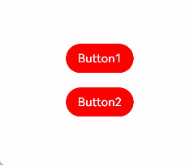

### @Styles和stateStyles联合使用

以下示例通过`@Styles`指定`stateStyles`的不同状态。

```typescript
@Entry
@Component
struct MyComponent {
  @Styles normalStyle() {
    .backgroundColor(Color.Gray)
  }

  @Styles pressedStyle() {
    .backgroundColor(Color.Red)
  }

  build() {
    Column() {
      Text('Text1')
        .fontSize(50)
        .fontColor(Color.White)
        .stateStyles({
          normal: this.normalStyle,
          pressed: this.pressedStyle,
        })
    }
  }
}
```

**图2** 正常态和按压态


### 在stateStyles里使用常规变量和状态变量

`stateStyles`可以通过`this`绑定组件内的常规变量和状态变量。

```typescript
@Entry
@Component
struct CompWithInlineStateStyles {
  @State focusedColor: Color = Color.Red;
  normalColor: Color = Color.Green

  build() {
    Column() {
      Button('clickMe').height(100).width(100)
        .stateStyles({
          normal: {
            .backgroundColor(this.normalColor)
          },
          focused: {
            .backgroundColor(this.focusedColor)
          }
        })
        .onClick(() => {
          this.focusedColor = Color.Pink
        })
        .margin('30%')
    }
  }
}
```

`Button`默认`normal`态显示绿色，第一次按下`Tab`键让`Button`获焦显示为`focus`态的红色，点击事件触发后，再次按下`Tab`键让`Button`获焦，`focus`态变为粉色。

**图3** 点击改变获焦态样式


## 状态管理

- **[状态管理概述](https://developer.huawei.com/consumer/cn/doc/harmonyos-guides-V2/arkts-state-management-overview-0000001524537145-V2)**
- **[管理组件拥有的状态](https://developer.huawei.com/consumer/cn/doc/harmonyos-guides-V2/arkts-component-state-management-0000001524417205-V2)**
- **[管理应用拥有的状态](https://developer.huawei.com/consumer/cn/doc/harmonyos-guides-V2/arkts-application-state-management-0000001524177633-V2)**
- **[其他状态管理](https://developer.huawei.com/consumer/cn/doc/harmonyos-guides-V2/arkts-other-state-mgmt-functions-0000001524297309-V2)**

### 状态管理概述

在前文的描述中，我们构建的页面多为静态界面。如果希望构建一个动态的、有交互的界面，就需要引入“状态”的概念。

**图1** 效果图


上面的示例中，用户与应用程序的交互触发了文本状态变更，状态变更引起了UI渲染，UI从“Hello World”变更为“Hello ArkUI”。

在声明式UI编程框架中，UI是程序状态的运行结果，用户构建了一个UI模型，其中应用的运行时的状态是参数。当参数改变时，UI作为返回结果，也将进行对应的改变。这些运行时的状态变化所带来的UI的重新渲染，在ArkUI中统称为状态管理机制。

自定义组件拥有变量，变量必须被装饰器装饰才可以成为状态变量，状态变量的改变会引起UI的渲染刷新。如果不使用状态变量，UI只能在初始化时渲染，后续将不会再刷新。 下图展示了State和View（UI）之间的关系。

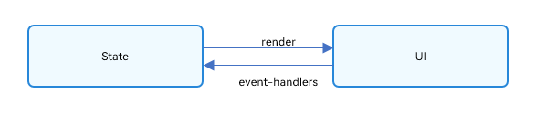

- View(UI)：UI渲染，指将`build`方法内的UI描述和`@Builder`装饰的方法内的UI描述映射到界面。
- State：状态，指驱动UI更新的数据。用户通过触发组件的事件方法，改变状态数据。状态数据的改变，引起UI的重新渲染。

#### 基本概念

- 状态变量：被状态装饰器装饰的变量，状态变量值的改变会引起UI的渲染更新。示例：`@State num: number = 1`，其中，`@State`是状态装饰器，`num`是状态变量。

- 常规变量：没有被状态装饰器装饰的变量，通常应用于辅助计算。它的改变永远不会引起UI的刷新。以下示例中`increaseBy`变量为常规变量。

- 数据源/同步源：状态变量的原始来源，可以同步给不同的状态数据。通常意义为父组件传给子组件的数据。以下示例中数据源为`count: 1`。

- 命名参数机制：父组件通过指定参数传递给子组件的状态变量，为父子传递同步参数的主要手段。示例：`CompA: ({ aProp: this.aProp })`。

- 从父组件初始化：父组件使用命名参数机制，将指定参数传递给子组件。子组件初始化的默认值在有父组件传值的情况下，会被覆盖。示例：

  ```typescript
  @Component
  struct MyComponent {
    @State count: number = 0;//状态变量
    private increaseBy: number = 1;//常规变量
  
    build() {
    }
  }
  
  @Component
  struct Parent {
    build() {
      Column() {
        // 从父组件初始化，覆盖本地定义的默认值
        MyComponent({ count: 1, increaseBy: 2 })
      }
    }
  }
  ```

- 初始化子节点：父组件中状态变量可以传递给子组件，初始化子组件对应的状态变量。示例同上。

- 本地初始化：在变量声明的时候赋值，作为变量的默认值。示例：`@State count: number = 0`。

#### 装饰器总览

ArkUI提供了多种装饰器，通过使用这些装饰器，状态变量不仅可以观察在组件内的改变，还可以在不同组件层级间传递，比如父子组件、跨组件层级，也可以观察全局范围内的变化。根据状态变量的影响范围，将所有的装饰器可以大致分为：

- 管理组件拥有状态的装饰器：组件级别的状态管理，可以观察组件内变化，和不同组件层级的变化，但需要唯一观察同一个组件树上，即同一个页面内。
- 管理应用拥有状态的装饰器：应用级别的状态管理，可以观察不同页面，甚至不同UIAbility的状态变化，是应用内全局的状态管理。

从数据的传递形式和同步类型层面看，装饰器也可分为：

- 只读的单向传递；
- 可变更的双向传递。

图示如下，具体装饰器的介绍，可详见[管理组件拥有的状态](https://developer.huawei.com/consumer/cn/doc/harmonyos-guides-V2/arkts-state-0000001474017162-V2)和[管理应用拥有的状态](https://developer.huawei.com/consumer/cn/doc/harmonyos-guides-V2/arkts-application-state-management-overview-0000001529381989-V2)。开发者可以灵活地利用这些能力来实现数据和UI的联动。

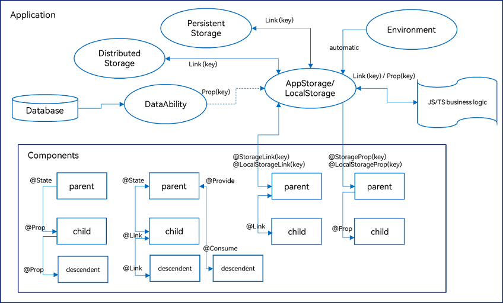

上图中，`Components`部分的装饰器为组件级别的状态管理，`Application`部分为应用的状态管理。开发者可以通过`@StorageLink/@LocalStorageLink`实现应用和组件状态的双向同步，通过`@StorageProp/@LocalStorageProp`实现应用和组件状态的单向同步。

[管理组件拥有的状态](https://developer.huawei.com/consumer/cn/doc/harmonyos-guides-V2/arkts-state-0000001474017162-V2)，即图中Components级别的状态管理：

- `@State`：`@State`装饰的变量拥有其所属组件的状态，可以作为其子组件单向和双向同步的数据源。当其数值改变时，会引起相关组件的渲染刷新。

- `@Prop`：`@Prop`装饰的变量可以和父组件建立单向同步关系，@Prop装饰的变量是可变的，但修改不会同步回父组件。

- `@Link`：`@Link`装饰的变量和父组件构建双向同步关系的状态变量，父组件会接受来自`@Link`装饰的变量的修改的同步，父组件的更新也会同步给`@Link`装饰的变量。

- `@Provide/@Consume`：`@Provide/@Consume`装饰的变量用于跨组件层级（多层组件）同步状态变量，可以不需要通过参数命名机制传递，通过alias（别名）或者属性名绑定。

- `@Observed`：`@Observed`装饰`class`，需要观察多层嵌套场景的`class`需要被`@Observed`装饰。单独使用`@Observed`没有任何作用，需要和`@ObjectLink`、`@Prop`连用。

- `@ObjectLink`：`@ObjectLink`装饰的变量接收`@Observed`装饰的`class`的实例，应用于观察多层嵌套场景，和父组件的数据源构建双向同步。

  > 仅[@Observed/@ObjectLink](https://developer.huawei.com/consumer/cn/doc/harmonyos-guides-V2/arkts-observed-and-objectlink-0000001473697338-V2)可以观察嵌套场景，其他的状态变量仅能观察第一层，详情见各个装饰器章节的“观察变化和行为表现”小节。

[管理应用拥有的状态](https://developer.huawei.com/consumer/cn/doc/harmonyos-guides-V2/arkts-application-state-management-overview-0000001529381989-V2)，即图中`Application`级别的状态管理：

- `AppStorage`是应用程序中的一个特殊的单例`LocalStorage`对象，是应用级的数据库，和进程绑定，通过[@StorageProp](https://developer.huawei.com/consumer/cn/doc/harmonyos-guides-V2/arkts-appstorage-0000001524417209-V2#section676113134317)和[@StorageLink](https://developer.huawei.com/consumer/cn/doc/harmonyos-guides-V2/arkts-appstorage-0000001524417209-V2#section84115526424)装饰器可以和组件联动。
- `AppStorage`是应用状态的“中枢”，将需要与组件（UI）交互的数据存入`AppStorage`，比如持久化数据`PersistentStorage`和环境变量`Environment`。UI再通过`AppStorage`提供的装饰器或者API接口，访问这些数据。
- 框架还提供了`LocalStorage`，`AppStorage`是`LocalStorage`特殊的单例。`LocalStorage`是应用程序声明的应用状态的内存“数据库”，通常用于页面级的状态共享，通过[@LocalStorageProp](https://developer.huawei.com/consumer/cn/doc/harmonyos-guides-V2/arkts-localstorage-0000001524537149-V2#section14665991077)和[@LocalStorageLink](https://developer.huawei.com/consumer/cn/doc/harmonyos-guides-V2/arkts-localstorage-0000001524537149-V2#section20745122910311)装饰器可以和UI联动。

#### 其他状态管理功能

`@Watch`用于监听状态变量的变化。

`$$运算符`：给内置组件提供TS变量的引用，使得TS变量和内置组件的内部状态保持同步。

### 管理组件拥有的状态

- **[@State装饰器：组件内状态](https://developer.huawei.com/consumer/cn/doc/harmonyos-guides-V2/arkts-state-0000001474017162-V2)**
- **[@Prop装饰器：父子单向同步](https://developer.huawei.com/consumer/cn/doc/harmonyos-guides-V2/arkts-prop-0000001473537702-V2)**
- **[@Link装饰器：父子双向同步](https://developer.huawei.com/consumer/cn/doc/harmonyos-guides-V2/arkts-link-0000001524297305-V2)**
- **[@Provide装饰器和@Consume装饰器：与后代组件双向同步](https://developer.huawei.com/consumer/cn/doc/harmonyos-guides-V2/arkts-provide-and-consume-0000001473857338-V2)**
- **[@Observed装饰器和@ObjectLink装饰器：嵌套类对象属性变化](https://developer.huawei.com/consumer/cn/doc/harmonyos-guides-V2/arkts-observed-and-objectlink-0000001473697338-V2)**


#### @State装饰器：组件内状态

`@State`装饰的变量，或称为状态变量，一旦变量拥有了状态属性，就和自定义组件的渲染绑定起来。当状态改变时，UI会发生对应的渲染改变。

在状态变量相关装饰器中，`@State`是最基础的，使变量拥有状态属性的装饰器，它也是大部分状态变量的数据源。

> 从API version 9开始，该装饰器支持在ArkTS卡片中使用。

##### 概述

@State装饰的变量，与声明式范式中的其他被装饰变量一样，是私有的，只能从组件内部访问，在声明时必须指定其类型和本地初始化。初始化也可选择使用命名参数机制从父组件完成初始化。

@State装饰的变量拥有以下特点：

- @State装饰的变量与子组件中的@Prop装饰变量之间建立单向数据同步，与@Link、@ObjectLink装饰变量之间建立双向数据同步。
- @State装饰的变量生命周期与其所属自定义组件的生命周期相同。

##### 装饰器使用规则说明

| @State变量装饰器 | 说明 |
| --------- | ------- |
| 装饰器参数 | 无  |
| 同步类型 | 不与父组件中任何类型的变量同步。|
| 允许装饰的变量类型 | Object、class、string、number、boolean、enum类型，以及这些类型的数组。嵌套类型的场景请参考[观察变化](https://developer.huawei.com/consumer/cn/doc/harmonyos-guides-V2/arkts-state-0000001474017162-V2#section135631413173517)。类型必须被指定。不支持any，不支持简单类型和复杂类型的联合类型，不允许使用undefined和null。建议不要装饰Date类型，应用可能会产生异常行为。不支持Length、ResourceStr、ResourceColor类型，Length、ResourceStr、ResourceColor为简单类型和复杂类型的联合类型。 |
| 被装饰变量的初始值 | 必须本地初始化。|

##### 变量的传递/访问规则说明

| 传递/访问 | 说明 |
| ------- | -------- |
| 从父组件初始化 | 可选，从父组件初始化或者本地初始化。如果从父组件初始化将会覆盖本地初始化。支持父组件中常规变量、@State、@Link、@Prop、@Provide、@Consume、@ObjectLink、@StorageLink、@StorageProp、@LocalStorageLink和@LocalStorageProp装饰的变量，初始化子组件的@State。 |
| 用于初始化子组件   | @State装饰的变量支持初始化子组件的常规变量、@State、@Link、@Prop、@Provide。 |
| 是否支持组件外访问 | 不支持，只能在组件内访问。|

**图1** 初始化规则图示

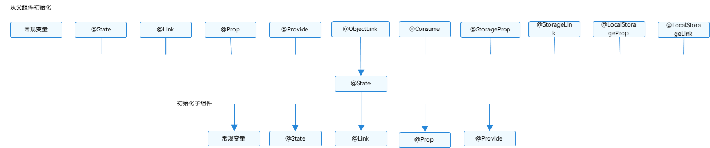

##### 观察变化和行为表现

并不是状态变量的所有更改都会引起UI的刷新，只有可以被框架观察到的修改才会引起UI刷新。本小节将介绍什么样的修改才能被观察到，以及观察到变化后，框架的是怎么引起UI刷新的，即框架的行为表现是什么。

###### 观察变化

- 当装饰的数据类型为`boolean、string、number`类型时，可以观察到数值的变化。

  ```typescript
  // for simple type
  @State count: number = 0;
  // value changing can be observed
  this.count = 1;
  ```

- 当装饰的数据类型为`class`或者`Object`时，可以观察到自身的赋值的变化，和其属性赋值的变化，即`Object.keys(observedObject)`返回的所有属性。例子如下。

  声明`ClassA`和`Model`类。

  ```typescript
  class ClassA {
    public value: string;
  
    constructor(value: string) {
      this.value = value;
    }
  }
  
  class Model {
    public value: string;
    public name: ClassA;
    constructor(value: string, a: ClassA) {
      this.value = value;
      this.name = a;
    }
  }
  ```

  @State装饰的类型是Model

  ```typescript
  // class类型
  @State title: Model = new Model('Hello', new ClassA('World'));
  ```

  对@State装饰变量的赋值。

  ```typescript
  // class类型赋值
  this.title = new Model('Hi', new ClassA('ArkUI'));
  ```

  对@State装饰变量的属性赋值。

  ```typescript
  // class属性的赋值
  this.title.value = 'Hi';
  ```

  嵌套属性的赋值观察不到。

  ```typescript
  // 嵌套的属性赋值观察不到
  this.title.name.value = 'ArkUI';
  ```

- 当装饰的对象是array时，可以观察到数组本身的赋值和添加、删除、更新数组的变化。例子如下。

  声明Model类。

  ```typescript
  class Model {
    public value: number;
    constructor(value: number) {
      this.value = value;
    }
  }
  ```

  @State装饰的对象为Model类型数组时。

  ```typescript
  @State title: Model[] = [new Model(11), new Model(1)];
  ```

  数组自身的赋值可以观察到。

  ```typescript
  this.title = [new Model(2)];
  ```

  数组项的赋值可以观察到。

  ```typescript
  this.title[0] = new Model(2);
  ```

  删除数组项可以观察到。

  ```typescript
  this.title.pop();
  ```

  新增数组项可以观察到。

  ```typescript
  this.title.push(new Model(12));
  ```

  数组项中属性的赋值观察不到。

  ```typescript
  this.title[0].value = 6;
  ```

###### 框架行为

- 当状态变量被改变时，查询依赖该状态变量的组件；
- 执行依赖该状态变量的组件的更新方法，组件更新渲染；
- 和该状态变量不相关的组件或者UI描述不会发生重新渲染，从而实现页面渲染的按需更新。

##### 使用场景

###### 装饰简单类型的变量

以下示例为@State装饰的简单类型，count被@State装饰成为状态变量，count的改变引起Button组件的刷新：

- 当状态变量count改变时，查询到只有Button组件关联了它；
- 执行Button组件的更新方法，实现按需刷新。

```typescript
@Entry
@Component
struct MyComponent {
  @State count: number = 0;

  build() {
    Button(`click times: ${this.count}`)
      .onClick(() => {
        this.count += 1;
      })
  }
}
```

###### 装饰class对象类型的变量

- 自定义组件MyComponent定义了被@State装饰的状态变量count和title，其中title的类型为自定义类Model。如果count或title的值发生变化，则查询MyComponent中使用该状态变量的UI组件，并进行重新渲染。

- EntryComponent中有多个MyComponent组件实例，第一个MyComponent内部状态的更改不会影响第二个MyComponent。

  ```typescript
  class Model {
    public value: string;
  
    constructor(value: string) {
      this.value = value;
    }
  }
  
  @Entry
  @Component
  struct EntryComponent {
    build() {
      Column() {
        // 此处指定的参数都将在初始渲染时覆盖本地定义的默认值，并不是所有的参数都需要从父组件初始化
        MyComponent({ count: 1, increaseBy: 2 })
          .width(300)
        MyComponent({ title: new Model('Hello World 2'), count: 7 })
      }
    }
  }
  
  @Component
  struct MyComponent {
    @State title: Model = new Model('Hello World');
    @State count: number = 0;
    private increaseBy: number = 1;
  
    build() {
      Column() {
        Text(`${this.title.value}`)
          .margin(10)
        Button(`Click to change title`)
          .onClick(() => {
            // @State变量的更新将触发上面的Text组件内容更新
            this.title.value = this.title.value === 'Hello ArkUI' ? 'Hello World' : 'Hello ArkUI';
          })
          .width(300)
          .margin(10)
  
        Button(`Click to increase count = ${this.count}`)
          .onClick(() => {
            // @State变量的更新将触发该Button组件的内容更新
            this.count += this.increaseBy;
          })
          .width(300)
          .margin(10)
      }
    }
  }
  ```

  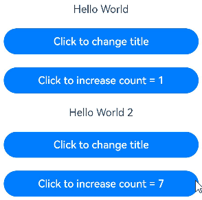

从该示例中，我们可以了解到@State变量首次渲染的初始化流程：

1. 使用默认的本地初始化：

   ```typescript
   @State title: Model = new Model('Hello World');
   @State count: number = 0;
   ```

2. 对于@State来说，命名参数机制传递的值并不是必选的，如果没有命名参数传值，则使用本地初始化的默认值：

   ```typescript
   MyComponent({ count: 1, increaseBy: 2 })
   ```


#### @Prop装饰器：父子单向同步

@Prop装饰的变量可以和父组件建立单向的同步关系。@Prop装饰的变量是可变的，但是变化不会同步回其父组件。

> 从API version 9开始，该装饰器支持在ArkTS卡片中使用。

##### 概述

@Prop装饰的变量和父组件建立单向的同步关系：

- @Prop变量允许在本地修改，但修改后的变化不会同步回父组件。
- 当父组件中的数据源更改时，与之相关的@Prop装饰的变量都会自动更新。如果子组件已经在本地修改了@Prop装饰的相关变量值，而在父组件中对应的@State装饰的变量被修改后，子组件本地修改的@Prop装饰的相关变量值将被覆盖。

##### 限制条件

@Prop装饰器不能在@Entry装饰的自定义组件中使用。

##### 装饰器使用规则说明

| @Prop变量装饰器 | 说明 |
| ------- | ------------ |
| 装饰器参数         | 无    |
| 同步类型           | 单向同步：对父组件状态变量值的修改，将同步给子组件@Prop装饰的变量，子组件@Prop变量的修改不会同步到父组件的状态变量上 |
| 允许装饰的变量类型 | string、number、boolean、enum类型。不支持any，不允许使用undefined和null。必须指定类型。在父组件中，传递给@Prop装饰的值不能为undefined或者null，反例如下所示。  CompA ({ aProp: undefined })  CompA ({ aProp: null })  @Prop和[数据源](https://developer.huawei.com/consumer/cn/doc/harmonyos-guides-V2/arkts-state-management-overview-0000001524537145-V2#section127619262713)类型需要相同，有以下三种情况（数据源以@State为例）：@Prop装饰的变量和父组件状态变量类型相同，即@Prop : S和@State : S，示例请参考[父组件@State到子组件@Prop简单数据类型同步](https://developer.huawei.com/consumer/cn/doc/harmonyos-guides-V2/arkts-prop-0000001473537702-V2#section614118685518)。当父组件的状态变量为数组时，@Prop装饰的变量和父组件状态变量的数组项类型相同，即@Prop : S和@State : Array<S>，示例请参考[父组件@State数组中的项到子组件@Prop简单数据类型同步](https://developer.huawei.com/consumer/cn/doc/harmonyos-guides-V2/arkts-prop-0000001473537702-V2#section99561777591)；当父组件状态变量为Object或者class时，@Prop装饰的变量和父组件状态变量的属性类型相同，即@Prop : S和@State : { propA: S }，示例请参考[从父组件中的@State类对象属性到@Prop简单类型的同步](https://developer.huawei.com/consumer/cn/doc/harmonyos-guides-V2/arkts-prop-0000001473537702-V2#section1381944312202)。 |
| 被装饰变量的初始值 | 允许本地初始化。  |

##### 变量的传递/访问规则说明

| 传递/访问  | 说明       |
| ------ | ------ |
| 从父组件初始化 | 如果本地有初始化，则是可选的。没有的话，则必选，支持父组件中的常规变量、@State、@Link、@Prop、@Provide、@Consume、@ObjectLink、@StorageLink、@StorageProp、@LocalStorageLink和@LocalStorageProp去初始化子组件中的@Prop变量。 |
| 用于初始化子组件 | @Prop支持去初始化子组件中的常规变量、@State、@Link、@Prop、@Provide。 |
| 是否支持组件外访问 | @Prop装饰的变量是私有的，只能在组件内访问。|

**图1** 初始化规则图示

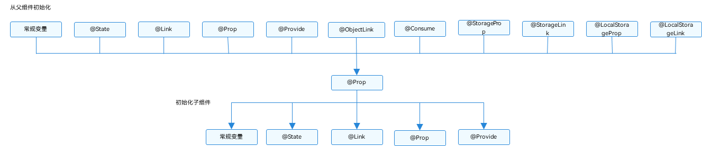

##### 观察变化和行为表现

###### 观察变化

@Prop装饰的数据可以观察到以下变化。

- 当装饰的类型是允许的类型，即string、number、boolean、enum类型都可以观察到的赋值变化；

  ```typescript
  // 简单类型
  @Prop count: number;
  // 赋值的变化可以被观察到
  this.count = 1;
  ```

对于@State和@Prop的同步场景：

- 使用父组件中@State变量的值初始化子组件中的@Prop变量。当@State变量变化时，该变量值也会同步更新至@Prop变量。
- @Prop装饰的变量的修改不会影响其数据源@State装饰变量的值。
- 除了@State，数据源也可以用@Link或@Prop装饰，对@Prop的同步机制是相同的。
- 数据源和@Prop变量的类型需要相同。

###### 框架行为

要理解@Prop变量值初始化和更新机制，有必要了解父组件和拥有@Prop变量的子组件初始渲染和更新流程。

1. 初始渲染：
   1. 执行父组件的build()函数将创建子组件的新实例，将数据源传递给子组件；
   2. 初始化子组件@Prop装饰的变量。
2. 更新：
   1. 子组件@Prop更新时，更新仅停留在当前子组件，不会同步回父组件；
   2. 当父组件的数据源更新时，子组件的@Prop装饰的变量将被来自父组件的数据源重置，所有@Prop装饰的本地的修改将被父组件的更新覆盖。

> @Prop装饰的数据更新依赖其所属自定义组件的重新渲染，所以在应用进入后台后，@Prop无法刷新，推荐使用@Link代替。

##### 使用场景

###### 父组件@State到子组件@Prop简单数据类型同步

以下示例是@State到子组件@Prop简单数据同步，父组件ParentComponent的状态变量countDownStartValue初始化子组件CountDownComponent中@Prop装饰的count，点击“Try again”，count的修改仅保留在CountDownComponent，不会同步给父组件ParentComponent。

ParentComponent的状态变量countDownStartValue的变化将重置CountDownComponent的count。

```typescript
@Component
struct CountDownComponent {
  @Prop count: number;
  costOfOneAttempt: number = 1;

  build() {
    Column() {
      if (this.count > 0) {
        Text(`You have ${this.count} Nuggets left`)
      } else {
        Text('Game over!')
      }
      // @Prop装饰的变量不会同步给父组件
      Button(`Try again`).onClick(() => {
        this.count -= this.costOfOneAttempt;
      })
    }
  }
}

@Entry
@Component
struct ParentComponent {
  @State countDownStartValue: number = 10;

  build() {
    Column() {
      Text(`Grant ${this.countDownStartValue} nuggets to play.`)
      // 父组件的数据源的修改会同步给子组件
      Button(`+1 - Nuggets in New Game`).onClick(() => {
        this.countDownStartValue += 1;
      })
      // 父组件的修改会同步给子组件
      Button(`-1  - Nuggets in New Game`).onClick(() => {
        this.countDownStartValue -= 1;
      })

      CountDownComponent({ count: this.countDownStartValue, costOfOneAttempt: 2 })
    }
  }
}
```

在上面的示例中：

1. CountDownComponent子组件首次创建时其@Prop装饰的count变量将从父组件@State装饰的countDownStartValue变量初始化；
2. 按“+1”或“-1”按钮时，父组件的@State装饰的countDownStartValue值会变化，这将触发父组件重新渲染，在父组件重新渲染过程中会刷新使用countDownStartValue状态变量的UI组件并单向同步更新CountDownComponent子组件中的count值；
3. 更新count状态变量值也会触发CountDownComponent的重新渲染，在重新渲染过程中，评估使用count状态变量的if语句条件（this.count > 0），并执行true分支中的使用count状态变量的UI组件相关描述来更新Text组件的UI显示；
4. 当按下子组件CountDownComponent的“Try again”按钮时，其@Prop变量count将被更改，但是count值的更改不会影响父组件的countDownStartValue值；
5. 父组件的countDownStartValue值会变化时，父组件的修改将覆盖掉子组件CountDownComponent中count本地的修改。

###### 父组件@State数组项到子组件@Prop简单数据类型同步

父组件中@State如果装饰的数组，其数组项也可以初始化@Prop。以下示例中父组件Index中@State装饰的数组arr，将其数组项初始化子组件Child中@Prop装饰的value。

```typescript
@Component
struct Child {
  @Prop value: number;

  build() {
    Text(`${this.value}`)
      .fontSize(50)
      .onClick(()=>{this.value++})
  }
}

@Entry
@Component
struct Index {
  @State arr: number[] = [1,2,3];

  build() {
    Row() {
      Column() {
        Child({value: this.arr[0]})
        Child({value: this.arr[1]})
        Child({value: this.arr[2]})

        Divider().height(5)

        ForEach(this.arr, 
          item => {
            Child({'value': item} as Record<string, number>)
          }, 
          item => item.toString()
        )
        Text('replace entire arr')
        .fontSize(50)
        .onClick(()=>{
          // 两个数组都包含项“3”。
          this.arr = this.arr[0] == 1 ? [3,4,5] : [1,2,3];
        })
      }
    }
  }
}
```

初始渲染创建6个子组件实例，每个@Prop装饰的变量初始化都在本地拷贝了一份数组项。子组件onclick事件处理程序会更改局部变量值。

如果点击界面上的“1”六次、“2”五次、“3”四次，将所有变量的本地取值都变为“7”。

```typescript
7
7
7
----
7
7
7
```

单击replace entire arr后，屏幕将显示以下信息，为什么？

```typescript
3
4
5
----
7
4
5
```

- 在子组件Child中做的所有的修改都不会同步回父组件Index组件，所以即使6个组件显示都为7，但在父组件Index中，this.arr保存的值依旧是[1,2,3]。
- 点击replace entire arr，this.arr[0] == 1成立，将this.arr赋值为[3, 4, 5]；
- 因为this.arr[0]已更改，Child({value: this.arr[0]})组件将this.arr[0]更新同步到实例@Prop装饰的变量。Child({value: this.arr[1]})和Child({value: this.arr[2]})的情况也类似。

- this.arr的更改触发ForEach更新，this.arr更新的前后都有数值为3的数组项：[3, 4, 5] 和[1, 2, 3]。根据diff算法，数组项“3”将被保留，删除“1”和“2”的数组项，添加为“4”和“5”的数组项。这就意味着，数组项“3”的组件不会重新生成，而是将其移动到第一位。所以“3”对应的组件不会更新，此时“3”对应的组件数值为“7”，ForEach最终的渲染结果是“7”，“4”，“5”。

###### 从父组件中的@State类对象属性到@Prop简单类型的同步

如果图书馆有一本图书和两位用户，每位用户都可以将图书标记为已读，此标记行为不会影响其它读者用户。从代码角度讲，对@Prop图书对象的本地更改不会同步给图书馆组件中的@State图书对象。

```typescript
class Book {
  public title: string;
  public pages: number;
  public readIt: boolean = false;

  constructor(title: string, pages: number) {
    this.title = title;
    this.pages = pages;
  }
}

@Component
struct ReaderComp {
  @Prop title: string;
  @Prop readIt: boolean;

  build() {
    Row() {
      Text(this.title)
      Text(`... ${this.readIt ? 'I have read' : 'I have not read it'}`)
        .onClick(() => this.readIt = true)
    }
  }
}

@Entry
@Component
struct Library {
  @State book: Book = new Book('100 secrets of C++', 765);

  build() {
    Column() {
      ReaderComp({ title: this.book.title, readIt: this.book.readIt })
      ReaderComp({ title: this.book.title, readIt: this.book.readIt })
    }
  }
}
```

###### @Prop本地初始化不和父组件同步

为了支持@Component装饰的组件复用场景，@Prop支持本地初始化，这样可以让@Prop是否与父组件建立同步关系变得可选。当且仅当@Prop有本地初始化时，从父组件向子组件传递@Prop的数据源才是可选的。

下面的示例中，子组件包含两个@Prop变量：

- @Prop customCounter没有本地初始化，所以需要父组件提供数据源去初始化@Prop，并当父组件的数据源变化时，@Prop也将被更新；

- @Prop customCounter2有本地初始化，在这种情况下，@Prop依旧允许但非强制父组件同步数据源给@Prop。

  ```typescript
  @Component
  struct MyComponent {
    @Prop customCounter: number;
    @Prop customCounter2: number = 5;
  
    build() {
      Column() {
        Row() {
          Text(`From Main: ${this.customCounter}`).fontColor('#ff6b6565').margin({ left: -110, top: 12 })
        }
  
        Row() {
          Button('Click to change locally !')
            .width(288)
            .height(40)
            .margin({ left: 30, top: 12 })
            .fontColor('#FFFFFF，90%')
            .onClick(() => {
              this.customCounter2++
            })
        }
  
        Row() {
          Text(`Custom Local: ${this.customCounter2}`).fontColor('#ff6b6565').margin({ left: -110, top: 12 })
        }
      }
    }
  }
  
  @Entry
  @Component
  struct MainProgram {
    @State mainCounter: number = 10;
  
    build() {
      Column() {
        Row() {
          Column() {
            // customCounter必须从父组件初始化，因为MyComponent的customCounter成员变量缺少本地初始化；此处，customCounter2可以不做初始化。
            MyComponent({ customCounter: this.mainCounter })
            // customCounter2也可以从父组件初始化，父组件初始化的值会覆盖子组件customCounter2的本地初始化的值
            MyComponent({ customCounter: this.mainCounter, customCounter2: this.mainCounter })
          }
        }
  
        Row() {
          Column() {
            Button('Click to change number')
              .width(288)
              .height(40)
              .margin({ left: 30, top: 12 })
              .fontColor('#FFFFFF，90%')
              .onClick(() => {
                this.mainCounter++
              })
          }
        }
      }
    }
  }
  ```
  
  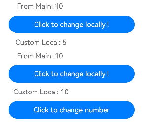


#### @Link装饰器：父子双向同步

子组件中被@Link装饰的变量与其父组件中对应的数据源建立双向数据绑定。

> 从API version 9开始，该装饰器支持在ArkTS卡片中使用。

##### 概述

@Link装饰的变量与其父组件中的数据源共享相同的值。

##### 限制条件

@Link装饰器不能在@Entry装饰的自定义组件中使用。

##### 装饰器使用规则说明

| @Link变量装饰器 | 说明 |
| ----------- | -------- |
| 装饰器参数  | 无 |
| 同步类型 | 双向同步。父组件中@State, @StorageLink和@Link 和子组件@Link可以建立双向数据同步，反之亦然。 |
| 允许装饰的变量类型 | Object、class、string、number、boolean、enum类型，以及这些类型的数组。嵌套类型的场景请参考[观察变化](https://developer.huawei.com/consumer/cn/doc/harmonyos-guides-V2/arkts-link-0000001524297305-V2#section7141136115513)。类型必须被指定，且和双向绑定状态变量的类型相同。不支持any，不支持简单类型和复杂类型的联合类型，不允许使用undefined和null。不支持Length、ResourceStr、ResourceColor类型，Length、ResourceStr、ResourceColor为简单类型和复杂类型的联合类型。 |
| 被装饰变量的初始值 | 无，禁止本地初始化。|

##### 变量的传递/访问规则说明

| 传递/访问 | 说明 |
| -------- | --------- |
| 从父组件初始化和更新 | 必选。与父组件@State, @StorageLink和@Link 建立双向绑定。允许父组件中@State、@Link、@Prop、@Provide、@Consume、@ObjectLink、@StorageLink、@StorageProp、@LocalStorageLink和@LocalStorageProp装饰变量初始化子组件@Link。从API version 9开始，@Link子组件从父组件初始化@State的语法为Comp({ aLink: this.aState })。同样Comp({aLink: $aState})也支持。 |
| 用于初始化子组件 | 允许，可用于初始化常规变量、@State、@Link、@Prop、@Provide。 |
| 是否支持组件外访问   | 私有，只能在所属组件内访问。|

**图1** 初始化规则图示

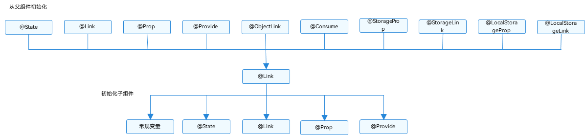


##### 观察变化和行为表现

###### 观察变化

- 当装饰的数据类型为boolean、string、number类型时，可以同步观察到数值的变化，示例请参考[简单类型和类对象类型的@Link](https://developer.huawei.com/consumer/cn/doc/harmonyos-guides-V2/arkts-link-0000001524297305-V2#section614118685518)。
- 当装饰的数据类型为class或者Object时，可以观察到赋值和属性赋值的变化，即Object.keys(observedObject)返回的所有属性，示例请参考[简单类型和类对象类型的@Link](https://developer.huawei.com/consumer/cn/doc/harmonyos-guides-V2/arkts-link-0000001524297305-V2#section614118685518)。
- 当装饰的对象是array时，可以观察到数组添加、删除、更新数组单元的变化，示例请参考[数组类型的@Link](https://developer.huawei.com/consumer/cn/doc/harmonyos-guides-V2/arkts-link-0000001524297305-V2#section99561777591)。

###### 框架行为

@Link装饰的变量和其所属的自定义组件共享生命周期。

为了了解@Link变量初始化和更新机制，有必要先了解父组件和拥有@Link变量的子组件的关系，初始渲染和双向更新的流程（以父组件为@State为例）。

1. 初始渲染：执行父组件的build()函数后将创建子组件的新实例。初始化过程如下：
   1. 必须指定父组件中的@State变量，用于初始化子组件的@Link变量。子组件的@Link变量值与其父组件的数据源变量保持同步（双向数据同步）。
   2. 父组件的@State状态变量包装类通过构造函数传给子组件，子组件的@Link包装类拿到父组件的@State的状态变量后，将当前@Link包装类this指针注册给父组件的@State变量。
2. @Link的数据源的更新：即父组件中状态变量更新，引起相关子组件的@Link的更新。处理步骤：
   1. 通过初始渲染的步骤可知，子组件@Link包装类把当前this指针注册给父组件。父组件@State变量变更后，会遍历更新所有依赖它的系统组件（elementid）和状态变量（比如@Link包装类）。
   2. 通知@Link包装类更新后，子组件中所有依赖@Link状态变量的系统组件（elementId）都会被通知更新。以此实现父组件对子组件的状态数据同步。
3. @Link的更新：当子组件中@Link更新后，处理步骤如下（以父组件为@State为例）：
   1. @Link更新后，调用父组件的@State包装类的set方法，将更新后的数值同步回父组件。
   2. 子组件@Link和父组件@State分别遍历依赖的系统组件，进行对应的UI的更新。以此实现子组件@Link同步回父组件@State。

##### 使用场景

###### 简单类型和类对象类型的@Link

以下示例中，点击父组件ShufflingContainer中的“Parent View: Set yellowButton”和“Parent View: Set GreenButton”，可以从父组件将变化同步给子组件。

1.点击子组件GreenButton和YellowButton中的Button，子组件会发生相应变化，将变化同步给父组件。因为@Link是双向同步，会将变化同步给@State。

2.当点击父组件ShufflingContainer中的Button时，@State变化，也会同步给@Link，子组件也会发生对应的刷新。

```typescript
class GreenButtonState {
  width: number = 0;

  constructor(width: number) {
    this.width = width;
  }
}

@Component
struct GreenButton {
  @Link greenButtonState: GreenButtonState;

  build() {
    Button('Green Button')
      .width(this.greenButtonState.width)
      .height(40)
      .backgroundColor('#64bb5c')
      .fontColor('#FFFFFF，90%')
      .onClick(() => {
        if (this.greenButtonState.width < 700) {
          // 更新class的属性，变化可以被观察到同步回父组件
          this.greenButtonState.width += 60;
        } else {
          // 更新class，变化可以被观察到同步回父组件
          this.greenButtonState = new GreenButtonState(180);
        }
      })
  }
}

@Component
struct YellowButton {
  @Link yellowButtonState: number;

  build() {
    Button('Yellow Button')
      .width(this.yellowButtonState)
      .height(40)
      .backgroundColor('#f7ce00')
      .fontColor('#FFFFFF，90%')
      .onClick(() => {
        // 子组件的简单类型可以同步回父组件
        this.yellowButtonState += 40.0;
      })
  }
}

@Entry
@Component
struct ShufflingContainer {
  @State greenButtonState: GreenButtonState = new GreenButtonState(180);
  @State yellowButtonProp: number = 180;

  build() {
    Column() {
      Flex({ direction: FlexDirection.Column, alignItems: ItemAlign.Center }) {
        // 简单类型从父组件@State向子组件@Link数据同步
        Button('Parent View: Set yellowButton')
          .width(312)
          .height(40)
          .margin(12)
          .fontColor('#FFFFFF，90%')
          .onClick(() => {
            this.yellowButtonProp = (this.yellowButtonProp < 700) ? this.yellowButtonProp + 40 : 100;
          })
        // class类型从父组件@State向子组件@Link数据同步
        Button('Parent View: Set GreenButton')
          .width(312)
          .height(40)
          .margin(12)
          .fontColor('#FFFFFF，90%')
          .onClick(() => {
            this.greenButtonState.width = (this.greenButtonState.width < 700) ? this.greenButtonState.width + 100 : 100;
          })
        // class类型初始化@Link
        GreenButton({ greenButtonState: $greenButtonState }).margin(12)
        // 简单类型初始化@Link
        YellowButton({ yellowButtonState: $yellowButtonProp }).margin(12)
      }
    }
  }
}
```

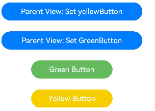

###### 数组类型的@Link

```typescript
@Component
struct Child {
  @Link items: number[];

  build() {
    Column() {
      Button(`Button1: push`)
        .margin(12)
        .width(312)
        .height(40)
        .fontColor('#FFFFFF，90%')
        .onClick(() => {
          this.items.push(this.items.length + 1);
        })
      Button(`Button2: replace whole item`)
        .margin(12)
        .width(312)
        .height(40)
        .fontColor('#FFFFFF，90%')
        .onClick(() => {
          this.items = [100, 200, 300];
        })
    }
  }
}

@Entry
@Component
struct Parent {
  @State arr: number[] = [1, 2, 3];

  build() {
    Column() {
      Child({ items: $arr })
        .margin(12)
      ForEach(this.arr,
        (item: number) => {
          Button(`${item}`)
            .margin(12)
            .width(312)
            .height(40)
            .backgroundColor('#11a2a2a2')
            .fontColor('#e6000000')
        },
        (item: ForEachInterface) => item.toString()
      )
    }
  }
}
```

上文所述，ArkUI框架可以观察到数组元素的添加，删除和替换。在该示例中@State和@Link的类型是相同的number[]，不允许将@Link定义成number类型（@Link item : number），并在父组件中用@State数组中每个数据项创建子组件。如果要使用这个场景，可以参考[@Prop](https://developer.huawei.com/consumer/cn/doc/harmonyos-guides-V2/arkts-prop-0000001473537702-V2#ZH-CN_TOPIC_0000001574128565__section0418145414102)和@Observed。


#### @Provide装饰器和@Consume装饰器：与后代组件双向同步

@Provide和@Consume，应用于与后代组件的双向数据同步，应用于状态数据在多个层级之间传递的场景。不同于上文提到的父子组件之间通过命名参数机制传递，@Provide和@Consume摆脱参数传递机制的束缚，实现跨层级传递。

其中@Provide装饰的变量是在祖先节点中，可以理解为被“提供”给后代的状态变量。@Consume装饰的变量是在后代组件中，去“消费（绑定）”祖先节点提供的变量。

> 从API version 9开始，这两个装饰器支持在ArkTS卡片中使用。

##### 概述

@Provide/@Consume装饰的状态变量有以下特性：

- @Provide装饰的状态变量自动对其所有后代组件可用，即该变量被“provide”给他的后代组件。由此可见，@Provide的方便之处在于，开发者不需要多次在组件之间传递变量。
- 后代通过使用@Consume去获取@Provide提供的变量，建立在@Provide和@Consume之间的双向数据同步，与@State/@Link不同的是，前者可以在多层级的父子组件之间传递。
- @Provide和@Consume可以通过相同的变量名或者相同的变量别名绑定，变量类型必须相同。

```typescript
// 通过相同的变量名绑定
@Provide a: number = 0;
@Consume a: number;

// 通过相同的变量别名绑定
@Provide('a') b: number = 0;
@Consume('a') c: number;
```

@Provide和@Consume通过相同的变量名或者相同的变量别名绑定时，@Provide修饰的变量和@Consume修饰的变量是一对多的关系。不允许在同一个自定义组件内，包括其子组件中声明多个同名或者同别名的@Provide装饰的变量。

##### 装饰器说明

@State的规则同样适用于@Provide，差异为@Provide还作为多层后代的同步源。

| @Provide变量装饰器 | 说明  |
| ------------- | ------ |
| 装饰器参数 | 别名：常量字符串，可选。如果指定了别名，则通过别名来绑定变量；如果未指定别名，则通过变量名绑定变量。 |
| 同步类型  | 双向同步。从@Provide变量到所有@Consume变量以及相反的方向的数据同步。双向同步的操作与@State和@Link的组合相同。 |
| 允许装饰的变量类型 | Object、class、string、number、boolean、enum类型，以及这些类型的数组。嵌套类型的场景请参考[观察变化](https://developer.huawei.com/consumer/cn/doc/harmonyos-guides-V2/arkts-provide-and-consume-0000001473857338-V2#section7141136115513)。不支持any，不支持简单类型和复杂类型的联合类型，不允许使用undefined和null。必须指定类型。@Provide变量的@Consume变量的类型必须相同。不支持Length、ResourceStr、ResourceColor类型，Length、ResourceStr、ResourceColor为简单类型和复杂类型的联合类型。 |
| 被装饰变量的初始值 | 必须指定。|

| @Consume变量装饰器 | 说明  |
| -------------- | ------ |
| 装饰器参数 | 别名：常量字符串，可选。如果提供了别名，则必须有@Provide的变量和其有相同的别名才可以匹配成功；否则，则需要变量名相同才能匹配成功。 |
| 同步类型  | 双向：从@Provide变量（具体请参见@Provide）到所有@Consume变量，以及相反的方向。双向同步操作与@State和@Link的组合相同。 |
| 允许装饰的变量类型 | Object、class、string、number、boolean、enum类型，以及这些类型的数组。嵌套类型的场景请参考[观察变化](https://developer.huawei.com/consumer/cn/doc/harmonyos-guides-V2/arkts-provide-and-consume-0000001473857338-V2#section7141136115513)。不支持any，不允许使用undefined和null。必须指定类型。@Provide变量的@Consume变量的类型必须相同。@Consume装饰的变量，在其父节点或者祖先节点上，必须有对应的属性和别名的@Provide装饰的变量。 |
| 被装饰变量的初始值 | 无，禁止本地初始化。|

##### 变量的传递/访问规则说明

| @Provide传递/访问    | 说明   |
| -------- | ---------- |
| 从父组件初始化和更新 | 可选，允许父组件中常规变量、@State、@Link、@Prop、@Provide、@Consume、@ObjectLink、@StorageLink、@StorageProp、@LocalStorageLink和@LocalStorageProp装饰的变量装饰变量初始化子组件@Provide。 |
| 用于初始化子组件 | 允许，可用于初始化@State、@Link、@Prop、@Provide。 |
| 和父组件同步  | 否。 |
| 和后代组件同步 | 和@Consume双向同步。|
| 是否支持组件外访问 | 私有，仅可以在所属组件内访问。|

**图1** @Provide初始化规则图示

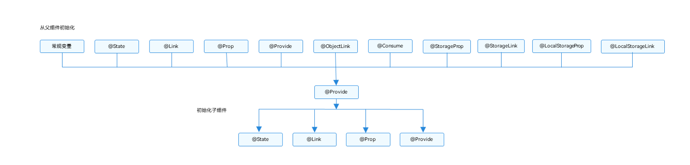

| @Consume传递/访问  | 说明   |
| ----------- | -------- |
| 从父组件初始化和更新 | 禁止。通过相同的变量名和alias（别名）从@Provide初始化。 |
| 用于初始化子组件     | 允许，可用于初始化@State、@Link、@Prop、@Provide。 |
| 和祖先组件同步      | 和@Provide双向同步。|
| 是否支持组件外访问   | 私有，仅可以在所属组件内访问|

**图2** @Consume初始化规则图示

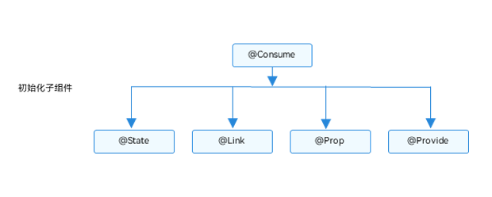

##### 观察变化和行为表现

###### 观察变化

- 当装饰的数据类型为boolean、string、number类型时，可以观察到数值的变化。
- 当装饰的数据类型为class或者Object的时候，可以观察到赋值和属性赋值的变化（属性为Object.keys(observedObject)返回的所有属性）。
- 当装饰的对象是array的时候，可以观察到数组的添加、删除、更新数组单元。

###### 框架行为

1. 初始渲染：
   1. @Provide装饰的变量会以map的形式，传递给当前@Provide所属组件的所有子组件；
   2. 子组件中如果使用@Consume变量，则会在map中查找是否有该变量名/alias（别名）对应的@Provide的变量，如果查找不到，框架会抛出JS ERROR;
   3. 在初始化@Consume变量时，和@State/@Link的流程类似，@Consume变量会保存在map中查找到的@Provide变量，并把自己注册给@Provide。
2. 当@Provide装饰的数据变化时：
   1. 通过初始渲染的步骤可知，子组件@Consume已把自己注册给父组件。父组件@Provide变量变更后，会遍历更新所有依赖它的系统组件（elementid）和状态变量（@Consume）；
   2. 通知@Consume更新后，子组件所有依赖@Consume的系统组件（elementId）都会被通知更新。以此实现@Provide对@Consume状态数据同步。
3. 当@Consume装饰的数据变化时：
   1. 通过初始渲染的步骤可知，子组件@Consume持有@Provide的实例。在@Consume更新后调用@Provide的更新方法，将更新的数值同步回@Provide，以此实现@Consume向@Provide的同步更新。

##### 使用场景

在下面的示例是与后代组件双向同步状态@Provide和@Consume场景。当分别点击CompA和CompD组件内Button时，reviewVotes 的更改会双向同步在CompA和CompD中。

```typescript
@Component
struct CompD {
  // @Consume装饰的变量通过相同的属性名绑定其祖先组件CompA内的@Provide装饰的变量
  @Consume reviewVotes: number;

  build() {
    Column() {
      Text(`reviewVotes(${this.reviewVotes})`)
      Button(`reviewVotes(${this.reviewVotes}), give +1`)
        .onClick(() => this.reviewVotes += 1)
    }
    .width('50%')
  }
}

@Component
struct CompC {
  build() {
    Row({ space: 5 }) {
      CompD()
      CompD()
    }
  }
}

@Component
struct CompB {
  build() {
    CompC()
  }
}

@Entry
@Component
struct CompA {
  // @Provide装饰的变量reviewVotes由入口组件CompA提供其后代组件
  @Provide reviewVotes: number = 0;

  build() {
    Column() {
      Button(`reviewVotes(${this.reviewVotes}), give +1`)
        .onClick(() => this.reviewVotes += 1)
      CompB()
    }
  }
}
```


#### @Observed装饰器和@ObjectLink装饰器：嵌套类对象属性变化

上文所述的装饰器仅能观察到第一层的变化，但是在实际应用开发中，应用会根据开发需要，封装自己的数据模型。对于多层嵌套的情况，比如二维数组，或者数组项class，或者class的属性是class，他们的第二层的属性变化是无法观察到的。这就引出了@Observed/@ObjectLink装饰器。

> 从API version 9开始，这两个装饰器支持在ArkTS卡片中使用。

##### 概述

@ObjectLink和@Observed类装饰器用于在涉及嵌套对象或数组的场景中进行双向数据同步：

- 被@Observed装饰的类，可以被观察到属性的变化；
- 子组件中@ObjectLink装饰器装饰的状态变量用于接收@Observed装饰的类的实例，和父组件中对应的状态变量建立双向数据绑定。这个实例可以是数组中的被@Observed装饰的项，或者是class object中的属性，这个属性同样也需要被@Observed装饰。
- 单独使用@Observed是没有任何作用的，需要搭配@ObjectLink或者@Prop使用。

##### 限制条件

- 使用@Observed装饰class会改变class原始的原型链，@Observed和其他类装饰器装饰同一个class可能会带来问题。
- @ObjectLink装饰器不能在@Entry装饰的自定义组件中使用。

##### 装饰器说明

| @Observed类装饰器 | 说明 |
| ---------- | ---------- |
| 装饰器参数 | 无  |
| 类装饰器   | 装饰class。需要放在class的定义前，使用new创建类对象。 |

| @ObjectLink变量装饰器 | 说明 |
| ----------- | ------------- |
| 装饰器参数 | 无 |
| 同步类型     | 不与父组件中的任何类型同步变量。    |
| 允许装饰的变量类型 | 必须为被@Observed装饰的class实例，必须指定类型。不支持简单类型，可以使用@Prop。@ObjectLink的属性是可以改变的，但是变量的分配是不允许的，也就是说这个装饰器装饰变量是只读的，不能被改变。 |
| 被装饰变量的初始值  | 不允许。 |

@ObjectLink装饰的数据为可读示例。

```typescript
// 允许@ObjectLink装饰的数据属性赋值
this.objLink.a= ...
// 不允许@ObjectLink装饰的数据自身赋值
this.objLink= ...
```

说明

@ObjectLink装饰的变量不能被赋值，如果要使用赋值操作，请使用[@Prop](https://developer.huawei.com/consumer/cn/doc/harmonyos-guides-V2/arkts-prop-0000001473537702-V2)。

- @Prop装饰的变量和数据源的关系是是单向同步，@Prop装饰的变量在本地拷贝了数据源，所以它允许本地更改，如果父组件中的数据源有更新，@Prop装饰的变量本地的修改将被覆盖；
- @ObjectLink装饰的变量和数据源的关系是双向同步，@ObjectLink装饰的变量相当于指向数据源的指针。如果一旦发生@ObjectLink装饰的变量的赋值，则同步链将被打断。

##### 变量的传递/访问规则说明

| @ObjectLink传递/访问 | 说明                                                         |
| -------------------- | ------------------------------------------------------------ |
| 从父组件初始化       | 必须指定。初始化@ObjectLink装饰的变量必须同时满足以下场景：类型必须是@Observed装饰的class。初始化的数值需要是数组项，或者class的属性。同步源的class或者数组必须是@State，@Link，@Provide，@Consume或者@ObjectLink装饰的数据。同步源是数组项的示例请参考[对象数组](https://developer.huawei.com/consumer/cn/doc/harmonyos-guides-V2/arkts-observed-and-objectlink-0000001473697338-V2#section99561777591)。初始化的class的示例请参考[嵌套对象](https://developer.huawei.com/consumer/cn/doc/harmonyos-guides-V2/arkts-observed-and-objectlink-0000001473697338-V2#section614118685518)。 |
| 与源对象同步         | 双向。                                                       |
| 可以初始化子组件     | 允许，可用于初始化常规变量、@State、@Link、@Prop、@Provide   |

**图1** 初始化规则图示

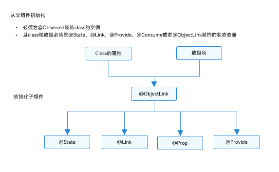

##### 观察变化和行为表现

###### 观察的变化

@Observed装饰的类，如果其属性为非简单类型，比如class、Object或者数组，也需要被@Observed装饰，否则将观察不到其属性的变化。

```typescript
class ClassA {
  public c: number;

  constructor(c: number) {
    this.c = c;
  }
}

@Observed
class ClassB {
  public a: ClassA;
  public b: number;

  constructor(a: ClassA, b: number) {
    this.a = a;
    this.b = b;
  }
}
```

以上示例中，ClassB被@Observed装饰，其成员变量的赋值的变化是可以被观察到的，但对于ClassA，没有被@Observed装饰，其属性的修改不能被观察到。

```typescript
@ObjectLink b: ClassB

// 赋值变化可以被观察到
this.b.a = new ClassA(5)
this.b.b = 5

// ClassA没有被@Observed装饰，其属性的变化观察不到
this.b.a.c = 5
```

@ObjectLink：@ObjectLink只能接收被@Observed装饰class的实例，可以观察到：

- 其属性的数值的变化，其中属性是指Object.keys(observedObject)返回的所有属性，示例请参考[嵌套对象](https://developer.huawei.com/consumer/cn/doc/harmonyos-guides-V2/arkts-observed-and-objectlink-0000001473697338-V2#section614118685518)。

- 如果数据源是数组，则可以观察到数组item的替换，如果数据源是class，可观察到class的属性的变化，示例请参考[对象数组](https://developer.huawei.com/consumer/cn/doc/harmonyos-guides-V2/arkts-observed-and-objectlink-0000001473697338-V2#section99561777591)。

###### 框架行为

1. 初始渲染：
   1. @Observed装饰的class的实例会被不透明的代理对象包装，代理了class上的属性的setter和getter方法
   2. 子组件中@ObjectLink装饰的从父组件初始化，接收被@Observed装饰的class的实例，@ObjectLink的包装类会将自己注册给@Observed class。
2. 属性更新：当@Observed装饰的class属性改变时，会走到代理的setter和getter，然后遍历依赖它的@ObjectLink包装类，通知数据更新。

##### 使用场景

###### 嵌套对象

以下是嵌套类对象的数据结构。

```typescript
// objectLinkNestedObjects.ets
let NextID: number = 1;

@Observed
class ClassA {
  public id: number;
  public c: number;

  constructor(c: number) {
    this.id = NextID++;
    this.c = c;
  }
}

@Observed
class ClassB {
  public a: ClassA;

  constructor(a: ClassA) {
    this.a = a;
  }
}
```

以下组件层次结构呈现的是嵌套类对象的数据结构。

```typescript
@Component
struct ViewA {
  label: string = 'ViewA1';
  @ObjectLink a: ClassA;

  build() {
    Row() {
      Button(`ViewA [${this.label}] this.a.c=${this.a.c} +1`)
        .onClick(() => {
          this.a.c += 1;
        })
    }
  }
}

@Entry
@Component
struct ViewB {
  @State b: ClassB = new ClassB(new ClassA(0));

  build() {
    Column() {
      // in low version,DevEco may throw a warning,but it does not matter.
      // you can still compile and run.
      ViewA({ label: 'ViewA #1', a: this.b.a })
      ViewA({ label: 'ViewA #2', a: this.b.a })

      Button(`ViewB: this.b.a.c+= 1`)
        .onClick(() => {
          this.b.a.c += 1;
        })
      Button(`ViewB: this.b.a = new ClassA(0)`)
        .onClick(() => {
          this.b.a = new ClassA(0);
        })
      Button(`ViewB: this.b = new ClassB(ClassA(0))`)
        .onClick(() => {
          this.b = new ClassB(new ClassA(0));
        })
    }
  }
}
```

ViewB中的事件句柄：

- this.b.a = new ClassA(0) 和this.b = new ClassB(new ClassA(0))： 对@State装饰的变量b和其属性的修改。
- this.b.a.c = ... ：该变化属于第二层的变化，[@State](https://developer.huawei.com/consumer/cn/doc/harmonyos-guides-V2/arkts-state-0000001474017162-V2#section135631413173517)无法观察到第二层的变化，但是ClassA被@Observed装饰，ClassA的属性c的变化可以被@ObjectLink观察到。

ViewA中的事件句柄：

- this.a.c += 1：对@ObjectLink变量a的修改，将触发Button组件的刷新。@ObjectLink和@Prop不同，@ObjectLink不拷贝来自父组件的数据源，而是在本地构建了指向其数据源的引用。
- @ObjectLink变量是只读的，this.a = new ClassA(...)是不允许的，因为一旦赋值操作发生，指向数据源的引用将被重置，同步将被打断。

###### 对象数组

对象数组是一种常用的数据结构。以下示例展示了数组对象的用法。

```typescript
let NextID: number = 1;

@Observed
class ClassA {
  public id: number;
  public c: number;

  constructor(c: number) {
    this.id = NextID++;
    this.c = c;
  }
}
@Component
struct ViewA {
  // 子组件ViewA的@ObjectLink的类型是ClassA
  @ObjectLink a: ClassA;
  label: string = 'ViewA1';

  build() {
    Row() {
      Button(`ViewA [${this.label}] this.a.c = ${this.a.c} +1`)
        .onClick(() => {
          this.a.c += 1;
        })
    }
  }
}

@Entry
@Component
struct ViewB {
  // ViewB中有@State装饰的ClassA[]
  @State arrA: ClassA[] = [new ClassA(0), new ClassA(0)];

  build() {
    Column() {
      ForEach(this.arrA,
        (item) => {
          ViewA({ label: `#${item.id}`, a: item })
        },
        (item) => item.id.toString()
      )
      // 使用@State装饰的数组的数组项初始化@ObjectLink，其中数组项是被@Observed装饰的ClassA的实例
      ViewA({ label: `ViewA this.arrA[first]`, a: this.arrA[0] })
      ViewA({ label: `ViewA this.arrA[last]`, a: this.arrA[this.arrA.length-1] })

      Button(`ViewB: reset array`)
        .onClick(() => {
          this.arrA = [new ClassA(0), new ClassA(0)];
        })
      Button(`ViewB: push`)
        .onClick(() => {
          this.arrA.push(new ClassA(0))
        })
      Button(`ViewB: shift`)
        .onClick(() => {
          this.arrA.shift()
        })
      Button(`ViewB: chg item property in middle`)
        .onClick(() => {
          this.arrA[Math.floor(this.arrA.length / 2)].c = 10;
        })
      Button(`ViewB: chg item property in middle`)
        .onClick(() => {
          this.arrA[Math.floor(this.arrA.length / 2)] = new ClassA(11);
        })
    }
  }
}
```

- this.arrA[Math.floor(this.arrA.length/2)] = new ClassA(..) ：该状态变量的改变触发2次更新：
  1. ForEach：数组项的赋值导致ForEach的[itemGenerator](https://developer.huawei.com/consumer/cn/doc/harmonyos-guides-V2/arkts-rendering-control-foreach-0000001524537153-V2#section611414423523)被修改，因此数组项被识别为有更改，ForEach的item builder将执行，创建新的ViewA组件实例。
  2. ViewA({ label: `ViewA this.arrA[last]`, a: this.arrA[this.arrA.length-1] })：上述更改改变了数组中第二个元素，所以绑定this.arrA[1]的ViewA将被更新；
- this.arrA.push(new ClassA(0)) ： 将触发2次不同效果的更新：
  1. ForEach：新添加的ClassA对象对于ForEach是未知的[itemGenerator](https://developer.huawei.com/consumer/cn/doc/harmonyos-guides-V2/arkts-rendering-control-foreach-0000001524537153-V2#section611414423523)，ForEach的item builder将执行，创建新的ViewA组件实例。
  2. ViewA({ label: `ViewA this.arrA[last]`, a: this.arrA[this.arrA.length-1] })：数组的最后一项有更改，因此引起第二个ViewA的实例的更改。对于ViewA({ label: `ViewA this.arrA[first]`, a: this.arrA[0] })，数组的更改并没有触发一个数组项更改的改变，所以第一个ViewA不会刷新。
- this.arrA[Math.floor(this.arrA.length/2)].c：[@State](https://developer.huawei.com/consumer/cn/doc/harmonyos-guides-V2/arkts-state-0000001474017162-V2#section135631413173517)无法观察到第二层的变化，但是ClassA被@Observed装饰，ClassA的属性的变化将被@ObjectLink观察到。

###### 二维数组

使用@Observed观察二维数组的变化。可以声明一个被@Observed装饰的继承Array的子类。

```typescript
@Observed
class StringArray extends Array<String> {
}
```

使用new StringArray()来构造StringArray的实例，new运算符使得@Observed生效，@Observed观察到StringArray的属性变化。

声明一个从Array扩展的类class StringArray extends Array<String> {}，并创建StringArray的实例。@Observed装饰的类需要使用new运算符来构建class实例。

```typescript
@Observed
class StringArray extends Array<String> {
}

@Component
struct ItemPage {
  @ObjectLink itemArr: StringArray;

  build() {
    Row() {
      Text('ItemPage')
        .width(100).height(100)

      ForEach(this.itemArr,
        item => {
          Text(item)
            .width(100).height(100)
        },
        item => item
      )
    }
  }
}

@Entry
@Component
struct IndexPage {
  @State arr: Array<StringArray> = [new StringArray(), new StringArray(), new StringArray()];

  build() {
    Column() {
      ItemPage({ itemArr: this.arr[0] })
      ItemPage({ itemArr: this.arr[1] })
      ItemPage({ itemArr: this.arr[2] })

      Divider()

      ForEach(this.arr,
        itemArr => {
          ItemPage({ itemArr: itemArr })
        },
        itemArr => itemArr[0]
      )

      Divider()

      Button('update')
        .onClick(() => {
          console.error('Update all items in arr');
          if (this.arr[0][0] !== undefined) {
            // 正常情况下需要有一个真实的ID来与ForEach一起使用，但此处没有
            // 因此需要确保推送的字符串是唯一的。
            this.arr[0].push(`${this.arr[0].slice(-1).pop()}${this.arr[0].slice(-1).pop()}`);
            this.arr[1].push(`${this.arr[1].slice(-1).pop()}${this.arr[1].slice(-1).pop()}`);
            this.arr[2].push(`${this.arr[2].slice(-1).pop()}${this.arr[2].slice(-1).pop()}`);
          } else {
            this.arr[0].push('Hello');
            this.arr[1].push('World');
            this.arr[2].push('!');
          }
        })
    }
  }
}
```


## 渲染控制（未完成）


