[TOC]

# ArkTS基础知识

> 用到的代码在ArkTsBase项目中

## ArkTS简介

ArkTs是HarmonyOS的一种应用开发语言。它在TypeScript语言的基础上，拓展了声明式UI、状态管理、并发任务等能力。让开发者以更简洁自然的方式开发高性能应用。

ArkTS在TS的基础上主要扩展了如下能力：

- [基本语法](https://developer.huawei.com/consumer/cn/doc/harmonyos-guides-V2/arkts-basic-syntax-overview-0000001531611153-V2)：ArkTS定义了声明式UI描述、自定义组件和动态扩展UI元素的能力，再配合ArkUI开发框架中的系统组件及其相关的事件方法、属性方法等共同构成了UI开发的主体。
- [状态管理](https://developer.huawei.com/consumer/cn/doc/harmonyos-guides-V2/arkts-state-management-overview-0000001524537145-V2)：ArkTS提供了多维度的状态管理机制。在UI开发框架中，与UI相关联的数据可以在组件内使用，也可以在不同组件层级间传递，比如父子组件之间、爷孙组件之间，还可以在应用全局范围内传递或跨设备传递。另外，从数据的传递形式来看，可分为只读的单向传递和可变更的双向传递。开发者可以灵活地利用这些能力来实现数据和UI的联动。
- [渲染控制](https://developer.huawei.com/consumer/cn/doc/harmonyos-guides-V2/arkts-rendering-control-overview-0000001543911149-V2)：ArkTS提供了渲染控制的能力。条件渲染可根据应用的不同状态，渲染对应状态下的UI内容。循环渲染可从数据源中迭代获取数据，并在每次迭代过程中创建相应的组件。数据懒加载从数据源中按需迭代数据，并在每次迭代过程中创建相应的组件。

## 基本语法

### 基本语法概述

点击按钮时，文本内容从`Hello World`变为`Hello ArkUI`


- 装饰器： 用于装饰类、结构、方法以及变量，并赋予其特殊的含义。如上述示例中`@Entry、@Component和@State`都是装饰器，[@Component](https://developer.huawei.com/consumer/cn/doc/harmonyos-guides-V2/arkts-create-custom-components-0000001473537046-V2#section1430055924816)表示自定义组件，[@Entry](https://developer.huawei.com/consumer/cn/doc/harmonyos-guides-V2/arkts-create-custom-components-0000001473537046-V2#section1430055924816)表示该自定义组件为入口组件，[@State](https://developer.huawei.com/consumer/cn/doc/harmonyos-guides-V2/arkts-state-0000001474017162-V2)表示组件中的状态变量，状态变量变化会触发UI刷新。
- [UI描述](https://developer.huawei.com/consumer/cn/doc/harmonyos-guides-V2/arkts-declarative-ui-description-0000001524416537-V2)：以声明式的方式来描述UI的结构，例如build()方法中的代码块。
- [自定义组件](https://developer.huawei.com/consumer/cn/doc/harmonyos-guides-V2/arkts-create-custom-components-0000001473537046-V2)：可复用的UI单元，可组合其他组件，如上述被`@Component`装饰的`struct Hello`。
- 系统组件：ArkUI框架中默认内置的基础和容器组件，可直接被开发者调用，比如示例中的`Column、Text、Divider、Button`。
- 属性方法：组件可以通过链式调用配置多项属性，如`fontSize()、width()、height()、backgroundColor()`等。
- 事件方法：组件可以通过链式调用设置多个事件的响应逻辑，如跟随在`Button`后面的`onClick()`。
- 系统组件、属性方法、事件方法具体使用可参考[基于ArkTS的声明式开发范式](https://developer.huawei.com/consumer/cn/doc/harmonyos-references-V2/ts-components-summary-0000001478181369-V2)。

除此之外，ArkTS扩展了多种语法范式来使开发更加便捷：

- [@Builder](https://developer.huawei.com/consumer/cn/doc/harmonyos-guides-V2/arkts-builder-0000001524176981-V2)/[@BuilderParam](https://developer.huawei.com/consumer/cn/doc/harmonyos-guides-V2/arkts-builderparam-0000001524416541-V2)：特殊的封装UI描述的方法，细粒度的封装和复用UI描述。
- [@Extend](https://developer.huawei.com/consumer/cn/doc/harmonyos-guides-V2/arkts-extend-0000001473696678-V2)/[@Styles](https://developer.huawei.com/consumer/cn/doc/harmonyos-guides-V2/arkts-style-0000001473856690-V2)：扩展内置组件和封装属性样式，更灵活地组合内置组件。
- [stateStyles](https://developer.huawei.com/consumer/cn/doc/harmonyos-guides-V2/arkts-statestyles-0000001482592098-V2)：多态样式，可以依据组件的内部状态的不同，设置不同样式。

### 声明式UI描述


#### 创建组件

根据组件构造方法的不同，创建组件包含有参数和无参数两种方式。

> 创建组件时不需要new运算符。

##### 无参数

如果组件的接口定义没有包含必选构造参数，则组件后面的“()”不需要配置任何内容。例如，Divider组件不包含构造参数：

```typescript
Column() {
  Text('item 1')
  Divider()
  Text('item 2')
}
```

##### 有参数

如果组件的接口定义包含构造参数，则在组件后面的“()”配置相应参数。

- Image组件的必选参数src。

  ```typescript
  Image('https://xyz/test.jpg')
  ```

- Text组件的非必选参数content。

  ```typescript
  // string类型的参数
  Text('test')
  // $r形式引入应用资源，可应用于多语言场景
  Text($r('app.string.title_value'))
  // 无参数形式
  Text()
  ```

- 变量或表达式也可以用于参数赋值，其中表达式返回的结果类型必须满足参数类型要求。

  例如，设置变量或表达式来构造Image和Text组件的参数。

  ```typescript
  Image(this.imagePath)
  Image('https://' + this.imageUrl)
  Text(`count: ${this.count}`)
  ```

#### 配置属性

属性方法以“.”链式调用的方式配置系统组件的样式和其他属性，建议每个属性方法单独写一行。

- 配置Text组件的字体大小。

  ```typescript
  Text('test')
    .fontSize(12)
  ```

- 配置组件的多个属性。

  ```typescript
  Image('test.jpg')
    .alt('error.jpg')
    .width(100)
    .height(100)
  ```

- 除了直接传递常量参数外，还可以传递变量或表达式。

  ```typescript
  Text('hello')
    .fontSize(this.size)
  Image('test.jpg')
    .width(this.count % 2 === 0 ? 100 : 200)
    .height(this.offset + 100)
  ```

- 对于系统组件，ArkUI还为其属性预定义了一些枚举类型供开发者调用，枚举类型可以作为参数传递，但必须满足参数类型要求。

  例如，可以按以下方式配置Text组件的颜色和字体样式。

  ```typescript
  Text('hello')
    .fontSize(20)
    .fontColor(Color.Red)
    .fontWeight(FontWeight.Bold)
  ```

#### 配置事件

事件方法以“.”链式调用的方式配置系统组件支持的事件，建议每个事件方法单独写一行。

- 使用箭头函数配置组件的事件方法。

  ```typescript
  Button('Click me')
    .onClick(() => {
    	this.myText = 'ArkUI';
  	})
  ```

- 使用匿名函数表达式配置组件的事件方法，要求使用bind，以确保函数体中的this指向当前组件。

  ```typescript
  Button('add counter')
    .onClick(function(){
   		 this.counter += 2;
  	}.bind(this))
  ```

- 使用组件的成员函数配置组件的事件方法。

  ```typescript
  myClickHandler(): void {
    this.counter += 2;
  }
  ...
  Button('add counter')
    .onClick(this.myClickHandler.bind(this))
  ```

- 使用声明的箭头函数，可以直接调用，不需要bind this。

  ```typescript
  fn = () => {
    console.info(`counter: ${this.counter}`)
    this.counter++
  }
  ...
  Button('add counter')
    .onClick(this.fn)
  ```

#### 配置子组件

如果组件支持子组件配置，则需在尾随闭包"{...}"中为组件添加子组件的UI描述。Column、Row、Stack、Grid、List等组件都是容器组件。

- 以下是简单的Column组件配置子组件的示例。

  ```typescript
  Column() {
    Text('Hello')
      .fontSize(100)
    Divider()
    Text(this.myText)
      .fontSize(100)
      .fontColor(Color.Red)
  }
  ```

- 容器组件均支持子组件配置，可以实现相对复杂的多级嵌套。

  ```typescript
  Column() {
    Row() {
      Image('test1.jpg')
        .width(100)
        .height(100)
      Button('click +1')
        .onClick(() => {
        	console.info('+1 clicked!');
      	})
    }
  }
  ```

### 自定义组件

#### 创建自定义组件

在ArkUI中，UI显示的内容均为组件，由框架直接提供的称为系统组件，由开发者定义的称为自定义组件。在进行 UI 界面开发时，通常不是简单的将系统组件进行组合使用，而是需要考虑代码可复用性、业务逻辑与UI分离，后续版本演进等因素。因此，将UI和部分业务逻辑封装成自定义组件是不可或缺的能力。

自定义组件具有以下特点：

- 可组合：允许开发者组合使用系统组件、及其属性和方法。
- 可重用：自定义组件可以被其他组件重用，并作为不同的实例在不同的父组件或容器中使用。
- 数据驱动UI更新：通过状态变量的改变，来驱动UI的刷新。

##### 自定义组件的基本用法

以下示例展示了自定义组件的基本用法。

```typescript
@Component
export struct HelloComponent {
  @State message: string = 'Hello, World!';
  
  build() {
    // HelloComponent自定义组件组合系统组件Row和Text
    Row() {
      Text(this.message)
        .onClick(() => {
        		// 状态变量message的改变驱动UI刷新，UI从'Hello, World!'刷新为'Hello, ArkUI!'    
        		this.message = 'Hello, ArkUI!';
      	})
    }
  }
}
```

> 如果在另外的文件中引用该自定义组件，需要使用export关键字导出，并在使用的页面import该自定义组件。

HelloComponent可以在其他自定义组件中的build()函数中多次创建，实现自定义组件的重用。

```typescript
@Entry
@Component
struct ParentHelloComponent {
  build() {
    Column() {
      Text('ArkUI message')
      Divider()
      HelloComponent({ message: 'Hello, World!' });
      Divider()
      HelloComponent({ message: '你好!' });
    }
  }
}
```

要完全理解上面的示例，需要了解自定义组件的以下概念定义：

- [自定义组件的基本结构](https://developer.huawei.com/consumer/cn/doc/harmonyos-guides-V2/arkts-create-custom-components-0000001473537046-V2#section1430055924816)
- [成员函数/变量](https://developer.huawei.com/consumer/cn/doc/harmonyos-guides-V2/arkts-create-custom-components-0000001473537046-V2#section371262217494)
- [自定义组件的参数规定](https://developer.huawei.com/consumer/cn/doc/harmonyos-guides-V2/arkts-create-custom-components-0000001473537046-V2#section4421142421915)
- [build()函数](https://developer.huawei.com/consumer/cn/doc/harmonyos-guides-V2/arkts-create-custom-components-0000001473537046-V2#section1150911733811)
- [自定义组件通用样式](https://developer.huawei.com/consumer/cn/doc/harmonyos-guides-V2/arkts-create-custom-components-0000001473537046-V2#section1051122203016)

##### 自定义组件的基础结构

- struct：自定义组件基于struct实现，`struct + 自定义组件名 + {...}`的组合构成自定义组件，不能有继承关系。对于struct的实例化，可以省略new。

  > 自定义组件名、类名、函数名不能和系统组件名相同。

- `@Component`：`@Component`装饰器仅能装饰`struct`关键字声明的数据结构。`struct`被@Component装饰后具备组件化的能力，需要实现`build`方法描述UI，一个`struct`只能被一个`@Component`装饰。

  > 从API version 9开始，该装饰器支持在ArkTS卡片中使用。

  ```typescript
  @Component
  struct MyComponent {}
  ```
  
- `build()`函数：`build()`函数用于定义自定义组件的声明式UI描述，自定义组件必须定义`build()`函数。

  ```typescript
  @Component
  struct MyComponent {
  	build() {
    }
  }
  ```

- `@Entry`：`@Entry`装饰的自定义组件将作为UI页面的入口。在单个UI页面中，最多可以使用`@Entry`装饰一个自定义组件。`@Entry`可以接受一个可选的[LocalStorage](https://developer.huawei.com/consumer/cn/doc/harmonyos-guides-V2/arkts-localstorage-0000001524537149-V2)的参数。

  > 从API version 9开始，该装饰器支持在ArkTS卡片中使用。

  ```typescript
  @Entry
  @Component
  struct MyComponent {
  }
	```

##### 成员函数/变量

自定义组件除了必须要实现`build()`函数外，还可以实现其他成员函数，成员函数具有以下约束：

- 不支持静态函数。
- 成员函数的访问是私有的。

自定义组件可以包含成员变量，成员变量具有以下约束：

- 不支持静态成员变量。
- 所有成员变量都是私有的，变量的访问规则与成员函数的访问规则相同。
- 自定义组件的成员变量本地初始化有些是可选的，有些是必选的。具体是否需要本地初始化，是否需要从父组件通过参数传递初始化子组件的成员变量，请参考[状态管理](https://developer.huawei.com/consumer/cn/doc/harmonyos-guides-V2/arkts-state-management-overview-0000001524537145-V2)。

##### 自定义组件的参数规定

从上文的示例中，我们已经了解到，可以在`build`方法或者[@Builder](https://developer.huawei.com/consumer/cn/doc/harmonyos-guides-V2/arkts-builder-0000001524176981-V2)装饰的函数里创建自定义组件，在创建自定义组件的过程中，根据装饰器的规则来初始化自定义组件的参数。

```typescript
@Component
struct MyComponent {
  private countDownFrom: number = 0;
  private color: Color = Color.Blue;
  build() {
  }
}

@Entry
@Component
struct ParentComponent {
  private someColor: Color = Color.Pink;
  
  build() {
    Column() {
      // 创建MyComponent实例，并将创建MyComponent成员变量countDownFrom初始化为10，将成员变量color初始化为this.someColor
      MyComponent({ countDownFrom: 10, color: this.someColor })
    }
  }
}
```

##### build()函数

所有声明在`build()`函数的语言，我们统称为UI描述，UI描述需要遵循以下规则：

- `@Entry`装饰的自定义组件，其`build()`函数下的根节点唯一且必要，且必须为容器组件，其中`ForEach`禁止作为根节点。

  `@Component`装饰的自定义组件，其`build()`函数下的根节点唯一且必要，可以为非容器组件，其中`ForEach`禁止作为根节点。

  ```typescript
  @Entry
  @Component
  struct MyComponent {
    build() { 
      // 根节点唯一且必要，必须为容器组件
      Row() {
        ChildComponent()
      }
    }
  }
  
  @Component
  struct ChildComponent {
    build() {
      // 根节点唯一且必要，可为非容器组件
      Image('test.jpg')
    }
  }
  ```

- 不允许声明本地变量，反例如下。

  ```typescript
  build() {  
    // 反例：不允许声明本地变量
    let a: number = 1;
  }
  ```

- 不允许在UI描述里直接使用console.info，但允许在方法或者函数里使用，反例如下。

  ```typescript
  build() {
    // 反例：不允许console.info
    console.info('print debug log');
  }
  ```

- 不允许创建本地的作用域，反例如下。

  ```typescript
  build() {
    // 反例：不允许本地作用域
    {
      ...
    }
  }
  ```

- 不允许调用没有用@Builder装饰的方法，允许系统组件的参数是TS方法的返回值。

  ```typescript
  @Component
  struct ParentComponent {
    doSomeCalculations() {
    }
    
    calcTextValue(): string {
      return 'Hello World';
    }
    
    @Builder doSomeRender() { 
      Text(`Hello World`)
    }
    
    build() {
      Column() { 
        // 反例：不能调用没有用@Builder装饰的方法  
        this.doSomeCalculations();
        // 正例：可以调用
        this.doSomeRender();
        // 正例：参数可以为调用TS方法的返回值 
        Text(this.calcTextValue())
      }
    }
  }
  ```

- 不允许switch语法，如果需要使用条件判断，请使用if。反例如下。

  ```typescript
  build() {
    Column() { 
      // 反例：不允许使用switch语法
      switch (expression) {
        case 1:
          Text('...')
          break;
        case 2:
          Image('...')
          break;
        default:
          Text('...')
          break;
      }
    }
  }
  ```

- 不允许使用表达式，反例如下。

  ```typescript
  build() {
    Column() {
      // 反例：不允许使用表达式
      (this.aVar > 10) ? Text('...') : Image('...') 
    }
  }
  ```

##### 自定义组件通用样式

自定义组件通过“.”链式调用的形式设置通用样式。

```typescript
@Component
struct MyComponent2 {
  build() {
    Button(`Hello World`)
  }
}

@Entry
@Component
struct MyComponent {
  build() {
    Row() {
      MyComponent2()
        .width(200)
        .height(300)
        .backgroundColor(Color.Red)
    }
  }
}
```

> ArkUI给自定义组件设置样式时，相当于给MyComponent2套了一个不可见的容器组件，而这些样式是设置在容器组件上的，而非直接设置给MyComponent2的Button组件。通过渲染结果我们可以很清楚的看到，背景颜色红色并没有直接生效在Button上，而是生效在Button所处的开发者不可见的容器组件上。

### 页面和自定义组件生命周期

我们先明确自定义组件和页面的关系：

- 自定义组件：`@Component`装饰的UI单元，可以组合多个系统组件实现UI的复用，可以调用组件的生命周期。
- 页面：即应用的UI页面。可以由一个或者多个自定义组件组成，[@Entry](https://developer.huawei.com/consumer/cn/doc/harmonyos-guides-V2/arkts-create-custom-components-0000001473537046-V2#section1430055924816)装饰的自定义组件为页面的入口组件，即页面的根节点，**一个页面有且仅能有一个@Entry**。只有被`@Entry`装饰的组件才可以调用页面的生命周期。

页面生命周期，即被@Entry装饰的组件生命周期，提供以下生命周期接口：

- [onPageShow](https://developer.huawei.com/consumer/cn/doc/harmonyos-references-V2/arkts-custom-component-lifecycle-0000001482395076-V2#ZH-CN_TOPIC_0000001523488850__onpageshow)：页面每次显示时触发一次，包括路由过程、应用进入前台等场景。
- [onPageHide](https://developer.huawei.com/consumer/cn/doc/harmonyos-references-V2/arkts-custom-component-lifecycle-0000001482395076-V2#ZH-CN_TOPIC_0000001523488850__onpagehide)：页面每次隐藏时触发一次，包括路由过程、应用进入后台等场景。
- [onBackPress](https://developer.huawei.com/consumer/cn/doc/harmonyos-references-V2/arkts-custom-component-lifecycle-0000001482395076-V2#ZH-CN_TOPIC_0000001523488850__onbackpress)：当用户点击返回按钮时触发。

组件生命周期，即一般用`@Component`装饰的自定义组件的生命周期，提供以下生命周期接口：

- [aboutToAppear](https://developer.huawei.com/consumer/cn/doc/harmonyos-references-V2/arkts-custom-component-lifecycle-0000001482395076-V2#ZH-CN_TOPIC_0000001523488850__abouttoappear)：组件即将出现时回调该接口，具体时机为在创建自定义组件的新实例后，在**执行其build()函数之前执行**。
- [aboutToDisappear](https://developer.huawei.com/consumer/cn/doc/harmonyos-references-V2/arkts-custom-component-lifecycle-0000001482395076-V2#ZH-CN_TOPIC_0000001523488850__abouttodisappear)：在自定义组件析构销毁之前执行。**不允许在aboutToDisappear函数中改变状态变量，特别是@Link变量的修改可能会导致应用程序行为不稳定**。

生命周期流程如下图所示，下图展示的是被`@Entry`装饰的组件（页面）生命周期。


根据上面的流程图，我们从自定义组件的初始创建、重新渲染和删除来详细解释。

#### 自定义组件的创建和渲染流程

1. 自定义组件的创建：自定义组件的实例由ArkUI框架创建。

2. 初始化自定义组件的成员变量：通过本地默认值或者构造方法传递参数来初始化自定义组件的成员变量，初始化顺序为成员变量的定义顺序。

3. 如果开发者定义了`aboutToAppear`，则执行`aboutToAppear`方法。

4. 在首次渲染的时候，执行`build`方法渲染系统组件，如果子组件为自定义组件，则创建自定义组件的实例。在执行`build()`函数的过程中，框架会观察每个状态变量的读取状态，将保存两个`map`：

   1. 状态变量 -> UI组件（包括`ForEach`和`if`）。
   2. UI组件 -> 此组件的更新函数，即一个`lambda`方法，作为`build()`函数的子集，创建对应的UI组件并执行其属性方法，示例如下。

   ```typescript
   build() {
     ...
     this.observeComponentCreation(() => {
       Button.create();
     })
     
     this.observeComponentCreation(() => {
       Text.create();
     })
     ...
   }
   ```

当应用在后台启动时，此时应用进程并没有销毁，所以仅需要执行`onPageShow`。

#### 自定义组件重新渲染

当事件句柄被触发（比如设置了点击事件，即触发点击事件）改变了状态变量时，或者`LocalStorage / AppStorage`中的属性更改，并导致绑定的状态变量更改其值时：

1. 框架观察到了变化，将启动重新渲染。
2. 根据框架持有的两个map（自定义组件的创建和渲染流程中第4步），框架可以知道该状态变量管理了哪些UI组件，以及这些UI组件对应的更新函数。执行这些UI组件的更新函数，实现最小化更新。

#### 自定义组件的删除

如果`if`组件的分支改变，或者`ForEach`循环渲染中数组的个数改变，组件将被删除：

1. 在删除组件之前，将调用其aboutToDisappear生命周期函数，标记着该节点将要被销毁。ArkUI的节点删除机制是：后端节点直接从组件树上摘下，后端节点被销毁，对前端节点解引用，前端节点已经没有引用时，将被JS虚拟机垃圾回收。
2. 自定义组件和它的变量将被删除，如果其有同步的变量，比如[@Link](https://developer.huawei.com/consumer/cn/doc/harmonyos-guides-V2/arkts-link-0000001524297305-V2)、[@Prop](https://developer.huawei.com/consumer/cn/doc/harmonyos-guides-V2/arkts-page-custom-components-lifecycle-0000001524296665-V2)、[@StorageLink](https://developer.huawei.com/consumer/cn/doc/harmonyos-guides-V2/arkts-appstorage-0000001524417209-V2#section84115526424)，将从[同步源](https://developer.huawei.com/consumer/cn/doc/harmonyos-guides-V2/arkts-state-management-overview-0000001524537145-V2#section127619262713)上取消注册。

**不建议在生命周期aboutToDisappear内使用async await**，如果在生命周期的aboutToDisappear使用异步操作（Promise或者回调方法），自定义组件将被保留在Promise的闭包中，直到回调方法被执行完，这个行为阻止了自定义组件的垃圾回收。

以下示例展示了生命周期的调用时机：

```typescript
// Index.ets
import router from '@ohos.router';

@Entry
@Component
struct MyComponent {
  @State showChild: boolean = true;
  
  // 只有被@Entry装饰的组件才可以调用页面的生命周期
  onPageShow() {
    console.info('Index onPageShow');
  }
  // 只有被@Entry装饰的组件才可以调用页面的生命周期
  onPageHide() {
    console.info('Index onPageHide');
  }
  // 只有被@Entry装饰的组件才可以调用页面的生命周期
  onBackPress() {
    console.info('Index onBackPress');
  }
  
  // 组件生命周期
  aboutToAppear() {
    console.info('MyComponent aboutToAppear');
  }
  // 组件生命周期
  aboutToDisappear() {
    console.info('MyComponent aboutToDisappear');
  }
  
  build() {
    Column() {
      // this.showChild为true，创建Child子组件，执行Child aboutToAppear
      if (this.showChild) {
        Child()
      } 
      // this.showChild为false，删除Child子组件，执行Child aboutToDisappear
      Button('delete Child').onClick(() => {
        this.showChild = false;
      })
      // push到Page2页面，执行onPageHide
      Button('push to next page')
        .onClick(() => {
       		 router.pushUrl({ url: 'pages/Page2' });
      	})
    }
  }
}

@Component
struct Child {
  @State title: string = 'Hello World';
  
  // 组件生命周期
  aboutToDisappear() {
    console.info('[lifeCycle] Child aboutToDisappear')
  }
  // 组件生命周期
  aboutToAppear() {
    console.info('[lifeCycle] Child aboutToAppear')
  }
  
  build() {
    Text(this.title).fontSize(50).onClick(() => {
      this.title = 'Hello ArkUI';
    })
  }
}
```

以上示例中，`Index`页面包含两个自定义组件，一个是被`@Entry`装饰的`MyComponent`，也是页面的入口组件，即页面的根节点；一个是`Child`，是`MyComponent`的子组件。只有`@Entry`装饰的节点才可以使页面级别的生命周期方法生效，所以`MyComponent`中声明了当前`Index`页面的页面生命周期函数。`MyComponent`和其子组件`Child`也同时也声明了组件的生命周期函数。

- 应用冷启动的初始化流程为：MyComponent aboutToAppear --> MyComponent build --> Child aboutToAppear --> Child build --> Child build执行完毕 --> MyComponent build执行完毕 --> Index onPageShow。
- 点击“delete Child”，if绑定的this.showChild变成false，删除Child组件，会执行Child aboutToDisappear方法。

- 点击“push to next page”，调用router.pushUrl接口，跳转到另外一个页面，当前Index页面隐藏，执行页面生命周期Index onPageHide。此处调用的是router.pushUrl接口，Index页面被隐藏，并没有销毁，所以只调用onPageHide。跳转到新页面后，执行初始化新页面的生命周期的流程。
- 如果调用的是router.replaceUrl，则当前Index页面被销毁，执行的生命周期流程将变为：Index onPageHide --> MyComponent aboutToDisappear --> Child aboutToDisappear。上文已经提到，组件的销毁是从组件树上直接摘下子树，所以先调用父组件的aboutToDisappear，再调用子组件的aboutToDisappear，然后执行初始化新页面的生命周期流程。
- 点击返回按钮，触发页面生命周期Index onBackPress，且触发返回一个页面后会导致当前Index页面被销毁。
- 最小化应用或者应用进入后台，触发Index onPageHide。当前Index页面没有被销毁，所以并不会执行组件的aboutToDisappear。应用回到前台，执行Index onPageShow。

- 退出应用，执行Index onPageHide --> MyComponent aboutToDisappear --> Child aboutToDisappear。

### @Builder装饰器：自定义构建函数

ArkUI还提供了一种更轻量的UI元素复用机制@Builder，@Builder所装饰的函数遵循build()函数语法规则，开发者可以将重复使用的UI元素抽象成一个方法，在build方法里调用。

为了简化语言，我们将@Builder装饰的函数也称为“自定义构建函数”

> 从API version 9开始，该装饰器支持在ArkTS卡片中使用。

#### 装饰器使用说明

##### 自定义组件内自定义构建函数

定义的语法：

```typescript
@Builder MyBuilderFunction(){ ... }
```

使用方法：

```typescript
this.MyBuilderFunction()
```

- 允许在自定义组件内定义一个或多个@Builder方法，该方法被认为是该组件的私有、特殊类型的成员函数。
- 自定义构建函数可以在所属组件的build方法和其他自定义构建函数中调用，但不允许在组件外调用。
- 在自定义函数体中，`this`指代当前所属组件，组件的状态变量可以在自定义构建函数内访问。建议通过`this`访问自定义组件的状态变量而不是参数传递。

##### 全局自定义构建函数

定义的语法：

```typescript
@Builder function MyGlobalBuilderFunction(){ ... }
```

使用方法：

```typescript
MyGlobalBuilderFunction()
```

- 全局的自定义构建函数可以被整个应用获取，不允许使用`this`和`bind`方法。
- 如果不涉及组件状态变化，建议使用全局的自定义构建方法。

#### 参数传递规则

自定义构建函数的参数传递有[按值传递](https://developer.huawei.com/consumer/cn/doc/harmonyos-guides-V2/arkts-builder-0000001524176981-V2#section163841721135012)和[按引用传递](https://developer.huawei.com/consumer/cn/doc/harmonyos-guides-V2/arkts-builder-0000001524176981-V2#section1522464044212)两种，均需遵守以下规则：

- 参数的类型必须与参数声明的类型一致，不允许undefined、null和返回undefined、null的表达式。
- 在自定义构建函数内部，不允许改变参数值。如果需要改变参数值，且同步回调用点，建议使用[@Link](https://developer.huawei.com/consumer/cn/doc/harmonyos-guides-V2/arkts-link-0000001524297305-V2)。
- @Builder内UI语法遵循[UI语法规则](https://developer.huawei.com/consumer/cn/doc/harmonyos-guides-V2/arkts-create-custom-components-0000001473537046-V2#section1150911733811)。
- 只有传入一个参数，且参数需要直接传入对象字面量才会按引用传递该参数，其余传递方式均为按值传递。

##### 按引用传递参数

按引用传递参数时，传递的参数可为状态变量，且状态变量的改变会引起`@Builder`方法内的UI刷新。ArkUI提供`$$`作为按引用传递参数的范式。

```typescript
ABuilder( $$ : { paramA1: string, paramB1 : string } );
```

```typescript
@Builder function ABuilder($$: { paramA1: string }) {
  Row() {
    Text(`UseStateVarByReference: ${$$.paramA1} `)
  }
}

@Entry
@Component
struct Parent {
  @State label: string = 'Hello';
  build() {
    Column() {
      // 在Parent组件中调用ABuilder的时候，将this.label引用传递给ABuilder
      ABuilder({ paramA1: this.label })
      Button('Click me').onClick(() => {
        // 点击“Click me”后，UI从“Hello”刷新为“ArkUI”
        this.label = 'ArkUI';
      })
    }
  }
}
```

##### 按值传递参数

调用@Builder装饰的函数默认按值传递。当传递的参数为状态变量时，状态变量的改变不会引起@Builder方法内的UI刷新。所以当使用状态变量的时候，推荐使用[按引用传递](https://developer.huawei.com/consumer/cn/doc/harmonyos-guides-V2/arkts-builder-0000001524176981-V2#section1522464044212)。

```typescript
@Builder function ABuilder(paramA1: string) {
  Row() {
    Text(`UseStateVarByValue: ${paramA1} `)
  }
}
@Entry
@Component
struct Parent {
  @State label: string = 'Hello';
  build() {
    Column() {
      ABuilder(this.label)
    }
  }
}
```

### @BuilderParam装饰器：引用@Builder函数

当开发者创建了自定义组件，并想对该组件添加特定功能时，例如在自定义组件中添加一个点击跳转操作。若直接在组件内嵌入事件方法，将会导致所有引入该自定义组件的地方均增加了该功能。为解决此问题，ArkUI引入了`@BuilderParam`装饰器，`@BuilderParam`用来装饰指向`@Builder`方法的变量，开发者可在初始化自定义组件时对此属性进行赋值，为自定义组件增加特定的功能。该装饰器用于声明任意UI描述的一个元素，类似`slot`占位符。

#### 装饰器使用说明

##### 初始化@BuilderParam装饰的方法

`@BuilderParam`装饰的方法只能被自定义构建函数（`@Builder`装饰的方法）初始化。

- 使用所属自定义组件的自定义构建函数或者全局的自定义构建函数，在本地初始化`@BuilderParam`。

  ```typescript
  @Builder function GlobalBuilder0() {}
  
  @Component
  struct Child {
    @Builder doNothingBuilder() {};
    // 使用自定义组件的自定义构建函数初始化@BuilderParam
    @BuilderParam aBuilder0: () => void = this.doNothingBuilder;
    // 使用全局自定义构建函数初始化@BuilderParam
    @BuilderParam aBuilder1: () => void = GlobalBuilder0;
    build(){}
  }
  ```

- 用父组件自定义构建函数初始化子组件`@BuilderParam`装饰的方法。

  ```typescript
  @Component
  struct Child {
    // 使用父组件@Builder装饰的方法初始化子组件@BuilderParam
    @BuilderParam aBuilder0: () => void;
  
    build() {
      Column() {
        this.aBuilder0()
      }
    }
  }
  
  @Entry
  @Component
  struct Parent {
    @Builder componentBuilder() {
      Text(`Parent builder `)
    }
  
    build() {
      Column() {
        Child({ aBuilder0: this.componentBuilder })
      }
    }
  }
  ```

  

- 需注意this指向正确。

	 以下示例中，`Parent`组件在调用`this.componentBuilder()`时，`this`指向其所属组件，即`“Parent”`。`@Builder componentBuilder()`传给子组件`@BuilderParam aBuilder0`，在`Child`组件中调用`this.aBuilder0()`时，`this`指向在`Child`的`label`，即`“Child”`。

	> 开发者谨慎使用bind改变函数调用的上下文，可能会使this指向混乱。
	
	```typescript
	@Component
	struct Child {
	  label: string = `Child`
	  @BuilderParam aBuilder0: () => void;
	
	  build() {
	    Column() {
	      this.aBuilder0()
	    }
	  }
	}
	
	@Entry
	@Component
	struct Parent {
	  label: string = `Parent`
	
	  @Builder componentBuilder() {
	    Text(`${this.label}`)
	  }
	
	  build() {
	    Column() {
	      this.componentBuilder()
	      Child({ aBuilder0: this.componentBuilder })
	    }
	  }
	}
	```
	
	
	
#### 使用场景

##### 参数初始化组件

`@BuilderParam`装饰的方法可以是有参数和无参数的两种形式，需与指向的`@Builder`方法类型匹配。`@BuilderParam`装饰的方法类型需要和`@Builder`方法类型一致。

```typescript
@Builder function GlobalBuilder1($$ : {label: string }) {
  Text($$.label)
    .width(400)
    .height(50)
    .backgroundColor(Color.Green)
}

@Component
struct Child {
  label: string = 'Child'
  // 无参数类型，指向的componentBuilder也是无参数类型
  @BuilderParam aBuilder0: () => void;
  // 有参数类型，指向的GlobalBuilder1也是有参数类型的方法
  @BuilderParam aBuilder1: ($$ : { label : string}) => void;

  build() {
    Column() {
      this.aBuilder0()
      this.aBuilder1({label: 'global Builder label' } )
    }
  }
}

@Entry
@Component
struct Parent {
  label: string = 'Parent'

  @Builder componentBuilder() {
    Text(`${this.label}`)
  }

  build() {
    Column() {
      this.componentBuilder()
      Child({ aBuilder0: this.componentBuilder, aBuilder1: GlobalBuilder1 })
    }
  }
}
```


##### 尾随闭包初始化组件

在自定义组件中使用`@BuilderParam`装饰的属性时也可通过尾随闭包进行初始化。在初始化自定义组件时，组件后紧跟一个大括号“{}”形成尾随闭包场景。

> 此场景下自定义组件内有且仅有一个使用@BuilderParam装饰的属性。

开发者可以将尾随闭包内的内容看做`@Builder`装饰的函数传给`@BuilderParam`。示例如下：

```typescript
// xxx.ets
@Component
struct CustomContainer {
  @Prop header: string;
  // 使用父组件的尾随闭包{}(@Builder装饰的方法)初始化子组件@BuilderParam
  @BuilderParam closer: () => void

  build() {
    Column() {
      Text(this.header)
        .fontSize(30)
      this.closer()
    }
  }
}

@Builder function specificParam(label1: string, label2: string) {
  Column() {
    Text(label1)
      .fontSize(30)
    Text(label2)
      .fontSize(30)
  }
}

@Entry
@Component
struct CustomContainerUser {
  @State text: string = 'header';

  build() {
    Column() {
      // 创建CustomContainer，在创建CustomContainer时，通过其后紧跟一个大括号“{}”形成尾随闭包
      // 作为传递给子组件CustomContainer @BuilderParam closer: () => void的参数
      CustomContainer({ header: this.text }) {
        Column() {
          specificParam('testA', 'testB')
        }.backgroundColor(Color.Yellow)
        .onClick(() => {
          this.text = 'changeHeader';
        })
      }
    }
  }
}
```


### @Styles装饰器：定义组件重用样式

如果每个组件的样式都需要单独设置，在开发过程中会出现大量代码在进行重复样式设置，虽然可以复制粘贴，但为了代码简洁性和后续方便维护，我们推出了可以提炼公共样式进行复用的装饰器`@Styles`。

`@Styles`装饰器可以将多条样式设置提炼成一个方法，直接在组件声明的位置调用。通过`@Styles`装饰器可以快速定义并复用自定义样式。用于快速定义并复用自定义样式。

> 从API version 9开始，该装饰器支持在ArkTS卡片中使用。

#### 装饰器使用说明

- 当前@Styles仅支持[通用属性](https://developer.huawei.com/consumer/cn/doc/harmonyos-references-V2/ts-universal-attributes-size-0000001428061700-V2)和[通用事件](https://developer.huawei.com/consumer/cn/doc/harmonyos-references-V2/ts-universal-events-click-0000001477981153-V2)。

- @Styles方法不支持参数，反例如下。

  ```typescript
  // 反例： @Styles不支持参数
  @Styles function globalFancy (value: number) {
    .width(value)
  }
  ```

- @Styles可以定义在组件内或全局，在全局定义时需在方法名前面添加`function`关键字，组件内定义时则不需要添加`function`关键字。

  ```typescript
  // 全局
  @Styles function functionName() { ... }
  
  // 在组件内
  @Component
  struct FancyUse {
    @Styles fancy() {
      .height(100)
    }
  }
  ```

- 定义在组件内的`@Styles`可以通过`this`访问组件的常量和状态变量，并可以在`@Styles`里通过事件来改变状态变量的值，示例如下：

  ```typescript
  @Component
  struct FancyUse {
    @State heightValue: number = 100
    @Styles fancy() {
      .height(this.heightValue)
      .backgroundColor(Color.Yellow)
      .onClick(() => {
        this.heightValue = 200
      })
    }
  }
  ```

- 组件内`@Styles`的优先级高于全局`@Styles`。

  框架优先找当前组件内的`@Styles`，如果找不到，则会全局查找。

#### 使用场景

以下示例中演示了组件内@Styles和全局@Styles的用法。

```typescript
// 定义在全局的@Styles封装的样式
@Styles function globalFancy  () {
  .width(150)
  .height(100)
  .backgroundColor(Color.Pink)
}

@Entry
@Component
struct FancyUse {
  @State heightValue: number = 100
  // 定义在组件内的@Styles封装的样式
  @Styles fancy() {
    .width(200)
    .height(this.heightValue)
    .backgroundColor(Color.Yellow)
    .onClick(() => {
      this.heightValue = 200
    })
  }

  build() {
    Column({ space: 10 }) {
      // 使用全局的@Styles封装的样式
      Text('FancyA')
        .globalFancy ()
        .fontSize(30)
      // 使用组件内的@Styles封装的样式
      Text('FancyB')
        .fancy()
        .fontSize(30)
    }
  }
}
```

### @Extend装饰器：定义扩展组件样式

在前文的示例中，可以使用`@Styles`用于样式的扩展，在`@Styles`的基础上，我们提供了`@Extend`，用于扩展原生组件样式。

> 从API version 9开始，该装饰器支持在ArkTS卡片中使用。

#### 装饰器使用说明

##### 语法

```typescript
@Extend(UIComponentName) function functionName { ... }
```

##### 使用规则

- 和`@Styles`不同，`@Extend`仅支持定义在全局，不支持在组件内部定义。

- 和`@Styles`不同，`@Extend`支持封装指定的组件的私有属性和私有事件和预定义相同组件的`@Extend`的方法。

  ```typescript
  // @Extend(Text)可以支持Text的私有属性fontColor
  @Extend(Text) function fancy () {
    .fontColor(Color.Red)
  }
  // superFancyText可以调用预定义的fancy
  @Extend(Text) function superFancyText(size:number) {
      .fontSize(size)
      .fancy()
  }
  ```

- 和`@Styles`不同，`@Extend`装饰的方法支持参数，开发者可以在调用时传递参数，调用遵循TS方法传值调用。

  ```typescript
  // xxx.ets
  @Extend(Text) function fancy (fontSize: number) {
    .fontColor(Color.Red)
    .fontSize(fontSize)
  }
  
  @Entry
  @Component
  struct FancyUse {
    build() {
      Row({ space: 10 }) {
        Text('Fancy')
          .fancy(16)
        Text('Fancy')
          .fancy(24)
      }
    }
  }
  ```

- `@Extend`装饰的方法的参数可以为`function`，作为Event事件的句柄。

  ```typescript
  @Extend(Text) function makeMeClick(onClick: () => void) {
    .backgroundColor(Color.Blue)
    .onClick(onClick)
  }
  
  @Entry
  @Component
  struct FancyUse {
    @State label: string = 'Hello World';
  
    onClickHandler() {
      this.label = 'Hello ArkUI';
    }
  
    build() {
      Row({ space: 10 }) {
        Text(`${this.label}`)
          .makeMeClick(this.onClickHandler.bind(this))
      }
    }
  }
  ```

- `@Extend`的参数可以为[状态变量](https://developer.huawei.com/consumer/cn/doc/harmonyos-guides-V2/arkts-state-management-overview-0000001524537145-V2)，当状态变量改变时，UI可以正常的被刷新渲染。

  ```typescript
  @Extend(Text) function fancy (fontSize: number) {
    .fontColor(Color.Red)
    .fontSize(fontSize)
  }
  
  @Entry
  @Component
  struct FancyUse {
    @State fontSizeValue: number = 20
    build() {
      Row({ space: 10 }) {
        Text('Fancy')
          .fancy(this.fontSizeValue)
          .onClick(() => {
            this.fontSizeValue = 30
          })
      }
    }
  }
  ```

#### 使用场景

以下示例声明了3个`Text`组件，每个`Text`组件均设置了`fontStyle、fontWeight和backgroundColor`样式。

```typescript
@Entry
@Component
struct FancyUse {
  @State label: string = 'Hello World'

  build() {
    Row({ space: 10 }) {
      Text(`${this.label}`)
        .fontStyle(FontStyle.Italic)
        .fontWeight(100)
        .backgroundColor(Color.Blue)
      Text(`${this.label}`)
        .fontStyle(FontStyle.Italic)
        .fontWeight(200)
        .backgroundColor(Color.Pink)
      Text(`${this.label}`)
        .fontStyle(FontStyle.Italic)
        .fontWeight(300)
        .backgroundColor(Color.Orange)
    }.margin('20%')
  }
}
```

`@Extend`将样式组合复用，示例如下。

```typescript
@Extend(Text) function fancyText(weightValue: number, color: Color) {
  .fontStyle(FontStyle.Italic)
  .fontWeight(weightValue)
  .backgroundColor(color)
}
```

通过`@Extend`组合样式后，使得代码更加简洁，增强可读性。

```typescript
@Entry
@Component
struct FancyUse {
  @State label: string = 'Hello World'

  build() {
    Row({ space: 10 }) {
      Text(`${this.label}`)
        .fancyText(100, Color.Blue)
      Text(`${this.label}`)
        .fancyText(200, Color.Pink)
      Text(`${this.label}`)
        .fancyText(300, Color.Orange)
    }.margin('20%')
  }
}
```

### stateStyles：多态样式

`@Styles`和`@Extend`仅仅应用于静态页面的样式复用，`stateStyles`可以依据组件的内部状态的不同，快速设置不同样式。这就是我们本章要介绍的内容`stateStyles`（又称为：多态样式）。

#### 概述

`stateStyles`是属性方法，可以根据UI内部状态来设置样式，类似于`css`伪类，但语法不同。ArkUI提供以下四种状态：

- `focused`：获焦态。
- `normal`：正常态。
- `pressed`：按压态。
- `disabled`：不可用态。

#### 使用场景

##### 基础场景

下面的示例展示了`stateStyles`最基本的使用场景。`Button1`处于第一个组件，`Button2`处于第二个组件。按压时显示为`pressed`态指定的黑色。使用`Tab`键走焦，先是`Button1`获焦并显示为`focus`态指定的粉色。当`Button2`获焦的时候，`Button2`显示为`focus`态指定的粉色，`Button1`失焦显示`normal`态指定的红色。

```typescript
@Entry
@Component
struct StateStylesSample {
  build() {
    Column() {
      Button('Button1')
        .stateStyles({
          focused: {
            .backgroundColor(Color.Pink)
          },
          pressed: {
            .backgroundColor(Color.Black)
          },
          normal: {
            .backgroundColor(Color.Red)
          }
        })
        .margin(20)
      Button('Button2')
        .stateStyles({
          focused: {
            .backgroundColor(Color.Pink)
          },
          pressed: {
            .backgroundColor(Color.Black)
          },
          normal: {
            .backgroundColor(Color.Red)
          }
        })
    }.margin('30%')
  }
}
```

**图1** 获焦态和按压态


### @Styles和stateStyles联合使用

以下示例通过`@Styles`指定`stateStyles`的不同状态。

```typescript
@Entry
@Component
struct MyComponent {
  @Styles normalStyle() {
    .backgroundColor(Color.Gray)
  }

  @Styles pressedStyle() {
    .backgroundColor(Color.Red)
  }

  build() {
    Column() {
      Text('Text1')
        .fontSize(50)
        .fontColor(Color.White)
        .stateStyles({
          normal: this.normalStyle,
          pressed: this.pressedStyle,
        })
    }
  }
}
```

**图2** 正常态和按压态


### 在stateStyles里使用常规变量和状态变量

`stateStyles`可以通过`this`绑定组件内的常规变量和状态变量。

```typescript
@Entry
@Component
struct CompWithInlineStateStyles {
  @State focusedColor: Color = Color.Red;
  normalColor: Color = Color.Green

  build() {
    Column() {
      Button('clickMe').height(100).width(100)
        .stateStyles({
          normal: {
            .backgroundColor(this.normalColor)
          },
          focused: {
            .backgroundColor(this.focusedColor)
          }
        })
        .onClick(() => {
          this.focusedColor = Color.Pink
        })
        .margin('30%')
    }
  }
}
```

`Button`默认`normal`态显示绿色，第一次按下`Tab`键让`Button`获焦显示为`focus`态的红色，点击事件触发后，再次按下`Tab`键让`Button`获焦，`focus`态变为粉色。

**图3** 点击改变获焦态样式


## 状态管理

- **[状态管理概述](https://developer.huawei.com/consumer/cn/doc/harmonyos-guides-V2/arkts-state-management-overview-0000001524537145-V2)**
- **[管理组件拥有的状态](https://developer.huawei.com/consumer/cn/doc/harmonyos-guides-V2/arkts-component-state-management-0000001524417205-V2)**
- **[管理应用拥有的状态](https://developer.huawei.com/consumer/cn/doc/harmonyos-guides-V2/arkts-application-state-management-0000001524177633-V2)**
- **[其他状态管理](https://developer.huawei.com/consumer/cn/doc/harmonyos-guides-V2/arkts-other-state-mgmt-functions-0000001524297309-V2)**

### 状态管理概述

在前文的描述中，我们构建的页面多为静态界面。如果希望构建一个动态的、有交互的界面，就需要引入“状态”的概念。

**图1** 效果图


上面的示例中，用户与应用程序的交互触发了文本状态变更，状态变更引起了UI渲染，UI从“Hello World”变更为“Hello ArkUI”。

在声明式UI编程框架中，UI是程序状态的运行结果，用户构建了一个UI模型，其中应用的运行时的状态是参数。当参数改变时，UI作为返回结果，也将进行对应的改变。这些运行时的状态变化所带来的UI的重新渲染，在ArkUI中统称为状态管理机制。

自定义组件拥有变量，变量必须被装饰器装饰才可以成为状态变量，状态变量的改变会引起UI的渲染刷新。如果不使用状态变量，UI只能在初始化时渲染，后续将不会再刷新。 下图展示了State和View（UI）之间的关系。


- View(UI)：UI渲染，指将`build`方法内的UI描述和`@Builder`装饰的方法内的UI描述映射到界面。
- State：状态，指驱动UI更新的数据。用户通过触发组件的事件方法，改变状态数据。状态数据的改变，引起UI的重新渲染。

#### 基本概念

- 状态变量：被状态装饰器装饰的变量，状态变量值的改变会引起UI的渲染更新。示例：`@State num: number = 1`，其中，`@State`是状态装饰器，`num`是状态变量。

- 常规变量：没有被状态装饰器装饰的变量，通常应用于辅助计算。它的改变永远不会引起UI的刷新。以下示例中`increaseBy`变量为常规变量。

- 数据源/同步源：状态变量的原始来源，可以同步给不同的状态数据。通常意义为父组件传给子组件的数据。以下示例中数据源为`count: 1`。

- 命名参数机制：父组件通过指定参数传递给子组件的状态变量，为父子传递同步参数的主要手段。示例：`CompA: ({ aProp: this.aProp })`。

- 从父组件初始化：父组件使用命名参数机制，将指定参数传递给子组件。子组件初始化的默认值在有父组件传值的情况下，会被覆盖。示例：

  ```typescript
  @Component
  struct MyComponent {
    @State count: number = 0;//状态变量
    private increaseBy: number = 1;//常规变量
  
    build() {
    }
  }
  
  @Component
  struct Parent {
    build() {
      Column() {
        // 从父组件初始化，覆盖本地定义的默认值
        MyComponent({ count: 1, increaseBy: 2 })
      }
    }
  }
  ```

- 初始化子节点：父组件中状态变量可以传递给子组件，初始化子组件对应的状态变量。示例同上。

- 本地初始化：在变量声明的时候赋值，作为变量的默认值。示例：`@State count: number = 0`。

#### 装饰器总览

ArkUI提供了多种装饰器，通过使用这些装饰器，状态变量不仅可以观察在组件内的改变，还可以在不同组件层级间传递，比如父子组件、跨组件层级，也可以观察全局范围内的变化。根据状态变量的影响范围，将所有的装饰器可以大致分为：

- 管理组件拥有状态的装饰器：组件级别的状态管理，可以观察组件内变化，和不同组件层级的变化，但需要唯一观察同一个组件树上，即同一个页面内。
- 管理应用拥有状态的装饰器：应用级别的状态管理，可以观察不同页面，甚至不同UIAbility的状态变化，是应用内全局的状态管理。

从数据的传递形式和同步类型层面看，装饰器也可分为：

- 只读的单向传递；
- 可变更的双向传递。

图示如下，具体装饰器的介绍，可详见[管理组件拥有的状态](https://developer.huawei.com/consumer/cn/doc/harmonyos-guides-V2/arkts-state-0000001474017162-V2)和[管理应用拥有的状态](https://developer.huawei.com/consumer/cn/doc/harmonyos-guides-V2/arkts-application-state-management-overview-0000001529381989-V2)。开发者可以灵活地利用这些能力来实现数据和UI的联动。


上图中，`Components`部分的装饰器为组件级别的状态管理，`Application`部分为应用的状态管理。开发者可以通过`@StorageLink/@LocalStorageLink`实现应用和组件状态的双向同步，通过`@StorageProp/@LocalStorageProp`实现应用和组件状态的单向同步。

[管理组件拥有的状态](https://developer.huawei.com/consumer/cn/doc/harmonyos-guides-V2/arkts-state-0000001474017162-V2)，即图中Components级别的状态管理：

- `@State`：`@State`装饰的变量拥有其所属组件的状态，可以作为其子组件单向和双向同步的数据源。当其数值改变时，会引起相关组件的渲染刷新。

- `@Prop`：`@Prop`装饰的变量可以和父组件建立单向同步关系，@Prop装饰的变量是可变的，但修改不会同步回父组件。

- `@Link`：`@Link`装饰的变量和父组件构建双向同步关系的状态变量，父组件会接受来自`@Link`装饰的变量的修改的同步，父组件的更新也会同步给`@Link`装饰的变量。

- `@Provide/@Consume`：`@Provide/@Consume`装饰的变量用于跨组件层级（多层组件）同步状态变量，可以不需要通过参数命名机制传递，通过alias（别名）或者属性名绑定。

- `@Observed`：`@Observed`装饰`class`，需要观察多层嵌套场景的`class`需要被`@Observed`装饰。单独使用`@Observed`没有任何作用，需要和`@ObjectLink`、`@Prop`连用。

- `@ObjectLink`：`@ObjectLink`装饰的变量接收`@Observed`装饰的`class`的实例，应用于观察多层嵌套场景，和父组件的数据源构建双向同步。

  > 仅[@Observed/@ObjectLink](https://developer.huawei.com/consumer/cn/doc/harmonyos-guides-V2/arkts-observed-and-objectlink-0000001473697338-V2)可以观察嵌套场景，其他的状态变量仅能观察第一层，详情见各个装饰器章节的“观察变化和行为表现”小节。

[管理应用拥有的状态](https://developer.huawei.com/consumer/cn/doc/harmonyos-guides-V2/arkts-application-state-management-overview-0000001529381989-V2)，即图中`Application`级别的状态管理：

- `AppStorage`是应用程序中的一个特殊的单例`LocalStorage`对象，是应用级的数据库，和进程绑定，通过[@StorageProp](https://developer.huawei.com/consumer/cn/doc/harmonyos-guides-V2/arkts-appstorage-0000001524417209-V2#section676113134317)和[@StorageLink](https://developer.huawei.com/consumer/cn/doc/harmonyos-guides-V2/arkts-appstorage-0000001524417209-V2#section84115526424)装饰器可以和组件联动。
- `AppStorage`是应用状态的“中枢”，将需要与组件（UI）交互的数据存入`AppStorage`，比如持久化数据`PersistentStorage`和环境变量`Environment`。UI再通过`AppStorage`提供的装饰器或者API接口，访问这些数据。
- 框架还提供了`LocalStorage`，`AppStorage`是`LocalStorage`特殊的单例。`LocalStorage`是应用程序声明的应用状态的内存“数据库”，通常用于页面级的状态共享，通过[@LocalStorageProp](https://developer.huawei.com/consumer/cn/doc/harmonyos-guides-V2/arkts-localstorage-0000001524537149-V2#section14665991077)和[@LocalStorageLink](https://developer.huawei.com/consumer/cn/doc/harmonyos-guides-V2/arkts-localstorage-0000001524537149-V2#section20745122910311)装饰器可以和UI联动。

#### 其他状态管理功能

`@Watch`用于监听状态变量的变化。

`$$运算符`：给内置组件提供TS变量的引用，使得TS变量和内置组件的内部状态保持同步。


### 管理组件拥有的状态

- **[@State装饰器：组件内状态](https://developer.huawei.com/consumer/cn/doc/harmonyos-guides-V2/arkts-state-0000001474017162-V2)**
- **[@Prop装饰器：父子单向同步](https://developer.huawei.com/consumer/cn/doc/harmonyos-guides-V2/arkts-prop-0000001473537702-V2)**
- **[@Link装饰器：父子双向同步](https://developer.huawei.com/consumer/cn/doc/harmonyos-guides-V2/arkts-link-0000001524297305-V2)**
- **[@Provide装饰器和@Consume装饰器：与后代组件双向同步](https://developer.huawei.com/consumer/cn/doc/harmonyos-guides-V2/arkts-provide-and-consume-0000001473857338-V2)**
- **[@Observed装饰器和@ObjectLink装饰器：嵌套类对象属性变化](https://developer.huawei.com/consumer/cn/doc/harmonyos-guides-V2/arkts-observed-and-objectlink-0000001473697338-V2)**


#### @State装饰器：组件内状态

`@State`装饰的变量，或称为状态变量，一旦变量拥有了状态属性，就和自定义组件的渲染绑定起来。当状态改变时，UI会发生对应的渲染改变。

在状态变量相关装饰器中，`@State`是最基础的，使变量拥有状态属性的装饰器，它也是大部分状态变量的数据源。

> 从API version 9开始，该装饰器支持在ArkTS卡片中使用。

##### 概述

@State装饰的变量，与声明式范式中的其他被装饰变量一样，是私有的，只能从组件内部访问，在声明时必须指定其类型和本地初始化。初始化也可选择使用命名参数机制从父组件完成初始化。

@State装饰的变量拥有以下特点：

- @State装饰的变量与子组件中的@Prop装饰变量之间建立单向数据同步，与@Link、@ObjectLink装饰变量之间建立双向数据同步。
- @State装饰的变量生命周期与其所属自定义组件的生命周期相同。

##### 装饰器使用规则说明

| @State变量装饰器 | 说明 |
| --------- | ------- |
| 装饰器参数 | 无  |
| 同步类型 | 不与父组件中任何类型的变量同步。|
| 允许装饰的变量类型 | Object、class、string、number、boolean、enum类型，以及这些类型的数组。嵌套类型的场景请参考[观察变化](https://developer.huawei.com/consumer/cn/doc/harmonyos-guides-V2/arkts-state-0000001474017162-V2#section135631413173517)。类型必须被指定。不支持any，不支持简单类型和复杂类型的联合类型，不允许使用undefined和null。建议不要装饰Date类型，应用可能会产生异常行为。不支持Length、ResourceStr、ResourceColor类型，Length、ResourceStr、ResourceColor为简单类型和复杂类型的联合类型。 |
| 被装饰变量的初始值 | 必须本地初始化。|

##### 变量的传递/访问规则说明

| 传递/访问 | 说明 |
| ------- | -------- |
| 从父组件初始化 | 可选，从父组件初始化或者本地初始化。如果从父组件初始化将会覆盖本地初始化。支持父组件中常规变量、@State、@Link、@Prop、@Provide、@Consume、@ObjectLink、@StorageLink、@StorageProp、@LocalStorageLink和@LocalStorageProp装饰的变量，初始化子组件的@State。 |
| 用于初始化子组件   | @State装饰的变量支持初始化子组件的常规变量、@State、@Link、@Prop、@Provide。 |
| 是否支持组件外访问 | 不支持，只能在组件内访问。|

**图1** 初始化规则图示


##### 观察变化和行为表现

并不是状态变量的所有更改都会引起UI的刷新，只有可以被框架观察到的修改才会引起UI刷新。本小节将介绍什么样的修改才能被观察到，以及观察到变化后，框架的是怎么引起UI刷新的，即框架的行为表现是什么。

###### 观察变化

- 当装饰的数据类型为`boolean、string、number`类型时，可以观察到数值的变化。

  ```typescript
  // for simple type
  @State count: number = 0;
  // value changing can be observed
  this.count = 1;
  ```

- 当装饰的数据类型为`class`或者`Object`时，可以观察到自身的赋值的变化，和其属性赋值的变化，即`Object.keys(observedObject)`返回的所有属性。例子如下。

  声明`ClassA`和`Model`类。

  ```typescript
  class ClassA {
    public value: string;
  
    constructor(value: string) {
      this.value = value;
    }
  }
  
  class Model {
    public value: string;
    public name: ClassA;
    constructor(value: string, a: ClassA) {
      this.value = value;
      this.name = a;
    }
  }
  ```

  @State装饰的类型是Model

  ```typescript
  // class类型
  @State title: Model = new Model('Hello', new ClassA('World'));
  ```

  对@State装饰变量的赋值。

  ```typescript
  // class类型赋值
  this.title = new Model('Hi', new ClassA('ArkUI'));
  ```

  对@State装饰变量的属性赋值。

  ```typescript
  // class属性的赋值
  this.title.value = 'Hi';
  ```

  嵌套属性的赋值观察不到。

  ```typescript
  // 嵌套的属性赋值观察不到
  this.title.name.value = 'ArkUI';
  ```

- 当装饰的对象是array时，可以观察到数组本身的赋值和添加、删除、更新数组的变化。例子如下。

  声明Model类。

  ```typescript
  class Model {
    public value: number;
    constructor(value: number) {
      this.value = value;
    }
  }
  ```

  @State装饰的对象为Model类型数组时。

  ```typescript
  @State title: Model[] = [new Model(11), new Model(1)];
  ```

  数组自身的赋值可以观察到。

  ```typescript
  this.title = [new Model(2)];
  ```

  数组项的赋值可以观察到。

  ```typescript
  this.title[0] = new Model(2);
  ```

  删除数组项可以观察到。

  ```typescript
  this.title.pop();
  ```

  新增数组项可以观察到。

  ```typescript
  this.title.push(new Model(12));
  ```

  数组项中属性的赋值观察不到。

  ```typescript
  this.title[0].value = 6;
  ```

###### 框架行为

- 当状态变量被改变时，查询依赖该状态变量的组件；
- 执行依赖该状态变量的组件的更新方法，组件更新渲染；
- 和该状态变量不相关的组件或者UI描述不会发生重新渲染，从而实现页面渲染的按需更新。

##### 使用场景

###### 装饰简单类型的变量

以下示例为@State装饰的简单类型，count被@State装饰成为状态变量，count的改变引起Button组件的刷新：

- 当状态变量count改变时，查询到只有Button组件关联了它；
- 执行Button组件的更新方法，实现按需刷新。

```typescript
@Entry
@Component
struct MyComponent {
  @State count: number = 0;

  build() {
    Button(`click times: ${this.count}`)
      .onClick(() => {
        this.count += 1;
      })
  }
}
```

###### 装饰class对象类型的变量

- 自定义组件MyComponent定义了被@State装饰的状态变量count和title，其中title的类型为自定义类Model。如果count或title的值发生变化，则查询MyComponent中使用该状态变量的UI组件，并进行重新渲染。

- EntryComponent中有多个MyComponent组件实例，第一个MyComponent内部状态的更改不会影响第二个MyComponent。

  ```typescript
  class Model {
    public value: string;
  
    constructor(value: string) {
      this.value = value;
    }
  }
  
  @Entry
  @Component
  struct EntryComponent {
    build() {
      Column() {
        // 此处指定的参数都将在初始渲染时覆盖本地定义的默认值，并不是所有的参数都需要从父组件初始化
        MyComponent({ count: 1, increaseBy: 2 })
          .width(300)
        MyComponent({ title: new Model('Hello World 2'), count: 7 })
      }
    }
  }
  
  @Component
  struct MyComponent {
    @State title: Model = new Model('Hello World');
    @State count: number = 0;
    private increaseBy: number = 1;
  
    build() {
      Column() {
        Text(`${this.title.value}`)
          .margin(10)
        Button(`Click to change title`)
          .onClick(() => {
            // @State变量的更新将触发上面的Text组件内容更新
            this.title.value = this.title.value === 'Hello ArkUI' ? 'Hello World' : 'Hello ArkUI';
          })
          .width(300)
          .margin(10)
  
        Button(`Click to increase count = ${this.count}`)
          .onClick(() => {
            // @State变量的更新将触发该Button组件的内容更新
            this.count += this.increaseBy;
          })
          .width(300)
          .margin(10)
      }
    }
  }
  ```

  

从该示例中，我们可以了解到@State变量首次渲染的初始化流程：

1. 使用默认的本地初始化：

   ```typescript
   @State title: Model = new Model('Hello World');
   @State count: number = 0;
   ```

2. 对于@State来说，命名参数机制传递的值并不是必选的，如果没有命名参数传值，则使用本地初始化的默认值：

   ```typescript
   MyComponent({ count: 1, increaseBy: 2 })
   ```


#### @Prop装饰器：父子单向同步

@Prop装饰的变量可以和父组件建立单向的同步关系。@Prop装饰的变量是可变的，但是变化不会同步回其父组件。

> 从API version 9开始，该装饰器支持在ArkTS卡片中使用。

##### 概述

@Prop装饰的变量和父组件建立单向的同步关系：

- @Prop变量允许在本地修改，但修改后的变化不会同步回父组件。
- 当父组件中的数据源更改时，与之相关的@Prop装饰的变量都会自动更新。如果子组件已经在本地修改了@Prop装饰的相关变量值，而在父组件中对应的@State装饰的变量被修改后，子组件本地修改的@Prop装饰的相关变量值将被覆盖。

##### 限制条件

@Prop装饰器不能在@Entry装饰的自定义组件中使用。

##### 装饰器使用规则说明

| @Prop变量装饰器 | 说明 |
| ------- | ------------ |
| 装饰器参数         | 无    |
| 同步类型           | 单向同步：对父组件状态变量值的修改，将同步给子组件@Prop装饰的变量，子组件@Prop变量的修改不会同步到父组件的状态变量上 |
| 允许装饰的变量类型 | string、number、boolean、enum类型。不支持any，不允许使用undefined和null。必须指定类型。在父组件中，传递给@Prop装饰的值不能为undefined或者null，反例如下所示。  CompA ({ aProp: undefined })  CompA ({ aProp: null })  @Prop和[数据源](https://developer.huawei.com/consumer/cn/doc/harmonyos-guides-V2/arkts-state-management-overview-0000001524537145-V2#section127619262713)类型需要相同，有以下三种情况（数据源以@State为例）：@Prop装饰的变量和父组件状态变量类型相同，即@Prop : S和@State : S，示例请参考[父组件@State到子组件@Prop简单数据类型同步](https://developer.huawei.com/consumer/cn/doc/harmonyos-guides-V2/arkts-prop-0000001473537702-V2#section614118685518)。当父组件的状态变量为数组时，@Prop装饰的变量和父组件状态变量的数组项类型相同，即@Prop : S和@State : Array<S>，示例请参考[父组件@State数组中的项到子组件@Prop简单数据类型同步](https://developer.huawei.com/consumer/cn/doc/harmonyos-guides-V2/arkts-prop-0000001473537702-V2#section99561777591)；当父组件状态变量为Object或者class时，@Prop装饰的变量和父组件状态变量的属性类型相同，即@Prop : S和@State : { propA: S }，示例请参考[从父组件中的@State类对象属性到@Prop简单类型的同步](https://developer.huawei.com/consumer/cn/doc/harmonyos-guides-V2/arkts-prop-0000001473537702-V2#section1381944312202)。 |
| 被装饰变量的初始值 | 允许本地初始化。  |

##### 变量的传递/访问规则说明

| 传递/访问  | 说明       |
| ------ | ------ |
| 从父组件初始化 | 如果本地有初始化，则是可选的。没有的话，则必选，支持父组件中的常规变量、@State、@Link、@Prop、@Provide、@Consume、@ObjectLink、@StorageLink、@StorageProp、@LocalStorageLink和@LocalStorageProp去初始化子组件中的@Prop变量。 |
| 用于初始化子组件 | @Prop支持去初始化子组件中的常规变量、@State、@Link、@Prop、@Provide。 |
| 是否支持组件外访问 | @Prop装饰的变量是私有的，只能在组件内访问。|

**图1** 初始化规则图示


##### 观察变化和行为表现

###### 观察变化

@Prop装饰的数据可以观察到以下变化。

- 当装饰的类型是允许的类型，即string、number、boolean、enum类型都可以观察到的赋值变化；

  ```typescript
  // 简单类型
  @Prop count: number;
  // 赋值的变化可以被观察到
  this.count = 1;
  ```

对于@State和@Prop的同步场景：

- 使用父组件中@State变量的值初始化子组件中的@Prop变量。当@State变量变化时，该变量值也会同步更新至@Prop变量。
- @Prop装饰的变量的修改不会影响其数据源@State装饰变量的值。
- 除了@State，数据源也可以用@Link或@Prop装饰，对@Prop的同步机制是相同的。
- 数据源和@Prop变量的类型需要相同。

###### 框架行为

要理解@Prop变量值初始化和更新机制，有必要了解父组件和拥有@Prop变量的子组件初始渲染和更新流程。

1. 初始渲染：
   1. 执行父组件的build()函数将创建子组件的新实例，将数据源传递给子组件；
   2. 初始化子组件@Prop装饰的变量。
2. 更新：
   1. 子组件@Prop更新时，更新仅停留在当前子组件，不会同步回父组件；
   2. 当父组件的数据源更新时，子组件的@Prop装饰的变量将被来自父组件的数据源重置，所有@Prop装饰的本地的修改将被父组件的更新覆盖。

> @Prop装饰的数据更新依赖其所属自定义组件的重新渲染，所以在应用进入后台后，@Prop无法刷新，推荐使用@Link代替。

##### 使用场景

###### 父组件@State到子组件@Prop简单数据类型同步

以下示例是@State到子组件@Prop简单数据同步，父组件ParentComponent的状态变量countDownStartValue初始化子组件CountDownComponent中@Prop装饰的count，点击“Try again”，count的修改仅保留在CountDownComponent，不会同步给父组件ParentComponent。

ParentComponent的状态变量countDownStartValue的变化将重置CountDownComponent的count。

```typescript
@Component
struct CountDownComponent {
  @Prop count: number;
  costOfOneAttempt: number = 1;

  build() {
    Column() {
      if (this.count > 0) {
        Text(`You have ${this.count} Nuggets left`)
      } else {
        Text('Game over!')
      }
      // @Prop装饰的变量不会同步给父组件
      Button(`Try again`).onClick(() => {
        this.count -= this.costOfOneAttempt;
      })
    }
  }
}

@Entry
@Component
struct ParentComponent {
  @State countDownStartValue: number = 10;

  build() {
    Column() {
      Text(`Grant ${this.countDownStartValue} nuggets to play.`)
      // 父组件的数据源的修改会同步给子组件
      Button(`+1 - Nuggets in New Game`).onClick(() => {
        this.countDownStartValue += 1;
      })
      // 父组件的修改会同步给子组件
      Button(`-1  - Nuggets in New Game`).onClick(() => {
        this.countDownStartValue -= 1;
      })

      CountDownComponent({ count: this.countDownStartValue, costOfOneAttempt: 2 })
    }
  }
}
```

在上面的示例中：

1. CountDownComponent子组件首次创建时其@Prop装饰的count变量将从父组件@State装饰的countDownStartValue变量初始化；
2. 按“+1”或“-1”按钮时，父组件的@State装饰的countDownStartValue值会变化，这将触发父组件重新渲染，在父组件重新渲染过程中会刷新使用countDownStartValue状态变量的UI组件并单向同步更新CountDownComponent子组件中的count值；
3. 更新count状态变量值也会触发CountDownComponent的重新渲染，在重新渲染过程中，评估使用count状态变量的if语句条件（this.count > 0），并执行true分支中的使用count状态变量的UI组件相关描述来更新Text组件的UI显示；
4. 当按下子组件CountDownComponent的“Try again”按钮时，其@Prop变量count将被更改，但是count值的更改不会影响父组件的countDownStartValue值；
5. 父组件的countDownStartValue值会变化时，父组件的修改将覆盖掉子组件CountDownComponent中count本地的修改。

###### 父组件@State数组项到子组件@Prop简单数据类型同步

父组件中@State如果装饰的数组，其数组项也可以初始化@Prop。以下示例中父组件Index中@State装饰的数组arr，将其数组项初始化子组件Child中@Prop装饰的value。

```typescript
@Component
struct Child {
  @Prop value: number;

  build() {
    Text(`${this.value}`)
      .fontSize(50)
      .onClick(()=>{this.value++})
  }
}

@Entry
@Component
struct Index {
  @State arr: number[] = [1,2,3];

  build() {
    Row() {
      Column() {
        Child({value: this.arr[0]})
        Child({value: this.arr[1]})
        Child({value: this.arr[2]})

        Divider().height(5)

        ForEach(this.arr, 
          item => {
            Child({'value': item} as Record<string, number>)
          }, 
          item => item.toString()
        )
        Text('replace entire arr')
        .fontSize(50)
        .onClick(()=>{
          // 两个数组都包含项“3”。
          this.arr = this.arr[0] == 1 ? [3,4,5] : [1,2,3];
        })
      }
    }
  }
}
```

初始渲染创建6个子组件实例，每个@Prop装饰的变量初始化都在本地拷贝了一份数组项。子组件onclick事件处理程序会更改局部变量值。

如果点击界面上的“1”六次、“2”五次、“3”四次，将所有变量的本地取值都变为“7”。

```typescript
7
7
7
----
7
7
7
```

单击replace entire arr后，屏幕将显示以下信息，为什么？

```typescript
3
4
5
----
7
4
5
```

- 在子组件Child中做的所有的修改都不会同步回父组件Index组件，所以即使6个组件显示都为7，但在父组件Index中，this.arr保存的值依旧是[1,2,3]。
- 点击replace entire arr，this.arr[0] == 1成立，将this.arr赋值为[3, 4, 5]；
- 因为this.arr[0]已更改，Child({value: this.arr[0]})组件将this.arr[0]更新同步到实例@Prop装饰的变量。Child({value: this.arr[1]})和Child({value: this.arr[2]})的情况也类似。

- this.arr的更改触发ForEach更新，this.arr更新的前后都有数值为3的数组项：[3, 4, 5] 和[1, 2, 3]。根据diff算法，数组项“3”将被保留，删除“1”和“2”的数组项，添加为“4”和“5”的数组项。这就意味着，数组项“3”的组件不会重新生成，而是将其移动到第一位。所以“3”对应的组件不会更新，此时“3”对应的组件数值为“7”，ForEach最终的渲染结果是“7”，“4”，“5”。

###### 从父组件中的@State类对象属性到@Prop简单类型的同步

如果图书馆有一本图书和两位用户，每位用户都可以将图书标记为已读，此标记行为不会影响其它读者用户。从代码角度讲，对@Prop图书对象的本地更改不会同步给图书馆组件中的@State图书对象。

```typescript
class Book {
  public title: string;
  public pages: number;
  public readIt: boolean = false;

  constructor(title: string, pages: number) {
    this.title = title;
    this.pages = pages;
  }
}

@Component
struct ReaderComp {
  @Prop title: string;
  @Prop readIt: boolean;

  build() {
    Row() {
      Text(this.title)
      Text(`... ${this.readIt ? 'I have read' : 'I have not read it'}`)
        .onClick(() => this.readIt = true)
    }
  }
}

@Entry
@Component
struct Library {
  @State book: Book = new Book('100 secrets of C++', 765);

  build() {
    Column() {
      ReaderComp({ title: this.book.title, readIt: this.book.readIt })
      ReaderComp({ title: this.book.title, readIt: this.book.readIt })
    }
  }
}
```

###### @Prop本地初始化不和父组件同步

为了支持@Component装饰的组件复用场景，@Prop支持本地初始化，这样可以让@Prop是否与父组件建立同步关系变得可选。当且仅当@Prop有本地初始化时，从父组件向子组件传递@Prop的数据源才是可选的。

下面的示例中，子组件包含两个@Prop变量：

- @Prop customCounter没有本地初始化，所以需要父组件提供数据源去初始化@Prop，并当父组件的数据源变化时，@Prop也将被更新；

- @Prop customCounter2有本地初始化，在这种情况下，@Prop依旧允许但非强制父组件同步数据源给@Prop。

  ```typescript
  @Component
  struct MyComponent {
    @Prop customCounter: number;
    @Prop customCounter2: number = 5;
  
    build() {
      Column() {
        Row() {
          Text(`From Main: ${this.customCounter}`).fontColor('#ff6b6565').margin({ left: -110, top: 12 })
        }
  
        Row() {
          Button('Click to change locally !')
            .width(288)
            .height(40)
            .margin({ left: 30, top: 12 })
            .fontColor('#FFFFFF，90%')
            .onClick(() => {
              this.customCounter2++
            })
        }
  
        Row() {
          Text(`Custom Local: ${this.customCounter2}`).fontColor('#ff6b6565').margin({ left: -110, top: 12 })
        }
      }
    }
  }
  
  @Entry
  @Component
  struct MainProgram {
    @State mainCounter: number = 10;
  
    build() {
      Column() {
        Row() {
          Column() {
            // customCounter必须从父组件初始化，因为MyComponent的customCounter成员变量缺少本地初始化；此处，customCounter2可以不做初始化。
            MyComponent({ customCounter: this.mainCounter })
            // customCounter2也可以从父组件初始化，父组件初始化的值会覆盖子组件customCounter2的本地初始化的值
            MyComponent({ customCounter: this.mainCounter, customCounter2: this.mainCounter })
          }
        }
  
        Row() {
          Column() {
            Button('Click to change number')
              .width(288)
              .height(40)
              .margin({ left: 30, top: 12 })
              .fontColor('#FFFFFF，90%')
              .onClick(() => {
                this.mainCounter++
              })
          }
        }
      }
    }
  }
  ```
  
  


#### @Link装饰器：父子双向同步

子组件中被@Link装饰的变量与其父组件中对应的数据源建立双向数据绑定。

> 从API version 9开始，该装饰器支持在ArkTS卡片中使用。

##### 概述

@Link装饰的变量与其父组件中的数据源共享相同的值。

##### 限制条件

@Link装饰器不能在@Entry装饰的自定义组件中使用。

##### 装饰器使用规则说明

| @Link变量装饰器 | 说明 |
| ----------- | -------- |
| 装饰器参数  | 无 |
| 同步类型 | 双向同步。父组件中@State, @StorageLink和@Link 和子组件@Link可以建立双向数据同步，反之亦然。 |
| 允许装饰的变量类型 | Object、class、string、number、boolean、enum类型，以及这些类型的数组。嵌套类型的场景请参考[观察变化](https://developer.huawei.com/consumer/cn/doc/harmonyos-guides-V2/arkts-link-0000001524297305-V2#section7141136115513)。类型必须被指定，且和双向绑定状态变量的类型相同。不支持any，不支持简单类型和复杂类型的联合类型，不允许使用undefined和null。不支持Length、ResourceStr、ResourceColor类型，Length、ResourceStr、ResourceColor为简单类型和复杂类型的联合类型。 |
| 被装饰变量的初始值 | 无，禁止本地初始化。|

##### 变量的传递/访问规则说明

| 传递/访问 | 说明 |
| -------- | --------- |
| 从父组件初始化和更新 | 必选。与父组件@State, @StorageLink和@Link 建立双向绑定。允许父组件中@State、@Link、@Prop、@Provide、@Consume、@ObjectLink、@StorageLink、@StorageProp、@LocalStorageLink和@LocalStorageProp装饰变量初始化子组件@Link。从API version 9开始，@Link子组件从父组件初始化@State的语法为Comp({ aLink: this.aState })。同样Comp({aLink: $aState})也支持。 |
| 用于初始化子组件 | 允许，可用于初始化常规变量、@State、@Link、@Prop、@Provide。 |
| 是否支持组件外访问   | 私有，只能在所属组件内访问。|

**图1** 初始化规则图示


##### 观察变化和行为表现

###### 观察变化

- 当装饰的数据类型为boolean、string、number类型时，可以同步观察到数值的变化，示例请参考[简单类型和类对象类型的@Link](https://developer.huawei.com/consumer/cn/doc/harmonyos-guides-V2/arkts-link-0000001524297305-V2#section614118685518)。
- 当装饰的数据类型为class或者Object时，可以观察到赋值和属性赋值的变化，即Object.keys(observedObject)返回的所有属性，示例请参考[简单类型和类对象类型的@Link](https://developer.huawei.com/consumer/cn/doc/harmonyos-guides-V2/arkts-link-0000001524297305-V2#section614118685518)。
- 当装饰的对象是array时，可以观察到数组添加、删除、更新数组单元的变化，示例请参考[数组类型的@Link](https://developer.huawei.com/consumer/cn/doc/harmonyos-guides-V2/arkts-link-0000001524297305-V2#section99561777591)。

###### 框架行为

@Link装饰的变量和其所属的自定义组件共享生命周期。

为了了解@Link变量初始化和更新机制，有必要先了解父组件和拥有@Link变量的子组件的关系，初始渲染和双向更新的流程（以父组件为@State为例）。

1. 初始渲染：执行父组件的build()函数后将创建子组件的新实例。初始化过程如下：
   1. 必须指定父组件中的@State变量，用于初始化子组件的@Link变量。子组件的@Link变量值与其父组件的数据源变量保持同步（双向数据同步）。
   2. 父组件的@State状态变量包装类通过构造函数传给子组件，子组件的@Link包装类拿到父组件的@State的状态变量后，将当前@Link包装类this指针注册给父组件的@State变量。
2. @Link的数据源的更新：即父组件中状态变量更新，引起相关子组件的@Link的更新。处理步骤：
   1. 通过初始渲染的步骤可知，子组件@Link包装类把当前this指针注册给父组件。父组件@State变量变更后，会遍历更新所有依赖它的系统组件（elementid）和状态变量（比如@Link包装类）。
   2. 通知@Link包装类更新后，子组件中所有依赖@Link状态变量的系统组件（elementId）都会被通知更新。以此实现父组件对子组件的状态数据同步。
3. @Link的更新：当子组件中@Link更新后，处理步骤如下（以父组件为@State为例）：
   1. @Link更新后，调用父组件的@State包装类的set方法，将更新后的数值同步回父组件。
   2. 子组件@Link和父组件@State分别遍历依赖的系统组件，进行对应的UI的更新。以此实现子组件@Link同步回父组件@State。

##### 使用场景

###### 简单类型和类对象类型的@Link

以下示例中，点击父组件ShufflingContainer中的“Parent View: Set yellowButton”和“Parent View: Set GreenButton”，可以从父组件将变化同步给子组件。

1.点击子组件GreenButton和YellowButton中的Button，子组件会发生相应变化，将变化同步给父组件。因为@Link是双向同步，会将变化同步给@State。

2.当点击父组件ShufflingContainer中的Button时，@State变化，也会同步给@Link，子组件也会发生对应的刷新。

```typescript
class GreenButtonState {
  width: number = 0;

  constructor(width: number) {
    this.width = width;
  }
}

@Component
struct GreenButton {
  @Link greenButtonState: GreenButtonState;

  build() {
    Button('Green Button')
      .width(this.greenButtonState.width)
      .height(40)
      .backgroundColor('#64bb5c')
      .fontColor('#FFFFFF，90%')
      .onClick(() => {
        if (this.greenButtonState.width < 700) {
          // 更新class的属性，变化可以被观察到同步回父组件
          this.greenButtonState.width += 60;
        } else {
          // 更新class，变化可以被观察到同步回父组件
          this.greenButtonState = new GreenButtonState(180);
        }
      })
  }
}

@Component
struct YellowButton {
  @Link yellowButtonState: number;

  build() {
    Button('Yellow Button')
      .width(this.yellowButtonState)
      .height(40)
      .backgroundColor('#f7ce00')
      .fontColor('#FFFFFF，90%')
      .onClick(() => {
        // 子组件的简单类型可以同步回父组件
        this.yellowButtonState += 40.0;
      })
  }
}

@Entry
@Component
struct ShufflingContainer {
  @State greenButtonState: GreenButtonState = new GreenButtonState(180);
  @State yellowButtonProp: number = 180;

  build() {
    Column() {
      Flex({ direction: FlexDirection.Column, alignItems: ItemAlign.Center }) {
        // 简单类型从父组件@State向子组件@Link数据同步
        Button('Parent View: Set yellowButton')
          .width(312)
          .height(40)
          .margin(12)
          .fontColor('#FFFFFF，90%')
          .onClick(() => {
            this.yellowButtonProp = (this.yellowButtonProp < 700) ? this.yellowButtonProp + 40 : 100;
          })
        // class类型从父组件@State向子组件@Link数据同步
        Button('Parent View: Set GreenButton')
          .width(312)
          .height(40)
          .margin(12)
          .fontColor('#FFFFFF，90%')
          .onClick(() => {
            this.greenButtonState.width = (this.greenButtonState.width < 700) ? this.greenButtonState.width + 100 : 100;
          })
        // class类型初始化@Link
        GreenButton({ greenButtonState: $greenButtonState }).margin(12)
        // 简单类型初始化@Link
        YellowButton({ yellowButtonState: $yellowButtonProp }).margin(12)
      }
    }
  }
}
```


###### 数组类型的@Link

```typescript
@Component
struct Child {
  @Link items: number[];

  build() {
    Column() {
      Button(`Button1: push`)
        .margin(12)
        .width(312)
        .height(40)
        .fontColor('#FFFFFF，90%')
        .onClick(() => {
          this.items.push(this.items.length + 1);
        })
      Button(`Button2: replace whole item`)
        .margin(12)
        .width(312)
        .height(40)
        .fontColor('#FFFFFF，90%')
        .onClick(() => {
          this.items = [100, 200, 300];
        })
    }
  }
}

@Entry
@Component
struct Parent {
  @State arr: number[] = [1, 2, 3];

  build() {
    Column() {
      Child({ items: $arr })
        .margin(12)
      ForEach(this.arr,
        (item: number) => {
          Button(`${item}`)
            .margin(12)
            .width(312)
            .height(40)
            .backgroundColor('#11a2a2a2')
            .fontColor('#e6000000')
        },
        (item: ForEachInterface) => item.toString()
      )
    }
  }
}
```

上文所述，ArkUI框架可以观察到数组元素的添加，删除和替换。在该示例中@State和@Link的类型是相同的number[]，不允许将@Link定义成number类型（@Link item : number），并在父组件中用@State数组中每个数据项创建子组件。如果要使用这个场景，可以参考[@Prop](https://developer.huawei.com/consumer/cn/doc/harmonyos-guides-V2/arkts-prop-0000001473537702-V2#ZH-CN_TOPIC_0000001574128565__section0418145414102)和@Observed。

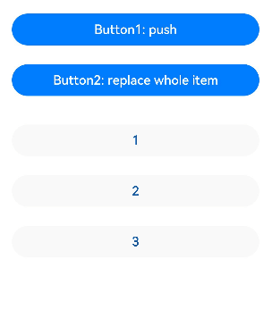

#### @Provide装饰器和@Consume装饰器：与后代组件双向同步

@Provide和@Consume，应用于与后代组件的双向数据同步，应用于状态数据在多个层级之间传递的场景。不同于上文提到的父子组件之间通过命名参数机制传递，@Provide和@Consume摆脱参数传递机制的束缚，实现跨层级传递。

其中@Provide装饰的变量是在祖先节点中，可以理解为被“提供”给后代的状态变量。@Consume装饰的变量是在后代组件中，去“消费（绑定）”祖先节点提供的变量。

> 从API version 9开始，这两个装饰器支持在ArkTS卡片中使用。

##### 概述

@Provide/@Consume装饰的状态变量有以下特性：

- @Provide装饰的状态变量自动对其所有后代组件可用，即该变量被“provide”给他的后代组件。由此可见，@Provide的方便之处在于，开发者不需要多次在组件之间传递变量。
- 后代通过使用@Consume去获取@Provide提供的变量，建立在@Provide和@Consume之间的双向数据同步，与@State/@Link不同的是，前者可以在多层级的父子组件之间传递。
- @Provide和@Consume可以通过相同的变量名或者相同的变量别名绑定，变量类型必须相同。

```typescript
// 通过相同的变量名绑定
@Provide a: number = 0;
@Consume a: number;

// 通过相同的变量别名绑定
@Provide('a') b: number = 0;
@Consume('a') c: number;
```

@Provide和@Consume通过相同的变量名或者相同的变量别名绑定时，@Provide修饰的变量和@Consume修饰的变量是一对多的关系。不允许在同一个自定义组件内，包括其子组件中声明多个同名或者同别名的@Provide装饰的变量。

##### 装饰器说明

@State的规则同样适用于@Provide，差异为@Provide还作为多层后代的同步源。

| @Provide变量装饰器 | 说明  |
| ------------- | ------ |
| 装饰器参数 | 别名：常量字符串，可选。如果指定了别名，则通过别名来绑定变量；如果未指定别名，则通过变量名绑定变量。 |
| 同步类型  | 双向同步。从@Provide变量到所有@Consume变量以及相反的方向的数据同步。双向同步的操作与@State和@Link的组合相同。 |
| 允许装饰的变量类型 | Object、class、string、number、boolean、enum类型，以及这些类型的数组。嵌套类型的场景请参考[观察变化](https://developer.huawei.com/consumer/cn/doc/harmonyos-guides-V2/arkts-provide-and-consume-0000001473857338-V2#section7141136115513)。不支持any，不支持简单类型和复杂类型的联合类型，不允许使用undefined和null。必须指定类型。@Provide变量的@Consume变量的类型必须相同。不支持Length、ResourceStr、ResourceColor类型，Length、ResourceStr、ResourceColor为简单类型和复杂类型的联合类型。 |
| 被装饰变量的初始值 | 必须指定。|

| @Consume变量装饰器 | 说明  |
| -------------- | ------ |
| 装饰器参数 | 别名：常量字符串，可选。如果提供了别名，则必须有@Provide的变量和其有相同的别名才可以匹配成功；否则，则需要变量名相同才能匹配成功。 |
| 同步类型  | 双向：从@Provide变量（具体请参见@Provide）到所有@Consume变量，以及相反的方向。双向同步操作与@State和@Link的组合相同。 |
| 允许装饰的变量类型 | Object、class、string、number、boolean、enum类型，以及这些类型的数组。嵌套类型的场景请参考[观察变化](https://developer.huawei.com/consumer/cn/doc/harmonyos-guides-V2/arkts-provide-and-consume-0000001473857338-V2#section7141136115513)。不支持any，不允许使用undefined和null。必须指定类型。@Provide变量的@Consume变量的类型必须相同。@Consume装饰的变量，在其父节点或者祖先节点上，必须有对应的属性和别名的@Provide装饰的变量。 |
| 被装饰变量的初始值 | 无，禁止本地初始化。|

##### 变量的传递/访问规则说明

| @Provide传递/访问    | 说明   |
| -------- | ---------- |
| 从父组件初始化和更新 | 可选，允许父组件中常规变量、@State、@Link、@Prop、@Provide、@Consume、@ObjectLink、@StorageLink、@StorageProp、@LocalStorageLink和@LocalStorageProp装饰的变量装饰变量初始化子组件@Provide。 |
| 用于初始化子组件 | 允许，可用于初始化@State、@Link、@Prop、@Provide。 |
| 和父组件同步  | 否。 |
| 和后代组件同步 | 和@Consume双向同步。|
| 是否支持组件外访问 | 私有，仅可以在所属组件内访问。|

**图1** @Provide初始化规则图示


| @Consume传递/访问  | 说明   |
| ----------- | -------- |
| 从父组件初始化和更新 | 禁止。通过相同的变量名和alias（别名）从@Provide初始化。 |
| 用于初始化子组件     | 允许，可用于初始化@State、@Link、@Prop、@Provide。 |
| 和祖先组件同步      | 和@Provide双向同步。|
| 是否支持组件外访问   | 私有，仅可以在所属组件内访问|

**图2** @Consume初始化规则图示


##### 观察变化和行为表现

###### 观察变化

- 当装饰的数据类型为boolean、string、number类型时，可以观察到数值的变化。
- 当装饰的数据类型为class或者Object的时候，可以观察到赋值和属性赋值的变化（属性为Object.keys(observedObject)返回的所有属性）。
- 当装饰的对象是array的时候，可以观察到数组的添加、删除、更新数组单元。

###### 框架行为

1. 初始渲染：
   1. @Provide装饰的变量会以map的形式，传递给当前@Provide所属组件的所有子组件；
   2. 子组件中如果使用@Consume变量，则会在map中查找是否有该变量名/alias（别名）对应的@Provide的变量，如果查找不到，框架会抛出JS ERROR;
   3. 在初始化@Consume变量时，和@State/@Link的流程类似，@Consume变量会保存在map中查找到的@Provide变量，并把自己注册给@Provide。
2. 当@Provide装饰的数据变化时：
   1. 通过初始渲染的步骤可知，子组件@Consume已把自己注册给父组件。父组件@Provide变量变更后，会遍历更新所有依赖它的系统组件（elementid）和状态变量（@Consume）；
   2. 通知@Consume更新后，子组件所有依赖@Consume的系统组件（elementId）都会被通知更新。以此实现@Provide对@Consume状态数据同步。
3. 当@Consume装饰的数据变化时：
   1. 通过初始渲染的步骤可知，子组件@Consume持有@Provide的实例。在@Consume更新后调用@Provide的更新方法，将更新的数值同步回@Provide，以此实现@Consume向@Provide的同步更新。

##### 使用场景

在下面的示例是与后代组件双向同步状态@Provide和@Consume场景。当分别点击CompA和CompD组件内Button时，reviewVotes 的更改会双向同步在CompA和CompD中。

```typescript
@Component
struct CompD {
  // @Consume装饰的变量通过相同的属性名绑定其祖先组件CompA内的@Provide装饰的变量
  @Consume reviewVotes: number;

  build() {
    Column() {
      Text(`reviewVotes(${this.reviewVotes})`)
      Button(`reviewVotes(${this.reviewVotes}), give +1`)
        .onClick(() => this.reviewVotes += 1)
    }
    .width('50%')
  }
}

@Component
struct CompC {
  build() {
    Row({ space: 5 }) {
      CompD()
      CompD()
    }
  }
}

@Component
struct CompB {
  build() {
    CompC()
  }
}

@Entry
@Component
struct CompA {
  // @Provide装饰的变量reviewVotes由入口组件CompA提供其后代组件
  @Provide reviewVotes: number = 0;

  build() {
    Column() {
      Button(`reviewVotes(${this.reviewVotes}), give +1`)
        .onClick(() => this.reviewVotes += 1)
      CompB()
    }
  }
}
```


#### @Observed装饰器和@ObjectLink装饰器：嵌套类对象属性变化

上文所述的装饰器仅能观察到第一层的变化，但是在实际应用开发中，应用会根据开发需要，封装自己的数据模型。对于多层嵌套的情况，比如二维数组，或者数组项class，或者class的属性是class，他们的第二层的属性变化是无法观察到的。这就引出了@Observed/@ObjectLink装饰器。

> 从API version 9开始，这两个装饰器支持在ArkTS卡片中使用。

##### 概述

@ObjectLink和@Observed类装饰器用于在涉及嵌套对象或数组的场景中进行双向数据同步：

- 被@Observed装饰的类，可以被观察到属性的变化；
- 子组件中@ObjectLink装饰器装饰的状态变量用于接收@Observed装饰的类的实例，和父组件中对应的状态变量建立双向数据绑定。这个实例可以是数组中的被@Observed装饰的项，或者是class object中的属性，这个属性同样也需要被@Observed装饰。
- 单独使用@Observed是没有任何作用的，需要搭配@ObjectLink或者@Prop使用。

##### 限制条件

- 使用@Observed装饰class会改变class原始的原型链，@Observed和其他类装饰器装饰同一个class可能会带来问题。
- @ObjectLink装饰器不能在@Entry装饰的自定义组件中使用。

##### 装饰器说明

| @Observed类装饰器 | 说明 |
| ---------- | ---------- |
| 装饰器参数 | 无  |
| 类装饰器   | 装饰class。需要放在class的定义前，使用new创建类对象。 |

| @ObjectLink变量装饰器 | 说明 |
| ----------- | ------------- |
| 装饰器参数 | 无 |
| 同步类型     | 不与父组件中的任何类型同步变量。    |
| 允许装饰的变量类型 | 必须为被@Observed装饰的class实例，必须指定类型。不支持简单类型，可以使用@Prop。@ObjectLink的属性是可以改变的，但是变量的分配是不允许的，也就是说这个装饰器装饰变量是只读的，不能被改变。 |
| 被装饰变量的初始值  | 不允许。 |

@ObjectLink装饰的数据为可读示例。

```typescript
// 允许@ObjectLink装饰的数据属性赋值
this.objLink.a= ...
// 不允许@ObjectLink装饰的数据自身赋值
this.objLink= ...
```

说明

@ObjectLink装饰的变量不能被赋值，如果要使用赋值操作，请使用[@Prop](https://developer.huawei.com/consumer/cn/doc/harmonyos-guides-V2/arkts-prop-0000001473537702-V2)。

- @Prop装饰的变量和数据源的关系是是单向同步，@Prop装饰的变量在本地拷贝了数据源，所以它允许本地更改，如果父组件中的数据源有更新，@Prop装饰的变量本地的修改将被覆盖；
- @ObjectLink装饰的变量和数据源的关系是双向同步，@ObjectLink装饰的变量相当于指向数据源的指针。如果一旦发生@ObjectLink装饰的变量的赋值，则同步链将被打断。

##### 变量的传递/访问规则说明

| @ObjectLink传递/访问 | 说明                                                         |
| -------------------- | ------------------------------------------------------------ |
| 从父组件初始化       | 必须指定。初始化@ObjectLink装饰的变量必须同时满足以下场景：类型必须是@Observed装饰的class。初始化的数值需要是数组项，或者class的属性。同步源的class或者数组必须是@State，@Link，@Provide，@Consume或者@ObjectLink装饰的数据。同步源是数组项的示例请参考[对象数组](https://developer.huawei.com/consumer/cn/doc/harmonyos-guides-V2/arkts-observed-and-objectlink-0000001473697338-V2#section99561777591)。初始化的class的示例请参考[嵌套对象](https://developer.huawei.com/consumer/cn/doc/harmonyos-guides-V2/arkts-observed-and-objectlink-0000001473697338-V2#section614118685518)。 |
| 与源对象同步         | 双向。                                                       |
| 可以初始化子组件     | 允许，可用于初始化常规变量、@State、@Link、@Prop、@Provide   |

**图1** 初始化规则图示


##### 观察变化和行为表现

###### 观察的变化

@Observed装饰的类，如果其属性为非简单类型，比如class、Object或者数组，也需要被@Observed装饰，否则将观察不到其属性的变化。

```typescript
class ClassA {
  public c: number;

  constructor(c: number) {
    this.c = c;
  }
}

@Observed
class ClassB {
  public a: ClassA;
  public b: number;

  constructor(a: ClassA, b: number) {
    this.a = a;
    this.b = b;
  }
}
```

以上示例中，ClassB被@Observed装饰，其成员变量的赋值的变化是可以被观察到的，但对于ClassA，没有被@Observed装饰，其属性的修改不能被观察到。

```typescript
@ObjectLink b: ClassB

// 赋值变化可以被观察到
this.b.a = new ClassA(5)
this.b.b = 5

// ClassA没有被@Observed装饰，其属性的变化观察不到
this.b.a.c = 5
```

@ObjectLink：@ObjectLink只能接收被@Observed装饰class的实例，可以观察到：

- 其属性的数值的变化，其中属性是指Object.keys(observedObject)返回的所有属性，示例请参考[嵌套对象](https://developer.huawei.com/consumer/cn/doc/harmonyos-guides-V2/arkts-observed-and-objectlink-0000001473697338-V2#section614118685518)。

- 如果数据源是数组，则可以观察到数组item的替换，如果数据源是class，可观察到class的属性的变化，示例请参考[对象数组](https://developer.huawei.com/consumer/cn/doc/harmonyos-guides-V2/arkts-observed-and-objectlink-0000001473697338-V2#section99561777591)。

###### 框架行为

1. 初始渲染：
   1. @Observed装饰的class的实例会被不透明的代理对象包装，代理了class上的属性的setter和getter方法
   2. 子组件中@ObjectLink装饰的从父组件初始化，接收被@Observed装饰的class的实例，@ObjectLink的包装类会将自己注册给@Observed class。
2. 属性更新：当@Observed装饰的class属性改变时，会走到代理的setter和getter，然后遍历依赖它的@ObjectLink包装类，通知数据更新。

##### 使用场景

###### 嵌套对象

以下是嵌套类对象的数据结构。

```typescript
// objectLinkNestedObjects.ets
let NextID: number = 1;

@Observed
class ClassA {
  public id: number;
  public c: number;

  constructor(c: number) {
    this.id = NextID++;
    this.c = c;
  }
}

@Observed
class ClassB {
  public a: ClassA;

  constructor(a: ClassA) {
    this.a = a;
  }
}
```

以下组件层次结构呈现的是嵌套类对象的数据结构。

```typescript
@Component
struct ViewA {
  label: string = 'ViewA1';
  @ObjectLink a: ClassA;

  build() {
    Row() {
      Button(`ViewA [${this.label}] this.a.c=${this.a.c} +1`)
        .onClick(() => {
          this.a.c += 1;
        })
    }
  }
}

@Entry
@Component
struct ViewB {
  @State b: ClassB = new ClassB(new ClassA(0));

  build() {
    Column() {
      // in low version,DevEco may throw a warning,but it does not matter.
      // you can still compile and run.
      ViewA({ label: 'ViewA #1', a: this.b.a })
      ViewA({ label: 'ViewA #2', a: this.b.a })

      Button(`ViewB: this.b.a.c+= 1`)
        .onClick(() => {
          this.b.a.c += 1;
        })
      Button(`ViewB: this.b.a = new ClassA(0)`)
        .onClick(() => {
          this.b.a = new ClassA(0);
        })
      Button(`ViewB: this.b = new ClassB(ClassA(0))`)
        .onClick(() => {
          this.b = new ClassB(new ClassA(0));
        })
    }
  }
}
```

ViewB中的事件句柄：

- this.b.a = new ClassA(0) 和this.b = new ClassB(new ClassA(0))： 对@State装饰的变量b和其属性的修改。
- this.b.a.c = ... ：该变化属于第二层的变化，[@State](https://developer.huawei.com/consumer/cn/doc/harmonyos-guides-V2/arkts-state-0000001474017162-V2#section135631413173517)无法观察到第二层的变化，但是ClassA被@Observed装饰，ClassA的属性c的变化可以被@ObjectLink观察到。

ViewA中的事件句柄：

- this.a.c += 1：对@ObjectLink变量a的修改，将触发Button组件的刷新。@ObjectLink和@Prop不同，@ObjectLink不拷贝来自父组件的数据源，而是在本地构建了指向其数据源的引用。
- @ObjectLink变量是只读的，this.a = new ClassA(...)是不允许的，因为一旦赋值操作发生，指向数据源的引用将被重置，同步将被打断。

###### 对象数组

对象数组是一种常用的数据结构。以下示例展示了数组对象的用法。

```typescript
let NextID: number = 1;

@Observed
class ClassA {
  public id: number;
  public c: number;

  constructor(c: number) {
    this.id = NextID++;
    this.c = c;
  }
}
@Component
struct ViewA {
  // 子组件ViewA的@ObjectLink的类型是ClassA
  @ObjectLink a: ClassA;
  label: string = 'ViewA1';

  build() {
    Row() {
      Button(`ViewA [${this.label}] this.a.c = ${this.a.c} +1`)
        .onClick(() => {
          this.a.c += 1;
        })
    }
  }
}

@Entry
@Component
struct ViewB {
  // ViewB中有@State装饰的ClassA[]
  @State arrA: ClassA[] = [new ClassA(0), new ClassA(0)];

  build() {
    Column() {
      ForEach(this.arrA,
        (item) => {
          ViewA({ label: `#${item.id}`, a: item })
        },
        (item) => item.id.toString()
      )
      // 使用@State装饰的数组的数组项初始化@ObjectLink，其中数组项是被@Observed装饰的ClassA的实例
      ViewA({ label: `ViewA this.arrA[first]`, a: this.arrA[0] })
      ViewA({ label: `ViewA this.arrA[last]`, a: this.arrA[this.arrA.length-1] })

      Button(`ViewB: reset array`)
        .onClick(() => {
          this.arrA = [new ClassA(0), new ClassA(0)];
        })
      Button(`ViewB: push`)
        .onClick(() => {
          this.arrA.push(new ClassA(0))
        })
      Button(`ViewB: shift`)
        .onClick(() => {
          this.arrA.shift()
        })
      Button(`ViewB: chg item property in middle`)
        .onClick(() => {
          this.arrA[Math.floor(this.arrA.length / 2)].c = 10;
        })
      Button(`ViewB: chg item property in middle`)
        .onClick(() => {
          this.arrA[Math.floor(this.arrA.length / 2)] = new ClassA(11);
        })
    }
  }
}
```

- this.arrA[Math.floor(this.arrA.length/2)] = new ClassA(..) ：该状态变量的改变触发2次更新：
  1. ForEach：数组项的赋值导致ForEach的[itemGenerator](https://developer.huawei.com/consumer/cn/doc/harmonyos-guides-V2/arkts-rendering-control-foreach-0000001524537153-V2#section611414423523)被修改，因此数组项被识别为有更改，ForEach的item builder将执行，创建新的ViewA组件实例。
  2. ViewA({ label: `ViewA this.arrA[last]`, a: this.arrA[this.arrA.length-1] })：上述更改改变了数组中第二个元素，所以绑定this.arrA[1]的ViewA将被更新；
- this.arrA.push(new ClassA(0)) ： 将触发2次不同效果的更新：
  1. ForEach：新添加的ClassA对象对于ForEach是未知的[itemGenerator](https://developer.huawei.com/consumer/cn/doc/harmonyos-guides-V2/arkts-rendering-control-foreach-0000001524537153-V2#section611414423523)，ForEach的item builder将执行，创建新的ViewA组件实例。
  2. ViewA({ label: `ViewA this.arrA[last]`, a: this.arrA[this.arrA.length-1] })：数组的最后一项有更改，因此引起第二个ViewA的实例的更改。对于ViewA({ label: `ViewA this.arrA[first]`, a: this.arrA[0] })，数组的更改并没有触发一个数组项更改的改变，所以第一个ViewA不会刷新。
- this.arrA[Math.floor(this.arrA.length/2)].c：[@State](https://developer.huawei.com/consumer/cn/doc/harmonyos-guides-V2/arkts-state-0000001474017162-V2#section135631413173517)无法观察到第二层的变化，但是ClassA被@Observed装饰，ClassA的属性的变化将被@ObjectLink观察到。

###### 二维数组

使用@Observed观察二维数组的变化。可以声明一个被@Observed装饰的继承Array的子类。

```typescript
@Observed
class StringArray extends Array<String> {
}
```

使用new StringArray()来构造StringArray的实例，new运算符使得@Observed生效，@Observed观察到StringArray的属性变化。

声明一个从Array扩展的类class StringArray extends Array<String> {}，并创建StringArray的实例。@Observed装饰的类需要使用new运算符来构建class实例。

```typescript
@Observed
class StringArray extends Array<String> {
}

@Component
struct ItemPage {
  @ObjectLink itemArr: StringArray;

  build() {
    Row() {
      Text('ItemPage')
        .width(100).height(100)

      ForEach(this.itemArr,
        item => {
          Text(item)
            .width(100).height(100)
        },
        item => item
      )
    }
  }
}

@Entry
@Component
struct IndexPage {
  @State arr: Array<StringArray> = [new StringArray(), new StringArray(), new StringArray()];

  build() {
    Column() {
      ItemPage({ itemArr: this.arr[0] })
      ItemPage({ itemArr: this.arr[1] })
      ItemPage({ itemArr: this.arr[2] })

      Divider()

      ForEach(this.arr,
        itemArr => {
          ItemPage({ itemArr: itemArr })
        },
        itemArr => itemArr[0]
      )

      Divider()

      Button('update')
        .onClick(() => {
          console.error('Update all items in arr');
          if (this.arr[0][0] !== undefined) {
            // 正常情况下需要有一个真实的ID来与ForEach一起使用，但此处没有
            // 因此需要确保推送的字符串是唯一的。
            this.arr[0].push(`${this.arr[0].slice(-1).pop()}${this.arr[0].slice(-1).pop()}`);
            this.arr[1].push(`${this.arr[1].slice(-1).pop()}${this.arr[1].slice(-1).pop()}`);
            this.arr[2].push(`${this.arr[2].slice(-1).pop()}${this.arr[2].slice(-1).pop()}`);
          } else {
            this.arr[0].push('Hello');
            this.arr[1].push('World');
            this.arr[2].push('!');
          }
        })
    }
  }
}
```


### 管理应用拥有的状态

- **[管理应用拥有的状态概述](https://developer.huawei.com/consumer/cn/doc/harmonyos-guides-V2/arkts-application-state-management-overview-0000001529381989-V2)**
- **[LocalStorage：页面级UI状态存储](https://developer.huawei.com/consumer/cn/doc/harmonyos-guides-V2/arkts-localstorage-0000001524537149-V2)**
- **[AppStorage：应用全局的UI状态存储](https://developer.huawei.com/consumer/cn/doc/harmonyos-guides-V2/arkts-appstorage-0000001524417209-V2)**
- **[PersistentStorage：持久化存储UI状态](https://developer.huawei.com/consumer/cn/doc/harmonyos-guides-V2/arkts-persiststorage-0000001474017166-V2)**
- **[Environment：设备环境查询](https://developer.huawei.com/consumer/cn/doc/harmonyos-guides-V2/arkts-environment-0000001473537710-V2)**


#### 管理应用拥有的状态概述

如果开发者要实现应用级的，或者多个页面的状态数据共享，就需要用到应用级别的状态管理的概念。ArkTS根据不同特性，提供了多种应用状态管理的能力：

- [LocalStorage](https://developer.huawei.com/consumer/cn/doc/harmonyos-guides-V2/arkts-localstorage-0000001524537149-V2)：页面级UI状态存储，通常用于[UIAbility](https://developer.huawei.com/consumer/cn/doc/harmonyos-references-V2/js-apis-app-ability-uiability-0000001493584184-V2)内、页面间的状态共享。
- [AppStorage](https://developer.huawei.com/consumer/cn/doc/harmonyos-guides-V2/arkts-appstorage-0000001524417209-V2)：特殊的单例LocalStorage对象，由UI框架在应用程序启动时创建，为应用程序UI状态属性提供中央存储；
- [PersistentStorage](https://developer.huawei.com/consumer/cn/doc/harmonyos-guides-V2/arkts-persiststorage-0000001474017166-V2)：持久化存储UI状态，通常和AppStorage配合使用，选择AppStorage存储的数据写入磁盘，以确保这些属性在应用程序重新启动时的值与应用程序关闭时的值相同；
- [Environment](https://developer.huawei.com/consumer/cn/doc/harmonyos-guides-V2/arkts-environment-0000001473537710-V2)：应用程序运行的设备的环境参数，环境参数会同步到AppStorage中，可以和AppStorage搭配使用。


#### LocalStorage：页面级UI状态存储

LocalStorage是页面级的UI状态存储，通过@Entry装饰器接收的参数可以在页面内共享同一个LocalStorage实例。LocalStorage也可以在UIAbility实例内，在页面间共享状态。

本文仅介绍LocalStorage使用场景和相关的装饰器：@LocalStorageProp和@LocalStorageLink。

> 本模块从API version 9开始支持。


##### 概述

LocalStorage是ArkTS为构建页面级别状态变量提供存储的内存内“数据库”。

- 应用程序可以创建多个LocalStorage实例，LocalStorage实例可以在页面内共享，也可以通过GetShared接口，实现跨页面、UIAbility实例内共享。
- 组件树的根节点，即被@Entry装饰的@Component，可以被分配一个LocalStorage实例，此组件的所有子组件实例将自动获得对该LocalStorage实例的访问权限；
- 被@Component装饰的组件最多可以访问一个LocalStorage实例和[AppStorage](https://developer.huawei.com/consumer/cn/doc/harmonyos-guides-V2/arkts-appstorage-0000001524417209-V2)，未被@Entry装饰的组件不可被独立分配LocalStorage实例，只能接受父组件通过@Entry传递来的LocalStorage实例。一个LocalStorage实例在组件树上可以被分配给多个组件。
- LocalStorage中的所有属性都是可变的。

应用程序决定LocalStorage对象的生命周期。当应用释放最后一个指向LocalStorage的引用时，比如销毁最后一个自定义组件，LocalStorage将被JS Engine垃圾回收。

LocalStorage根据与@Component装饰的组件的同步类型不同，提供了两个装饰器：

- [@LocalStorageProp](https://developer.huawei.com/consumer/cn/doc/harmonyos-guides-V2/arkts-localstorage-0000001524537149-V2#section14665991077)：@LocalStorageProp装饰的变量和与LocalStorage中给定属性建立单向同步关系。
- [@LocalStorageLink](https://developer.huawei.com/consumer/cn/doc/harmonyos-guides-V2/arkts-localstorage-0000001524537149-V2#section20745122910311)：@LocalStorageLink装饰的变量和在@Component中创建与LocalStorage中给定属性建立双向同步关系。


##### 限制条件

- LocalStorage创建后，命名属性的类型不可更改。后续调用Set时必须使用相同类型的值。
- LocalStorage是页面级存储，[GetShared](https://developer.huawei.com/consumer/cn/doc/harmonyos-references-V2/arkts-state-management-0000001504151156-V2#ZH-CN_TOPIC_0000001523808562__getshared9)接口仅能获取当前Stage通过[windowStage.loadContent](https://developer.huawei.com/consumer/cn/doc/harmonyos-references-V2/js-apis-window-0000001477981397-V2#ZH-CN_TOPIC_0000001573929313__loadcontent9)传入的LocalStorage实例，否则返回undefined。例子可见[将LocalStorage实例从UIAbility共享到一个或多个视图](https://developer.huawei.com/consumer/cn/doc/harmonyos-guides-V2/arkts-localstorage-0000001524537149-V2#section13961833151713)。


##### @LocalStorageProp

在上文中已经提到，如果要建立LocalStorage和自定义组件的联系，需要使用@LocalStorageProp和@LocalStorageLink装饰器。使用@LocalStorageProp(key)/@LocalStorageLink(key)装饰组件内的变量，key标识了LocalStorage的属性。

当自定义组件初始化的时候，@LocalStorageProp(key)/@LocalStorageLink(key)装饰的变量会通过给定的key，绑定LocalStorage对应的属性，完成初始化。本地初始化是必要的，因为无法保证LocalStorage一定存在给定的key（这取决于应用逻辑是否在组件初始化之前在LocalStorage实例中存入对应的属性）。

> 从API version 9开始，该装饰器支持在ArkTS卡片中使用。

@LocalStorageProp(key)是和LocalStorage中key对应的属性建立单向数据同步，我们允许本地改变的发生，但是对于@LocalStorageProp，本地的修改永远不会同步回LocalStorage中，相反，如果LocalStorage给定key的属性发生改变，改变会被同步给@LocalStorageProp，并覆盖掉本地的修改。


###### 装饰器使用规则说明

| @LocalStorageProp变量装饰器 | 说明   |
| -------------- | ------------------ |
| 装饰器参数 | key：常量字符串，必填（字符串需要有引号）。 |
| 允许装饰的变量类型          | Object、class、string、number、boolean、enum类型，以及这些类型的数组。嵌套类型的场景请参考[观察变化和行为表现](https://developer.huawei.com/consumer/cn/doc/harmonyos-guides-V2/arkts-localstorage-0000001524537149-V2#section95308721319)。类型必须被指定，且必须和LocalStorage中对应属性相同。不支持any，不允许使用undefined和null。 |
| 同步类型   | 单向同步：从LocalStorage的对应属性到组件的状态变量。组件本地的修改是允许的，但是LocalStorage中给定的属性一旦发生变化，将覆盖本地的修改。 |
| 被装饰变量的初始值   | 必须指定，如果LocalStorage实例中不存在属性，则作为初始化默认值，并存入LocalStorage中。 |


###### 变量的传递/访问规则说明

| 传递/访问  | 说明  |
| -------- | ------- |
| 从父节点初始化和更新 | 禁止，@LocalStorageProp不支持从父节点初始化，只能从LocalStorage中key对应的属性初始化，如果没有对应key的话，将使用本地默认值初始化。 |
| 初始化子节点  | 支持，可用于初始化@State、@Link、@Prop、@Provide。 |
| 是否支持组件外访问  | 否。 |

**图1** @LocalStorageProp初始化规则图示


###### 观察变化和行为表现

###### **观察变化**

- 当装饰的数据类型为boolean、string、number类型时，可以观察到数值的变化。
- 当装饰的数据类型为class或者Object时，可以观察到赋值和属性赋值的变化，即Object.keys(observedObject)返回的所有属性。
- 当装饰的对象是array时，可以观察到数组添加、删除、更新数组单元的变化。

###### **框架行为**

- 当@LocalStorageProp(key)装饰的数值改变被观察到时，修改不会被同步回LocalStorage对应属性键值key的属性中。
- 当前@LocalStorageProp(key)单向绑定的数据会被修改，即仅限于当前组件的私有成员变量改变，其他的绑定该key的数据不会同步改变。
- 当@LocalStorageProp(key)装饰的数据本身是状态变量，它的改变虽然不会同步回LocalStorage中，但是会引起所属的自定义组件的重新渲染。
- 当LocalStorage中key对应的属性发生改变时，会同步给所有@LocalStorageProp(key)装饰的数据，@LocalStorageProp(key)本地的修改将被覆盖。


##### @LocalStorageLink

如果我们需要将自定义组件的状态变量的更新同步回LocalStorage，就需要用到@LocalStorageLink。

@LocalStorageLink(key)是和LocalStorage中key对应的属性建立双向数据同步：

1. 本地修改发生，该修改会被写回LocalStorage中；
2. LocalStorage中的修改发生后，该修改会被同步到所有绑定LocalStorage对应key的属性上，包括单向（@LocalStorageProp和通过prop创建的单向绑定变量）、双向（@LocalStorageLink和通过link创建的双向绑定变量）变量。

###### 装饰器使用规则说明

| @LocalStorageLink变量装饰器 | 说明  |
| --------------------- | ------------ |
| 装饰器参数 | key：常量字符串，必填（字符串需要有引号）。 |
| 允许装饰的变量类型 | Object、class、string、number、boolean、enum类型，以及这些类型的数组。嵌套类型的场景请参考[观察变化和行为表现](https://developer.huawei.com/consumer/cn/doc/harmonyos-guides-V2/arkts-localstorage-0000001524537149-V2#section0207123614516)。类型必须被指定，且必须和LocalStorage中对应属性相同。不支持any，不允许使用undefined和null。 |
| 同步类型  | 双向同步：从LocalStorage的对应属性到自定义组件，从自定义组件到LocalStorage对应属性。 |
| 被装饰变量的初始值 | 必须指定，如果LocalStorage实例中不存在属性，则作为初始化默认值，并存入LocalStorage中。 |

###### 变量的传递/访问规则说明

| 传递/访问  | 说明  |
| --------- | ------ |
| 从父节点初始化和更新 | 禁止，@LocalStorageLink不支持从父节点初始化，只能从LocalStorage中key对应的属性初始化，如果没有对应key的话，将使用本地默认值初始化。 |
| 初始化子节点  | 支持，可用于初始化@State、@Link、@Prop、@Provide。|
| 是否支持组件外访问   | 否。 |

**图2** @LocalStorageLink初始化规则图示

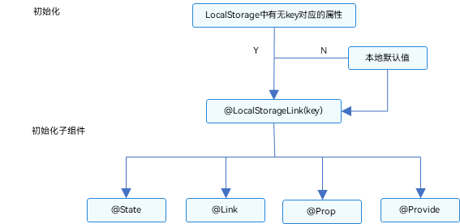


###### 观察变化和行为表现

###### **观察变化**

- 当装饰的数据类型为boolean、string、number类型时，可以观察到数值的变化。
- 当装饰的数据类型为class或者Object时，可以观察到赋值和属性赋值的变化，即Object.keys(observedObject)返回的所有属性。
- 当装饰的对象是array时，可以观察到数组添加、删除、更新数组单元的变化。

###### **框架行为**

1. 当@LocalStorageLink(key)装饰的数值改变被观察到时，修改将被同步回LocalStorage对应属性键值key的属性中。
2. LocalStorage中属性键值key对应的数据一旦改变，属性键值key绑定的所有的数据（包括双向@LocalStorageLink和单向@LocalStorageProp）都将同步修改。
3. 当@LocalStorageLink(key)装饰的数据本身是状态变量，它的改变不仅仅会同步回LocalStorage中，还会引起所属的自定义组件的重新渲染。


###### 使用场景

###### 应用逻辑使用LocalStorage

```typescript
let storage = new LocalStorage({ 'PropA': 47 }); // 创建新实例并使用给定对象初始化
let propA = storage.get('PropA') // propA == 47
let link1 = storage.link('PropA'); // link1.get() == 47
let link2 = storage.link('PropA'); // link2.get() == 47
let prop = storage.prop('PropA'); // prop.get() = 47
link1.set(48); // two-way sync: link1.get() == link2.get() == prop.get() == 48
prop.set(1); // one-way sync: prop.get()=1; but link1.get() == link2.get() == 48
link1.set(49); // two-way sync: link1.get() == link2.get() == prop.get() == 49
```

###### 从UI内部使用LocalStorage

除了应用程序逻辑使用LocalStorage，还可以借助LocalStorage相关的两个装饰器@LocalStorageProp和@LocalStorageLink，在UI组件内部获取到LocalStorage实例中存储的状态变量。

本示例以@LocalStorageLink为例，展示了：

- 使用构造函数创建LocalStorage实例storage；

- 使用@Entry装饰器将storage添加到CompA顶层组件中；

- @LocalStorageLink绑定LocalStorage对给定的属性，建立双向数据同步。

  ```typescript
  // 创建新实例并使用给定对象初始化
  let storage = new LocalStorage({ 'PropA': 47 });
  
  @Component
  struct Child {
    // @LocalStorageLink变量装饰器与LocalStorage中的'PropA'属性建立双向绑定
    @LocalStorageLink('PropA') storLink2: number = 1;
  
    build() {
      Button(`Child from LocalStorage ${this.storLink2}`)
        // 更改将同步至LocalStorage中的'PropA'以及Parent.storLink1
        .onClick(() => this.storLink2 += 1)
    }
  }
  // 使LocalStorage可从@Component组件访问
  @Entry(storage)
  @Component
  struct CompA {
    // @LocalStorageLink变量装饰器与LocalStorage中的'PropA'属性建立双向绑定
    @LocalStorageLink('PropA') storLink1: number = 1;
  
    build() {
      Column({ space: 15 }) {
        Button(`Parent from LocalStorage ${this.storLink1}`) // initial value from LocalStorage will be 47, because 'PropA' initialized already
          .onClick(() => this.storLink1 += 1)
        // @Component子组件自动获得对CompA LocalStorage实例的访问权限。
        Child()
      }
    }
  }
  ```

###### @LocalStorageProp和LocalStorage单向同步的简单场景

在下面的示例中，CompA 组件和Child组件分别在本地创建了与storage的'PropA'对应属性的单向同步的数据，我们可以看到：

- CompA中对this.storProp1的修改，只会在CompA中生效，并没有同步回storage；

- Child组件中，Text绑定的storProp2 依旧显示47。

  ```typescript
  // 创建新实例并使用给定对象初始化
  let storage = new LocalStorage({ 'PropA': 47 });
  // 使LocalStorage可从@Component组件访问
  @Entry(storage)
  @Component
  struct CompA {
    // @LocalStorageProp变量装饰器与LocalStorage中的'PropA'属性建立单向绑定
    @LocalStorageProp('PropA') storProp1: number = 1;
  
    build() {
      Column({ space: 15 }) {
        // 点击后从47开始加1，只改变当前组件显示的storProp1，不会同步到LocalStorage中
        Button(`Parent from LocalStorage ${this.storProp1}`)
          .onClick(() => this.storProp1 += 1)
        Child()
      }
    }
  }
  
  @Component
  struct Child {
    // @LocalStorageProp变量装饰器与LocalStorage中的'PropA'属性建立单向绑定
    @LocalStorageProp('PropA') storProp2: number = 2;
  
    build() {
      Column({ space: 15 }) {
        // 当CompA改变时，当前storProp2不会改变，显示47
        Text(`Parent from LocalStorage ${this.storProp2}`)
      }
    }
  }
  ```

###### @LocalStorageLink和LocalStorage双向同步的简单场景

下面的示例展示了@LocalStorageLink装饰的数据和LocalStorage双向同步的场景

```typescript
// 构造LocalStorage实例
let storage = new LocalStorage({ 'PropA': 47 });
// 调用link（api9以上）接口构造'PropA'的双向同步数据，linkToPropA 是全局变量
let linkToPropA = storage.link('PropA');

@Entry(storage)
@Component
struct CompA {

  // @LocalStorageLink('PropA')在CompA自定义组件中创建'PropA'的双向同步数据，初始值为47，因为在构造LocalStorage已经给“PropA”设置47
  @LocalStorageLink('PropA') storLink: number = 1;

  build() {
    Column() {
      Text(`incr @LocalStorageLink variable`)
        // 点击“incr @LocalStorageLink variable”，this.storLink加1，改变同步回storage，全局变量linkToPropA也会同步改变 

        .onClick(() => this.storLink += 1)

      // 并不建议在组件内使用全局变量linkToPropA.get()，因为可能会有生命周期不同引起的错误。
      Text(`@LocalStorageLink: ${this.storLink} - linkToPropA: ${linkToPropA.get()}`)
    }
  }
}
```

###### 兄弟节点之间同步状态变量

下面的示例展示了通过@LocalStorageLink双向同步兄弟节点之间的状态。

先看Parent自定义组件中发生的变化：

1. 点击“playCount ${this.playCount} dec by 1”，this.playCount减1，修改同步回LocalStorage中，Child组件中的playCountLink绑定的组件会同步刷新；
2. 点击“countStorage ${this.playCount} incr by 1”，调用LocalStorage的set接口，更新LocalStorage中“countStorage”对应的属性，Child组件中的playCountLink绑定的组件会同步刷新；
3. Text组件“playCount in LocalStorage for debug ${storage.get<number>('countStorage')}”没有同步刷新，因为storage.get<number>('countStorage')返回的是常规变量，常规变量的更新并不会引起Text组件的重新渲染。

Child自定义组件中的变化：

1. playCountLink的刷新会同步回LocalStorage，并且引起兄弟组件和父组件相应的刷新。

   ```typescript
   let storage = new LocalStorage({ countStorage: 1 });
   
   @Component
   struct Child {
     // 子组件实例的名字
     label: string = 'no name';
     // 和LocalStorage中“countStorage”的双向绑定数据
     @LocalStorageLink('countStorage') playCountLink: number = 0;
   
     build() {
       Row() {
         Text(this.label)
           .width(50).height(60).fontSize(12)
         Text(`playCountLink ${this.playCountLink}: inc by 1`)
           .onClick(() => {
             this.playCountLink += 1;
           })
           .width(200).height(60).fontSize(12)
       }.width(300).height(60)
     }
   }
   
   @Entry(storage)
   @Component
   struct Parent {
     @LocalStorageLink('countStorage') playCount: number = 0;
   
     build() {
       Column() {
         Row() {
           Text('Parent')
             .width(50).height(60).fontSize(12)
           Text(`playCount ${this.playCount} dec by 1`)
             .onClick(() => {
               this.playCount -= 1;
             })
             .width(250).height(60).fontSize(12)
         }.width(300).height(60)
   
         Row() {
           Text('LocalStorage')
             .width(50).height(60).fontSize(12)
           Text(`countStorage ${this.playCount} incr by 1`)
             .onClick(() => {
               storage.set<number>('countStorage', 1 + storage.get<number>('countStorage'));
             })
             .width(250).height(60).fontSize(12)
         }.width(300).height(60)
   
         Child({ label: 'ChildA' })
         Child({ label: 'ChildB' })
   
         Text(`playCount in LocalStorage for debug ${storage.get<number>('countStorage')}`)
           .width(300).height(60).fontSize(12)
       }
     }
   }
   ```

###### 将LocalStorage实例从UIAbility共享到一个或多个视图

上面的实例中，LocalStorage的实例仅仅在一个@Entry装饰的组件和其所属的子组件（一个页面）中共享，如果希望其在多个视图中共享，可以在所属UIAbility中创建LocalStorage实例，并调用windowStage.[loadContent](https://developer.huawei.com/consumer/cn/doc/harmonyos-references-V2/js-apis-window-0000001477981397-V2#ZH-CN_TOPIC_0000001573929313__loadcontent9)。

```typescript
// EntryAbility.ts
import UIAbility from '@ohos.app.ability.UIAbility';
import window from '@ohos.window';

export default class EntryAbility extends UIAbility {
  para:Record<string, number> = { 'PropA': 47 };
  storage: LocalStorage = new LocalStorage(this.para);

  onWindowStageCreate(windowStage: window.WindowStage) {
  	windowStage.loadContent('pages/Index', this.storage);
  }
}
```

> 在UI页面通过getShared接口获取在通过loadContent共享的LocalStorage实例。
>
> LocalStorage.getShared只在模拟器或者实机上才有效，不能在Preview预览器中使用。

在下面的用例中，Index页面中的propA通过getShared()方法获取到共享的LocalStorage实例。点击Button跳转到Page页面，点击Change propA改变propA的值，back回Index页面后，页面中propA的值也同步修改。

```typescript
// index.ets
import router from '@ohos.router';

// 通过getShared接口获取stage共享的LocalStorage实例
let storage = LocalStorage.getShared()
@Entry(storage)
@Component
struct Index {
  // can access LocalStorage instance using 
  // @LocalStorageLink/Prop decorated variables
  @LocalStorageLink('PropA') propA: number = 1;
  build() {
    Row() {
      Column() {
        Text(`${this.propA}`)
          .fontSize(50)
          .fontWeight(FontWeight.Bold)
        Button("To Page")
          .onClick(() => {
            router.pushUrl({
              url:'pages/Page'
            })
          })
      }
      .width('100%')
    }
    .height('100%')
  }
}

// Page.ets
import router from '@ohos.router';

let storage = LocalStorage.getShared()
@Entry(storage)
@Component
struct Page {
  @LocalStorageLink('PropA') propA: number = 2;

  build() {
    Row() {
      Column() {
        Text(`${this.propA}`)
          .fontSize(50)
          .fontWeight(FontWeight.Bold)

        Button("Change propA")
          .onClick(() => {
            this.propA = 100;
          })

        Button("Back Index")
          .onClick(() => {
            router.back()
          })
      }
      .width('100%')
    }
  }
}
```

> 对于开发者更建议使用这个方式来构建LocalStorage的实例，并且在创建LocalStorage实例的时候就写入默认值，因为默认值可以作为运行异常的备份，也可以用作页面的单元测试。


#### AppStorage：应用全局的UI状态存储

AppStorage是应用全局的UI状态存储，是和应用的进程绑定的，由UI框架在应用程序启动时创建，为应用程序UI状态属性提供中央存储。

和AppStorage不同的是，LocalStorage是页面级的，通常应用于页面内的数据共享。而AppStorage是应用级的全局状态共享，还相当于整个应用的“中枢”，[持久化数据PersistentStorage](https://developer.huawei.com/consumer/cn/doc/harmonyos-guides-V2/arkts-persiststorage-0000001474017166-V2)和[环境变量Environment](https://developer.huawei.com/consumer/cn/doc/harmonyos-guides-V2/arkts-environment-0000001473537710-V2)都是通过和AppStorage中转，才可以和UI交互。

本文仅介绍AppStorage使用场景和相关的装饰器：@StorageProp和@StorageLink。


##### 概述

AppStorage是在应用启动的时候会被创建的单例。它的目的是为了提供应用状态数据的中心存储，这些状态数据在应用级别都是可访问的。AppStorage将在应用运行过程保留其属性。属性通过唯一的键字符串值访问。

AppStorage可以和UI组件同步，且可以在应用业务逻辑中被访问。

AppStorage中的属性可以被双向同步，数据可以是存在于本地或远程设备上，并具有不同的功能，比如数据持久化（详见[PersistentStorage](https://developer.huawei.com/consumer/cn/doc/harmonyos-guides-V2/arkts-persiststorage-0000001474017166-V2)）。这些数据是通过业务逻辑中实现，与UI解耦，如果希望这些数据在UI中使用，需要用到[@StorageProp](https://developer.huawei.com/consumer/cn/doc/harmonyos-guides-V2/arkts-appstorage-0000001524417209-V2#section676113134317)和[@StorageLink](https://developer.huawei.com/consumer/cn/doc/harmonyos-guides-V2/arkts-appstorage-0000001524417209-V2#section84115526424)。


##### @StorageProp

在上文中已经提到，如果要建立AppStorage和自定义组件的联系，需要使用@StorageProp和@StorageLink装饰器。使用@StorageProp(key)/@StorageLink(key)装饰组件内的变量，key标识了AppStorage的属性。

当自定义组件初始化的时候，@StorageProp(key)/@StorageLink(key)装饰的变量会通过给定的key，绑定在AppStorage对应的属性，完成初始化。本地初始化是必要的，因为无法保证AppStorage一定存在给定的key，这取决于应用逻辑，是否在组件初始化之前在AppStorage实例中存入对应的属性。

@StorageProp(key)是和AppStorage中key对应的属性建立单向数据同步，我们允许本地改变的发生，但是对于@StorageProp，本地的修改永远不会同步回AppStorage中，相反，如果AppStorage给定key的属性发生改变，改变会被同步给@StorageProp，并覆盖掉本地的修改。


###### 装饰器使用规则说明

| @StorageProp变量装饰器 | 说明 |
| ---------- | ------------- |
| 装饰器参数 | key：常量字符串，必填（字符串需要有引号）。|
| 允许装饰的变量类型 | Object、class、string、number、boolean、enum类型，以及这些类型的数组。嵌套类型的场景请参考[观察变化和行为表现](https://developer.huawei.com/consumer/cn/doc/harmonyos-guides-V2/arkts-appstorage-0000001524417209-V2#section8970810185617)。类型必须被指定，且必须和AppStorage中对应属性相同。不支持any，不允许使用undefined和null。 |
| 同步类型 | 单向同步：从AppStorage的对应属性到组件的状态变量。组件本地的修改是允许的，但是AppStorage中给定的属性一旦发生变化，将覆盖本地的修改。 |
| 被装饰变量的初始值 | 必须指定，如果AppStorage实例中不存在属性，则作为初始化默认值，并存入AppStorage中。 |

###### 变量的传递/访问规则说明

| 传递/访问 | 说明 |
| -------- | ------- |
| 从父节点初始化和更新 | 禁止，@StorageProp不支持从父节点初始化，只能AppStorage中key对应的属性初始化，如果没有对应key的话，将使用本地默认值初始化 |
| 初始化子节点 | 支持，可用于初始化@State、@Link、@Prop、@Provide。 |
| 是否支持组件外访问 | 否。|

**图1** @StorageProp初始化规则图示


###### 观察变化和行为表现

**观察变化**

- 当装饰的数据类型为boolean、string、number类型时，可以观察到数值的变化。
- 当装饰的数据类型为class或者Object时，可以观察到赋值和属性赋值的变化，即Object.keys(observedObject)返回的所有属性。
- 当装饰的对象是array时，可以观察到数组添加、删除、更新数组单元的变化。

**框架行为**

- 当@StorageProp(key)装饰的数值改变被观察到时，修改不会被同步回AppStorage对应属性键值key的属性中。
- 当前@StorageProp(key)单向绑定的数据会被修改，即仅限于当前组件的私有成员变量改变，其他的绑定该key的数据不会同步改变。
- 当@StorageProp(key)装饰的数据本身是状态变量，它的改变虽然不会同步回AppStorage中，但是会引起所属的自定义组件的重新渲染。
- 当AppStorage中key对应的属性发生改变时，会同步给所有@StorageProp(key)装饰的数据，@StorageProp(key)本地的修改将被覆盖。


##### @StorageLink

@StorageLink(key)是和AppStorage中key对应的属性建立双向数据同步：

1. 本地修改发生，该修改会被写回AppStorage中；
2. AppStorage中的修改发生后，该修改会被同步到所有绑定AppStorage对应key的属性上，包括单向（@StorageProp和通过Prop创建的单向绑定变量）、双向（@StorageLink和通过Link创建的双向绑定变量）变量和其他实例（比如PersistentStorage）。


###### 装饰器使用规则说明

| @StorageLink变量装饰器 | 说明 |
| ------------ | ----------- |
| 装饰器参数 | key：常量字符串，必填（字符串需要有引号）。|
| 允许装饰的变量类型 | Object、class、string、number、boolean、enum类型，以及这些类型的数组。嵌套类型的场景请参考[观察变化和行为表现](https://developer.huawei.com/consumer/cn/doc/harmonyos-guides-V2/arkts-appstorage-0000001524417209-V2#section2040243611596)。类型必须被指定，且必须和AppStorage中对应属性相同。不支持any，不允许使用undefined和null。 |
| 同步类型  | 双向同步：从AppStorage的对应属性到自定义组件，从自定义组件到AppStorage对应属性。 |
| 被装饰变量的初始值 | 必须指定，如果AppStorage实例中不存在属性，则作为初始化默认值，并存入AppStorage中。 |

###### 变量的传递/访问规则说明

| 传递/访问  | 说明 |
| ---------- | ---------- |
| 从父节点初始化和更新 | 禁止。|
| 初始化子节点 | 支持，可用于初始化常规变量、@State、@Link、@Prop、@Provide。 |
| 是否支持组件外访问 | 否。 |

**图2** @StorageLink初始化规则图示

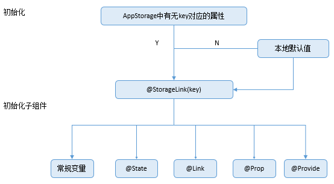


###### 观察变化和行为表现

**观察变化**

- 当装饰的数据类型为boolean、string、number类型时，可以观察到数值的变化。
- 当装饰的数据类型为class或者Object时，可以观察到赋值和属性赋值的变化，即Object.keys(observedObject)返回的所有属性。
- 当装饰的对象是array时，可以观察到数组添加、删除、更新数组单元的变化。

**框架行为**

1. 当@StorageLink(key)装饰的数值改变被观察到时，修改将被同步回AppStorage对应属性键值key的属性中。
2. AppStorage中属性键值key对应的数据一旦改变，属性键值key绑定的所有的数据（包括双向@StorageLink和单向@StorageProp）都将同步修改。
3. 当@StorageLink(key)装饰的数据本身是状态变量，它的改变不仅仅会同步回AppStorage中，还会引起所属的自定义组件的重新渲染。


###### 使用场景

###### 从应用逻辑使用AppStorage和LocalStorage

AppStorage是单例，它的所有API都是静态的，使用方法类似于LocalStorage对应的非静态方法。

```typescript
AppStorage.SetOrCreate('PropA', 47);

let storage: LocalStorage = new LocalStorage({ 'PropA': 17 });
let propA: number = AppStorage.Get('PropA') // propA in AppStorage == 47, propA in LocalStorage == 17
var link1: SubscribedAbstractProperty<number> = AppStorage.Link('PropA'); // link1.get() == 47
var link2: SubscribedAbstractProperty<number> = AppStorage.Link('PropA'); // link2.get() == 47
var prop: SubscribedAbstractProperty<number> = AppStorage.Prop('PropA'); // prop.get() == 47

link1.set(48); // two-way sync: link1.get() == link2.get() == prop.get() == 48
prop.set(1); // one-way sync: prop.get() == 1; but link1.get() == link2.get() == 48
link1.set(49); // two-way sync: link1.get() == link2.get() == prop.get() == 49

storage.get('PropA') // == 17 
storage.set('PropA', 101);
storage.get('PropA') // == 101

AppStorage.Get('PropA') // == 49
link1.get() // == 49
link2.get() // == 49
prop.get() // == 49
```


###### 从UI内部使用AppStorage和LocalStorage

@StorageLink变量装饰器与AppStorage配合使用，正如@LocalStorageLink与LocalStorage配合使用一样。此装饰器使用AppStorage中的属性创建双向数据同步。

```typescript
AppStorage.SetOrCreate('PropA', 47);
let storage = new LocalStorage({ 'PropA': 48 });

@Entry(storage)
@Component
struct CompA {
  @StorageLink('PropA') storLink: number = 1;
  @LocalStorageLink('PropA') localStorLink: number = 1;

  build() {
    Column({ space: 20 }) {
      Text(`From AppStorage ${this.storLink}`)
        .onClick(() => this.storLink += 1)

      Text(`From LocalStorage ${this.localStorLink}`)
        .onClick(() => this.localStorLink += 1)
    }
  }
}
```


###### 不建议借助@StorageLink的双向同步机制实现事件通知

不建议开发者使用@StorageLink和AppStorage的双向同步的机制来实现事件通知，AppStorage是和UI相关的数据存储，改变会带来UI的刷新，相对于一般的事件通知，UI刷新的成本较大。

TapImage中的点击事件，会触发AppStorage中tapIndex对应属性的改变。因为@StorageLink是双向同步，修改会同步回AppStorage中，所以，所有绑定AppStorage的tapIndex自定义组件都会被通知UI刷新。UI刷新带来的成本是巨大的，因此不建议开发者使用此方式来实现基本的事件通知功能。

```typescript
// xxx.ets
class ViewData {
  title: string;
  uri: Resource;
  color: Color = Color.Black;

  constructor(title: string, uri: Resource) {
    this.title = title;
    this.uri = uri
  }
}

@Entry
@Component
struct Gallery2 {
  dataList: Array<ViewData> = [new ViewData('flower', $r('app.media.icon')), new ViewData('OMG', $r('app.media.icon')), new ViewData('OMG', $r('app.media.icon'))]
  scroller: Scroller = new Scroller()

  build() {
    Column() {
      Grid(this.scroller) {
        ForEach(this.dataList, (item: ViewData, index?: number) => {
          GridItem() {
            TapImage({
              uri: item.uri,
              index: index
            })
          }.aspectRatio(1)

        }, (item: ViewData, index?: number) => {
          return JSON.stringify(item) + index;
        })
      }.columnsTemplate('1fr 1fr')
    }

  }
}

@Component
export struct TapImage {
  @StorageLink('tapIndex') @Watch('onTapIndexChange') tapIndex: number = -1;
  @State tapColor: Color = Color.Black;
  private index: number = 0;
  private uri: Resource = {
    id: 0,
    type: 0,
    moduleName: "",
    bundleName: ""
  };

  // 判断是否被选中
  onTapIndexChange() {
    if (this.tapIndex >= 0 && this.index === this.tapIndex) {
      console.info(`tapindex: ${this.tapIndex}, index: ${this.index}, red`)
      this.tapColor = Color.Red;
    } else {
      console.info(`tapindex: ${this.tapIndex}, index: ${this.index}, black`)
      this.tapColor = Color.Black;
    }
  }

  build() {
    Column() {
      Image(this.uri)
        .objectFit(ImageFit.Cover)
        .onClick(() => {
          this.tapIndex = this.index;
        })
        .border({ width: 5, style: BorderStyle.Dotted, color: this.tapColor })
    }

  }
}
```

开发者可以使用emit订阅某个事件并接收事件回调，可以减少开销，增强代码的可读性。

```typescript
// xxx.ets
import emitter from '@ohos.events.emitter';

let NextID: number = 0;

class ViewData {
  title: string;
  uri: Resource;
  color: Color = Color.Black;
  id: number;

  constructor(title: string, uri: Resource) {
    this.title = title;
    this.uri = uri
    this.id = NextID++;
  }
}

@Entry
@Component
struct Gallery2 {
  dataList: Array<ViewData> = [new ViewData('flower', $r('app.media.icon')), new ViewData('OMG', $r('app.media.icon')), new ViewData('OMG', $r('app.media.icon'))]
  scroller: Scroller = new Scroller()
  private preIndex: number = -1

  build() {
    Column() {
      Grid(this.scroller) {
        ForEach(this.dataList, (item: ViewData) => {
          GridItem() {
            TapImage({
              uri: item.uri,
              index: item.id
            })
          }.aspectRatio(1)
          .onClick(() => {
            if (this.preIndex === item.id) {
              return
            }
            let innerEvent: emitter.InnerEvent = { eventId: item.id }
            // 选中态：黑变红
            let eventData: emitter.EventData = {
              data: {
                "colorTag": 1
              }
            }
            emitter.emit(innerEvent, eventData)

            if (this.preIndex != -1) {
              console.info(`preIndex: ${this.preIndex}, index: ${item.id}, black`)
              let innerEvent: emitter.InnerEvent = { eventId: this.preIndex }
              // 取消选中态：红变黑
              let eventData: emitter.EventData = {
                data: {
                  "colorTag": 0
                }
              }
              emitter.emit(innerEvent, eventData)
            }
            this.preIndex = item.id
          })
        }, (item: ViewData) => JSON.stringify(item))
      }.columnsTemplate('1fr 1fr')
    }

  }
}

@Component
export struct TapImage {
  @State tapColor: Color = Color.Black;
  private index: number = 0;
  private uri: Resource = {
    id: 0,
    type: 0,
    moduleName: "",
    bundleName: ""
  };

  onTapIndexChange(colorTag: emitter.EventData) {
    if (colorTag.data != null) {
      this.tapColor = colorTag.data.colorTag ? Color.Red : Color.Black
    }
  }

  aboutToAppear() {
    //定义事件ID
    let innerEvent: emitter.InnerEvent = { eventId: this.index }
    emitter.on(innerEvent, data => {
      this.onTapIndexChange(data)
    })
  }

  build() {
    Column() {
      Image(this.uri)
        .objectFit(ImageFit.Cover)
        .border({ width: 5, style: BorderStyle.Dotted, color: this.tapColor })
    }
  }
}
```

以上通知事件逻辑简单，也可以简化成三元表达式。

```typescript
// xxx.ets
class ViewData {
  title: string;
  uri: Resource;
  color: Color = Color.Black;

  constructor(title: string, uri: Resource) {
    this.title = title;
    this.uri = uri
  }
}

@Entry
@Component
struct Gallery2 {
  dataList: Array<ViewData> = [new ViewData('flower', $r('app.media.icon')), new ViewData('OMG', $r('app.media.icon')), new ViewData('OMG', $r('app.media.icon'))]
  scroller: Scroller = new Scroller()

  build() {
    Column() {
      Grid(this.scroller) {
        ForEach(this.dataList, (item: ViewData, index?: number) => {
          GridItem() {
            TapImage({
              uri: item.uri,
              index: index
            })
          }.aspectRatio(1)

        }, (item: ViewData, index?: number) => {
          return JSON.stringify(item) + index;
        })
      }.columnsTemplate('1fr 1fr')
    }

  }
}

@Component
export struct TapImage {
  @StorageLink('tapIndex') tapIndex: number = -1;
  @State tapColor: Color = Color.Black;
  private index: number = 0;
  private uri: Resource = {
    id: 0,
    type: 0,
    moduleName: "",
    bundleName: ""
  };

  build() {
    Column() {
      Image(this.uri)
        .objectFit(ImageFit.Cover)
        .onClick(() => {
          this.tapIndex = this.index;
        })
        .border({
          width: 5,
          style: BorderStyle.Dotted,
          color: (this.tapIndex >= 0 && this.index === this.tapIndex) ? Color.Red : Color.Black
        })
    }
  }
}
```


###### 限制条件

AppStorage与[PersistentStorage](https://developer.huawei.com/consumer/cn/doc/harmonyos-guides-V2/arkts-persiststorage-0000001474017166-V2)以及[Environment](https://developer.huawei.com/consumer/cn/doc/harmonyos-guides-V2/arkts-environment-0000001473537710-V2)配合使用时，需要注意以下几点：

- 在AppStorage中创建属性后，调用PersistentStorage.persistProp()接口时，会使用在AppStorage中已经存在的值，并覆盖PersistentStorage中的同名属性，所以建议要使用相反的调用顺序，反例可见[在PersistentStorage之前访问AppStorage中的属性](https://developer.huawei.com/consumer/cn/doc/harmonyos-guides-V2/arkts-persiststorage-0000001474017166-V2#ZH-CN_TOPIC_0000001574128625__section15461219591)。
- 如果在AppStorage中已经创建属性后，再调用Environment.envProp()创建同名的属性，会调用失败。因为AppStorage已经有同名属性，Environment环境变量不会再写入AppStorage中，所以建议AppStorage中属性不要使用Environment预置环境变量名。
- 状态装饰器装饰的变量，改变会引起UI的渲染更新，如果改变的变量不是用于UI更新，只是用于消息传递，推荐使用 emitter方式。例子可见[不建议借助@StorageLink的双向同步机制实现事件通知](https://developer.huawei.com/consumer/cn/doc/harmonyos-guides-V2/arkts-appstorage-0000001524417209-V2#section1077010815149)。


#### PersistentStorage：持久化存储UI状态

前两个小节介绍的LocalStorage和AppStorage都是运行时的内存，但是在应用退出再次启动后，依然能保存选定的结果，是应用开发中十分常见的现象，这就需要用到PersistentStorage。

PersistentStorage是应用程序中的可选单例对象。此对象的作用是持久化存储选定的AppStorage属性，以确保这些属性在应用程序重新启动时的值与应用程序关闭时的值相同。


###### 概述

PersistentStorage将选定的AppStorage属性保留在设备磁盘上。应用程序通过API，以决定哪些AppStorage属性应借助PersistentStorage持久化。UI和业务逻辑不直接访问PersistentStorage中的属性，所有属性访问都是对AppStorage的访问，AppStorage中的更改会自动同步到PersistentStorage。

PersistentStorage和AppStorage中的属性建立双向同步。应用开发通常通过AppStorage访问PersistentStorage，另外还有一些接口可以用于管理持久化属性，但是业务逻辑始终是通过AppStorage获取和设置属性的。


###### 限制条件

PersistentStorage允许的类型和值有：

- number, string, boolean, enum 等简单类型。
- 可以被JSON.stringify()和JSON.parse()重构的对象。例如Date, Map, Set等内置类型则不支持，以及对象的属性方法不支持持久化。

PersistentStorage不允许的类型和值有：

- 不支持嵌套对象（对象数组，对象的属性是对象等）。因为目前框架无法检测AppStorage中嵌套对象（包括数组）值的变化，所以无法写回到PersistentStorage中。
- 不支持undefined 和 null 。

持久化数据是一个相对缓慢的操作，应用程序应避免以下情况：

- 持久化大型数据集。
- 持久化经常变化的变量。

PersistentStorage的持久化变量最好是小于2kb的数据，不要大量的数据持久化，因为PersistentStorage写入磁盘的操作是同步的，大量的数据本地化读写会同步在UI线程中执行，影响UI渲染性能。如果开发者需要存储大量的数据，建议使用数据库api。

PersistentStorage只能在UI页面内使用，否则将无法持久化数据。


###### 支持的接口

###### PersistProp

static PersistProp<T>(key: string, defaultValue: T): void

将AppStorage中key对应的属性持久化到文件中。该接口的调用通常在访问AppStorage之前。

确定属性的类型和值的顺序如下：

1. 如果PersistentStorage文件中存在key对应的属性，在AppStorage中创建对应的propName，并用在PersistentStorage中找到的key的属性初始化。
2. 如果PersistentStorage文件中没有查询到key对应的属性，则在AppStorage中查找key对应的属性。如果找到key对应的属性，则将该属性持久化。
3. 如果AppStorage也没查找到key对应的属性，则在AppStorage中创建key对应的属性。用defaultValue初始化其值，并将该属性持久化。

根据上述的初始化流程，如果AppStorage中有该属性，则会使用其值，覆盖掉PersistentStorage文件中的值。由于AppStorage是内存内数据，该行为会导致数据丧失持久化能力。

**参数：**

| 参数名 | 类型 | 必填 | 参数描述 |
| ---- | ---- | ---- | ----- |
| key  | string | 是 | 属性名。|
| defaultValue | T | 是 | 在PersistentStorage和AppStorage未查询到时，则使用默认值初始化初始化它。不允许为undefined和null。 |

**示例：**

```typescript
PersistentStorage.PersistProp('highScore', '0');
```


###### DeleteProp

static DeleteProp(key: string): void

将key对应的属性从PersistentStorage删除，后续AppStorage的操作，对PersistentStorage不会再有影响。

**参数：**

| 参数名 | 类型   | 必填 | 参数描述   |
| ------ | ------ | ---- | --------- |
| key    | string | 是   | PersistentStorage中的属性名。 |

**示例：**

```typescript
PersistentStorage.DeleteProp('highScore');
```


###### PersistProps

static PersistProps(properties: {key: string, defaultValue: any;}[]): void

行为和PersistProp类似，不同在于可以一次性持久化多个数据，适合在应用启动的时候初始化。

**参数：**

| 参数名 | 类型  | 必填 | 参数描述 |
| ----- | ---- | ---- | ------- |
| key | string | 是 | 属性名。 |
| properties | {key: string, defaultValue: any}[] | 是   | 持久化数组，启动key为属性名，defaultValue为默认值。规则同PersistProp。 |

**示例：**

```typescript
PersistentStorage.PersistProps([{ key: 'highScore', defaultValue: '0' }, { key: 'wightScore', defaultValue: '1' }]);
```


###### Keys

static Keys(): Array<string>

返回所有持久化属性的key的数组。

**返回值：**

| 类型          | 描述                            |
| ------------- | ------------------------------- |
| Array<string> | 返回所有持久化属性的key的数组。 |

**示例：**

```typescript
let keys: Array<string> = PersistentStorage.Keys();
```


###### 使用场景

###### 从AppStorage中访问PersistentStorage初始化的属性

1. 初始化PersistentStorage：

   ```typescript
   PersistentStorage.PersistProp('aProp', 47);
   ```

2. 在AppStorage获取对应属性：

   ```typescript
   AppStorage.Get('aProp'); // returns 47
   ```

   或在组件内部定义：

   ```typescript
   @StorageLink('aProp') aProp: number = 48;
   ```

完整代码如下：

```typescript
PersistentStorage.PersistProp('aProp', 47);

@Entry
@Component
struct Index {
  @State message: string = 'Hello World'
  @StorageLink('aProp') aProp: number = 48

  build() {
    Row() {
      Column() {
        Text(this.message)
        // 应用退出时会保存当前结果。重新启动后，会显示上一次的保存结果
        Text(`${this.aProp}`)
          .onClick(() => {
            this.aProp += 1;
          })
      }
    }
  }
}
```

> 当前持久化存储在API9模拟器上暂不支持。

- 新应用安装后首次启动运行：
  1. 调用PersistProp初始化PersistentStorage，首先查询在PersistentStorage本地文件中是否存在“aProp”，查询结果为不存在，因为应用是第一次安装。
  2. 接着查询属性“aProp”在AppStorage中是否存在，依旧不存在。
  3. 在AppStorge中创建名为“aProp”的number类型属性，属性初始值是定义的默认值47。
  4. PersistentStorage将属性“aProp”和值47写入磁盘，AppStorage中“aProp”对应的值和其后续的更改将被持久化。
  5. 在Index组件中创建状态变量@StorageLink('aProp') aProp，和AppStorage中“aProp”双向绑定，在创建的过程中会在AppStorage中查找，成功找到“aProp”，所以使用其在AppStorage找到的值47。

**图1** PersistProp初始化流程

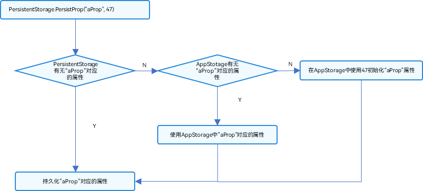


- 触发点击事件后：
  1. 状态变量@StorageLink('aProp') aProp改变，触发Text组件重新刷新。
  2. @StorageLink装饰的变量是和AppStorage中建立双向同步的，所以@StorageLink('aProp') aProp的变化会被同步回AppStorage中。
  3. AppStorage中“aProp”属性的改变会同步到所有绑定该“aProp”的单向或者双向变量，在本示例中没有其他的绑定“aProp”的变量。
  4. 因为“aProp”对应的属性已经被持久化，所以在AppStorage中“aProp”的改变会触发PersistentStorage将新的改变写入本地磁盘。
- 后续启动应用：
  1. 执行PersistentStorage.PersistProp('aProp', 47)，在首先查询在PersistentStorage本地文件查询“aProp”属性，成功查询到。
  2. 将在PersistentStorage查询到的值写入AppStorage中。
  3. 在Index组件里，@StorageLink绑定的“aProp”为PersistentStorage写入AppStorage中的值，即为上一次退出应用存入的值。
  
  

###### 在PersistentStorage之前访问AppStorage中的属性

该示例为**反例**。在调用PersistentStorage.PersistProp或者PersistProps之前使用接口访问AppStorage中的属性是错误的，因为这样的调用顺序会丢失上一次应用程序运行中的属性值：

```typescript
let aProp = AppStorage.SetOrCreate('aProp', 47);
PersistentStorage.PersistProp('aProp', 48);
```

应用在非首次运行时，先执行AppStorage.SetOrCreate('aProp', 47)：属性“aProp”在AppStorage中创建，其类型为number，其值设置为指定的默认值47。“aProp”是持久化的属性，所以会被写回PersistentStorage磁盘中，PersistentStorage存储的上次退出应用的值丢失。

PersistentStorage.PersistProp('aProp', 48)：在PersistentStorage中查找到“aProp”，值为刚刚使用AppStorage接口写入的47。


###### 在PersistentStorage之后访问AppStorage中的属性

开发者可以先判断是否需要覆盖上一次保存在PersistentStorage中的值，如果需要覆盖，再调用AppStorage的接口进行修改，如果不需要覆盖，则不调用AppStorage的接口。

```typescript
PersistentStorage.PersistProp('aProp', 48);
if (AppStorage.Get('aProp') > 50) {
    // 如果PersistentStorage存储的值超过50，设置为47
    AppStorage.SetOrCreate('aProp',47);
}
```

示例代码在读取PersistentStorage储存的数据后判断“aProp”的值是否大于50，如果大于50的话使用AppStorage的接口设置为47。


#### Environment：设备环境查询

开发者如果需要应用程序运行的设备的环境参数，以此来作出不同的场景判断，比如多语言，暗黑模式等，需要用到Environment设备环境查询。

Environment是ArkUI框架在应用程序启动时创建的单例对象。它为AppStorage提供了一系列描述应用程序运行状态的属性。Environment的所有属性都是不可变的（即应用不可写入），所有的属性都是简单类型。


###### Environment内置参数

| 键  | 数据类型 | 描述  |
| -- | -------- | ---- |
| accessibilityEnabled | boolean | 获取无障碍屏幕读取是否启用。  |
| colorMode            | ColorMode       | 色彩模型类型：选项为ColorMode.LIGHT: 浅色，ColorMode.DARK: 深色。 |
| fontScale            | number          | 字体大小比例，范围: [0.85, 1.45]。 |
| fontWeightScale      | number          | 字体粗细程度，范围: [0.6, 1.6]。|
| layoutDirection      | LayoutDirection | 布局方向类型：包括LayoutDirection.LTR: 从左到右，LayoutDirection.RTL: 从右到左。 |
| languageCode         | string          | 当前系统语言值，取值必须为小写字母, 例如zh。 |


###### 使用场景

###### 从UI中访问Environment参数

- 使用Environment.EnvProp将设备运行的环境变量存入AppStorage中：

  ```typescript
  // 将设备的语言code存入AppStorage，默认值为en
  Environment.EnvProp('languageCode', 'en');
  ```

- 可以使用@StorageProp链接到Component中。

  ```typescript
  @StorageProp('languageCode') lang : string = 'en';
  ```

设备环境到Component的更新链：Environment --> AppStorage -->Component。

> @StorageProp关联的环境参数可以在本地更改，但不能同步回AppStorage中，因为应用对环境变量参数是不可写的，只能在Environment中查询。

```typescript
// 将设备languageCode存入AppStorage中
Environment.EnvProp('languageCode', 'en');

@Entry
@Component
struct Index {
  @StorageProp('languageCode') languageCode: string = 'en';

  build() {
    Row() {
      Column() {
        // 输出当前设备的languageCode
        Text(this.languageCode)
      }
    }
  }
}
```


###### 应用逻辑使用Environment

```typescript
// 使用Environment.EnvProp将设备运行languageCode存入AppStorage中；
Environment.EnvProp('languageCode', 'en');
// 从AppStorage获取单向绑定的languageCode的变量
const lang: SubscribedAbstractProperty<string> = AppStorage.Prop('languageCode');

if (lang.get() === 'zh') {
  console.info('你好');
} else {
  console.info('Hello!');
}
```


### 其他状态管理

- **[其他状态管理概述](https://developer.huawei.com/consumer/cn/doc/harmonyos-guides-V2/arkts-other-state-mgmt-functions-overview-0000001530077309-V2)**
- **[@Watch装饰器：状态变量更改通知](https://developer.huawei.com/consumer/cn/doc/harmonyos-guides-V2/arkts-watch-0000001473697342-V2)**
- **[$$语法：内置组件双向同步](https://developer.huawei.com/consumer/cn/doc/harmonyos-guides-V2/arkts-two-way-sync-0000001473857342-V2)**


#### 其他状态管理概述

除了前面章节提到的组件状态管理和应用状态管理，ArkTS还提供了@Watch和$$来为开发者提供更多功能：

- @Watch用于监听状态变量的变化。
- [$$运算符](https://developer.huawei.com/consumer/cn/doc/harmonyos-guides-V2/arkts-two-way-sync-0000001473857342-V2)：给内置组件提供TS变量的引用，使得TS变量和内置组件的内部状态保持同步。


#### @Watch装饰器：状态变量更改通知

@Watch应用于对状态变量的监听。如果开发者需要关注某个状态变量的值是否改变，可以使用@Watch为状态变量设置回调函数。

> 从API version 9开始，该装饰器支持在ArkTS卡片中使用。


##### 概述

@Watch用于监听状态变量的变化，当状态变量变化时，@Watch的回调方法将被调用。@Watch在ArkUI框架内部判断数值有无更新使用的是严格相等（===），遵循严格相等规范。当在严格相等为false的情况下，就会触发@Watch的回调。


##### 装饰器说明

| @Watch补充变量装饰器 | 说明  |
| ---------------- | ------- |
| 装饰器参数  | 必填。常量字符串，字符串需要有引号。是(string) => void自定义成员函数的方法的引用。 |
| 可装饰的自定义组件变量 | 可监听所有装饰器装饰的状态变量。不允许监听常规变量。|
| 装饰器的顺序  | 建议@State、@Prop、@Link等装饰器在@Watch装饰器之前。  |

##### 语法说明

| 类型 | 说明    |
| ----- | ------ |
| (changedPropertyName? : string) => void | 该函数是自定义组件的成员函数，changedPropertyName是被watch的属性名。在多个状态变量绑定同一个@Watch的回调方法的时候，可以通过changedPropertyName进行不同的逻辑处理将属性名作为字符串输入参数，不返回任何内容。 |


##### 观察变化和行为表现

1. 当观察到状态变量的变化（包括双向绑定的AppStorage和LocalStorage中对应的key发生的变化）的时候，对应的@Watch的回调方法将被触发；
2. @Watch方法在自定义组件的属性变更之后同步执行；
3. 如果在@Watch的方法里改变了其他的状态变量，也会引起状态变更和@Watch的执行；
4. 在第一次初始化的时候，@Watch装饰的方法不会被调用，即认为初始化不是状态变量的改变。只有在后续状态改变时，才会调用@Watch回调方法。


##### 限制条件

- 建议开发者避免无限循环。循环可能是因为在@Watch的回调方法里直接或者间接地修改了同一个状态变量引起的。为了避免循环的产生，建议不要在@Watch的回调方法里修改当前装饰的状态变量；
- 开发者应关注性能，属性值更新函数会延迟组件的重新渲染（具体请见上面的行为表现），因此，回调函数应仅执行快速运算；
- 不建议在@Watch函数中调用async await，因为@Watch设计的用途是为了快速的计算，异步行为可能会导致重新渲染速度的性能问题。


##### 使用场景

###### @Watch和自定义组件更新

以下示例展示组件更新和@Watch的处理步骤。count在CountModifier中由@State装饰，在TotalView中由@Prop装饰。

```typescript
@Component
struct TotalView {
  @Prop @Watch('onCountUpdated') count: number;
  @State total: number = 0;
  // @Watch 回调
  onCountUpdated(propName: string): void {
    this.total += this.count;
  }

  build() {
    Text(`Total: ${this.total}`)
  }
}

@Entry
@Component
struct CountModifier {
  @State count: number = 0;

  build() {
    Column() {
      Button('add to basket')
        .onClick(() => {
          this.count++
        })
      TotalView({ count: this.count })
    }
  }
}
```

处理步骤：

1. CountModifier自定义组件的Button.onClick点击事件自增count。
2. 由于@State count变量更改，子组件TotalView中的@Prop被更新，其@Watch('onCountUpdated')方法被调用，更新了子组件TotalView 中的total变量。
3. 子组件TotalView中的Text重新渲染。


###### @Watch与@Link组合使用

以下示例说明了如何在子组件中观察@Link变量。

```typescript
class PurchaseItem {
  static NextId: number = 0;
  public id: number;
  public price: number;

  constructor(price: number) {
    this.id = PurchaseItem.NextId++;
    this.price = price;
  }
}

@Component
struct BasketViewer {
  @Link @Watch('onBasketUpdated') shopBasket: PurchaseItem[];
  @State totalPurchase: number = 0;

  updateTotal(): number {
    let total = this.shopBasket.reduce((sum, i) => sum + i.price, 0);
    // 超过100欧元可享受折扣
    if (total >= 100) {
      total = 0.9 * total;
    }
    return total;
  }
  // @Watch 回调
  onBasketUpdated(propName: string): void {
    this.totalPurchase = this.updateTotal();
  }

  build() {
    Column() {
      ForEach(this.shopBasket,
        (item) => {
          Text(`Price: ${item.price.toFixed(2)} €`)
        },
        item => item.id.toString()
      )
      Text(`Total: ${this.totalPurchase.toFixed(2)} €`)
    }
  }
}

@Entry
@Component
struct BasketModifier {
  @State shopBasket: PurchaseItem[] = [];

  build() {
    Column() {
      Button('Add to basket')
        .onClick(() => {
          this.shopBasket.push(new PurchaseItem(Math.round(100 * Math.random())))
        })
      BasketViewer({ shopBasket: $shopBasket })
    }
  }
}
```

处理步骤如下：

1. BasketModifier组件的Button.onClick向BasketModifier shopBasket中添加条目；
2. @Link装饰的BasketViewer shopBasket值发生变化；
3. 状态管理框架调用@Watch函数BasketViewer onBasketUpdated 更新BasketViewer TotalPurchase的值；
4. @Link shopBasket的改变，新增了数组项，ForEach组件会执行item Builder，渲染构建新的Item项；@State totalPurchase改变，对应的Text组件也重新渲染；重新渲染是异步发生的。


#### $$语法：内置组件双向同步

$$运算符为系统内置组件提供TS变量的引用，使得TS变量和系统内置组件的内部状态保持同步。

内部状态具体指什么取决于组件。例如，[Refresh](https://developer.huawei.com/consumer/cn/doc/harmonyos-references-V2/ts-container-refresh-0000001478181429-V2)组件的refreshing参数。


##### 使用规则

- 当前$$支持基础类型变量，以及@State、@Link和@Prop装饰的变量。
- 当前$$仅支持[Refresh](https://developer.huawei.com/consumer/cn/doc/harmonyos-references-V2/ts-container-refresh-0000001478181429-V2)组件的refreshing参数。
- $$绑定的变量变化时，会触发UI的同步刷新。


##### 使用示例

以[Refresh](https://developer.huawei.com/consumer/cn/doc/harmonyos-references-V2/ts-container-refresh-0000001478181429-V2)组件的refreshing参数为例：

当使用了$$符号绑定isRefreshing状态变量时，页面进行下拉操作，isRefreshing会变成true。

同时，Text中的isRefreshing状态也会同步改变为true，如果不使用$$符号绑定，则不会同步改变。

```typescript
// xxx.ets
@Entry
@Component
struct RefreshExample {
  @State isRefreshing: boolean = false
  @State counter: number = 0

  build() {
    Column() {
      Text('Pull Down and isRefreshing: ' + this.isRefreshing)
        .fontSize(30)
        .margin(10)

      Refresh({ refreshing: $$this.isRefreshing, offset: 120, friction: 100 }) {
        Text('Pull Down and refresh: ' + this.counter)
          .fontSize(30)
          .margin(10)
      }
      .onStateChange((refreshStatus: RefreshStatus) => {
        console.info('Refresh onStatueChange state is ' + refreshStatus)
      })
    }
  }
}
```

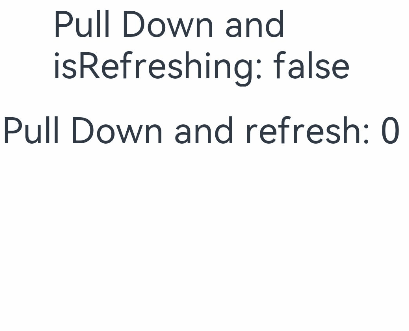

## 渲染控制

- **[渲染控制概述](https://developer.huawei.com/consumer/cn/doc/harmonyos-guides-V2/arkts-rendering-control-overview-0000001543911149-V2)**
- **[if/else：条件渲染](https://developer.huawei.com/consumer/cn/doc/harmonyos-guides-V2/arkts-rendering-control-ifelse-0000001524177637-V2)**
- **[ForEach：循环渲染](https://developer.huawei.com/consumer/cn/doc/harmonyos-guides-V2/arkts-rendering-control-foreach-0000001524537153-V2)**
- **[LazyForEach：数据懒加载](https://developer.huawei.com/consumer/cn/doc/harmonyos-guides-V2/arkts-rendering-control-lazyforeach-0000001524417213-V2)**


### 渲染控制概述

ArkUI通过[自定义组件](https://developer.huawei.com/consumer/cn/doc/harmonyos-guides-V2/arkts-create-custom-components-0000001473537046-V2)的build()函数和[@builder装饰器](https://developer.huawei.com/consumer/cn/doc/harmonyos-guides-V2/arkts-builder-0000001524176981-V2)中的声明式UI描述语句构建相应的UI。在声明式描述语句中开发者除了使用系统组件外，还可以使用渲染控制语句来辅助UI的构建，这些渲染控制语句包括控制组件是否显示的条件渲染语句，基于数组数据快速生成组件的循环渲染语句以及针对大数据量场景的数据懒加载语句。


### if/else：条件渲染

ArkTS提供了渲染控制的能力。条件渲染可根据应用的不同状态，使用if、else和else if渲染对应状态下的UI内容。

> 从API version 9开始，该接口支持在ArkTS卡片中使用。


#### 使用规则

- 支持if、else和else if语句。
- if、else if后跟随的条件语句可以使用状态变量。
- 允许在容器组件内使用，通过条件渲染语句构建不同的子组件。
- 条件渲染语句在涉及到组件的父子关系时是“透明”的，当父组件和子组件之间存在一个或多个if语句时，必须遵守父组件关于子组件使用的规则。
- 每个分支内部的构建函数必须遵循构建函数的规则，并创建一个或多个组件。无法创建组件的空构建函数会产生语法错误。
- 某些容器组件限制子组件的类型或数量，将条件渲染语句用于这些组件内时，这些限制将同样应用于条件渲染语句内创建的组件。例如，Grid容器组件的子组件仅支持GridItem组件，在Grid内使用条件渲染语句时，条件渲染语句内仅允许使用GridItem组件。


#### 更新机制

当if、else if后跟随的状态判断中使用的状态变量值变化时，条件渲染语句会进行更新，更新步骤如下：

1. 评估if和else if的状态判断条件，如果分支没有变化，无需执行以下步骤。如果分支有变化，则执行2、3步骤：
2. 删除此前构建的所有子组件。
3. 执行新分支的构造函数，将获取到的组件添加到if父容器中。如果缺少适用的else分支，则不构建任何内容。

条件可以包括Typescript表达式。对于构造函数中的表达式，此类表达式不得更改应用程序状态。


#### 使用场景

##### 使用if进行条件渲染

```
@Entry
@Component
struct ViewA {
  @State count: number = 0;

  build() {
    Column() {
      Text(`count=${this.count}`)

      if (this.count > 0) {
        Text(`count is positive`)
          .fontColor(Color.Green)
      }

      Button('increase count')
        .onClick(() => {
          this.count++;
        })

      Button('decrease count')
        .onClick(() => {
          this.count--;
        })
    }
  }
}
```

if语句的每个分支都包含一个构建函数。此类构建函数必须创建一个或多个子组件。在初始渲染时，if语句会执行构建函数，并将生成的子组件添加到其父组件中。

每当if或else if条件语句中使用的状态变量发生变化时，条件语句都会更新并重新评估新的条件值。如果条件值评估发生了变化，这意味着需要构建另一个条件分支。此时ArkUI框架将：

1. 删除所有以前渲染的（早期分支的）组件。
2. 执行新分支的构造函数，将生成的子组件添加到其父组件中。

在以上示例中，如果count从0增加到1，那么if语句更新，条件count > 0将重新评估，评估结果将从false更改为true。因此，将执行条件为真分支的构造函数，创建一个Text组件，并将它添加到父组件Column中。如果后续count更改为0，则Text组件将从Column组件中删除。由于没有else分支，因此不会执行新的构造函数。


#### if ... else ...语句和子组件状态

以下示例包含if ... else ...语句与拥有@State装饰变量的子组件。

```typescript
@Component
struct CounterView {
  @State counter: number = 0;
  label: string = 'unknown';

  build() {
    Row() {
      Text(`${this.label}`)
      Button(`counter ${this.counter} +1`)
        .onClick(() => {
          this.counter += 1;
        })
    }
  }
}

@Entry
@Component
struct MainView {
  @State toggle: boolean = true;

  build() {
    Column() {
      if (this.toggle) {
        CounterView({ label: 'CounterView #positive' })
      } else {
        CounterView({ label: 'CounterView #negative' })
      }
      Button(`toggle ${this.toggle}`)
        .onClick(() => {
          this.toggle = !this.toggle;
        })
    }
  }
}
```

CounterView（label为 'CounterView #positive'）子组件在初次渲染时创建。此子组件携带名为counter的状态变量。当修改CounterView.counter状态变量时，CounterView（label为 'CounterView #positive'）子组件重新渲染时并保留状态变量值。当MainView.toggle状态变量的值更改为false时，MainView父组件内的if语句将更新，随后将删除CounterView（label为 'CounterView #positive'）子组件。与此同时，将创建新的CounterView（label为 'CounterView #negative'）实例。而它自己的counter状态变量设置为初始值0。

> CounterView（label为 'CounterView #positive'）和CounterView（label为 'CounterView #negative'）是同一自定义组件的两个不同实例。if分支的更改，不会更新现有子组件，也不会保留状态。

以下示例展示了条件更改时，若需要保留counter值所做的修改。

```typescript
@Component
struct CounterView {
  @Link counter: number;
  label: string = 'unknown';

  build() {
    Row() {
      Text(`${this.label}`)
      Button(`counter ${this.counter} +1`)
        .onClick(() => {
          this.counter += 1;
        })
    }
  }
}

@Entry
@Component
struct MainView {
  @State toggle: boolean = true;
  @State counter: number = 0;

  build() {
    Column() {
      if (this.toggle) {
        CounterView({ counter: $counter, label: 'CounterView #positive' })
      } else {
        CounterView({ counter: $counter, label: 'CounterView #negative' })
      }
      Button(`toggle ${this.toggle}`)
        .onClick(() => {
          this.toggle = !this.toggle;
        })
    }
  }
}
```

此处，@State counter变量归父组件所有。因此，当CounterView组件实例被删除时，该变量不会被销毁。CounterView组件通过@Link装饰器引用状态。状态必须从子级移动到其父级（或父级的父级），以避免在条件内容或重复内容被销毁时丢失状态。


#### 嵌套if语句

条件语句的嵌套对父组件的相关规则没有影响。

```typescript
@Entry
@Component
struct CompA {
  @State toggle: boolean = false;
  @State toggleColor: boolean = false;

  build() {
    Column() {
      Text('Before')
        .fontSize(15)
      if (this.toggle) {
        Text('Top True, positive 1 top')
          .backgroundColor('#aaffaa').fontSize(20)
        // 内部if语句
        if (this.toggleColor) {
          Text('Top True, Nested True, positive COLOR  Nested ')
            .backgroundColor('#00aaaa').fontSize(15)
        } else {
          Text('Top True, Nested False, Negative COLOR  Nested ')
            .backgroundColor('#aaaaff').fontSize(15)
        }
      } else {
        Text('Top false, negative top level').fontSize(20)
          .backgroundColor('#ffaaaa')
        if (this.toggleColor) {
          Text('positive COLOR  Nested ')
            .backgroundColor('#00aaaa').fontSize(15)
        } else {
          Text('Negative COLOR  Nested ')
            .backgroundColor('#aaaaff').fontSize(15)
        }
      }
      Text('After')
        .fontSize(15)
      Button('Toggle Outer')
        .onClick(() => {
          this.toggle = !this.toggle;
        })
      Button('Toggle Inner')
        .onClick(() => {
          this.toggleColor = !this.toggleColor;
        })
    }
  }
}
```


### ForEach：循环渲染

ForEach接口基于数组类型数据来进行循环渲染，需要与容器组件配合使用，且接口返回的组件应当是允许包含在ForEach父容器组件中的子组件。例如，ListItem组件要求ForEach的父容器组件必须为[List组件](https://developer.huawei.com/consumer/cn/doc/harmonyos-references-V2/ts-container-list-0000001477981213-V2)。

> 从API version 9开始，该接口支持在ArkTS卡片中使用。

#### 接口描述

```typescript
ForEach(
  arr: Array,
  itemGenerator: (item: any, index?: number) => void,
  keyGenerator?: (item: any, index?: number) => string
)
```

| 参数名        | 参数类型                              | 必填 | 参数描述                                                     |
| ------------- | ------------------------------------- | ---- | ------------------------------------------------------------ |
| arr           | Array                                 | 是   | 数据源，为Array类型的数组。**说明**：- 可以设置为空数组，此时不会创建子组件。- 可以设置返回值为数组类型的函数，例如arr.slice(1, 3)，但设置的函数不应改变包括数组本身在内的任何状态变量，例如不应使用Array.splice(),Array.sort()或Array.reverse()这些会改变原数组的函数。 |
| itemGenerator | (item: any, index?: number) => void   | 是   | 组件生成函数。- 为数组中的每个元素创建对应的组件。- item参数：arr数组中的数据项。- index参数（可选）：arr数组中的数据项索引。**说明**：- 组件的类型必须是ForEach的父容器所允许的。例如，ListItem组件要求ForEach的父容器组件必须为List组件。 |
| keyGenerator  | (item: any, index?: number) => string | 否   | 键值生成函数。- 为数据源arr的每个数组项生成唯一且持久的键值。函数返回值为开发者自定义的键值生成规则。- item参数：arr数组中的数据项。- index参数（可选）：arr数组中的数据项索引。**说明**：- 如果函数缺省，框架默认的键值生成函数为(item: T, index: number) => { return index + '__' + JSON.stringify(item); }- 键值生成函数不应改变任何组件状态。 |

> - ForEach的itemGenerator函数可以包含if/else条件渲染逻辑。另外，也可以在if/else条件渲染语句中使用ForEach组件。
> - 在初始化渲染时，ForEach会加载数据源的所有数据，并为每个数据项创建对应的组件，然后将其挂载到渲染树上。如果数据源非常大或有特定的性能需求，建议使用LazyForEach组件。

#### 键值生成规则

在ForEach循环渲染过程中，系统会为每个数组元素生成一个唯一且持久的键值，用于标识对应的组件。当这个键值变化时，ArkUI框架将视为该数组元素已被替换或修改，并会基于新的键值创建一个新的组件。

ForEach提供了一个名为keyGenerator的参数，这是一个函数，开发者可以通过它自定义键值的生成规则。如果开发者没有定义keyGenerator函数，则ArkUI框架会使用默认的键值生成函数，即(item: any, index: number) => { return index + '__' + JSON.stringify(item); }。

ArkUI框架对于ForEach的键值生成有一套特定的判断规则，这主要与itemGenerator函数的第二个参数index以及keyGenerator函数的第二个参数index有关，具体的键值生成规则判断逻辑如下图所示。

**图1** ForEach键值生成规则
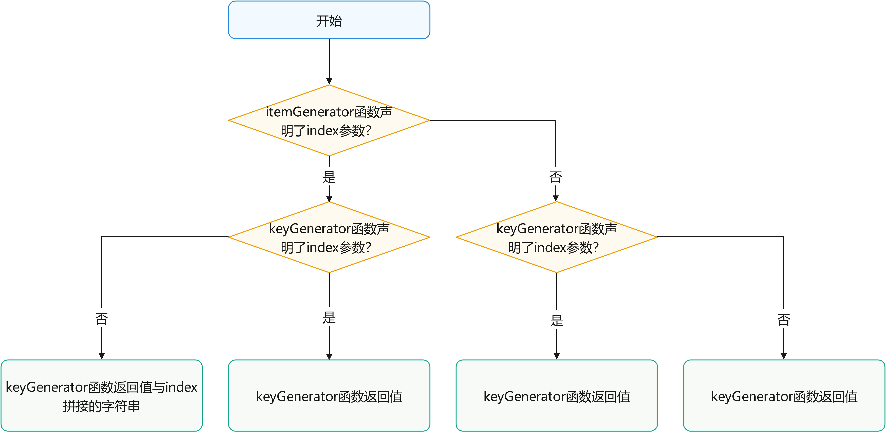

> ArkUI框架会对重复的键值发出警告。在UI更新的场景下，如果出现重复的键值，框架可能无法正常工作，具体请参见[渲染结果非预期](https://developer.huawei.com/consumer/cn/doc/harmonyos-guides-V2/arkts-rendering-control-foreach-0000001524537153-V2#section223mcpsimp)。


#### 组件创建规则

在确定键值生成规则后，ForEach的第二个参数itemGenerator函数会根据键值生成规则为数据源的每个数组项创建组件。组件的创建包括两种情况：[ForEach首次渲染](https://developer.huawei.com/consumer/cn/doc/harmonyos-guides-V2/arkts-rendering-control-foreach-0000001524537153-V2#section159mcpsimp)和[ForEach非首次渲染](https://developer.huawei.com/consumer/cn/doc/harmonyos-guides-V2/arkts-rendering-control-foreach-0000001524537153-V2#section169mcpsimp)。


##### 首次渲染

在ForEach首次渲染时，会根据前述键值生成规则为数据源的每个数组项生成唯一键值，并创建相应的组件。

```typescript
@Entry
@Component
struct Parent {
  @State simpleList: Array<string> = ['one', 'two', 'three'];

  build() {
    Row() {
      Column() {
        ForEach(this.simpleList, (item: string) => {
          ChildItem({ 'item': item } as Record<string, string>)
        }, (item: string) => item)
      }
      .width('100%')
      .height('100%')
    }
    .height('100%')
    .backgroundColor(0xF1F3F5)
  }
}

@Component
struct ChildItem {
  @Prop item: string;

  build() {
    Text(this.item)
      .fontSize(50)
  }
}
```

运行效果如下图所示。

**图2** ForEach数据源不存在相同值案例首次渲染运行效果图


在上述代码中，键值生成规则是keyGenerator函数的返回值item。在ForEach渲染循环时，为数据源数组项依次生成键值one、two和three，并创建对应的ChildItem组件渲染到界面上。

当不同数组项按照键值生成规则生成的键值相同时，框架的行为是未定义的。例如，在以下代码中，ForEach渲染相同的数据项two时，只创建了一个ChildItem组件，而没有创建多个具有相同键值的组件。

```typescript
@Entry
@Component
struct Parent {
  @State simpleList: Array<string> = ['one', 'two', 'two', 'three'];

  build() {
    Row() {
      Column() {
        ForEach(this.simpleList, (item: string) => {
          ChildItem({ 'item': item } as Record<string, string>)
        }, (item: string) => item)
      }
      .width('100%')
      .height('100%')
    }
    .height('100%')
    .backgroundColor(0xF1F3F5)
  }
}

@Component
struct ChildItem {
  @Prop item: string;

  build() {
    Text(this.item)
      .fontSize(50)
  }
}
```

运行效果如下图所示。

**图3** ForEach数据源存在相同值案例首次渲染运行效果图


在该示例中，最终键值生成规则为item。当ForEach遍历数据源simpleList，遍历到索引为1的two时，按照最终键值生成规则生成键值为two的组件并进行标记。当遍历到索引为2的two时，按照最终键值生成规则当前项的键值也为two，此时不再创建新的组件。


##### 非首次渲染

在ForEach组件进行非首次渲染时，它会检查新生成的键值是否在上次渲染中已经存在。如果键值不存在，则会创建一个新的组件；如果键值存在，则不会创建新的组件，而是直接渲染该键值所对应的组件。例如，在以下的代码示例中，通过点击事件修改了数组的第三项值为"new three"，这将触发ForEach组件进行非首次渲染。

```typescript
@Entry
@Component
struct Parent {
  @State simpleList: Array<string> = ['one', 'two', 'three'];

  build() {
    Row() {
      Column() {
        Text('点击修改第3个数组项的值')
          .fontSize(24)
          .fontColor(Color.Red)
          .onClick(() => {
            this.simpleList[2] = 'new three';
          })

        ForEach(this.simpleList, (item: string) => {
          ChildItem({ item: item })
            .margin({ top: 20 })
        }, (item: string) => item)
      }
      .justifyContent(FlexAlign.Center)
      .width('100%')
      .height('100%')
    }
    .height('100%')
    .backgroundColor(0xF1F3F5)
  }
}

@Component
struct ChildItem {
  @Prop item: string;

  build() {
    Text(this.item)
      .fontSize(30)
  }
}
```

运行效果如下图所示。

**图4** ForEach非首次渲染案例运行效果图
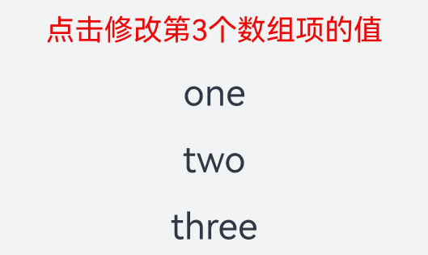

从本例可以看出@State 能够监听到简单数据类型数组数据源 simpleList 数组项的变化。

1. 当 simpleList 数组项发生变化时，会触发 ForEach 进行重新渲染。
2. ForEach 遍历新的数据源 ['one', 'two', 'new three']，并生成对应的键值one、two和new three。
3. 其中，键值one和two在上次渲染中已经存在，所以 ForEach 复用了对应的组件并进行了渲染。对于第三个数组项 "new three"，由于其通过键值生成规则 item 生成的键值new three在上次渲染中不存在，因此 ForEach 为该数组项创建了一个新的组件。


#### 使用场景

ForEach组件在开发过程中的主要应用场景包括：[数据源不变](https://developer.huawei.com/consumer/cn/doc/harmonyos-guides-V2/arkts-rendering-control-foreach-0000001524537153-V2#section182mcpsimp)、[数据源数组项发生变化](https://developer.huawei.com/consumer/cn/doc/harmonyos-guides-V2/arkts-rendering-control-foreach-0000001524537153-V2#section189mcpsimp)（如插入、删除操作）、[数据源数组项子属性变化](https://developer.huawei.com/consumer/cn/doc/harmonyos-guides-V2/arkts-rendering-control-foreach-0000001524537153-V2#section15662921144118)。


##### 数据源不变

在数据源保持不变的场景中，数据源可以直接采用基本数据类型。例如，在页面加载状态时，可以使用骨架屏列表进行渲染展示。

```typescript
@Entry
@Component
struct ArticleList {
  @State simpleList: Array<number> = [1, 2, 3, 4, 5];

  build() {
    Column() {
      ForEach(this.simpleList, (item: string) => {
        ArticleSkeletonView()
          .margin({ top: 20 })
      }, (item: string) => item)
    }
    .padding(20)
    .width('100%')
    .height('100%')
  }
}

@Builder
function textArea(width: number | Resource | string = '100%', height: number | Resource | string = '100%') {
  Row()
    .width(width)
    .height(height)
    .backgroundColor('#FFF2F3F4')
}

@Component
struct ArticleSkeletonView {
  build() {
    Row() {
      Column() {
        textArea(80, 80)
      }
      .margin({ right: 20 })

      Column() {
        textArea('60%', 20)
        textArea('50%', 20)
      }
      .alignItems(HorizontalAlign.Start)
      .justifyContent(FlexAlign.SpaceAround)
      .height('100%')
    }
    .padding(20)
    .borderRadius(12)
    .backgroundColor('#FFECECEC')
    .height(120)
    .width('100%')
    .justifyContent(FlexAlign.SpaceBetween)
  }
}
```

运行效果如下图所示。

**图5** 骨架屏运行效果图


在本示例中，采用数据项item作为键值生成规则，由于数据源simpleList的数组项各不相同，因此能够保证键值的唯一性。


##### 数据源数组项发生变化

在数据源数组项发生变化的场景下，例如进行数组插入、删除操作或者数组项索引位置发生交换时，数据源应为对象数组类型，并使用对象的唯一ID作为最终键值。例如，当在页面上通过手势上滑加载下一页数据时，会在数据源数组尾部新增新获取的数据项，从而使得数据源数组长度增大。

```typescript
class Article {
  id: string;
  title: string;
  brief: string;

  constructor(id: string, title: string, brief: string) {
    this.id = id;
    this.title = title;
    this.brief = brief;
  }
}

@Entry
@Component
struct ArticleListView {
  @State isListReachEnd: boolean = false;
  @State articleList: Array<Article> = [
    new Article('001', '第1篇文章', '文章简介内容'),
    new Article('002', '第2篇文章', '文章简介内容'),
    new Article('003', '第3篇文章', '文章简介内容'),
    new Article('004', '第4篇文章', '文章简介内容'),
    new Article('005', '第5篇文章', '文章简介内容'),
    new Article('006', '第6篇文章', '文章简介内容')
  ]

  loadMoreArticles() {
    this.articleList.push(new Article('007', '加载的新文章', '文章简介内容'));
  }

  build() {
    Column({ space: 5 }) {
      List() {
        ForEach(this.articleList, (item: Article) => {
          ListItem() {
            ArticleCard({ article: item })
              .margin({ top: 20 })
          }
        }, (item: Article) => item.id)
      }
      .onReachEnd(() => {
        this.isListReachEnd = true;
      })
      .parallelGesture(
        PanGesture({ direction: PanDirection.Up, distance: 80 })
          .onActionStart(() => {
            if (this.isListReachEnd) {
              this.loadMoreArticles();
              this.isListReachEnd = false;
            }
          })
      )
      .padding(20)
      .scrollBar(BarState.Off)
    }
    .width('100%')
    .height('100%')
    .backgroundColor(0xF1F3F5)
  }
}

@Component
struct ArticleCard {
  @Prop article: Article;

  build() {
    Row() {
      Image($r('app.media.icon'))
        .width(80)
        .height(80)
        .margin({ right: 20 })

      Column() {
        Text(this.article.title)
          .fontSize(20)
          .margin({ bottom: 8 })
        Text(this.article.brief)
          .fontSize(16)
          .fontColor(Color.Gray)
          .margin({ bottom: 8 })
      }
      .alignItems(HorizontalAlign.Start)
      .width('80%')
      .height('100%')
    }
    .padding(20)
    .borderRadius(12)
    .backgroundColor('#FFECECEC')
    .height(120)
    .width('100%')
    .justifyContent(FlexAlign.SpaceBetween)
  }
}
```

初始运行效果（左图）和手势上滑加载后效果（右图）如下图所示。

**图6** 数据源数组项变化案例运行效果图
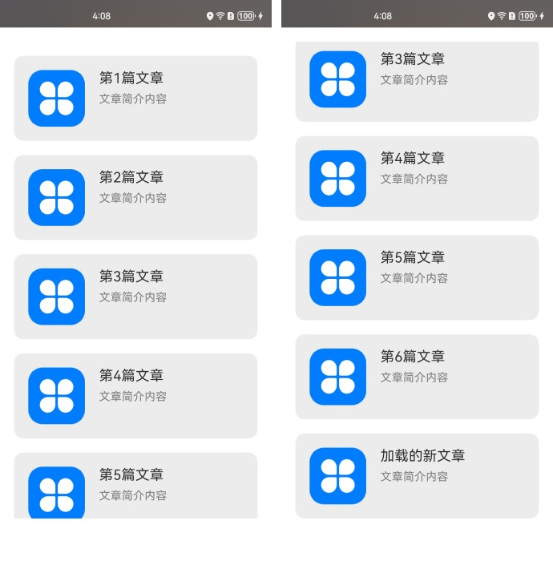

在本示例中，ArticleCard组件作为ArticleListView组件的子组件，通过@Prop装饰器接收一个Article对象，用于渲染文章卡片。

1. 当列表滚动到底部时，如果手势滑动距离超过指定的80，将触发loadMoreArticle()函数。此函数会在articleList数据源的尾部添加一个新的数据项，从而增加数据源的长度。
2. 数据源被@State装饰器修饰，ArkUI框架能够感知到数据源长度的变化，并触发ForEach进行重新渲染。


##### 数据源数组项子属性变化

当数据源的数组项为对象数据类型，并且只修改某个数组项的属性值时，由于数据源为复杂数据类型，ArkUI框架无法监听到@State装饰器修饰的数据源数组项的属性变化，从而无法触发ForEach的重新渲染。为实现ForEach重新渲染，需要结合@Observed和@ObjectLink装饰器使用。例如，在文章列表卡片上点击“点赞”按钮，从而修改文章的点赞数量。

```typescript
@Observed
class Article {
  id: string;
  title: string;
  brief: string;
  isLiked: boolean;
  likesCount: number;

  constructor(id: string, title: string, brief: string, isLiked: boolean, likesCount: number) {
    this.id = id;
    this.title = title;
    this.brief = brief;
    this.isLiked = isLiked;
    this.likesCount = likesCount;
  }
}

@Entry
@Component
struct ArticleListView {
  @State articleList: Array<Article> = [
    new Article('001', '第0篇文章', '文章简介内容', false, 100),
    new Article('002', '第1篇文章', '文章简介内容', false, 100),
    new Article('003', '第2篇文章', '文章简介内容', false, 100),
    new Article('004', '第4篇文章', '文章简介内容', false, 100),
    new Article('005', '第5篇文章', '文章简介内容', false, 100),
    new Article('006', '第6篇文章', '文章简介内容', false, 100),
  ];

  build() {
    List() {
      ForEach(this.articleList, (item: Article) => {
        ListItem() {
          ArticleCard({
            article: item
          })
            .margin({ top: 20 })
        }
      }, (item: Article) => item.id)
    }
    .padding(20)
    .scrollBar(BarState.Off)
    .backgroundColor(0xF1F3F5)
  }
}

@Component
struct ArticleCard {
  @ObjectLink article: Article;

  handleLiked() {
    this.article.isLiked = !this.article.isLiked;
    this.article.likesCount = this.article.isLiked ? this.article.likesCount + 1 : this.article.likesCount - 1;
  }

  build() {
    Row() {
      Image($r('app.media.icon'))
        .width(80)
        .height(80)
        .margin({ right: 20 })

      Column() {
        Text(this.article.title)
          .fontSize(20)
          .margin({ bottom: 8 })
        Text(this.article.brief)
          .fontSize(16)
          .fontColor(Color.Gray)
          .margin({ bottom: 8 })

        Row() {
          Image(this.article.isLiked ? $r('app.media.iconLiked') : $r('app.media.iconUnLiked'))
            .width(24)
            .height(24)
            .margin({ right: 8 })
          Text(this.article.likesCount.toString())
            .fontSize(16)
        }
        .onClick(() => this.handleLiked())
        .justifyContent(FlexAlign.Center)
      }
      .alignItems(HorizontalAlign.Start)
      .width('80%')
      .height('100%')
    }
    .padding(20)
    .borderRadius(12)
    .backgroundColor('#FFECECEC')
    .height(120)
    .width('100%')
    .justifyContent(FlexAlign.SpaceBetween)
  }
}
```

上述代码的初始运行效果（左图）和点击第1个文章卡片上的点赞图标后的运行效果（右图）如下图所示。

**图7** 数据源数组项子属性变化案例运行效果图
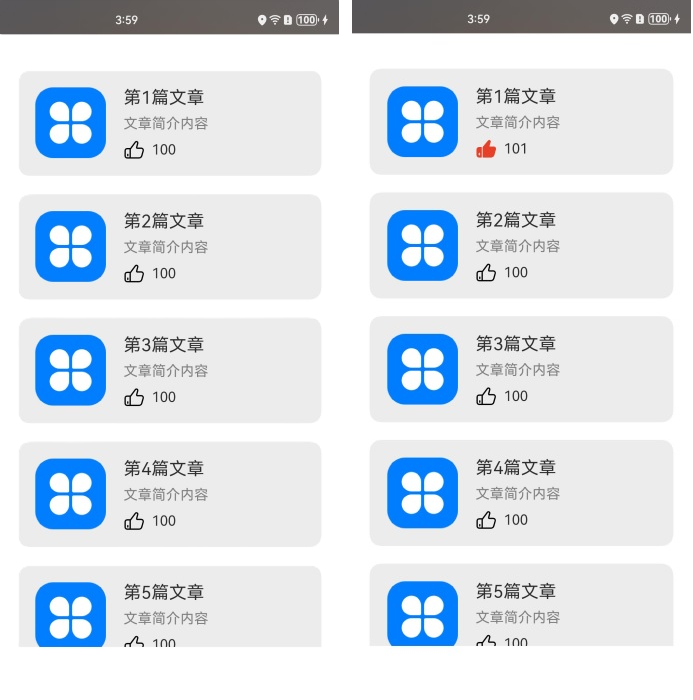

在本示例中，Article类被@Observed装饰器修饰。父组件ArticleListView传入Article对象实例给子组件ArticleCard，子组件使用@ObjectLink装饰器接收该实例。

1. 当点击第1个文章卡片上的点赞图标时，会触发ArticleCard组件的handleLiked函数。该函数修改第1个卡片对应组件里article实例的isLiked和likesCount属性值。
2. 由于子组件ArticleCard中的article使用了@ObjectLink装饰器，父子组件共享同一份article数据。因此，父组件中articleList的第1个数组项的isLiked和likedCounts数值也会同步修改。
3. 当父组件监听到数据源数组项属性值变化时，会触发ForEach重新渲染。
4. 在此处，ForEach键值生成规则为数组项的id属性值。当ForEach遍历新数据源时，数组项的id均没有变化，不会新建组件。
5. 渲染第1个数组项对应的ArticleCard组件时，读取到的isLiked和likesCount为修改后的新值。


#### 使用建议

- 尽量避免在最终的键值生成规则中包含数据项索引index，以防止出现[渲染结果非预期](https://developer.huawei.com/consumer/cn/doc/harmonyos-guides-V2/arkts-rendering-control-foreach-0000001524537153-V2#section223mcpsimp)和[渲染性能降低](https://developer.huawei.com/consumer/cn/doc/harmonyos-guides-V2/arkts-rendering-control-foreach-0000001524537153-V2#section234mcpsimp)。如果业务确实需要使用index，例如列表需要通过index进行条件渲染，开发者需要接受ForEach在改变数据源后重新创建组件所带来的性能损耗。
- 为满足键值的唯一性，对于对象数据类型，建议使用对象数据中的唯一id作为键值。
- 基本数据类型的数据项没有唯一ID属性。如果使用基本数据类型本身作为键值，必须确保数组项无重复。因此，对于数据源会发生变化的场景，建议将基本数据类型数组转化为具备唯一ID属性的对象数据类型数组，再使用ID属性作为键值生成规则。


#### 不推荐案例

开发者在使用ForEach的过程中，若对于键值生成规则的理解不够充分，可能会出现错误的使用方式。错误使用一方面会导致功能层面问题，例如[渲染结果非预期](https://developer.huawei.com/consumer/cn/doc/harmonyos-guides-V2/arkts-rendering-control-foreach-0000001524537153-V2#section223mcpsimp)，另一方面会导致性能层面问题，例如[渲染性能降低](https://developer.huawei.com/consumer/cn/doc/harmonyos-guides-V2/arkts-rendering-control-foreach-0000001524537153-V2#section234mcpsimp)。


##### 渲染结果非预期

在本示例中，通过设置ForEach的第三个参数KeyGenerator函数，自定义键值生成规则为数据源的索引index的字符串类型值。当点击父组件Parent中“在第1项后插入新项”文本组件后，界面会出现非预期的结果。

```typescript
@Entry
@Component
struct Parent {
  @State simpleList: Array<string> = ['one', 'two', 'three'];

  build() {
    Column() {
      Button() {
        Text('在第1项后插入新项').fontSize(30)
      }
      .onClick(() => {
        this.simpleList.splice(1, 0, 'new item');
      })

      ForEach(this.simpleList, (item: string) => {
        ChildItem({ 'item': item } as Record<string, string>)
      }, (item: string, index: number) => index.toString())
    }
    .justifyContent(FlexAlign.Center)
    .width('100%')
    .height('100%')
    .backgroundColor(0xF1F3F5)
  }
}

@Component
struct ChildItem {
  @Prop item: string;

  build() {
    Text(this.item)
      .fontSize(30)
  }
}}}
```

上述代码的初始渲染效果（左图）和点击“在第1项后插入新项”文本组件后的渲染效果（右图）如下图所示。

**图8** 渲染结果非预期运行效果图
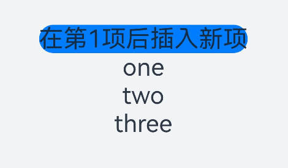

ForEach在首次渲染时，创建的键值依次为"0"、"1"、"2"。

插入新项后，数据源simpleList变为['one', 'new item', 'two', 'three']，框架监听到@State装饰的数据源长度变化触发ForEach重新渲染。

ForEach依次遍历新数据源，遍历数据项"one"时生成键值"0"，存在相同键值，因此不创建新组件。继续遍历数据项"new item"时生成键值"1"，存在相同键值，因此不创建新组件。继续遍历数据项"two"生成键值"2"，存在相同键值，因此不创建新组件。最后遍历数据项"three"时生成键值"3"，不存在相同键值，创建内容为"three"的新组件并渲染。

从以上可以看出，当最终键值生成规则包含index时，期望的界面渲染结果为['one', 'new item', 'two', 'three']，而实际的渲染结果为['one', 'two', 'three', 'three']，渲染结果不符合开发者预期。因此，开发者在使用ForEach时应尽量避免最终键值生成规则中包含index。


##### 渲染性能降低

在本示例中，ForEach的第三个参数KeyGenerator函数处于缺省状态。根据上述[键值生成规则](https://developer.huawei.com/consumer/cn/doc/harmonyos-guides-V2/arkts-rendering-control-foreach-0000001524537153-V2#section147mcpsimp)，此例使用框架默认的键值生成规则，即最终键值为字符串index + '__' + JSON.stringify(item)。当点击“在第1项后插入新项”文本组件后，ForEach将需要为第2个数组项以及其后的所有项重新创建组件。

```typescript
@Entry
@Component
struct Parent {
  @State simpleList: Array<string> = ['one', 'two', 'three'];

  build() {
    Column() {
      Button() {
        Text('在第1项后插入新项').fontSize(30)
      }
      .onClick(() => {
        this.simpleList.splice(1, 0, 'new item');
        console.log(`[onClick]: simpleList is ${JSON.stringify(this.simpleList)}`);
      })

      ForEach(this.simpleList, (item: string) => {
        ChildItem({ 'item': item } as Record<string, string>)
      })
    }
    .justifyContent(FlexAlign.Center)
    .width('100%')
    .height('100%')
    .backgroundColor(0xF1F3F5)
  }
}

@Component
struct ChildItem {
  @Prop item: string;

  aboutToAppear() {
    console.log(`[aboutToAppear]: item is ${this.item}`);
  }

  build() {
    Text(this.item)
      .fontSize(50)
  }
}
```

以上代码的初始渲染效果（左图）和点击"在第1项后插入新项"文本组件后的渲染效果（右图）如下所示。

**图9** 渲染性能降低案例运行效果图
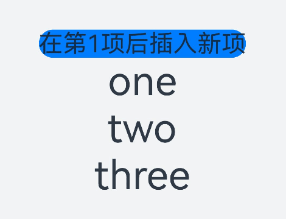

点击“在第1项后插入新项”文本组件后，IDE的日志打印结果如下所示。

**图10** 插入新项后渲染效果
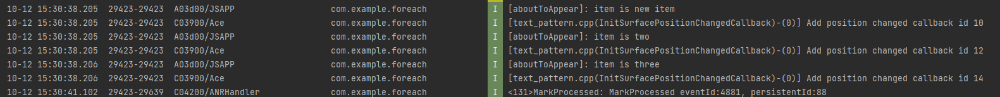

插入新项后，ForEach为new item、 two、 three三个数组项创建了对应的组件ChildItem，并执行了组件的[aboutToAppear()](https://developer.huawei.com/consumer/cn/doc/harmonyos-references-V2/arkts-custom-component-lifecycle-0000001482395076-V2)生命周期函数。这是因为：

1. 在ForEach首次渲染时，创建的键值依次为0__one、1__two、2__three。
2. 插入新项后，数据源simpleList变为['one', 'new item', 'two', 'three']，ArkUI框架监听到@State装饰的数据源长度变化触发ForEach重新渲染。
3. ForEach依次遍历新数据源，遍历数据项one时生成键值0__one，键值已存在，因此不创建新组件。继续遍历数据项new item时生成键值1__new item，不存在相同键值，创建内容为new item的新组件并渲染。继续遍历数据项two生成键值2__two，不存在相同键值，创建内容为two的新组件并渲染。最后遍历数据项three时生成键值3__three，不存在相同键值，创建内容为three的新组件并渲染。

尽管此示例中界面渲染的结果符合预期，但每次插入一条新数组项时，ForEach都会为从该数组项起后面的所有数组项全部重新创建组件。当数据源数据量较大或组件结构复杂时，由于组件无法得到复用，将导致性能体验不佳。因此，除非必要，否则不推荐将第三个参数KeyGenerator函数处于缺省状态，以及在键值生成规则中包含数据项索引index。

