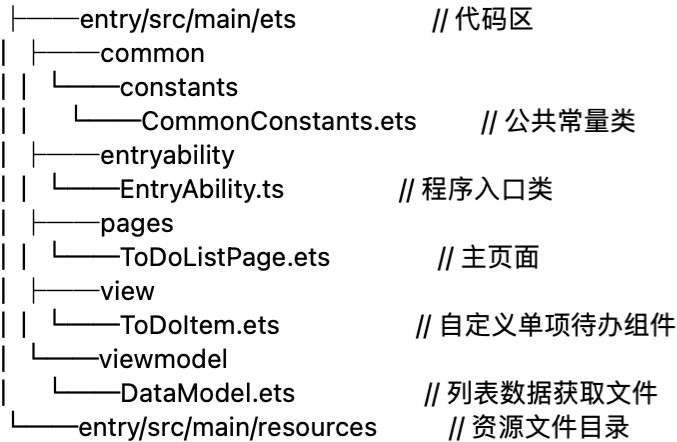

# 基础知识实战-水果排行榜

> 具体代码查看ArkTsBaase

## 效果


## 代码结构


## 使用@Link封装标题组件

> 在TitleComponent文件中，首先使用struct对象创建自定义组件，然后使用@Link修饰器管理TitleComponent组件内的状态变量isRefreshData，状态变量isRefreshData值发生改变后，通过@Link装饰器通知页面刷新List中的数据。

```typescript
// TitleComponent.ets
...
@Component
export struct TitleComponent {
  @Link isRefreshData: boolean; // 判断是否刷新数据
  @State title: Resource = $r('app.string.title_default');

  build() {
    Row() {
      ...
      Row() {
        Image($r('app.media.loading'))
          .height(TitleBarStyle.IMAGE_LOADING_SIZE)
          .width(TitleBarStyle.IMAGE_LOADING_SIZE)
          .onClick(() => {
            this.isRefreshData = !this.isRefreshData;
          })
      }
      .width(TitleBarStyle.WEIGHT)
      .height(WEIGHT)
      .justifyContent(FlexAlign.End)
    }
   ...
  }
}
```

## 封装列表头部样式组件

> 在ListHeaderComponent文件中，我们使用常规成员变量来设置自定义组件ListHeaderComponent的widthValue和paddingValue。

```typescript
// ListHeaderComponent.ets
...
@Component
export struct ListHeaderComponent {
  paddingValue: Padding | Length = 0;
  widthValue: Length = 0;

  build() {
    Row() {
      Text($r('app.string.page_number'))
        .fontSize(FontSize.SMALL)
        .width(ListHeaderStyle.LAYOUT_WEIGHT_LEFT)
        .fontWeight(ListHeaderStyle.FONT_WEIGHT)
        .fontColor($r('app.color.font_description'))
      Text($r('app.string.page_type'))
        .fontSize(FontSize.SMALL)
        .width(ListHeaderStyle.LAYOUT_WEIGHT_CENTER)
        .fontWeight(ListHeaderStyle.FONT_WEIGHT)
        .fontColor($r('app.color.font_description'))
      Text($r('app.string.page_vote'))
        .fontSize(FontSize.SMALL)
        .width(ListHeaderStyle.LAYOUT_WEIGHT_RIGHT)
        .fontWeight(ListHeaderStyle.FONT_WEIGHT)
        .fontColor($r('app.color.font_description'))
    }
    .width(this.widthValue)
    .padding(this.paddingValue)
  }
}
```

## 创建ListItemComponent

> 为了体现@Prop单向绑定功能，我们在ListItemComponent组件中添加了一个@Prop修饰的字段isSwitchDataSource，当通过点击改变ListItemComponent组件中isSwitchDataSource状态时，ListItemComponent作为List的子组件，并不会通知其父组件List刷新状态。
>
> 在代码中，我们使用@State管理ListItemComponent中的 isChange 状态，当用户点击ListItemComponent时，ListItemComponent组件中的文本颜色发生变化。我们使用条件渲染控制语句，创建的圆型文本组件。

```typescript
// ListItemComponent.ets
...
@Component
export struct ListItemComponent {
  index?: number;
  private name?: Resource;
  private vote: string = '';
  @Prop isSwitchDataSource: boolean = false;
  // 判断是否改变ListItemComponent字体颜色
  @State isChange: boolean = false;

  build() {
    Row() {
      Column() {
        if (this.isRenderCircleText()) {
          if (this.index !== undefined) {
            this.CircleText(this.index);
          }
        } else {
          Text(this.index?.toString())
            .lineHeight(ItemStyle.TEXT_LAYOUT_SIZE)
            .textAlign(TextAlign.Center)
            .width(ItemStyle.TEXT_LAYOUT_SIZE)
            .fontWeight(FontWeight.Bold)
            .fontSize(FontSize.SMALL)
        }
      }
      .width(ItemStyle.LAYOUT_WEIGHT_LEFT)
      .alignItems(HorizontalAlign.Start)

      Text(this.name)
        .width(ItemStyle.LAYOUT_WEIGHT_CENTER)
        .fontWeight(FontWeight.Bolder)
        .fontSize(FontSize.MIDDLE)
        .fontColor(this.isChange ? ItemStyle.COLOR_BLUE : ItemStyle.COLOR_BLACK)
      Text(this.vote)
        .width(ItemStyle.LAYOUT_WEIGHT_RIGHT)
        .fontWeight(FontWeight.Bold)
        .fontSize(FontSize.SMALL)
        .fontColor(this.isChange ? ItemStyle.COLOR_BLUE : ItemStyle.COLOR_BLACK)
    }
    .height(ItemStyle.BAR_HEIGHT)
    .width(WEIGHT)
    .onClick(() => {
      this.isSwitchDataSource = !this.isSwitchDataSource;
      this.isChange = !this.isChange;
    })
  }
  ...
}
```

## 创建RankList

> 为了简化代码，提高代码的可读性，我们使用@Builder描述排行列表布局内容，使用循环渲染组件ForEach创建ListItem。

```typescript
// RankPage.ets
...
  build() {
    Column() {
      // 顶部标题组件
      TitleComponent({ isRefreshData: $isSwitchDataSource, title: TITLE })
      // 列表头部样式
      ListHeaderComponent({
        paddingValue: { 
          left: Style.RANK_PADDING,
          right: Style.RANK_PADDING 
        },
        widthValue: Style.CONTENT_WIDTH
      })
        .margin({ 
          top: Style.HEADER_MARGIN_TOP,
          bottom: Style.HEADER_MARGIN_BOTTOM 
        })
      // 列表区域
      this.RankList(Style.CONTENT_WIDTH)
    }
    .backgroundColor($r('app.color.background'))
    .height(WEIGHT)
    .width(WEIGHT)
  }

  @Builder RankList(widthValue: Length) {
    Column() {
      List() {
        ForEach(this.isSwitchDataSource ? this.dataSource1 : this.dataSource2,
          (item: RankData, index?: number) => {
            ListItem() {
              ListItemComponent({ 
                index: index + 1),
                name: item.name,
                vote: item.vote,
                isSwitchDataSource: this.isSwitchDataSource
              })
            }
          }, (item: RankData) => JSON.stringify(item))
      }
      .width(WEIGHT)
      .height(Style.LIST_HEIGHT)
      .divider({ strokeWidth: Style.STROKE_WIDTH })
    }
    .padding({ 
      left: Style.RANK_PADDING,
      right: Style.RANK_PADDING 
    })
    .borderRadius(Style.BORDER_RADIUS)
    .width(widthValue)
    .alignItems(HorizontalAlign.Center)
    .backgroundColor(Color.White)
  }
...
```

## 使用自定义组件生命周期函数

> 我们通过点击系统导航返回按钮来演示onBackPress回调方法的使用，在指定的时间段内，如果满足退出条件，onBackPress将返回false，系统默认关闭当前页面。否则，提示用户需要再点击一次才能退出，同时onBackPress返回true，表示用户自己处理导航返回事件。

```typescript
// RankPage.ets
... 
@Entry
@Component
struct RankPage {
  ...
  onBackPress() {
    if (this.isShowToast()) {
      prompt.showToast({
        message: $r('app.string.prompt_text'),
        duration: TIME
      });
      this.clickBackTimeRecord = new Date().getTime();
      return true;
    }
    return false;
  }
  ...
}
```


# 基础知识实战-待办列表

> 具体代码查看ToDoList

## 效果


## 代码结构



## 构建主界面

主页面的实现，采用Column容器嵌套ForEach完成页面整体布局，页面分为两个部分：

- 标题区：使用Text组件显示“待办”标题。
- 数据列表：使用ForEach循环渲染自定义组件ToDoItem。


在aboutToAppear生命周期中初始化待办数据totalTasks，在build方法中编写主页面布局，使用Text文本组件显示标题，使用ForEach循环渲染自定义组件ToDoItem。

```typescript
// EntryAbility.ts
onWindowStageCreate(windowStage: Window.WindowStage) {
  ...
  windowStage.loadContent('pages/ToDoListPage', (err, data) => {
    ...
  });
}
```

```typescript
// ToDoListPage.ets
import ToDoItem'../view/ToDoItem';
...
@Entry
@Component
struct ToDoListPage {
  private totalTasks: Array<string> = [];

  aboutToAppear() {
    this.totalTasks = DataModel.getData();
  }

  build() {
    Column({ space: CommonConstants.COLUMN_SPACE }) {
      Text($r('app.string.page_title'))
        ...
      ForEach(this.totalTasks, (item: string) => {
        ToDoItem({ content: item })
      }, (item: string) => JSON.stringify(item))
    }
    ...
  }
}
```

## 自定义子组件

显示的文本内容为入参content，使用@State修饰参数isComplete来管理当前事项的完成状态。当点击当前ToDoItem时，触发Row组件的onClick事件，更新isComplete的值，isComplete的改变将会刷新使用该状态变量的UI组件。具体表现为：当前点击的ToDoItem中，labelIcon图片的替换、文本透明度opacity属性的变化、文本装饰线decoration的显隐。

```typescript
// ToDoItem.ets
...
@Component
export default struct ToDoItem {
  private content?: string;
  @State isComplete: boolean = false;
  
 @Builder labelIcon(icon: Resource) {
    Image(icon)
      ...
  }

  build() {
    Row() {
      if (this.isComplete) {
        this.labelIcon($r('app.media.ic_ok'));
      } else {
        this.labelIcon($r('app.media.ic_default'));
      }
      Text(this.content)
        ...
        .opacity(this.isComplete ? CommonConstants.OPACITY_COMPLETED : CommonConstants.OPACITY_DEFAULT)
        .decoration({ type: this.isComplete ? TextDecorationType.LineThrough : TextDecorationType.None })
    }
    ...
    .onClick(() => {
      this.isComplete = !this.isComplete;
    })
  }
}
```

