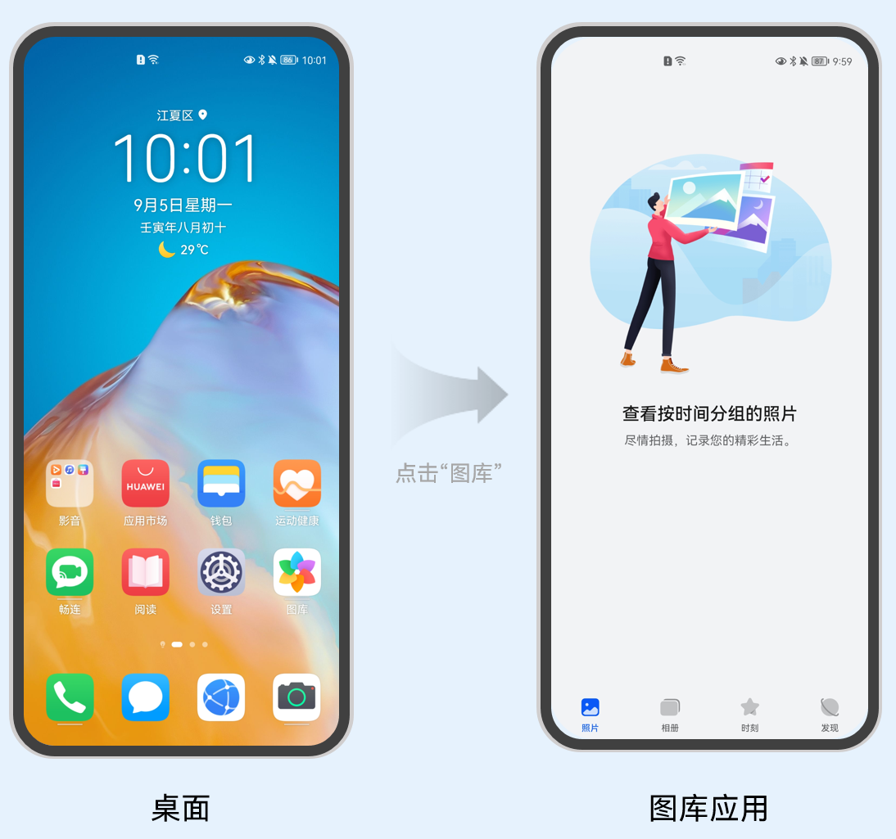
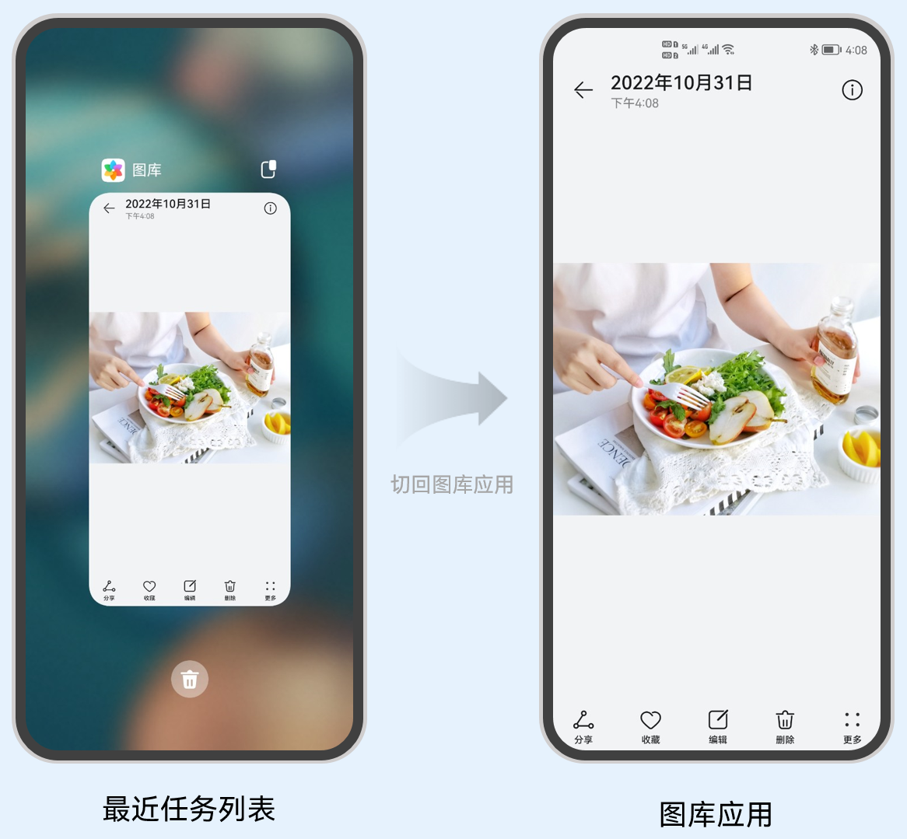
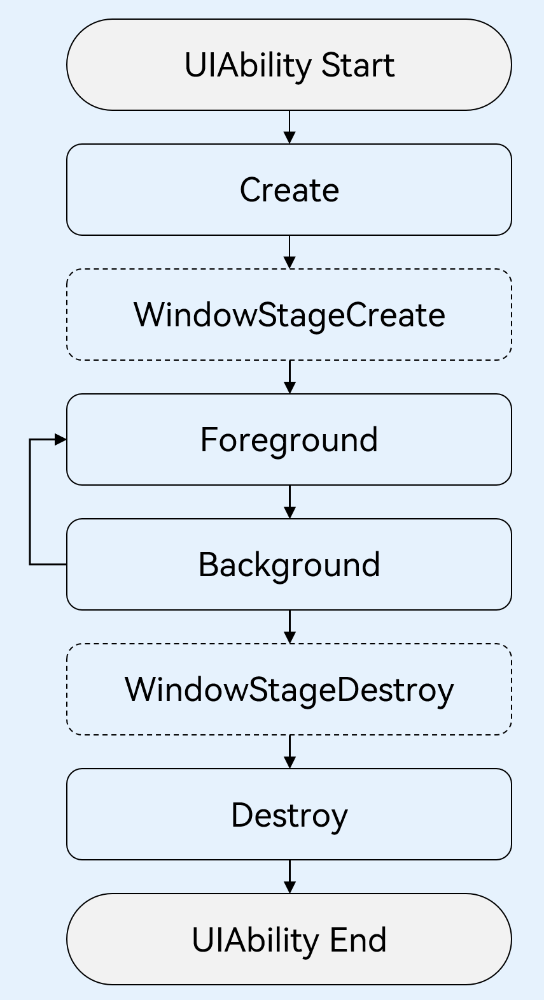

# UIAbility组件


## 概述

UIAbility是一种包含用户界面的应用组件，主要用于和用户进行交互。UIAbility也是系统调度的单元，为应用提供窗口在其中绘制界面。

每一个UIAbility实例，都对应于一个最近任务列表中的任务。

一个应用可以有一个UIAbility，也可以有多个UIAbility。


## 配置

需要在`module.json5`配置文件的`abilities`标签中声明

```typescript
{
  "module": {
    // ...
    "abilities": [
      {
        "name": "EntryAbility", // UIAbility组件的名称
        "srcEntry": "./ets/entryability/EntryAbility.ts", // UIAbility组件的代码路径
        "description": "$string:EntryAbility_desc", // UIAbility组件的描述信息
        "icon": "$media:icon", // UIAbility组件的图标
        "label": "$string:EntryAbility_label", // UIAbility组件的标签
        "startWindowIcon": "$media:icon", // UIAbility组件启动页面图标资源文件的索引
        "startWindowBackground": "$color:start_window_background", // UIAbility组件启动页面背景颜色资源文件的索引
        // ...
      }
    ]
  }
}
```


## 生命周期

当用户浏览、切换和返回到对应应用的时候，应用中的UIAbility实例会在其生命周期的不同状态之间转换。

UIAbility类提供了很多回调，通过这些回调可以知晓当前UIAbility的某个状态已经发生改变：例如UIAbility的创建和销毁，或者UIAbility发生了前后台的状态切换。

例如从桌面点击图库应用图标，到启动图库应用，应用的状态经过了从创建到前台展示的状态变化。如下图所示。

**图** 从桌面点击图库应用图标启动应用



回到桌面，从最近任务列表，切换回到图库应用，应用的状态经过了从后台到前台展示的状态变化。如下图所示。

**图** 从最近任务列表切换回到图库应用



在UIAbility的使用过程中，会有多种生命周期状态。掌握UIAbility的生命周期，对于应用的开发非常重要。

为了实现多设备形态上的裁剪和多窗口的可扩展性，系统对组件管理和窗口管理进行了解耦。UIAbility的生命周期包括**`Create、Foreground、Background、Destroy`**四个状态，**WindowStageCreate和WindowStageDestroy为窗口管理器（WindowStage）在UIAbility中管理UI界面功能的两个生命周期回调**，从而实现UIAbility与窗口之间的弱耦合。如下图所示。

**图** UIAbility生命周期状态



### Create状态

Create状态，在UIAbility实例创建时触发，系统会调用onCreate回调。可以在onCreate回调中进行相关初始化操作。

```typescript
import UIAbility from '@ohos.app.ability.UIAbility';
import window from '@ohos.window';

export default class EntryAbility extends UIAbility {
    onCreate(want: Want, launchParam: AbilityConstant.LaunchParam) {
        // 应用初始化
        // ...
    }
    // ...
}
```


### WindowStageCreate状态

UIAbility实例创建完成之后，在进入Foreground之前，系统会创建一个WindowStage。**每一个UIAbility实例都对应持有一个WindowStage实例**。

WindowStage为本地窗口管理器，用于管理窗口相关的内容，例如与界面相关的获焦/失焦、可见/不可见。

可以在`onWindowStageCreate`回调中，设置UI页面加载、设置WindowStage的事件订阅。

在`onWindowStageCreate`(windowStage)中通过`loadContent`接口设置应用要加载的页面，Window接口的使用详见[窗口开发指导](https://developer.harmonyos.com/cn/docs/documentation/doc-guides-V3/application-window-stage-0000001427584712-V3?catalogVersion=V3)。

```typescript
import UIAbility from '@ohos.app.ability.UIAbility';
import window from '@ohos.window';

export default class EntryAbility extends UIAbility {
    // ...

    onWindowStageCreate(windowStage: window.WindowStage) {
        // 设置UI页面加载
        // 设置WindowStage的事件订阅（获焦/失焦、可见/不可见）
        // ...

        windowStage.loadContent('pages/Index', (err, data) => {
            // ...
        });
    }
    // ...
}
```

例如用户打开游戏应用，正在打游戏的时候，有一个消息通知，打开消息，消息会以弹窗的形式弹出在游戏应用的上方，此时，游戏应用就从获焦切换到了失焦状态，消息应用切换到了获焦状态。对于消息应用，在`onWindowStageCreate`回调中，会触发获焦的事件回调，可以进行设置消息应用的背景颜色、高亮等操作。

### Foreground和Background状态

Foreground和Background状态，分别在UIAbility切换至前台或者切换至后台时触发。

分别对应于`onForeground`回调和`onBackground`回调。

onForeground回调，在UIAbility的UI页面可见之前，即UIAbility切换至前台时触发。可以在onForeground回调中申请系统需要的资源，或者重新申请在onBackground中释放的资源。

onBackground回调，在UIAbility的UI页面完全不可见之后，即UIAbility切换至后台时候触发。可以在onBackground回调中释放UI页面不可见时无用的资源，或者在此回调中执行较为耗时的操作，例如状态保存等。

```typescript
import UIAbility from '@ohos.app.ability.UIAbility';
import window from '@ohos.window';

export default class EntryAbility extends UIAbility {
    // ...

    onForeground() {
        // 申请系统需要的资源，或者重新申请在onBackground中释放的资源
        // ...
    }

    onBackground() {
        // 释放UI页面不可见时无用的资源，或者在此回调中执行较为耗时的操作
        // 例如状态保存等
        // ...
    }
}
```

例如用户打开地图应用查看当前地理位置的时候，假设地图应用已获得用户的定位权限授权。在UI页面显示之前，可以在onForeground回调中打开定位功能，从而获取到当前的位置信息。

当地图应用切换到后台状态，可以在onBackground回调中停止定位功能，以节省系统的资源消耗。

### WindowStageDestroy状态

在UIAbility实例销毁之前，则会先进入onWindowStageDestroy回调，我们可以在该回调中释放UI页面资源。

```typescript
import UIAbility from '@ohos.app.ability.UIAbility';
import window from '@ohos.window';

export default class EntryAbility extends UIAbility {
    // ...

    onWindowStageDestroy() {
        // 释放UI页面资源
        // ...
    }
}
```

例如在onWindowStageCreate中设置的获焦/失焦等WindowStage订阅事件。

### Destroy状态

Destroy状态，在UIAbility销毁时触发。可以在onDestroy回调中进行系统资源的释放、数据的保存等操作。

```typescript
import UIAbility from '@ohos.app.ability.UIAbility';
import window from '@ohos.window';

export default class EntryAbility extends UIAbility {
    // ...

    onDestroy() {
        // 系统资源的释放、数据的保存等
        // ...
    }
}
```

例如用户使用应用的程序退出功能，会调用UIAbilityContext的terminalSelf()方法，从而完成UIAbility销毁。或者用户使用最近任务列表关闭该UIAbility实例时，也会完成UIAbility的销毁。


## 启动模式

对于浏览器或者新闻等应用，用户在打开该应用，并浏览访问相关内容后，回到桌面，再次打开该应用，显示的仍然是用户当前访问的界面。

对于应用的分屏操作，用户希望使用两个不同应用（例如备忘录应用和图库应用）之间进行分屏，也希望能使用同一个应用（例如备忘录应用自身）进行分屏。

对于文档应用，用户从文档应用中打开一个文档内容，回到文档应用，继续打开同一个文档，希望打开的还是同一个文档内容。

基于以上场景的考虑，**UIAbility当前支持singleton（单实例模式）、multiton（多实例模式）和specified（指定实例模式）3种启动模式**。

