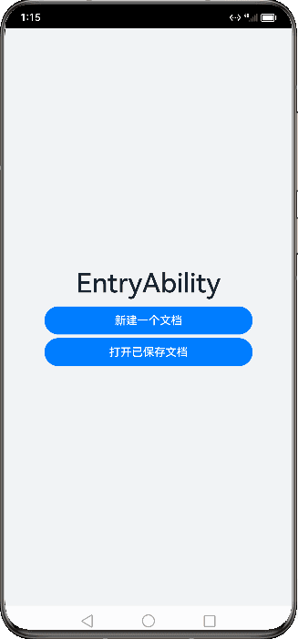

# UIAbility组件


## 概述

UIAbility是一种包含用户界面的应用组件，主要用于和用户进行交互。UIAbility也是系统调度的单元，为应用提供窗口在其中绘制界面。

每一个UIAbility实例，都对应于一个最近任务列表中的任务。

一个应用可以有一个UIAbility，也可以有多个UIAbility。


## 配置

需要在`module.json5`配置文件的`abilities`标签中声明

```typescript
{
  "module": {
    // ...
    "abilities": [
      {
        "name": "EntryAbility", // UIAbility组件的名称
        "srcEntry": "./ets/entryability/EntryAbility.ts", // UIAbility组件的代码路径
        "description": "$string:EntryAbility_desc", // UIAbility组件的描述信息
        "icon": "$media:icon", // UIAbility组件的图标
        "label": "$string:EntryAbility_label", // UIAbility组件的标签
        "startWindowIcon": "$media:icon", // UIAbility组件启动页面图标资源文件的索引
        "startWindowBackground": "$color:start_window_background", // UIAbility组件启动页面背景颜色资源文件的索引
        // ...
      }
    ]
  }
}
```


## 生命周期

当用户浏览、切换和返回到对应应用的时候，应用中的UIAbility实例会在其生命周期的不同状态之间转换。

UIAbility类提供了很多回调，通过这些回调可以知晓当前UIAbility的某个状态已经发生改变：例如UIAbility的创建和销毁，或者UIAbility发生了前后台的状态切换。

例如从桌面点击图库应用图标，到启动图库应用，应用的状态经过了从创建到前台展示的状态变化。如下图所示。

**图** 从桌面点击图库应用图标启动应用


回到桌面，从最近任务列表，切换回到图库应用，应用的状态经过了从后台到前台展示的状态变化。如下图所示。

**图** 从最近任务列表切换回到图库应用


在UIAbility的使用过程中，会有多种生命周期状态。掌握UIAbility的生命周期，对于应用的开发非常重要。

为了实现多设备形态上的裁剪和多窗口的可扩展性，系统对组件管理和窗口管理进行了解耦。UIAbility的生命周期包括**`Create、Foreground、Background、Destroy`**四个状态，**WindowStageCreate和WindowStageDestroy为窗口管理器（WindowStage）在UIAbility中管理UI界面功能的两个生命周期回调**，从而实现UIAbility与窗口之间的弱耦合。如下图所示。

**图** UIAbility生命周期状态


### Create状态

Create状态，在UIAbility实例创建时触发，系统会调用onCreate回调。可以在onCreate回调中进行相关初始化操作。

```typescript
import UIAbility from '@ohos.app.ability.UIAbility';
import window from '@ohos.window';

export default class EntryAbility extends UIAbility {
    onCreate(want: Want, launchParam: AbilityConstant.LaunchParam) {
        // 应用初始化
        // ...
    }
    // ...
}
```


### WindowStageCreate状态

UIAbility实例创建完成之后，在进入Foreground之前，系统会创建一个WindowStage。**每一个UIAbility实例都对应持有一个WindowStage实例**。

WindowStage为本地窗口管理器，用于管理窗口相关的内容，例如与界面相关的获焦/失焦、可见/不可见。

可以在`onWindowStageCreate`回调中，设置UI页面加载、设置WindowStage的事件订阅。

在`onWindowStageCreate`(windowStage)中通过`loadContent`接口设置应用要加载的页面，Window接口的使用详见[窗口开发指导](https://developer.harmonyos.com/cn/docs/documentation/doc-guides-V3/application-window-stage-0000001427584712-V3?catalogVersion=V3)。

```typescript
import UIAbility from '@ohos.app.ability.UIAbility';
import window from '@ohos.window';

export default class EntryAbility extends UIAbility {
    // ...

    onWindowStageCreate(windowStage: window.WindowStage) {
        // 设置UI页面加载
        // 设置WindowStage的事件订阅（获焦/失焦、可见/不可见）
        // ...

        windowStage.loadContent('pages/Index', (err, data) => {
            // ...
        });
    }
    // ...
}
```

例如用户打开游戏应用，正在打游戏的时候，有一个消息通知，打开消息，消息会以弹窗的形式弹出在游戏应用的上方，此时，游戏应用就从获焦切换到了失焦状态，消息应用切换到了获焦状态。对于消息应用，在`onWindowStageCreate`回调中，会触发获焦的事件回调，可以进行设置消息应用的背景颜色、高亮等操作。

### Foreground和Background状态

Foreground和Background状态，分别在UIAbility切换至前台或者切换至后台时触发。

分别对应于`onForeground`回调和`onBackground`回调。

onForeground回调，在UIAbility的UI页面可见之前，即UIAbility切换至前台时触发。可以在onForeground回调中申请系统需要的资源，或者重新申请在onBackground中释放的资源。

onBackground回调，在UIAbility的UI页面完全不可见之后，即UIAbility切换至后台时候触发。可以在onBackground回调中释放UI页面不可见时无用的资源，或者在此回调中执行较为耗时的操作，例如状态保存等。

```typescript
import UIAbility from '@ohos.app.ability.UIAbility';
import window from '@ohos.window';

export default class EntryAbility extends UIAbility {
    // ...

    onForeground() {
        // 申请系统需要的资源，或者重新申请在onBackground中释放的资源
        // ...
    }

    onBackground() {
        // 释放UI页面不可见时无用的资源，或者在此回调中执行较为耗时的操作
        // 例如状态保存等
        // ...
    }
}
```

例如用户打开地图应用查看当前地理位置的时候，假设地图应用已获得用户的定位权限授权。在UI页面显示之前，可以在onForeground回调中打开定位功能，从而获取到当前的位置信息。

当地图应用切换到后台状态，可以在onBackground回调中停止定位功能，以节省系统的资源消耗。

### WindowStageDestroy状态

在UIAbility实例销毁之前，则会先进入onWindowStageDestroy回调，我们可以在该回调中释放UI页面资源。

```typescript
import UIAbility from '@ohos.app.ability.UIAbility';
import window from '@ohos.window';

export default class EntryAbility extends UIAbility {
    // ...

    onWindowStageDestroy() {
        // 释放UI页面资源
        // ...
    }
}
```

例如在onWindowStageCreate中设置的获焦/失焦等WindowStage订阅事件。

### Destroy状态

Destroy状态，在UIAbility销毁时触发。可以在onDestroy回调中进行系统资源的释放、数据的保存等操作。

```typescript
import UIAbility from '@ohos.app.ability.UIAbility';
import window from '@ohos.window';

export default class EntryAbility extends UIAbility {
    // ...

    onDestroy() {
        // 系统资源的释放、数据的保存等
        // ...
    }
}
```

例如用户使用应用的程序退出功能，会调用UIAbilityContext的terminalSelf()方法，从而完成UIAbility销毁。或者用户使用最近任务列表关闭该UIAbility实例时，也会完成UIAbility的销毁。


## 启动模式

对于浏览器或者新闻等应用，用户在打开该应用，并浏览访问相关内容后，回到桌面，再次打开该应用，显示的仍然是用户当前访问的界面。

对于应用的分屏操作，用户希望使用两个不同应用（例如备忘录应用和图库应用）之间进行分屏，也希望能使用同一个应用（例如备忘录应用自身）进行分屏。

对于文档应用，用户从文档应用中打开一个文档内容，回到文档应用，继续打开同一个文档，希望打开的还是同一个文档内容。

基于以上场景的考虑，**UIAbility当前支持singleton（单实例模式）、multiton（多实例模式）和specified（指定实例模式）3种启动模式**。


### singleton（单实例模式）

singleton启动模式为单实例模式，也是默认情况下的启动模式。

每次调用startAbility()方法时，如果应用进程中该类型的UIAbility实例已经存在，则复用系统中的UIAbility实例。系统中只存在唯一一个该UIAbility实例，即在最近任务列表中只存在一个该类型的UIAbility实例。

> 应用的UIAbility实例已创建，该UIAbility配置为单实例模式，再次调用startAbility()方法启动该UIAbility实例。由于启动的还是原来的UIAbility实例，并未重新创建一个新的UIAbility实例，此时只会进入该UIAbility的onNewWant()回调，不会进入其onCreate()和onWindowStageCreate()生命周期回调。

singleton启动模式的开发使用，在module.json5文件中的“launchType”字段配置为“singleton”即可。

```typescript
{
   "module": {
     // ...
     "abilities": [
       {
         "launchType": "singleton",
         // ...
       }
     ]
  }
}
```


### multiton（多实例模式）

multiton启动模式为多实例模式，每次调用startAbility()方法时，都会在应用进程中创建一个新的该类型UIAbility实例。即在最近任务列表中可以看到有多个该类型的UIAbility实例。这种情况下可以将UIAbility配置为multiton（多实例模式）。

multiton启动模式的开发使用，在module.json5配置文件中的launchType字段配置为multiton即可。

```typescript
{
   "module": {
     // ...
     "abilities": [
       {
         "launchType": "multiton",
         // ...
       }
     ]
  }
}
```


### specified（指定实例模式）

specified启动模式为指定实例模式，针对一些特殊场景使用（例如文档应用中每次新建文档希望都能新建一个文档实例，重复打开一个已保存的文档希望打开的都是同一个文档实例）。


在UIAbility实例创建之前，允许开发者为该实例创建一个唯一的字符串Key，创建的UIAbility实例绑定Key之后，后续每次调用startAbility()方法时，都会询问应用使用哪个Key对应的UIAbility实例来响应startAbility()请求。运行时由UIAbility内部业务决定是否创建多实例，如果匹配有该UIAbility实例的Key，则直接拉起与之绑定的UIAbility实例，否则创建一个新的UIAbility实例。

> 应用的UIAbility实例已创建，该UIAbility配置为指定实例模式，再次调用startAbility()方法启动该UIAbility实例，且AbilityStage的onAcceptWant()回调匹配到一个已创建的UIAbility实例。此时，再次启动该UIAbility时，只会进入该UIAbility的onNewWant()回调，不会进入其onCreate()和onWindowStageCreate()生命周期回调。


例如有两个UIAbility：EntryAbility和SpecifiedAbility，SpecifiedAbility配置为指定实例模式启动，需要从EntryAbility的页面中启动SpecifiedAbility。

1. 在SpecifiedAbility中，将module.json5配置文件的launchType字段配置为specified。

   ```typescript
   {
     "module": {
       // ...
       "abilities": [
         {
           "launchType": "specified",
           // ...
         }
       ]
     }
   }
   ```

2. 在创建UIAbility实例之前，开发者可以为该实例指定一个唯一的字符串Key，这样在调用startAbility()方法时，应用就可以根据指定的Key来识别响应请求的UIAbility实例。在EntryAbility中，调用startAbility()方法时，可以在want参数中增加一个自定义参数，例如instanceKey，以此来区分不同的UIAbility实例。

   ```typescript
   // 在启动指定实例模式的UIAbility时，给每一个UIAbility实例配置一个独立的Key标识
   // 例如在文档使用场景中，可以用文档路径作为Key标识
   import common from '@ohos.app.ability.common';
   import Want from '@ohos.app.ability.Want';
   import { BusinessError } from '@ohos.base';
   
   function getInstance() {
     return 'key';
   }
   
   let context:common.UIAbilityContext = ...; // context为调用方UIAbility的UIAbilityContext
   let want: Want = {
     deviceId: '', // deviceId为空表示本设备
     bundleName: 'com.example.myapplication',
     abilityName: 'SpecifiedAbility',
     moduleName: 'specified', // moduleName非必选
     parameters: { // 自定义信息
       instanceKey: getInstance(),
     },
   }
   
   context.startAbility(want).then(() => {
     console.info('Succeeded in starting ability.');
   }).catch((err: BusinessError) => {
     console.error(`Failed to start ability. Code is ${err.code}, message is ${err.message}`);
   })
   ```

3. 由于SpecifiedAbility的启动模式被配置为指定实例启动模式，**因此在SpecifiedAbility启动之前，会先进入对应的AbilityStage的onAcceptWant()生命周期回调中**，以获取该UIAbility实例的Key值。然后系统会自动匹配，如果存在与该UIAbility实例匹配的Key，则会启动与之绑定的UIAbility实例，并进入该UIAbility实例的onNewWant()回调函数；否则会创建一个新的UIAbility实例，并进入该UIAbility实例的onCreate()回调函数和onWindowStageCreate()回调函数。

   示例代码中，通过实现onAcceptWant()生命周期回调函数，解析传入的want参数，获取自定义参数instanceKey。业务逻辑会根据这个参数返回一个字符串Key，用于标识当前UIAbility实例。如果返回的Key已经对应一个已启动的UIAbility实例，系统会将该UIAbility实例拉回前台并获焦，而不会创建新的实例。如果返回的Key没有对应已启动的UIAbility实例，则系统会创建新的UIAbility实例并启动。

   ```typescript
   import AbilityStage from '@ohos.app.ability.AbilityStage';
   import Want from '@ohos.app.ability.Want';
   
   export default class MyAbilityStage extends AbilityStage {
     onAcceptWant(want: Want): string {
       // 在被调用方的AbilityStage中，针对启动模式为specified的UIAbility返回一个UIAbility实例对应的一个Key值
       // 当前示例指的是module1 Module的SpecifiedAbility
       if (want.abilityName === 'SpecifiedAbility') {
         // 返回的字符串Key标识为自定义拼接的字符串内容
         if (want.parameters) {
           return `SpecifiedAbilityInstance_${want.parameters.instanceKey}`;
         }
       }
   
       return '';
     }
   }
   ```

> 1. 当应用的UIAbility实例已经被创建，并且配置为指定实例模式时，如果再次调用startAbility()方法启动该UIAbility实例，且AbilityStage的onAcceptWant()回调匹配到一个已创建的UIAbility实例，则系统会启动原来的UIAbility实例，并且不会重新创建一个新的UIAbility实例。此时，该UIAbility实例的onNewWant()回调会被触发，而不会触发onCreate()和onWindowStageCreate()生命周期回调。
> 2. DevEco Studio默认工程中未自动生成AbilityStage，AbilityStage文件的创建请参见AbilityStage组件容器。

例如在文档应用中，可以为不同的文档实例内容绑定不同的Key值。每次新建文档时，可以传入一个新的Key值（例如可以将文件的路径作为一个Key标识），此时AbilityStage中启动UIAbility时都会创建一个新的UIAbility实例；当新建的文档保存之后，回到桌面，或者新打开一个已保存的文档，回到桌面，此时再次打开该已保存的文档，此时AbilityStage中再次启动该UIAbility时，打开的仍然是之前原来已保存的文档界面。

以如下步骤所示进行举例说明。

1. 打开文件A，对应启动一个新的UIAbility实例，例如启动UIAbility实例1。
2. 在最近任务列表中关闭文件A的任务进程，此时UIAbility实例1被销毁，回到桌面，再次打开文件A，此时对应启动一个新的UIAbility实例，例如启动UIAbility实例2。
3. 回到桌面，打开文件B，此时对应启动一个新的UIAbility实例，例如启动UIAbility实例3。
4. 回到桌面，再次打开文件A，此时仍然启动之前的UIAbility实例2，因为系统会自动匹配UIAbility实例的Key值，如果存在与之匹配的Key，则会启动与之绑定的UIAbility实例。在此例中，之前启动的UIAbility实例2与文件A绑定的Key是相同的，因此系统会拉回UIAbility实例2并让其获焦，而不会创建新的实例。




## 基本用法

UIAbility组件的基本用法包括：指定UIAbility的启动页面以及获取UIAbility的上下文[UIAbilityContext](https://developer.huawei.com/consumer/cn/doc/harmonyos-references-V2/js-apis-inner-application-uiabilitycontext-0000001478341321-V2)。


### 指定UIAbility的启动页面

应用中的UIAbility在启动过程中，需要指定启动页面，否则应用启动后会因为没有默认加载页面而导致白屏。可以在UIAbility的onWindowStageCreate()生命周期回调中，通过[WindowStage](https://developer.huawei.com/consumer/cn/doc/harmonyos-references-V2/js-apis-window-0000001477981397-V2#ZH-CN_TOPIC_0000001573929313__windowstage9)对象的loadContent()方法设置启动页面。

```typescript
import UIAbility from '@ohos.app.ability.UIAbility';
import Window from '@ohos.window';

export default class EntryAbility extends UIAbility {
    onWindowStageCreate(windowStage: Window.WindowStage) {
        // Main window is created, set main page for this ability
        windowStage.loadContent('pages/Index', (err, data) => {
            // ...
        });
    }

    // ...
}
```


### 获取UIAbility的上下文信息

UIAbility类拥有自身的上下文信息，该信息为[UIAbilityContext](https://developer.huawei.com/consumer/cn/doc/harmonyos-references-V2/js-apis-inner-application-uiabilitycontext-0000001478341321-V2)类的实例，[UIAbilityContext](https://developer.huawei.com/consumer/cn/doc/harmonyos-references-V2/js-apis-inner-application-uiabilitycontext-0000001478341321-V2)类拥有abilityInfo、currentHapModuleInfo等属性。通过UIAbilityContext可以获取UIAbility的相关配置信息，如包代码路径、Bundle名称、Ability名称和应用程序需要的环境状态等属性信息，以及可以获取操作UIAbility实例的方法（如startAbility()、connectServiceExtensionAbility()、terminateSelf()等）。

- 在UIAbility中可以通过this.context获取UIAbility实例的上下文信息。

  ```typescript
  import UIAbility from '@ohos.app.ability.UIAbility';
  
  export default class EntryAbility extends UIAbility {
      onCreate(want, launchParam) {
          // 获取UIAbility实例的上下文
          let context = this.context;
  
          // ...
      }
  }
  ```

- 在页面中获取UIAbility实例的上下文信息，包括导入依赖资源context模块和在组件中定义一个context变量两个部分。

  ```typescript
  import common from '@ohos.app.ability.common';
  
  @Entry
  @Component
  struct Index {
    private context = getContext(this) as common.UIAbilityContext;
  
    startAbilityTest() {
      let want = {
        // Want参数信息
      };
      this.context.startAbility(want);
    }
  
    // 页面展示
    build() {
      // ...
    }
  }
  ```

  也可以在导入依赖资源context模块后，在具体使用[UIAbilityContext](https://developer.huawei.com/consumer/cn/doc/harmonyos-references-V2/js-apis-inner-application-uiabilitycontext-0000001478341321-V2)前进行变量定义。

  ```typescript
  import common from '@ohos.app.ability.common';
  
  @Entry
  @Component
  struct Index {
  
    startAbilityTest() {
      let context = getContext(this) as common.UIAbilityContext;
      let want = {
        // Want参数信息
      };
      context.startAbility(want);
    }
  
    // 页面展示
    build() {
      // ...
    }
  }
  ```


## UIAbility组件与UI的数据同步

基于HarmonyOS的应用模型，可以通过以下两种方式来实现UIAbility组件与UI之间的数据同步。

- [使用EventHub进行数据通信](https://developer.huawei.com/consumer/cn/doc/harmonyos-guides-V2/uiability-data-sync-with-ui-0000001427744556-V2#ZH-CN_TOPIC_0000001574088345__使用eventhub进行数据通信)：基于发布订阅模式来实现，事件需要先订阅后发布，订阅者收到消息后进行处理。
- [使用globalThis进行数据同步](https://developer.huawei.com/consumer/cn/doc/harmonyos-guides-V2/uiability-data-sync-with-ui-0000001427744556-V2#ZH-CN_TOPIC_0000001574088345__使用globalthis进行数据同步)：ArkTS引擎实例内部的一个全局对象，在ArkTS引擎实例内部都能访问。

- [使用AppStorage/LocalStorage进行数据同步](https://developer.huawei.com/consumer/cn/doc/harmonyos-guides-V2/uiability-data-sync-with-ui-0000001427744556-V2#section1926741133818)：ArkUI提供了AppStorage和LocalStorage两种应用级别的状态管理方案，可用于实现应用级别和UIAbility级别的数据同步。


### 使用EventHub进行数据通信

EventHub提供了UIAbility组件/ExtensionAbility组件级别的事件机制，以UIAbility组件/ExtensionAbility组件为中心提供了订阅、取消订阅和触发事件的数据通信能力。接口说明请参见[EventHub](https://developer.huawei.com/consumer/cn/doc/harmonyos-references-V2/js-apis-inner-application-eventhub-0000001477981377-V2)。

在使用EventHub之前，首先需要获取EventHub对象。[基类Context](https://developer.huawei.com/consumer/cn/doc/harmonyos-guides-V2/application-context-stage-0000001427744560-V2)提供了EventHub对象，本章节以使用EventHub实现UIAbility与UI之间的数据通信为例进行说明。

1. 在UIAbility中调用eventHub.on()方法注册一个自定义事件“event1”，eventHub.on()有如下两种调用方式，使用其中一种即可。

   ```typescript
   import UIAbility from '@ohos.app.ability.UIAbility';
   
   const TAG: string = '[Example].[Entry].[EntryAbility]';
   
   export default class EntryAbility extends UIAbility {
       func1(...data) {
           // 触发事件，完成相应的业务操作
           console.info(TAG, '1. ' + JSON.stringify(data));
       }
   
       onCreate(want, launch) {
           // 获取eventHub
           let eventhub = this.context.eventHub;
           // 执行订阅操作
           eventhub.on('event1', this.func1);
           eventhub.on('event1', (...data) => {
               // 触发事件，完成相应的业务操作
               console.info(TAG, '2. ' + JSON.stringify(data));
           });
       }
   }
   ```

2. 在UI界面中通过eventHub.emit()方法触发该事件，在触发事件的同时，根据需要传入参数信息。

   ```typescript
   import common from '@ohos.app.ability.common';
   
   @Entry
   @Component
   struct Index {
     private context = getContext(this) as common.UIAbilityContext;
   
     eventHubFunc() {
       // 不带参数触发自定义“event1”事件
       this.context.eventHub.emit('event1');
       // 带1个参数触发自定义“event1”事件
       this.context.eventHub.emit('event1', 1);
       // 带2个参数触发自定义“event1”事件
       this.context.eventHub.emit('event1', 2, 'test');
       // 开发者可以根据实际的业务场景设计事件传递的参数
     }
   
     // 页面展示
     build() {
       // ...
     }
   }
   ```

3. 在UIAbility的注册事件回调中可以得到对应的触发事件结果，运行日志结果如下所示。

   ```typescript
   []
   
   [1]
   
   [2,'test']
   ```

4. 在自定义事件“event1”使用完成后，可以根据需要调用eventHub.off()方法取消该事件的订阅。

   ```typescript
   // context为UIAbility实例的AbilityContext
   this.context.eventHub.off('event1');
   ```


### 使用globalThis进行数据同步

globalThis是ArkTS引擎实例内部的一个全局对象，引擎内部的UIAbility/ExtensionAbility/Page都可以使用，因此可以使用globalThis全局对象进行数据同步。

**图** 使用globalThis进行数据同步


#### UIAbility和Page之间使用globalThis

globalThis为[ArkTS引擎实例](https://developer.huawei.com/consumer/cn/doc/harmonyos-guides-V2/thread-model-stage-0000001428061492-V2)下的全局对象，可以通过globalThis绑定属性/方法来进行UIAbility组件与UI的数据同步。例如在UIAbility组件中绑定want参数，即可在UIAbility对应的UI界面上使用want参数信息。

1. 调用startAbility()方法启动一个UIAbility实例时，被启动的UIAbility创建完成后会进入onCreate()生命周期回调，且在onCreate()生命周期回调中能够接受到传递过来的want参数，可以将want参数绑定到globalThis上。

   ```typescript
   import UIAbility from '@ohos.app.ability.UIAbility'
   
   export default class EntryAbility extends UIAbility {
       onCreate(want, launch) {
           globalThis.entryAbilityWant = want;
           // ...
       }
   
       // ...
   }
   ```

2. 在UI界面中即可通过globalThis获取到want参数信息。

   ```typescript
   let entryAbilityWant;
   
   @Entry
   @Component
   struct Index {
     aboutToAppear() {
       entryAbilityWant = globalThis.entryAbilityWant;
     }
   
     // 页面展示
     build() {
       // ...
     }
   }
   ```


#### UIAbility和UIAbility之间使用globalThis

同一个应用中UIAbility和UIAbility之间的数据传递，可以通过将数据绑定到全局变量globalThis上进行同步，如在AbilityA中将数据保存在globalThis，然后跳转到AbilityB中取得该数据：

1. AbilityA中保存数据一个字符串数据并挂载到globalThis上。

   ```typescript
   import UIAbility from '@ohos.app.ability.UIAbility'
   
   export default class AbilityA extends UIAbility {
       onCreate(want, launch) {
           globalThis.entryAbilityStr = 'AbilityA'; // AbilityA存放字符串“AbilityA”到globalThis
           // ...
       }
   }
   ```

2. AbilityB中获取对应的数据。

   ```typescript
   import UIAbility from '@ohos.app.ability.UIAbility'
   
   export default class AbilityB extends UIAbility {
       onCreate(want, launch) {
           // AbilityB从globalThis读取name并输出
           console.info('name from entryAbilityStr: ' + globalThis.entryAbilityStr);
           // ...
       }
   }
   ```


#### globalThis使用的注意事项

**图** globalThis注意事项


- Stage模型下进程内的UIAbility组件共享ArkTS引擎实例，使用globalThis时需要避免存放相同名称的对象。例如AbilityA和AbilityB可以使用globalThis共享数据，在存放相同名称的对象时，先存放的对象会被后存放的对象覆盖。
- FA模型因为每个UIAbility组件之间引擎隔离，不会存在该问题。
- 对于绑定在globalThis上的对象，其生命周期与ArkTS虚拟机实例相同，建议在使用完成之后将其赋值为null，以减少对应用内存的占用。


### AppStorage/LocalStorage进行数据同步

ArkUI提供了AppStorage和LocalStorage两种应用级别的状态管理方案，可用于实现应用级别和UIAbility级别的数据同步。使用这些方案可以方便地管理应用状态，提高应用性能和用户体验。其中，**AppStorage是一个全局的状态管理器，适用于多个UIAbility共享同一状态数据的情况；而LocalStorage则是一个局部的状态管理器，适用于单个UIAbility内部使用的状态数据。**通过这两种方案，开发者可以更加灵活地控制应用状态，提高应用的可维护性和可扩展性。详细请参见[应用级变量的状态管理](https://developer.huawei.com/consumer/cn/doc/harmonyos-guides-V2/arkts-application-state-management-overview-0000001529381989-V2)。


# UIAbility组件间交互（设备内）

**UIAbility是系统调度的最小单元**。在设备内的功能模块之间跳转时，会涉及到启动特定的UIAbility，该UIAbility可以是应用内的其他UIAbility，也可以是其他应用的UIAbility（例如启动三方支付UIAbility）。


### 启动应用内的UIAbility

当一个应用内包含多个UIAbility时，存在应用内启动UIAbility的场景。例如在支付应用中从入口UIAbility启动收付款UIAbility。

假设应用中有两个UIAbility：EntryAbility和FuncAbility（可以在同一个Module中，也可以在不同的Module中），需要从EntryAbility的页面中启动FuncAbility。

1. 在EntryAbility中，通过调用startAbility()方法启动UIAbility，[want](https://developer.huawei.com/consumer/cn/doc/harmonyos-references-V2/js-apis-app-ability-want-0000001493584192-V2)为UIAbility实例启动的入口参数，其中bundleName为待启动应用的Bundle名称，abilityName为待启动的UIAbility名称，moduleName在待启动的UIAbility属于不同的Module时添加，parameters为自定义信息参数。示例中的context的获取方式参见[获取UIAbility的Context属性](https://developer.huawei.com/consumer/cn/doc/harmonyos-guides-V2/uiability-usage-0000001427584600-V2#ZH-CN_TOPIC_0000001574088337__获取uiability的上下文信息)。

   ```typescript
   let wantInfo = {
       deviceId: '', // deviceId为空表示本设备
       bundleName: 'com.example.myapplication',
       abilityName: 'FuncAbility',
       moduleName: 'module1', // moduleName非必选
       parameters: { // 自定义信息
           info: '来自EntryAbility Index页面',
       },
   }
   // context为调用方UIAbility的AbilityContext
   this.context.startAbility(wantInfo).then(() => {
       // ...
   }).catch((err) => {
       // ...
   })
   ```

2. 在FuncAbility的生命周期回调文件中接收EntryAbility传递过来的参数。

   ```typescript
   import UIAbility from '@ohos.app.ability.UIAbility';
   import Window from '@ohos.window';
   
   export default class FuncAbility extends UIAbility {
       onCreate(want, launchParam) {
       // 接收调用方UIAbility传过来的参数
           let funcAbilityWant = want;
           let info = funcAbilityWant?.parameters?.info;
           // ...
       }
   }
   ```

3. 在FuncAbility业务完成之后，如需要停止当前UIAbility实例，在FuncAbility中通过调用terminateSelf()方法实现。

   ```typescript
   // context为需要停止的UIAbility实例的AbilityContext
   this.context.terminateSelf((err) => {
       // ...
   });
   ```


### 启动应用内的UIAbility并获取返回结果

在一个EntryAbility启动另外一个FuncAbility时，希望在被启动的FuncAbility完成相关业务后，能将结果返回给调用方。例如在应用中将入口功能和帐号登录功能分别设计为两个独立的UIAbility，在帐号登录UIAbility中完成登录操作后，需要将登录的结果返回给入口UIAbility。

1. 在EntryAbility中，调用startAbilityForResult()接口启动FuncAbility，异步回调中的data用于接收FuncAbility停止自身后返回给EntryAbility的信息。示例中的context的获取方式参见[获取UIAbility的Context属性](https://developer.huawei.com/consumer/cn/doc/harmonyos-guides-V2/uiability-usage-0000001427584600-V2#ZH-CN_TOPIC_0000001574088337__获取uiability的上下文信息)。

   ```typescript
   let wantInfo = {
       deviceId: '', // deviceId为空表示本设备
       bundleName: 'com.example.myapplication',
       abilityName: 'FuncAbility',
       moduleName: 'module1', // moduleName非必选
       parameters: { // 自定义信息
           info: '来自EntryAbility Index页面',
       },
   }
   // context为调用方UIAbility的AbilityContext
   this.context.startAbilityForResult(wantInfo).then((data) => {
       // ...
   }).catch((err) => {
       // ...
   })
   ```

2. 在FuncAbility停止自身时，需要调用terminateSelfWithResult()方法，入参abilityResult为FuncAbility需要返回给EntryAbility的信息。

   ```typescript
   const RESULT_CODE: number = 1001;
   let abilityResult = {
       resultCode: RESULT_CODE,
       want: {
           bundleName: 'com.example.myapplication',
           abilityName: 'FuncAbility',
           moduleName: 'module1',
           parameters: {
               info: '来自FuncAbility Index页面',
           },
       },
   }
   // context为被调用方UIAbility的AbilityContext
   this.context.terminateSelfWithResult(abilityResult, (err) => {
       // ...
   });
   ```

3. FuncAbility停止自身后，EntryAbility通过startAbilityForResult()方法回调接收被FuncAbility返回的信息，RESULT_CODE需要与前面的数值保持一致。

   ```typescript
   const RESULT_CODE: number = 1001;
   
   // ...
   
   // context为调用方UIAbility的AbilityContext
   this.context.startAbilityForResult(want).then((data) => {
       if (data?.resultCode === RESULT_CODE) {
           // 解析被调用方UIAbility返回的信息
           let info = data.want?.parameters?.info;
           // ...
       }
   }).catch((err) => {
       // ...
   })
   ```


### 启动其他应用的UIAbility

启动其他应用的UIAbility，通常用户只需要完成一个通用的操作（例如需要选择一个文档应用来查看某个文档的内容信息），推荐使用[隐式Want启动](https://developer.huawei.com/consumer/cn/doc/harmonyos-guides-V2/want-overview-0000001478340877-V2#ZH-CN_TOPIC_0000001574088785__want的类型)。系统会根据调用方的want参数来识别和启动匹配到的应用UIAbility。

启动UIAbility有[显式Want启动和隐式Want启动](https://developer.huawei.com/consumer/cn/doc/harmonyos-guides-V2/want-overview-0000001478340877-V2)两种方式。

- 显式Want启动：启动一个确定应用的UIAbility，在want参数中需要设置该应用bundleName和abilityName，当需要拉起某个明确的UIAbility时，通常使用显式Want启动方式。
- 隐式Want启动：根据匹配条件由用户选择启动哪一个UIAbility，即不明确指出要启动哪一个UIAbility（abilityName参数未设置），在调用startAbility()方法时，其入参want中指定了一系列的[entities](https://developer.huawei.com/consumer/cn/doc/harmonyos-references-V2/js-apis-ability-wantconstant-0000001544583997-V2#ZH-CN_TOPIC_0000001574088649__wantconstantentity)字段（表示目标UIAbility额外的类别信息，如浏览器、视频播放器）和[actions](https://developer.huawei.com/consumer/cn/doc/harmonyos-references-V2/js-apis-ability-wantconstant-0000001544583997-V2#ZH-CN_TOPIC_0000001574088649__wantconstantaction)字段（表示要执行的通用操作，如查看、分享、应用详情等）等参数信息，然后由系统去分析want，并帮助找到合适的UIAbility来启动。当需要拉起其他应用的UIAbility时，开发者通常不知道用户设备中应用的安装情况，也无法确定目标应用的bundleName和abilityName，通常使用隐式Want启动方式。
