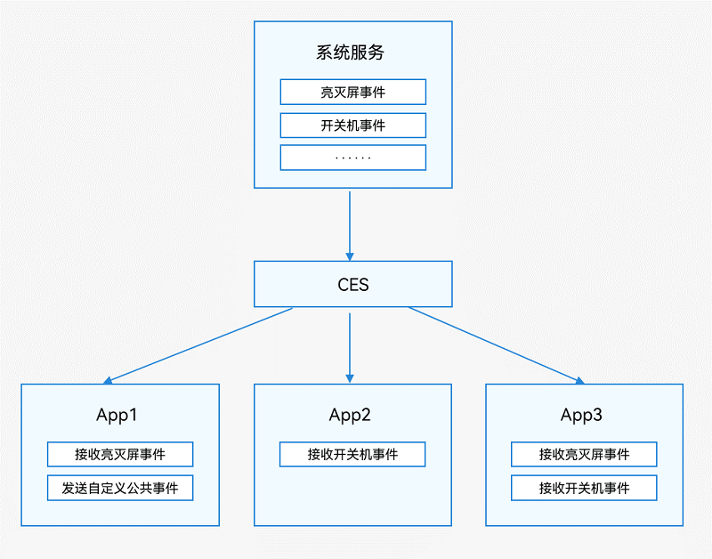

[TOC]

# 概述

HarmonyOS的进程模型：

- 应用中（同一包名）的所有UIAbility运行在同一个独立进程中。
- WebView拥有独立的渲染进程。

基于HarmonyOS的进程模型，系统提供了[公共事件机制](https://developer.huawei.com/consumer/cn/doc/harmonyos-guides-V2/common-event-overview-0000001427744568-V2)用于一对多的通信场景，公共事件发布者可能存在多个订阅者同时接收事件。


# 公共事件


## 简介

HarmonyOS通过CES（Common Event Service，公共事件服务）为应用程序提供订阅、发布、退订公共事件的能力。

公共事件从系统角度可分为：系统公共事件和自定义公共事件。

- 系统公共事件：CES内部定义的公共事件，只有系统应用和系统服务才能发布，例如HAP安装，更新，卸载等公共事件。目前支持的系统公共事件详见[系统公共事件定义](https://developer.huawei.com/consumer/cn/doc/harmonyos-references-V2/commoneventmanager-definitions-0000001493424344-V2)。
- 自定义公共事件：应用自定义一些公共事件用来实现跨进程的事件通信能力。

公共事件按发送方式可分为：无序公共事件、有序公共事件和粘性公共事件。

- 无序公共事件：CES转发公共事件时，不考虑订阅者是否接收到，且订阅者接收到的顺序与其订阅顺序无关。
- 有序公共事件：CES转发公共事件时，根据订阅者设置的优先级等级，优先将公共事件发送给优先级较高的订阅者，等待其成功接收该公共事件之后再将事件发送给优先级较低的订阅者。如果有多个订阅者具有相同的优先级，则他们将随机接收到公共事件。
- 粘性公共事件：能够让订阅者收到在订阅前已经发送的公共事件就是粘性公共事件。普通的公共事件只能在订阅后发送才能收到，而粘性公共事件的特殊性就是可以先发送后订阅。发送粘性事件必须是系统应用或系统服务，且需要申请ohos.permission.COMMONEVENT_STICKY权限，配置方式请参阅[访问控制授权申请指导](https://developer.huawei.com/consumer/cn/doc/harmonyos-guides-V2/accesstoken-guidelines-0000001493744016-V2#ZH-CN_TOPIC_0000001574088333__stage模型)。

每个应用都可以按需订阅公共事件，订阅成功，当公共事件发布时，系统会将其发送给对应的应用。这些公共事件可能来自系统、其他应用和应用自身。

**图** 公共事件示意图




## 公共事件订阅


### 概述

公共事件服务提供了动态订阅和静态订阅两种订阅方式。动态订阅与静态订阅最大的区别在于，动态订阅是应用运行时行为，而静态订阅是后台服务无需处于运行状态。

- 动态订阅：指订阅方在运行时调用公共事件订阅的API实现对公共事件的订阅，详见[动态订阅公共事件](https://developer.huawei.com/consumer/cn/doc/harmonyos-guides-V2/common-event-subscription-0000001544583897-V2)。
- 静态订阅：订阅方通过配置文件声明和实现继承自StaticSubscriberExtensionAbility的类实现对公共事件的订阅，详见[静态订阅公共事件](https://developer.huawei.com/consumer/cn/doc/harmonyos-guides-V2/common-event-static-subscription-0000001544703825-V2)。


### 动态订阅公共事件


#### 场景介绍

动态订阅是指当应用在运行状态时对某个公共事件进行订阅，在运行期间如果有订阅的事件发布那么订阅了这个事件的应用将会收到该事件及其传递的参数。例如，某应用希望在其运行期间收到电量过低的事件，并根据该事件降低其运行功耗，那么该应用便可动态订阅电量过低事件，收到该事件后关闭一些非必要的任务来降低功耗。订阅部分系统公共事件需要先[申请权限](https://developer.huawei.com/consumer/cn/doc/harmonyos-guides-V2/accesstoken-guidelines-0000001493744016-V2)，订阅这些事件所需要的权限请见[公共事件权限列表](https://developer.huawei.com/consumer/cn/doc/harmonyos-references-V2/js-apis-commoneventmanager-0000001427902640-V2#ZH-CN_TOPIC_0000001574088313__support)。


#### 接口说明

详细接口见[接口文档](https://developer.huawei.com/consumer/cn/doc/harmonyos-references-V2/js-apis-commonevent-0000001478181597-V2#ZH-CN_TOPIC_0000001523648890__commoneventcreatesubscriber)。

| 接口名                                                       | 接口描述                 |
| ------------------------------------------------------------ | ------------------------ |
| createSubscriber(subscribeInfo: [CommonEventSubscribeInfo](https://developer.huawei.com/consumer/cn/doc/harmonyos-references-V2/js-apis-commoneventmanager-0000001427902640-V2#ZH-CN_TOPIC_0000001574088313__commoneventsubscribeinfo), callback: AsyncCallback<[CommonEventData](https://developer.huawei.com/consumer/cn/doc/harmonyos-references-V2/js-apis-commoneventmanager-0000001427902640-V2#ZH-CN_TOPIC_0000001574088313__commoneventdata)>): void | 创建订阅者对象(callback) |
| createSubscriber(subscribeInfo: CommonEventSubscribeInfo): Promise<CommonEventSubscriber> | 创建订阅者对象(promise)  |
| subscribe(subscriber: CommonEventSubscriber, callback: AsyncCallback): void | 订阅公共事件             |


#### 开发步骤

1. 导入模块。

   ```typescript
   import commonEventManager from '@ohos.commonEventManager'; 
   import Base from '@ohos.base';
   ```

2. 创建订阅者信息，详细的订阅者信息数据类型及包含的参数请见[CommonEventSubscribeInfo](https://developer.huawei.com/consumer/cn/doc/harmonyos-references-V2/js-apis-commoneventmanager-0000001427902640-V2#ZH-CN_TOPIC_0000001574088313__commoneventsubscribeinfo)文档介绍。

   ```typescript
   // 用于保存创建成功的订阅者对象，后续使用其完成订阅及退订的动作
   let subscriber: commonEventManager.CommonEventSubscriber | null = null;
   // 订阅者信息
   let subscribeInfo: commonEventManager.CommonEventSubscribeInfo = {
     events: ["usual.event.SCREEN_OFF"], // 订阅灭屏公共事件
   }
   ```

3. 创建订阅者，保存返回的订阅者对象subscriber，用于执行后续的订阅、退订等操作。

   ```typescript
   // 创建订阅者回调
   commonEventManager.createSubscriber(subscribeInfo, (err: Base.BusinessError, data: commonEventManager.CommonEventSubscriber) => {
     if (err) {
       console.error(`Failed to create subscriber. Code is ${err.code}, message is ${err.message}`);
       return;
     }
     console.info('Succeeded in creating subscriber.');
     subscriber = data;
     // 订阅公共事件回调
   })
   
   })
   ```

4. 创建订阅回调函数，订阅回调函数会在接收到事件时触发。订阅回调函数返回的data内包含了公共事件的名称、发布者携带的数据等信息，公共事件数据的详细参数和数据类型请见[CommonEventData](https://developer.huawei.com/consumer/cn/doc/harmonyos-references-V2/js-apis-commoneventmanager-0000001427902640-V2#ZH-CN_TOPIC_0000001574088313__commoneventdata)文档介绍。

   ```typescript
   // 订阅公共事件回调
   if (subscriber !== null) {
     commonEventManager.subscribe(subscriber, (err: Base.BusinessError, data: commonEventManager.CommonEventData) => {
       if (err) {
         console.error(`Failed to subscribe common event. Code is ${err.code}, message is ${err.message}`);
         return;
       }
     })
   } else {
     console.error(`Need create subscriber`);
   }
   ```


## 静态订阅公共事件（仅对系统应用开放）


### 场景介绍

静态订阅者在未接收订阅的目标事件时，处于未拉起状态，当系统或应用发布了指定的公共事件后，静态订阅者将被拉起，并执行onReceiveEvent回调，开发者可通过在onReceiveEvent回调中执行业务逻辑，实现当应用接收到特定公共事件时执行业务逻辑的目的。例如，某应用希望在设备开机的时候执行一些初始化任务，那么该应用可以静态订阅开机事件，在收到开机事件后会拉起该应用，然后执行初始化任务。静态订阅是通过配置文件声明和实现继承自StaticSubscriberExtensionAbility的类实现对公共事件的订阅。**需要注意的是，静态订阅公共事件对系统功耗有一定影响，建议谨慎使用**。


### 开发步骤

1. 静态订阅者声明

   声明一个静态订阅者，首先需要在工程中新建一个ExtensionAbility, 该ExtensionAbility从StaticSubscriberExtensionAbility派生，其代码实现如下：

   ```typescript
   import StaticSubscriberExtensionAbility from '@ohos.application.StaticSubscriberExtensionAbility'
   
   export default class StaticSubscriber extends StaticSubscriberExtensionAbility {
       onReceiveEvent(event) {
           console.log('onReceiveEvent, event:' + event.event);
       }
   }
   ```

   开发者可以在onReceiveEvent中实现业务逻辑。

2. 静态订阅者工程配置

   在完成静态订阅者的代码实现后，需要将该订阅者配置到系统的module.json5中，配置形式如下：

   ```typescript
   {
     "module": {
       ......
       "extensionAbilities": [
         {
           "name": "StaticSubscriber",
           "srcEntrance": "./ets/StaticSubscriber/StaticSubscriber.ts",
           "description": "$string:StaticSubscriber_desc",
           "icon": "$media:icon",
           "label": "$string:StaticSubscriber_label",
           "type": "staticSubscriber",
           "visible": true,
           "metadata": [
             {
               "name": "ohos.extension.staticSubscriber",
               "resource": "$profile:subscribe"
             }
           ]
         }
       ]
       ......
     }
   }
   ```

   上述json文件主要关注以下字段：

   - srcEntrance : 表示ExtensionAbility的入口文件路径，即步骤2中声明的静态订阅者所在的文件路径
   - type: 表示ExtensionAbility的类型，**对于静态订阅者需要声明为“`staticSubscriber`”**
   - metadata: 表示ExtensionAbility的二级配置文件信息。由于不同的ExtensionAbility类型其配置信息不尽相同，因此需要使用不同的config文件表示其具体配置信息。
     - name：表示ExtensionAbility的类型名称，**对于静态订阅类型，name必须声明为“ohos.extension.staticSubscriber”，否则无法识别为静态订阅者**；
     - resource: 字段表示ExtensionAbility的配置信息路径，由开发者自行定义，在本例中表示路径为“resources/base/profile/subscribe.json"。

   metadata指向的二级配置文件的通常形式如下：

   ```typescript
   {
     "commonEvents": [
       {
         "name": "xxx",
         "permission": "xxx",
         "events":[
           "xxx"
         ]
       }
     ]
   }
   ```

   需要注意二级配置文件必须按照此形式进行声明，否则会无法正确识别。下面对字段进行介绍：

   - name: 静态订阅ExtensionAbility的名称，需要和module.json5中声明的ExtensionAbility的name一致
   - permission：订阅者要求的发布者需要具备的权限，对于发布了目标事件但不具备permission中声明的权限的发布者将被视为非法事件不予发布
   - events: 订阅的目标事件列表

3. 修改设备系统配置文件

   修改设备系统配置文件 **/etc/static_subscriber_config.json**，将静态订阅应用者的包名添加至该json文件中即可。

   ```typescript
   {
       "xxx",
       "ohos.extension.staticSubscriber",
       "xxx"
   }
   ```


## 取消动态订阅公共事件


### 场景介绍

动态订阅者完成业务需要时，需要主动取消订阅，订阅者通过调用[unsubscribe()](https://developer.huawei.com/consumer/cn/doc/harmonyos-references-V2/js-apis-commoneventmanager-0000001427902640-V2#ZH-CN_TOPIC_0000001574088313__commoneventmanagerunsubscribe)方法取消订阅事件。


### 接口说明

| 接口名                                                       | 接口描述         |
| ------------------------------------------------------------ | ---------------- |
| unsubscribe(subscriber: CommonEventSubscriber, callback?: AsyncCallback) | 取消订阅公共事件 |


### 开发步骤

1. 导入CommonEvent模块。

   ```typescript
   import commonEvent from '@ohos.commonEventManager';
   ```

2. 根据[动态订阅公共事件](https://developer.huawei.com/consumer/cn/doc/harmonyos-guides-V2/common-event-subscription-0000001544583897-V2)章节的步骤来订阅某个事件。

3. 调用CommonEvent中的unsubscribe方法取消订阅某事件。

   ```typescript
   // subscriber为订阅事件时创建的订阅者对象
   if (subscriber !== null) {
       commonEvent.unsubscribe(subscriber, (err) => {
           if (err) {
               console.error(`[CommonEvent] UnsubscribeCallBack err=${JSON.stringify(err)}`)
           } else {
               console.info(`[CommonEvent] Unsubscribe`)
               subscriber = null
           }
       })
   }
   ```


## 公共事件发布


#### 场景介绍

当需要发布某个自定义公共事件时，可以通过publish()方法发布事件。发布的公共事件可以携带数据，供订阅者解析并进行下一步处理。

> 已发出的粘性公共事件后来订阅者也可以接收到，其他公共事件都需要先订阅再接收，订阅参考[公共事件订阅章节](https://developer.huawei.com/consumer/cn/doc/harmonyos-guides-V2/common-event-subscription-0000001544583897-V2)。


#### 接口说明

详细接口见[接口文档](https://developer.huawei.com/consumer/cn/doc/harmonyos-references-V2/js-apis-commonevent-0000001478181597-V2#ZH-CN_TOPIC_0000001523648890__commoneventpublish)。

| 接口名                                                       | 接口描述                     |
| ------------------------------------------------------------ | ---------------------------- |
| publish(event: string, callback: AsyncCallback)              | 发布公共事件。               |
| publish(event: string, options: [CommonEventPublishData](https://developer.huawei.com/consumer/cn/doc/harmonyos-references-V2/js-apis-commoneventmanager-0000001427902640-V2#ZH-CN_TOPIC_0000001574088313__commoneventpublishdata), callback: AsyncCallback) | 指定发布信息并发布公共事件。 |


#### 发布不携带信息的公共事件

不携带信息的公共事件，只能发布无序公共事件。

1. 导入CommonEvent模块。

   ```typescript
   import commonEvent from '@ohos.commonEventManager';
   ```

2. 传入需要发布的事件名称和回调函数，发布事件。

   ```typescript
   // 发布公共事件
   commonEvent.publish("usual.event.SCREEN_OFF", (err) => {
       if (err) {
           console.error(`[CommonEvent] PublishCallBack err=${JSON.stringify(err)}`);
       } else {
           console.info(`[CommonEvent] Publish success`);
       }
   })
   ```


#### 发布携带信息的公共事件

携带信息的公共事件，可以发布为无序公共事件、有序公共事件和粘性事件，可以通过参数[CommonEventPublishData](https://developer.huawei.com/consumer/cn/doc/harmonyos-references-V2/js-apis-commoneventmanager-0000001427902640-V2#ZH-CN_TOPIC_0000001574088313__commoneventpublishdata)的isOrdered、isSticky的字段进行设置。

1. 导入CommonEvent模块。

   ```typescript
   import commonEvent from '@ohos.commonEventManager';
   ```

2. 传入需要发布的事件名称和回调函数，发布事件。

   ```typescript
   // 公共事件相关信息
   let options = {
       code: 1, // 公共事件的初始代码
       data: "initial data", // 公共事件的初始数据
   }
   ```

3. 传入需要发布的事件名称、需要发布的指定信息和回调函数，发布事件。

   ```typescript
   // 发布公共事件
   commonEventManager.publish("custom_event", options, (err) => {
       if (err) {
           console.error('[CommonEvent] PublishCallBack err=' + JSON.stringify(err));
       } else {
           console.info('[CommonEvent] Publish success')
       }
   })
   ```
