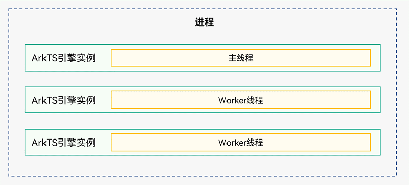

[TOC]

# 概述

HarmonyOS应用中每个进程都会有一个主线程，主线程有如下职责：

1. 执行UI绘制；
2. 管理主线程的ArkTS引擎实例，使多个UIAbility组件能够运行在其之上；
3. 管理其他线程（例如Worker线程）的ArkTS引擎实例，例如启动和终止其他线程；
4. 分发交互事件；
5. 处理应用代码的回调，包括事件处理和生命周期管理；
6. 接收Worker线程发送的消息；

除主线程外，还有一类与主线程并行的独立线程Worker，主要用于执行耗时操作，但不可以直接操作UI。Worker线程在主线程中创建，与主线程相互独立。**最多可以创建8个Worker**：



基于HarmonyOS的线程模型，不同的业务功能运行在不同的线程上，业务功能的交互就需要线程间通信。线程间通信目前主要有Emitter和Worker两种方式，其中Emitter主要适用于线程间的事件同步， Worker主要用于新开一个线程执行耗时任务。

**说明：**

- Stage模型只提供了主线程和Worker线程，Emitter主要用于主线程内或者主线程和Worker线程的事件同步。


# 使用Emitter进行线程间通信

[Emitter](https://developer.huawei.com/consumer/cn/doc/harmonyos-references-V2/js-apis-emitter-0000001428061916-V2)主要提供线程间发送和处理事件的能力，包括对持续订阅事件或单次订阅事件的处理、取消订阅事件、发送事件到事件队列等。

Emitter的开发步骤如下：

1. 订阅事件

   ```typescript
   import emitter from "@ohos.events.emitter";
   
   // 定义一个eventId为1的事件
   let event = {
       eventId: 1
   };
   
   // 收到eventId为1的事件后执行该回调
   let callback = (eventData) => {
       console.info('event callback');
   };
   
   // 订阅eventId为1的事件
   emitter.on(event, callback);
   ```

2. 发送事件

   ```typescript
   import emitter from "@ohos.events.emitter";
   
   // 定义一个eventId为1的事件，事件优先级为Low
   let event = {
       eventId: 1,
       priority: emitter.EventPriority.LOW
   };
   
   let eventData = {
       data: {
           "content": "c",
           "id": 1,
           "isEmpty": false,
       }
   };
   
   // 发送eventId为1的事件，事件内容为eventData
   emitter.emit(event, eventData);
   ```


# 使用Worker进行线程间通信

[Worker](https://developer.huawei.com/consumer/cn/doc/harmonyos-references-V2/js-apis-worker-0000001427902752-V2)是与主线程并行的独立线程。创建Worker的线程被称为宿主线程，Worker工作的线程被称为Worker线程。创建Worker时传入的脚本文件在Worker线程中执行，通常在Worker线程中处理耗时的操作，**需要注意的是，Worker中不能直接更新Page**。

Worker的开发步骤如下：

1. 在工程的[模块级build-profile.json5](https://developer.harmonyos.com/cn/docs/documentation/doc-guides/ohos-building-configuration-0000001218440654#section6887184182020)文件的buildOption属性中添加配置信息。

   ```typescript
     "buildOption": {
       "sourceOption": {
         "workers": [
           "./src/main/ets/workers/worker.ts"
         ]
       }
     }
   ```

2. 根据build-profile.json5中的配置创建对应的worker.ts文件。

   ```typescript
   import worker from '@ohos.worker';
   
   let parent = worker.workerPort;
   
   // 处理来自主线程的消息
   parent.onmessage = function(message) {
       console.info("onmessage: " + message)
       // 发送消息到主线程
       parent.postMessage("message from worker thread.")
   }
   ```

3. 主线程中使用如下方式初始化和使用worker。

   - Stage模型：

     ```typescript
     import worker from '@ohos.worker';
     
     let wk = new worker.ThreadWorker("entry/ets/workers/worker.ts");
     
     // 发送消息到worker线程
     wk.postMessage("message from main thread.")
     
     // 处理来自worker线程的消息
     wk.onmessage = function(message) {
         console.info("message from worker: " + message)
     
         // 根据业务按需停止worker线程
         wk.terminate()
     }
     ```

   - FA模型：

     ```typescript
     import worker from '@ohos.worker';
     
     let wk = new worker.ThreadWorker("../workers/worker.ts");
     
     // 发送消息到worker线程
     wk.postMessage("message from main thread.")
     
     // 处理来自worker线程的消息
     wk.onmessage = function(message) {
         console.info("message from worker: " + message)
     
         // 根据业务按需停止worker线程
         wk.terminate()
     }
     ```

**说明：**

- build-profile.json5中配置的worker.ts的相对路径都为./src/main/ets/workers/worker.ts时，在Stage模型下创建worker需要传入路径entry/ets/workers/worker.ts；在FA模型下创建worker需要传入路径../workers/worker.ts。
- 主线程与Worker线程间支持的数据类型参考[序列化支持类型](https://developer.huawei.com/consumer/cn/doc/harmonyos-references-V2/js-apis-worker-0000001427902752-V2#ZH-CN_TOPIC_0000001574088505__序列化支持类型)。