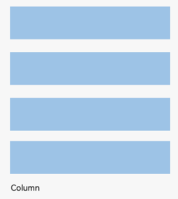
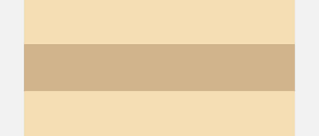
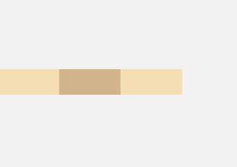

[TOC]

# 概述

组件按照布局的要求依次排列，构成应用的页面。在声明式UI中，所有的页面都是由自定义组件构成，开发者可以根据自己的需求，选择合适的布局进行页面开发。

布局指用特定的组件或者属性来管理用户页面所放置UI组件的大小和位置。在实际的开发过程中，需要遵守以下流程保证整体的布局效果：

- 确定页面的布局结构。
- 分析页面中的元素构成。
- 选用适合的布局容器组件或属性控制页面中各个元素的位置和大小约束。


## 布局结构

布局的结构通常是分层级的，代表了用户界面中的整体架构。一个常见的页面结构如下所示：

**图** 常见页面结构图


为实现上述效果，开发者需要在页面中声明对应的元素。其中，Page表示页面的根节点，Column/Row等元素为系统组件。针对不同的页面结构，ArkUI提供了不同的布局组件来帮助开发者实现对应布局的效果，例如Row用于实现线性布局。


## 布局元素的组成

布局相关的容器组件可形成对应的布局效果。例如，List组件可构成线性布局。

**图** 布局元素组成图


- 组件区域（蓝区方块）：组件区域表明组件的大小，width、height属性设置该区域的大小。
- 组件内容区（黄色方块）：组件区域大小减去组件的border值，组件内容区大小会作为组件内容（或者子组件）进行大小测算时的布局测算限制。
- 组件内容（绿色方块）：组件内容本身占用的大小，比如文本内容占用的大小。组件内容和组件内容区不一定匹配，比如设置了固定的width和height，此时组件内容的大小就是设置的width和height减去padding和border值，但文本内容则是通过文本布局引擎测算后得到的大小，可能出现文本真实大小小于设置的组件内容区大小。当组件内容和组件内容区大小不一致时，align属性生效，定义组件内容在组件内容区的对齐方式，如居中对齐。
- 组件布局边界（虚线部分）：组件通过margin属性设置外边距时，组件布局边界就是组件区域加上margin的大小。


## 如何选择布局

声明式UI提供了以下9种常见布局，开发者可根据实际应用场景选择合适的布局进行页面开发。

| 布局                                                         | 应用场景                                                     |
| ------------------------------------------------------------ | ------------------------------------------------------------ |
| [线性布局](https://developer.huawei.com/consumer/cn/doc/harmonyos-guides-V2/arkts-layout-development-linear-0000001504125349-V2)（Row、Column） | 如果布局内子元素超过1个，且能够以某种方式线性排列时优先考虑此布局。 |
| [层叠布局](https://developer.huawei.com/consumer/cn/doc/harmonyos-guides-V2/arkts-layout-development-stack-layout-0000001454605342-V2)（Stack） | 组件需要有堆叠效果时优先考虑此布局，层叠布局的堆叠效果不会占用或影响其他同容器内子组件的布局空间。例如[Panel](https://developer.huawei.com/consumer/cn/doc/harmonyos-references-V2/ts-container-panel-0000001427744836-V2)作为子组件弹出时将其他组件覆盖更为合理，则优先考虑在外层使用堆叠布局。 |
| [弹性布局](https://developer.huawei.com/consumer/cn/doc/harmonyos-guides-V2/arkts-layout-development-flex-layout-0000001504525013-V2)（Flex） | 弹性布局是与线性布局类似的布局方式。区别在于弹性布局默认能够使子组件压缩或拉伸。在子组件需要计算拉伸或压缩比例时优先使用此布局，可使得多个容器内子组件能有更好的视觉上的填充容器效果。 |
| [相对布局](https://developer.huawei.com/consumer/cn/doc/harmonyos-guides-V2/arkts-layout-development-relative-layout-0000001455042516-V2)（RelativeContainer） | 相对布局是在二维空间中的布局方式，不需要遵循线性布局的规则，布局方式更为自由。通过在子组件上设置锚点规则（AlignRules）使子组件能够将自己在横轴、纵轴中的位置与容器或容器内其他子组件的位置对齐。设置的锚点规则可以天然支持子元素压缩、拉伸，堆叠或形成多行效果。在页面元素分布复杂或通过线性布局会使容器嵌套层数过深时推荐使用。 |
| [栅格布局](https://developer.huawei.com/consumer/cn/doc/harmonyos-guides-V2/arkts-layout-development-grid-layout-0000001454765270-V2)（GridRow、GridCol） | 栅格是多设备场景下通用的辅助定位工具，通过将空间分割为有规律的栅格。栅格不同于网格布局固定的空间划分，它可以实现不同设备下不同的布局，空间划分更随心所欲，从而显著降低适配不同屏幕尺寸的设计及开发成本，使得整体设计和开发流程更有秩序和节奏感，同时也保证多设备上应用显示的协调性和一致性，提升用户体验。推荐手机、大屏、平板等不同设备，内容相同但布局不同时使用。 |
| [媒体查询](https://developer.huawei.com/consumer/cn/doc/harmonyos-guides-V2/arkts-layout-development-media-query-0000001454445606-V2)（@ohos.mediaquery） | 媒体查询可根据不同设备类型或同设备不同状态修改应用的样式。例如根据设备和应用的不同属性信息设计不同的布局，以及屏幕发生动态改变时更新应用的页面布局。 |
| [列表](https://developer.huawei.com/consumer/cn/doc/harmonyos-guides-V2/arkts-layout-development-create-list-0000001451074018-V2)（List） | 使用列表可以轻松高效地显示结构化、可滚动的信息。在ArkUI中，列表具有垂直和水平布局能力和自适应交叉轴方向上排列个数的布局能力，超出屏幕时可以滚动。列表适合用于呈现同类数据类型或数据类型集，例如图片和文本。 |
| [网格](https://developer.huawei.com/consumer/cn/doc/harmonyos-guides-V2/arkts-layout-development-create-grid-0000001504486057-V2)（Grid） | 网格布局具有较强的页面均分能力，子组件占比控制能力，是一种重要自适应布局。网格布局可以控制元素所占的网格数量、设置子组件横跨几行或者几列，当网格容器尺寸发生变化时，所有子组件以及间距等比例调整。推荐在需要按照固定比例或者均匀分配空间的布局场景下使用，例如计算器、相册、日历等。 |
| [轮播](https://developer.huawei.com/consumer/cn/doc/harmonyos-guides-V2/arkts-layout-development-create-looping-0000001454931830-V2)（Swiper） | 轮播组件通常用于实现广告轮播、图片预览、可滚动应用等。       |


## 布局位置

position、offset等属性影响了布局容器相对于自身或其他组件的位置。

| 定位能力 | 使用场景                                                     | 实现方式                                                     |
| -------- | ------------------------------------------------------------ | ------------------------------------------------------------ |
| 绝对定位 | 对于不同尺寸的设备，使用绝对定位的适应性会比较差，在屏幕的适配上有缺陷。 | 使用[position](https://developer.huawei.com/consumer/cn/doc/harmonyos-references-V2/ts-universal-attributes-location-0000001427584824-V2)实现绝对定位，设置元素左上角相对于父容器左上角偏移位置。在布局容器中，设置该属性不影响父容器布局，仅在绘制时进行位置调整。 |
| 相对定位 | 相对定位不脱离文档流，即原位置依然保留，不影响元素本身的特性，仅相对于原位置进行偏移。 | 使用[offset](https://developer.huawei.com/consumer/cn/doc/harmonyos-references-V2/ts-universal-attributes-location-0000001427584824-V2)可以实现相对定位，设置元素相对于自身的偏移量。设置该属性，不影响父容器布局，仅在绘制时进行位置调整。 |


## 对子元素的约束

| 对子元素的约束能力 | 使用场景                                                     | 实现方式                                                     |
| ------------------ | ------------------------------------------------------------ | ------------------------------------------------------------ |
| 拉伸               | 容器组件尺寸发生变化时，增加或减小的空间全部分配给容器组件内指定区域。 | [flexGrow](https://developer.huawei.com/consumer/cn/doc/harmonyos-references-V2/ts-universal-attributes-flex-layout-0000001478181377-V2)和[flexShrink](https://developer.huawei.com/consumer/cn/doc/harmonyos-references-V2/ts-universal-attributes-flex-layout-0000001478181377-V2)属性：flexGrow基于父容器的剩余空间分配来控制组件拉伸。flexShrink设置父容器的压缩尺寸来控制组件压缩。 |
| 缩放               | 子组件的宽高按照预设的比例，随容器组件发生变化，且变化过程中子组件的宽高比不变。 | [aspectRatio](https://developer.huawei.com/consumer/cn/doc/harmonyos-references-V2/ts-universal-attributes-layout-constraints-0000001427744784-V2)属性指定当前组件的宽高比来控制缩放，公式为：aspectRatio=width/height。 |
| 占比               | 占比能力是指子组件的宽高按照预设的比例，随父容器组件发生变化。 | 基于通用属性的两种实现方式：1. 将子组件的宽高设置为父组件宽高的百分比。2. [layoutWeight](https://developer.huawei.com/consumer/cn/doc/harmonyos-references-V2/ts-universal-attributes-size-0000001428061700-V2)属性，使得子元素自适应占满剩余空间。 |
| 隐藏               | 隐藏能力是指容器组件内的子组件，按照其预设的显示优先级，随容器组件尺寸变化显示或隐藏，其中相同显示优先级的子组件同时显示或隐藏。 | 通过[displayPriority](https://developer.huawei.com/consumer/cn/doc/harmonyos-references-V2/ts-universal-attributes-layout-constraints-0000001427744784-V2)属性来控制页面的显示和隐藏。 |


# 构建布局


## 线性布局（Row/Column）


## 概述

线性布局（LinearLayout）是开发中最常用的布局，通过线性容器[Row](https://developer.huawei.com/consumer/cn/doc/harmonyos-references-V2/ts-container-row-0000001478061717-V2)和[Column](https://developer.huawei.com/consumer/cn/doc/harmonyos-references-V2/ts-container-column-0000001478341157-V2)构建。线性布局是其他布局的基础，其子元素在线性方向上（水平方向和垂直方向）依次排列。线性布局的排列方向由所选容器组件决定，Column容器内子元素按照垂直方向排列，Row容器内子元素按照水平方向排列。根据不同的排列方向，开发者可选择使用Row或Column容器创建线性布局。

**图** Column容器内子元素排列示意图


**图** Row容器内子元素排列示意图


### 基本概念

- 布局容器：具有布局能力的容器组件，可以承载其他元素作为其子元素，布局容器会对其子元素进行尺寸计算和布局排列。
- 布局子元素：布局容器内部的元素。
- 主轴：线性布局容器在布局方向上的轴线，子元素默认沿主轴排列。Row容器主轴为水平方向，Column容器主轴为垂直方向。
- 交叉轴：垂直于主轴方向的轴线。Row容器交叉轴为垂直方向，Column容器交叉轴为水平方向。
- 间距：布局子元素的间距。


### 布局子元素在排列方向上的间距

在布局容器内，可以通过space属性设置排列方向上子元素的间距，使各子元素在排列方向上有等间距效果。


#### Column容器内排列方向上的间距

**图** Column容器内排列方向的间距图


```typescript
Column({ space: 20 }) {
  Text('space: 20').fontSize(15).fontColor(Color.Gray).width('90%')
  Row().width('90%').height(50).backgroundColor(0xF5DEB3)
  Row().width('90%').height(50).backgroundColor(0xD2B48C)
  Row().width('90%').height(50).backgroundColor(0xF5DEB3)
}.width('100%')
```


### Row容器内排列方向上的间距

**图** Row容器内排列方向的间距图


```
Row({ space: 35 }) {  Text('space: 35').fontSize(15).fontColor(Color.Gray)  Row().width('10%').height(150).backgroundColor(0xF5DEB3)  Row().width('10%').height(150).backgroundColor(0xD2B48C)  Row().width('10%').height(150).backgroundColor(0xF5DEB3)}.width('90%')
```


## 布局子元素在交叉轴上的对齐方式

在布局容器内，可以通过alignItems属性设置子元素在交叉轴（排列方向的垂直方向）上的对齐方式。且在各类尺寸屏幕中，表现一致。其中，交叉轴为垂直方向时，取值为[VerticalAlign类型](https://developer.huawei.com/consumer/cn/doc/harmonyos-references-V2/ts-appendix-enums-0000001478061741-V2#ZH-CN_TOPIC_0000001574248789__verticalalign)，水平方向取值为[HorizontalAlign](https://developer.huawei.com/consumer/cn/doc/harmonyos-references-V2/ts-appendix-enums-0000001478061741-V2#ZH-CN_TOPIC_0000001574248789__horizontalalign)。

alignSelf属性用于控制单个子元素在容器交叉轴上的对齐方式，其优先级高于alignItems属性，如果设置了alignSelf属性，则在单个子元素上会覆盖alignItems属性。

### Column容器内子元素在水平方向上的排列

**图** Column容器内子元素在水平方向上的排列图


- HorizontalAlign.Start：子元素在水平方向左对齐。

  ```typescript
  Column({}) {
    Column() {
    }.width('80%').height(50).backgroundColor(0xF5DEB3)
  
    Column() {
    }.width('80%').height(50).backgroundColor(0xD2B48C)
  
    Column() {
    }.width('80%').height(50).backgroundColor(0xF5DEB3)
  }.width('100%').alignItems(HorizontalAlign.Start).backgroundColor('rgb(242,242,242)')
  ```

  

- HorizontalAlign.Center：子元素在水平方向居中对齐。

  ```typescript
  Column({}) {
    Column() {
    }.width('80%').height(50).backgroundColor(0xF5DEB3)
  
    Column() {
    }.width('80%').height(50).backgroundColor(0xD2B48C)
  
    Column() {
    }.width('80%').height(50).backgroundColor(0xF5DEB3)
  }.width('100%').alignItems(HorizontalAlign.Center).backgroundColor('rgb(242,242,242)')
  ```

  

- HorizontalAlign.End：子元素在水平方向右对齐。

  ```typescript
  CColumn({}) {
    Column() {
    }.width('80%').height(50).backgroundColor(0xF5DEB3)
  
    Column() {
    }.width('80%').height(50).backgroundColor(0xD2B48C)
  
    Column() {
    }.width('80%').height(50).backgroundColor(0xF5DEB3)
  }.width('100%').alignItems(HorizontalAlign.End).backgroundColor('rgb(242,242,242)')
  ```
  
  

### Row容器内子元素在垂直方向上的排列

**图** Row容器内子元素在垂直方向上的排列图


- VerticalAlign.Top：子元素在垂直方向顶部对齐。

  ```typescript
  Row({}) {
    Column() {
    }.width('20%').height(30).backgroundColor(0xF5DEB3)
  
    Column() {
    }.width('20%').height(30).backgroundColor(0xD2B48C)
  
    Column() {
    }.width('20%').height(30).backgroundColor(0xF5DEB3)
  }.width('100%').height(200).alignItems(VerticalAlign.Top).backgroundColor('rgb(242,242,242)')
  ```

  

- VerticalAlign.Center：子元素在垂直方向居中对齐。

  ```typescript
  Row({}) {
    Column() {
    }.width('20%').height(30).backgroundColor(0xF5DEB3)
  
    Column() {
    }.width('20%').height(30).backgroundColor(0xD2B48C)
  
    Column() {
    }.width('20%').height(30).backgroundColor(0xF5DEB3)
  }.width('100%').height(200).alignItems(VerticalAlign.Center).backgroundColor('rgb(242,242,242)')
  ```

  

- VerticalAlign.Bottom：子元素在垂直方向底部对齐。

  ```typescript
  Row({}) {
    Column() {
    }.width('20%').height(30).backgroundColor(0xF5DEB3)
  
    Column() {
    }.width('20%').height(30).backgroundColor(0xD2B48C)
  
    Column() {
    }.width('20%').height(30).backgroundColor(0xF5DEB3)
  }.width('100%').height(200).alignItems(VerticalAlign.Bottom).backgroundColor('rgb(242,242,242)')
  ```
  
  


## 布局子元素在主轴上的排列方式

在布局容器内，可以通过justifyContent属性设置子元素在容器主轴上的排列方式。可以从主轴起始位置开始排布，也可以从主轴结束位置开始排布，或者均匀分割主轴的空间。


### Column容器内子元素在垂直方向上的排列

**图** Column容器内子元素在垂直方向上的排列图


- justifyContent(FlexAlign.Start)：元素在垂直方向首端对齐，第一个元素与行首对齐，同时后续的元素与前一个对齐。

  ```
  Column({}) {  Column() {  }.width('80%').height(50).backgroundColor(0xF5DEB3)
    Column() {  }.width('80%').height(50).backgroundColor(0xD2B48C)
    Column() {  }.width('80%').height(50).backgroundColor(0xF5DEB3)}.width('100%').height(300).backgroundColor('rgb(242,242,242)').justifyContent(FlexAlign.Start)
  ```

  

- justifyContent(FlexAlign.Center)：元素在垂直方向中心对齐，第一个元素与行首的距离与最后一个元素与行尾距离相同。

  ```
  Column({}) {  Column() {  }.width('80%').height(50).backgroundColor(0xF5DEB3)
    Column() {  }.width('80%').height(50).backgroundColor(0xD2B48C)
    Column() {  }.width('80%').height(50).backgroundColor(0xF5DEB3)}.width('100%').height(300).backgroundColor('rgb(242,242,242)').justifyContent(FlexAlign.Center)
  ```

  

- justifyContent(FlexAlign.End)：元素在垂直方向尾部对齐，最后一个元素与行尾对齐，其他元素与后一个对齐。

  ```
  Column({}) {  Column() {  }.width('80%').height(50).backgroundColor(0xF5DEB3)
    Column() {  }.width('80%').height(50).backgroundColor(0xD2B48C)
    Column() {  }.width('80%').height(50).backgroundColor(0xF5DEB3)}.width('100%').height(300).backgroundColor('rgb(242,242,242)').justifyContent(FlexAlign.End)
  ```

  

- justifyContent(FlexAlign.SpaceBetween)：垂直方向均匀分配元素，相邻元素之间距离相同。第一个元素与行首对齐，最后一个元素与行尾对齐。

  ```
  Column({}) {  Column() {  }.width('80%').height(50).backgroundColor(0xF5DEB3)
    Column() {  }.width('80%').height(50).backgroundColor(0xD2B48C)
    Column() {  }.width('80%').height(50).backgroundColor(0xF5DEB3)}.width('100%').height(300).backgroundColor('rgb(242,242,242)').justifyContent(FlexAlign.SpaceBetween)
  ```

  

- justifyContent(FlexAlign.SpaceAround)：垂直方向均匀分配元素，相邻元素之间距离相同。第一个元素到行首的距离和最后一个元素到行尾的距离是相邻元素之间距离的一半。

  ```
  Column({}) {  Column() {  }.width('80%').height(50).backgroundColor(0xF5DEB3)
    Column() {  }.width('80%').height(50).backgroundColor(0xD2B48C)
    Column() {  }.width('80%').height(50).backgroundColor(0xF5DEB3)}.width('100%').height(300).backgroundColor('rgb(242,242,242)').justifyContent(FlexAlign.SpaceAround)
  ```

  

- justifyContent(FlexAlign.SpaceEvenly)：垂直方向均匀分配元素，相邻元素之间的距离、第一个元素与行首的间距、最后一个元素到行尾的间距都完全一样。

  ```
  Column({}) {  Column() {  }.width('80%').height(50).backgroundColor(0xF5DEB3)
    Column() {  }.width('80%').height(50).backgroundColor(0xD2B48C)
    Column() {  }.width('80%').height(50).backgroundColor(0xF5DEB3)}.width('100%').height(300).backgroundColor('rgb(242,242,242)').justifyContent(FlexAlign.SpaceEvenly)
  ```

  

### Row容器内子元素在水平方向上的排列

**图8** Row容器内子元素在水平方向上的排列图


- justifyContent(FlexAlign.Start)：元素在水平方向方向首端对齐，第一个元素与行首对齐，同时后续的元素与前一个对齐。

  ```
  Row({}) {  Column() {  }.width('20%').height(30).backgroundColor(0xF5DEB3)
    Column() {  }.width('20%').height(30).backgroundColor(0xD2B48C)
    Column() {  }.width('20%').height(30).backgroundColor(0xF5DEB3)}.width('100%').height(200).backgroundColor('rgb(242,242,242)').justifyContent(FlexAlign.Start)
  ```

  

- justifyContent(FlexAlign.Center)：元素在水平方向方向中心对齐，第一个元素与行首的距离与最后一个元素与行尾距离相同。

  ```
  Row({}) {  Column() {  }.width('20%').height(30).backgroundColor(0xF5DEB3)
    Column() {  }.width('20%').height(30).backgroundColor(0xD2B48C)
    Column() {  }.width('20%').height(30).backgroundColor(0xF5DEB3)}.width('100%').height(200).backgroundColor('rgb(242,242,242)').justifyContent(FlexAlign.Center)
  ```

  

- justifyContent(FlexAlign.End)：元素在水平方向方向尾部对齐，最后一个元素与行尾对齐，其他元素与后一个对齐。

  ```
  Row({}) {  Column() {  }.width('20%').height(30).backgroundColor(0xF5DEB3)
    Column() {  }.width('20%').height(30).backgroundColor(0xD2B48C)
    Column() {  }.width('20%').height(30).backgroundColor(0xF5DEB3)}.width('100%').height(200).backgroundColor('rgb(242,242,242)').justifyContent(FlexAlign.End)
  ```

  

- justifyContent(FlexAlign.SpaceBetween)：水平方向方向均匀分配元素，相邻元素之间距离相同。第一个元素与行首对齐，最后一个元素与行尾对齐。

  ```
  Row({}) {  Column() {  }.width('20%').height(30).backgroundColor(0xF5DEB3)
    Column() {  }.width('20%').height(30).backgroundColor(0xD2B48C)
    Column() {  }.width('20%').height(30).backgroundColor(0xF5DEB3)}.width('100%').height(200).backgroundColor('rgb(242,242,242)').justifyContent(FlexAlign.SpaceBetween)
  ```

  

- justifyContent(FlexAlign.SpaceAround)：水平方向方向均匀分配元素，相邻元素之间距离相同。第一个元素到行首的距离和最后一个元素到行尾的距离是相邻元素之间距离的一半。

  ```
  Row({}) {  Column() {  }.width('20%').height(30).backgroundColor(0xF5DEB3)
    Column() {  }.width('20%').height(30).backgroundColor(0xD2B48C)
    Column() {  }.width('20%').height(30).backgroundColor(0xF5DEB3)}.width('100%').height(200).backgroundColor('rgb(242,242,242)').justifyContent(FlexAlign.SpaceAround)
  ```

  

- justifyContent(FlexAlign.SpaceEvenly)：水平方向方向均匀分配元素，相邻元素之间的距离、第一个元素与行首的间距、最后一个元素到行尾的间距都完全一样。

  ```
  Row({}) {  Column() {  }.width('20%').height(30).backgroundColor(0xF5DEB3)
    Column() {  }.width('20%').height(30).backgroundColor(0xD2B48C)
    Column() {  }.width('20%').height(30).backgroundColor(0xF5DEB3)}.width('100%').height(200).backgroundColor('rgb(242,242,242)').justifyContent(FlexAlign.SpaceEvenly)
  ```

  

## 自适应拉伸

在线性布局下，常用空白填充组件[Blank](https://developer.huawei.com/consumer/cn/doc/harmonyos-references-V2/ts-basic-components-blank-0000001428061724-V2)，在容器主轴方向自动填充空白空间，达到自适应拉伸效果。Row和Column作为容器，只需要添加宽高为百分比，当屏幕宽高发生变化时，会产生自适应效果。

```
@Entry@Componentstruct BlankExample {  build() {    Column() {      Row() {        Text('Bluetooth').fontSize(18)        Blank()        Toggle({ type: ToggleType.Switch, isOn: true })      }.backgroundColor(0xFFFFFF).borderRadius(15).padding({ left: 12 }).width('100%')    }.backgroundColor(0xEFEFEF).padding(20).width('100%')  }}
```

**图9** 竖屏


**图10** 横屏


## 自适应缩放

自适应缩放是指子组件随容器尺寸的变化而按照预设的比例自动调整尺寸，适应各种不同大小的设备。在线性布局中，可以使用以下两种方法实现自适应缩放。

- 父容器尺寸确定时，使用layoutWeight属性设置子组件和兄弟元素在主轴上的权重，忽略元素本身尺寸设置，使它们在任意尺寸的设备下自适应占满剩余空间。

  ```
  @Entry@Componentstruct layoutWeightExample {  build() {    Column() {      Text('1:2:3').width('100%')      Row() {        Column() {          Text('layoutWeight(1)')            .textAlign(TextAlign.Center)        }.layoutWeight(1).backgroundColor(0xF5DEB3).height('100%')
          Column() {          Text('layoutWeight(2)')            .textAlign(TextAlign.Center)        }.layoutWeight(2).backgroundColor(0xD2B48C).height('100%')
          Column() {          Text('layoutWeight(3)')            .textAlign(TextAlign.Center)        }.layoutWeight(3).backgroundColor(0xF5DEB3).height('100%')
        }.backgroundColor(0xffd306).height('30%')
        Text('2:5:3').width('100%')      Row() {        Column() {          Text('layoutWeight(2)')            .textAlign(TextAlign.Center)        }.layoutWeight(2).backgroundColor(0xF5DEB3).height('100%')
          Column() {          Text('layoutWeight(5)')            .textAlign(TextAlign.Center)        }.layoutWeight(5).backgroundColor(0xD2B48C).height('100%')
          Column() {          Text('layoutWeight(3)')            .textAlign(TextAlign.Center)        }.layoutWeight(3).backgroundColor(0xF5DEB3).height('100%')      }.backgroundColor(0xffd306).height('30%')    }  }}
  ```

  **图11** 横屏

  

  **图12** 竖屏

  

- 父容器尺寸确定时，使用百分比设置子组件和兄弟元素的宽度，使他们在任意尺寸的设备下保持固定的自适应占比。

  ```
  @Entry@Componentstruct WidthExample {  build() {    Column() {      Row() {        Column() {          Text('left width 20%')            .textAlign(TextAlign.Center)        }.width('20%').backgroundColor(0xF5DEB3).height('100%')
          Column() {          Text('center width 50%')            .textAlign(TextAlign.Center)        }.width('50%').backgroundColor(0xD2B48C).height('100%')
          Column() {          Text('right width 30%')            .textAlign(TextAlign.Center)        }.width('30%').backgroundColor(0xF5DEB3).height('100%')      }.backgroundColor(0xffd306).height('30%')    }  }}
  ```

  **图13** 横屏
  

  **图14** 竖屏
  

## 自适应延伸

自适应延伸是指在不同尺寸设备下，当页面的内容超出屏幕大小而无法完全显示时，可以通过滚动条进行拖动展示。这种方法适用于线性布局中内容无法一屏展示的场景。通常有以下两种实现方式。

- [在List中添加滚动条](https://developer.huawei.com/consumer/cn/doc/harmonyos-guides-V2/arkts-layout-development-create-list-0000001451074018-V2#section1958410178617)：当List子项过多一屏放不下时，可以将每一项子元素放置在不同的组件中，通过滚动条进行拖动展示。可以通过scrollBar属性设置滚动条的常驻状态，edgeEffect属性设置拖动到内容最末端的回弹效果。

- 使用Scroll组件：在线性布局中，开发者可以进行垂直方向或者水平方向的布局。当一屏无法完全显示时，可以在Column或Row组件的外层包裹一个可滚动的容器组件Scroll来实现可滑动的线性布局。

  垂直方向布局中使用Scroll组件：

  ```
  @Entry@Componentstruct ScrollExample {  scroller: Scroller = new Scroller();  private arr: number[] = [0, 1, 2, 3, 4, 5, 6, 7, 8, 9];
    build() {    Scroll(this.scroller) {      Column() {        ForEach(this.arr, (item) => {          Text(item.toString())            .width('90%')            .height(150)            .backgroundColor(0xFFFFFF)            .borderRadius(15)            .fontSize(16)            .textAlign(TextAlign.Center)            .margin({ top: 10 })        }, item => item)      }.width('100%')    }    .backgroundColor(0xDCDCDC)    .scrollable(ScrollDirection.Vertical) // 滚动方向为垂直方向    .scrollBar(BarState.On) // 滚动条常驻显示    .scrollBarColor(Color.Gray) // 滚动条颜色    .scrollBarWidth(10) // 滚动条宽度    .edgeEffect(EdgeEffect.Spring) // 滚动到边沿后回弹  }}
  ```

  

  水平方向布局中使用Scroll组件：

  ```
  @Entry@Componentstruct ScrollExample {  scroller: Scroller = new Scroller();  private arr: number[] = [0, 1, 2, 3, 4, 5, 6, 7, 8, 9];
    build() {    Scroll(this.scroller) {      Row() {        ForEach(this.arr, (item) => {          Text(item.toString())            .height('90%')            .width(150)            .backgroundColor(0xFFFFFF)            .borderRadius(15)            .fontSize(16)            .textAlign(TextAlign.Center)            .margin({ left: 10 })        })      }.height('100%')    }    .backgroundColor(0xDCDCDC)    .scrollable(ScrollDirection.Horizontal) // 滚动方向为水平方向    .scrollBar(BarState.On) // 滚动条常驻显示    .scrollBarColor(Color.Gray) // 滚动条颜色    .scrollBarWidth(10) // 滚动条宽度    .edgeEffect(EdgeEffect.Spring) // 滚动到边沿后回弹  }}
  ```

  
